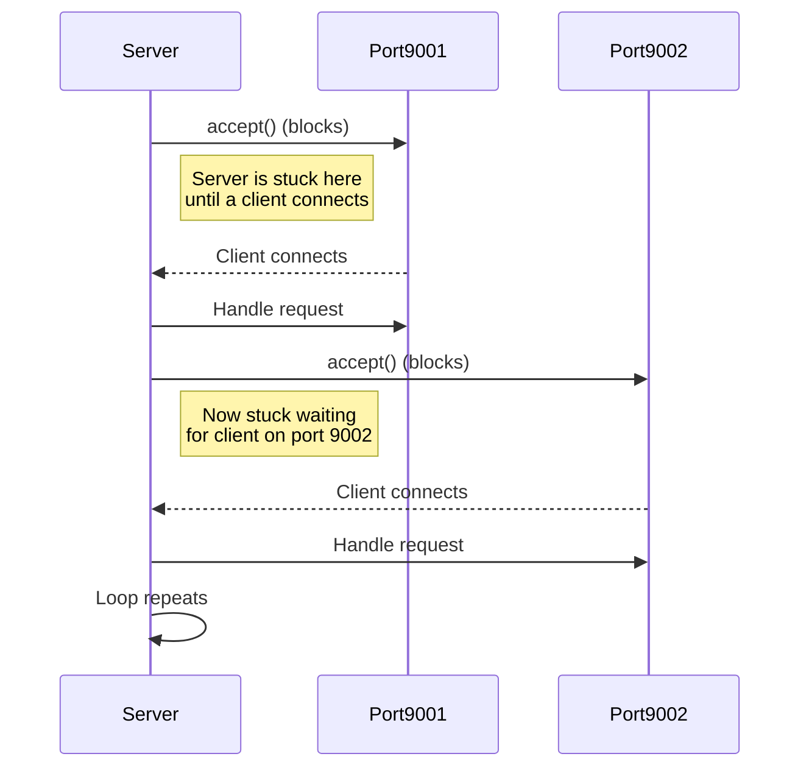
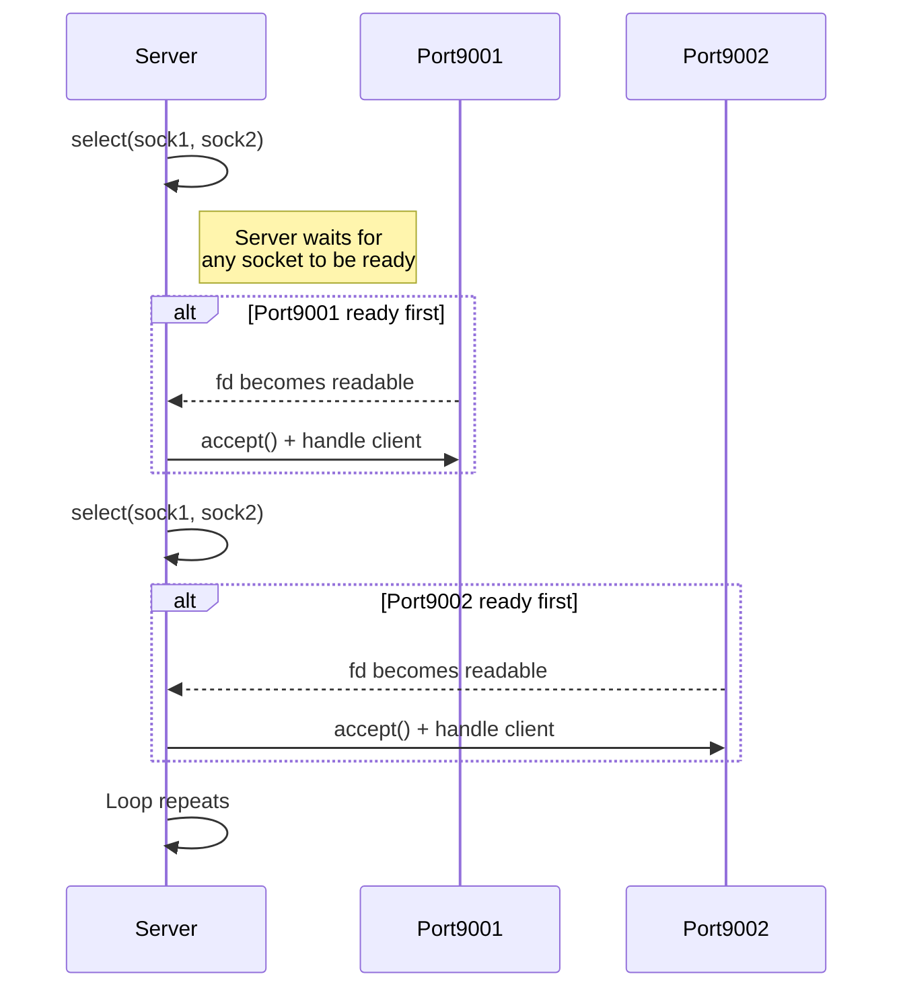

## Introduction

### Blocking I/O

In this version, each `accept()` call is **blocking**.
The server waits indefinitely for a connection on **sock1**, and only after completing that interaction does it move to **sock2**.
This means the server can only handle one port at a time and becomes unresponsive on the other port until the current accept completes.

```python
import socket

# Create two TCP sockets
sock1 = socket.socket(socket.AF_INET, socket.SOCK_STREAM)
sock2 = socket.socket(socket.AF_INET, socket.SOCK_STREAM)

# Bind them to localhost on different ports
sock1.bind(('localhost', 9001))
sock2.bind(('localhost', 9002))
sock1.listen()
sock2.listen()

print("Server listening on ports 9001 and 9002...")

while True:
    # This call BLOCKS: execution stops here until someone connects to port 9001
    print("Waiting for client on port 9001...")
    client1, addr1 = sock1.accept()
    print(f"Connection from {addr1} on port 9001")
    client1.send(b"Hello from server port 9001!\n")
    client1.close()

    # Only after finishing with port 9001 does the server handle port 9002
    print("Waiting for client on port 9002...")
    client2, addr2 = sock2.accept()
    print(f"Connection from {addr2} on port 9002")
    client2.send(b"Hello from server port 9002!\n")
    client2.close()
```



---

### Non-blocking I/O

In this version, the server becomes **event-driven**.
Instead of blocking on a single `accept()`, it uses `select()` to wait for **any** socket to become readable.
This allows the server to react to whichever port receives a connection first, making it responsive on both ports concurrently.

```python
import socket
import select

# Create two TCP sockets
sock1 = socket.socket(socket.AF_INET, socket.SOCK_STREAM)
sock2 = socket.socket(socket.AF_INET, socket.SOCK_STREAM)

# Bind them to localhost on different ports
sock1.bind(('localhost', 9001))
sock2.bind(('localhost', 9002))
sock1.listen()
sock2.listen()

# List of sockets to monitor
sockets = [sock1, sock2]

print("Server listening on ports 9001 and 9002...")

while True:
    # select() waits until *any* socket is ready.
    # It does NOT block on a specific socket.
    ready_to_read, _, _ = select.select(sockets, [], [], 1)

    # Handle all sockets that have incoming connections
    for s in ready_to_read:
        client, addr = s.accept()
        print(f"Connection from {addr} on port {s.getsockname()[1]}")
        client.send(b"Hello from server!\n")
        client.close()
```



### Synchronous (blocking) code

```python
import time

def task(name, duration):
    print(f"Task {name} started")
    time.sleep(duration)  # Blocks the whole program
    print(f"Task {name} finished")

task("A", 2)
task("B", 3)
print("All tasks done")
```

**Behavior:**

* Task A runs for 2 seconds, then Task B runs for 3 seconds.
* Total time ≈ 5 seconds.
* Nothing else happens while a task is sleeping.

---

### Asynchronous code with an event loop

```python
import asyncio

async def task(name, duration):
    print(f"Task {name} started")
    await asyncio.sleep(duration)  # Non-blocking sleep
    print(f"Task {name} finished")

async def main():
    # Schedule two tasks concurrently
    await asyncio.gather(
        task("A", 2),
        task("B", 3)
    )
    print("All tasks done")

# Run the event loop
asyncio.run(main())
```

**Behavior:**

* Task A and Task B start at almost the same time.
* Task A finishes after 2 seconds, Task B after 3 seconds.
* Total time ≈ 3 seconds, not 5 — because the event loop allows overlapping tasks.

---

## Event Loop Concept

* The **event loop** continuously checks which tasks are ready to run.
* If a task is waiting (`await`), the loop moves to the next ready task.
* It’s the core mechanism behind **async/await** programming.

```python
# Very simplified conceptual loop
tasks = [task("A", 2), task("B", 3)]

while tasks:
    for t in tasks:
        if t.is_ready():    # Pseudo-method: is the task ready to continue?
            t.run_step()
```


## Synchronous Microservices
**Definition:** Each request is handled in a **dedicated thread** and blocks until the operation completes.  

**Technical Details / Limitations:**
- **Blocking I/O:** CPU waits while DB or HTTP call executes  
- **Thread-per-request model:** Memory usage grows linearly with concurrent requests  
- **Limited scalability:** Only as many simultaneous requests as available threads  
- **Poor support for long-lived connections:** Each WebSocket/SSE consumes a thread  
- **High latency under load:** Slow downstream calls block processing  

**Spring Boot Example:**
```java
@GetMapping("/items")
public List<String> getItems() {
    try { Thread.sleep(1000); } catch (InterruptedException e) { Thread.currentThread().interrupt(); }
    return List.of("Item1","Item2","Item3");
}
```

**Python / FastAPI Example (blocking):**
```python
from fastapi import FastAPI
import time

app = FastAPI()

@app.get("/items-sync")
def get_items_sync():
    time.sleep(1)  ## blocks thread
    return ["Item1","Item2","Item3"]
```

---

## Asynchronous Microservices
**Definition:** Tasks **yield control while awaiting I/O**; the **event loop** schedules pending operations.  

**Benefits:**
- Single thread handles thousands of connections efficiently  
- Better CPU utilization  
- Supports long-lived connections (WebSockets, streaming)  
- Reduces latency spikes under load  

**Spring Boot WebFlux Example:**
```java
@GetMapping("/items")
public Mono<List<String>> getItems() {
    return Mono.delay(Duration.ofSeconds(1))
               .map(ignore -> List.of("Item1","Item2","Item3"));
}
```

**Python / FastAPI Example (async):**
```python
from fastapi import FastAPI
import asyncio

app = FastAPI()

@app.get("/items-async")
async def get_items_async():
    await asyncio.sleep(1)  ## non-blocking
    return ["Item1","Item2","Item3"]
```

---

## Backpressure

Backpressure is a mechanism that **prevents fast producers from overwhelming slow consumers**.
* Producers can be extremely fast (network bursts, Kafka topics, sensor streams, parallel tasks).
* Consumers may be slow (I/O, database inserts, CPU-bound computation).

Without backpressure, the gap accumulates, leading to:

* Out-of-memory errors (buffers grow indefinitely)
* Queue explosion (message queues fill up)
* Crashes or unresponsiveness
* Microservice overload cascades
  (one slow service slows down upstream services too)

Example ("retry storm" or "death spiral"):
* A keeps sending requests at full speed
* B's queue grows (Kafka/RabbitMQ internal buffer, HTTP thread pool, DB connections)
* B reaches resource limits
* B slows down or crashes
* A interprets B’s slowness as errors
* Retries start happening (worsens traffic)
* Load balancers become saturated
* Entire service mesh becomes unstable


### Backpressure strategies
Whenever a producer is able to generate data faster than the consumer can process, there must be a strategy to:

* slow down
* temporarily store
* drop
* or otherwise regulate

… the flow of data.

Without this regulation, systems become unstable.

```text
Flux.range(1, 1000)
    .onBackpressureBuffer(100) // buffer up to 100 items
    .limitRate(50)             // request 50 items at a time
    .subscribe(
        item -> process(item),
        err -> System.err.println("Error: " + err),
        () -> System.out.println("Processing complete")
    );
```

```python
import asyncio

async def producer(queue):
    for i in range(1000):
        await queue.put(i)  # waits if queue is full
        print(f"Produced {i}")

async def consumer(queue):
    while True:
        item = await queue.get()
        print(f"Consumed {item}")
        await asyncio.sleep(0.1)  # simulate slow consumer
        queue.task_done()

async def main():
    queue = asyncio.Queue(maxsize=50)  # backpressure: limits queue size
    prod_task = asyncio.create_task(producer(queue))
    cons_task = asyncio.create_task(consumer(queue))
    await prod_task
    await queue.join()
    cons_task.cancel()

asyncio.run(main())
```
---

## Modern Framework Examples
**Spring Boot:**
- Sync: Servlet/Tomcat → blocking threads  
- Async/Reactive: WebFlux + Netty → Mono/Flux, event-driven, backpressure  

**FastAPI / Starlette:**
- Async endpoints: `async def`, awaitable I/O  
- Event loop (`asyncio`) schedules tasks efficiently  
- Backpressure via async queues  

**Quarkus / Vert.x:**
- Event-driven with lightweight event loops  
- Event bus enables async messaging  
- Reactive messaging support (Kafka, AMQP)  

---

## References
- FastAPI docs: https://fastapi.tiangolo.com  
- Python asyncio: https://docs.python.org/3/library/asyncio.html  
- Spring WebFlux: https://docs.spring.io/spring-framework/docs/current/reference/html/web-reactive.html  
- Quarkus reactive guide: https://quarkus.io/guides/reactive  
- Reactive Streams spec: https://www.reactive-streams.org/
