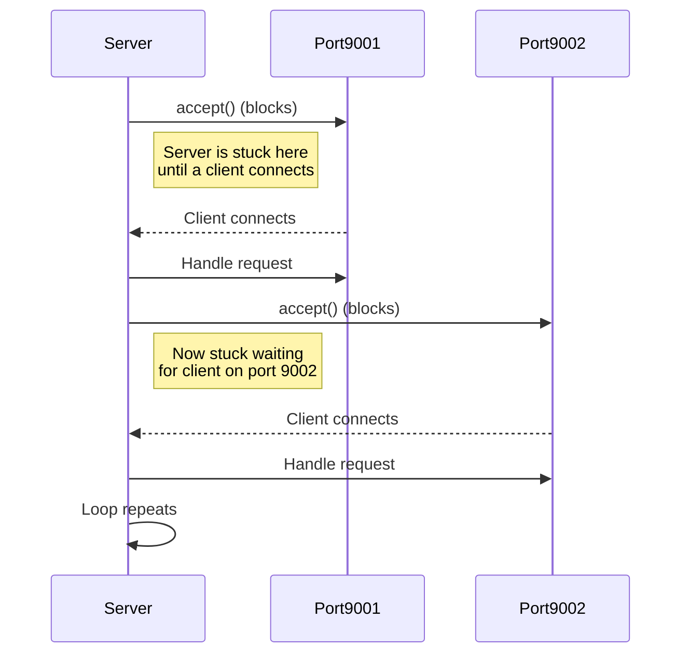
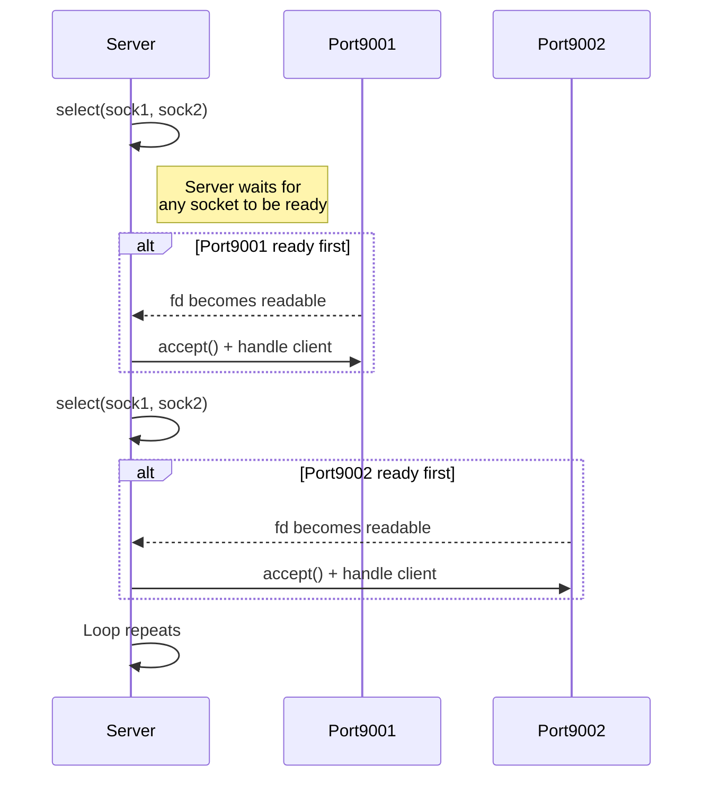

## Introduction

### Blocking I/O

In this version, each `accept()` call is **blocking**.
The server waits indefinitely for a connection on **sock1**, and only after completing that interaction does it move to **sock2**.
This means the server can only handle one port at a time and becomes unresponsive on the other port until the current accept completes.

```python
...

print("Server listening on ports 9001 and 9002...")

while True:
    # This call BLOCKS: execution stops here until someone connects to port 9001
    print("Waiting for client on port 9001...")
    client1, addr1 = sock1.accept()
    print(f"Connection from {addr1} on port 9001")
    client1.send(b"Hello from server port 9001!\n")
    client1.close()

    # Only after finishing with port 9001 does the server handle port 9002
    print("Waiting for client on port 9002...")
    client2, addr2 = sock2.accept()
    print(f"Connection from {addr2} on port 9002")
    client2.send(b"Hello from server port 9002!\n")
    client2.close()
```



---

### Non-blocking I/O

Instead of blocking on a single `accept()`, it uses `select()` to wait for **any** socket to become readable.
This allows the server to react to whichever port receives a connection first, making it responsive on both ports concurrently.

```python
...

print("Server listening on ports 9001 and 9002...")

while True:
    # select() waits until *any* socket is ready.
    # It does NOT block on a specific socket.
    ready_to_read, _, _ = select.select(sockets, [], [], 1)

    # Handle all sockets that have incoming connections
    for s in ready_to_read:
        client, addr = s.accept()
        print(f"Connection from {addr} on port {s.getsockname()[1]}")
        client.send(b"Hello from server!\n")
        client.close()
```



### How event-driven programming comes in

In event-driven systems:

1. You **register interest** in certain events (e.g., data available, connection ready, timeout).
2. The system notifies you **only when the event occurs**.
3. Your callback or handler executes in response to the event.

Non-blocking I/O fits this naturally because:

* You **do not wait** for I/O to complete.
* You rely on **events or readiness notifications** (e.g., `select()`, `poll()`, `epoll()`, `kqueue`) to know when you can actually perform I/O.
* Your program reacts **only when data is ready**, which is the core of event-driven design.


### Blocking calls in microservices

```python
import time

def db_query(name, duration):
    print(f"Query {name} started")
    time.sleep(duration)  # Simulate blocking DB call
    print(f"Query {name} finished")

# Two database queries executed sequentially
db_query("A", 2)
db_query("B", 3)
print("All queries done")
```

* In traditional blocking code, each incoming request is handled by a dedicated thread.
* While the thread waits (e.g., for a database query, HTTP call, or file I/O), it **cannot do anything else**.
* Microservices often handle **thousands of concurrent requests**, so:

    * Blocking threads consume memory and CPU.
    * Thread pools can become exhausted, leading to request rejection or increased latency.

**Example:**

```text
Thread pool: 200 threads
Requests per second: 500
If each request blocks 2 seconds → threads saturate → new requests must wait → slow response
```

---

### Non-blocking calls in microservices

```python
import asyncio

async def db_query(name, duration):
    print(f"Query {name} started")
    await asyncio.sleep(duration)  # Simulate non-blocking DB call
    print(f"Query {name} finished")

async def main():
    # Schedule two queries concurrently
    await asyncio.gather(
        db_query("A", 2),
        db_query("B", 3)
    )
    print("All queries done")

# Run the event loop
asyncio.run(main())
```

---

#### What is `async`?

* The `async` keyword is used to **define an asynchronous function**, also called a **coroutine** in Python.
* Calling an `async` function **does not immediately run it**. Instead, it returns a **coroutine object**, which represents the work that can be scheduled on an event loop.

**Example:**

```python
import asyncio

async def say_hello():
    print("Hello")
```

* `say_hello()` here is asynchronous.
* If you call `say_hello()` directly, it **does not execute yet**; it returns a coroutine object:

```python
coro = say_hello()
print(coro)
# <coroutine object say_hello at 0x...>
```

* To actually run it, you need to **schedule it on an event loop**, e.g., with `asyncio.run()`.

---

#### What is `await`?

* The `await` keyword **pauses the coroutine until another async operation finishes**.
* Unlike `time.sleep()` (blocking), `await` is **non-blocking**: it tells the event loop, “I’m waiting, you can run other tasks in the meantime.”

**Example:**

```python
import asyncio

async def wait_and_print():
    print("Start waiting")
    await asyncio.sleep(2)  # Non-blocking sleep
    print("Done waiting")

asyncio.run(wait_and_print())
```

* Output:

```
Start waiting
(wait 2 seconds without blocking)
Done waiting
```

* During the `await asyncio.sleep(2)`, the event loop could run **other coroutines**.

---

#### How `async` and `await` work together

* `async` defines a **coroutine**.
* `await` tells Python to **pause this coroutine until the awaited coroutine completes**, allowing other tasks to run in the meantime.

**Example with multiple tasks:**

```python
import asyncio

async def task(name, duration):
    print(f"{name} started")
    await asyncio.sleep(duration)  # Non-blocking
    print(f"{name} finished")

async def main():
    await asyncio.gather(
        task("A", 2),
        task("B", 3)
    )

asyncio.run(main())
```

* `task("A")` and `task("B")` start almost simultaneously.
* Total runtime ≈ 3 seconds, not 5, because `await` allows overlapping execution.


## Event Loop Concept

* The **event loop** continuously checks which tasks are ready to run.
* If a task is waiting (`await`), the loop moves to the next ready task.
* It’s the core mechanism behind **async/await** programming.

```python
# Very simplified conceptual loop
tasks = [task("A", 2), task("B", 3)]

while tasks:
    for t in tasks:
        if t.is_ready():    # Pseudo-method: is the task ready to continue?
            t.run_step()
```


## Microservices frameworks

### Synchronous Approach
**Definition:** Each request is handled in a **dedicated thread** and blocks until the operation completes.  

**Technical Details / Limitations:**
- **Blocking I/O:** CPU waits while DB or HTTP call executes  
- **Thread-per-request model:** Memory usage grows linearly with concurrent requests  
- **Limited scalability:** Only as many simultaneous requests as available threads  
- **Poor support for long-lived connections:** Each WebSocket/SSE consumes a thread  
- **High latency under load:** Slow downstream calls block processing  

```java
@GetMapping("/items")
public List<String> getItems() {
    try { Thread.sleep(1000); } catch (InterruptedException e) { Thread.currentThread().interrupt(); }
    return List.of("Item1","Item2","Item3");
}
```

```java
import javax.ws.rs.GET;
import javax.ws.rs.Path;
import java.util.List;

@Path("/items")
public class ItemResource {

    @GET
    public List<String> getItems() {
        try { Thread.sleep(1000); } catch (InterruptedException e) { Thread.currentThread().interrupt(); }
        return List.of("Item1","Item2","Item3");
    }
}
```

```python
from fastapi import FastAPI
import time

app = FastAPI()

@app.get("/items-sync")
def get_items_sync():
    time.sleep(1)  ## blocks thread
    return ["Item1","Item2","Item3"]
```

```python
from flask import Flask
import time

app = Flask(__name__)

@app.route("/items")
def get_items():
    time.sleep(1)  ## blocks thread
    return ["Item1","Item2","Item3"]
```

```python
import time
from django.http import JsonResponse

def items_view(request):
    time.sleep(1)  ## blocks thread
    return JsonResponse(["Item1","Item2","Item3"], safe=False)
```

---

### Asynchronous Approach
**Definition:** Tasks **yield control while awaiting I/O**; the **event loop** schedules pending operations.  

**Benefits:**
- Single thread handles thousands of connections efficiently  
- Better CPU utilization  
- Supports long-lived connections (WebSockets, streaming)  
- Reduces latency spikes under load  

```java
@GetMapping("/items")
public Mono<List<String>> getItems() {
    return Mono.delay(Duration.ofSeconds(1))
               .map(ignore -> List.of("Item1","Item2","Item3"));
}
```

```java
@Path("/items")
public class ItemResource {

    @GET
    public Uni<List<String>> getItems() {
        return Uni.createFrom().item(List.of("Item1","Item2","Item3"))
                  .onItem().delayIt().by(Duration.ofSeconds(1));
    }
}
```

```python
from fastapi import FastAPI
import asyncio

app = FastAPI()

@app.get("/items-async")
async def get_items_async():
    await asyncio.sleep(1)  ## non-blocking
    return ["Item1","Item2","Item3"]
```

---

## Backpressure

Backpressure is a mechanism that **prevents fast producers from overwhelming slow consumers**.
* Producers can be extremely fast (network bursts, Kafka topics, sensor streams, parallel tasks).
* Consumers may be slow (I/O, database inserts, CPU-bound computation).

Without backpressure, the gap accumulates, leading to:

* Out-of-memory errors (buffers grow indefinitely)
* Queue explosion (message queues fill up)
* Crashes or unresponsiveness
* Microservice overload cascades
  (one slow service slows down upstream services too)

Example ("retry storm" or "death spiral"):
* A keeps sending requests at full speed
* B's queue grows (Kafka/RabbitMQ internal buffer, HTTP thread pool, DB connections)
* B reaches resource limits
* B slows down or crashes
* A interprets B’s slowness as errors
* Retries start happening (worsens traffic)
* Load balancers become saturated
* Entire service mesh becomes unstable


## Backpressure strategies
Whenever a producer is able to generate data faster than the consumer can process, there must be a strategy to:

* slow down
* temporarily store
* drop
* or otherwise regulate

… the flow of data.

Without this regulation, systems become unstable.

```text
Flux.fromIterable(items)
    .flatMap(item -> webClient.post()
                              .uri("http://consumer-service/items")
                              .bodyValue(item)
                              .retrieve()
                              .bodyToMono(Void.class

```

```python
queue = asyncio.Queue(maxsize=10)  # max pending requests

async def producer(items):
    for item in items:
        await queue.put(item)  # waits if queue is full → backpressure

async def consumer():
    async with httpx.AsyncClient() as client:
        while True:
            item = await queue.get()
            await client.post("http://consumer-service/items", json=item)
            queue.task_done()

@app.post("/produce")
async def produce_endpoint(items: list):
    # start consumer task
    consumer_task = asyncio.create_task(consumer())
    await producer(items)
    await queue.join()  # wait until all items processed
    consumer_task.cancel()
    return {"status": "done"}
```
---

## References
- FastAPI docs: https://fastapi.tiangolo.com  
- Python asyncio: https://docs.python.org/3/library/asyncio.html  
- Spring WebFlux: https://docs.spring.io/spring-framework/docs/current/reference/html/web-reactive.html  
- Quarkus reactive guide: https://quarkus.io/guides/reactive  
- Reactive Streams spec: https://www.reactive-streams.org/
