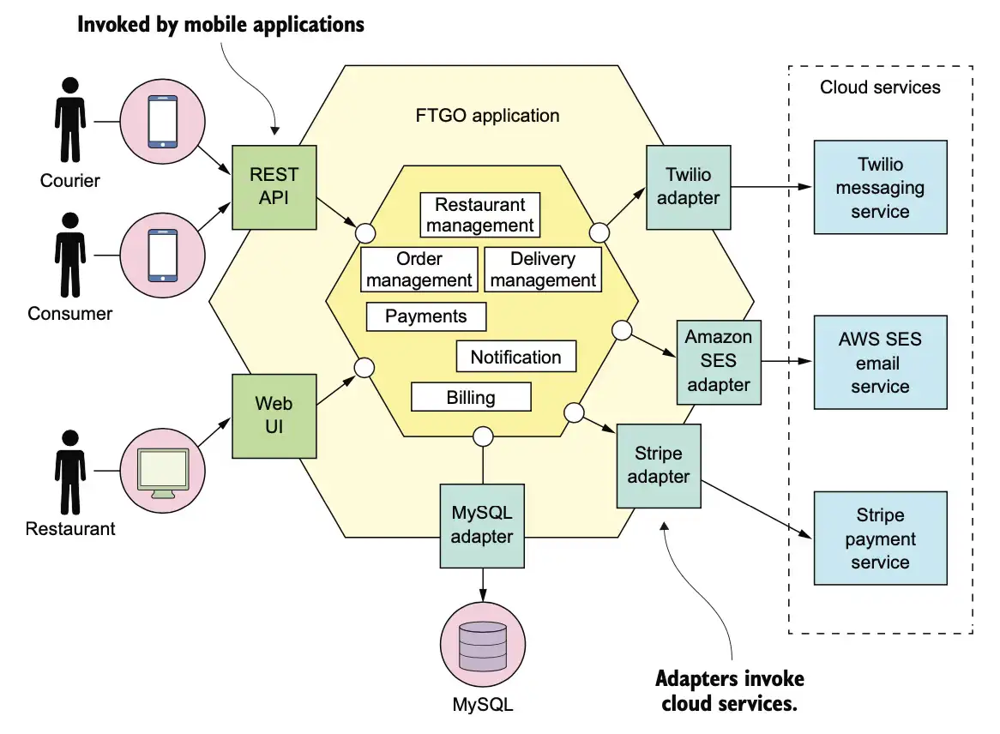
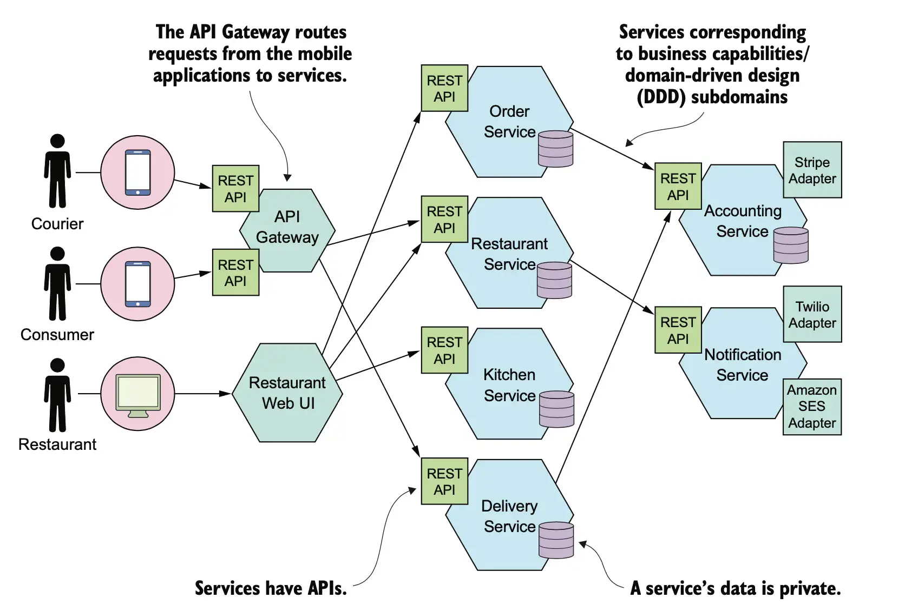

# The Twelve-Factor App

The Twelve-Factor App is a methodology for building **modern, scalable, cloud-native applications**.

* Portability across environments
* Continuous deployment
* Scalability and resilience
* Maintainability in distributed systems

---

## I. Codebase

* One codebase tracked in version control
* Many deploys from the same codebase

**Benefits:**

* Traceability and collaboration
* Simplified CI/CD
* Consistent releases across environments

---

## II. Dependencies

* Explicitly declare and isolate dependencies

**Key Ideas:**

* Use dependency managers (e.g., Maven, Gradle, pip)
* Avoid relying on system-level packages
* Ensures reproducibility and portability

---

## III. Config

* Store configuration in the environment

**Examples:**

* Database URLs
* API keys
* Credentials

**Benefits:**

* Separation of code and configuration
* Easier deployment across environments

---

## IV. Backing Services

* Treat external services as attached resources (*An attached resource is something the application does not own or embed internally, but connects to at runtime through configuration.*)

**Examples:**

* Databases
* Message brokers
* Caches

**Key Principle:**

* Easily replace services without code changes

---

## V. Build, Release, Run

* Strict separation of stages

**Stages:**

1. Build → compile and package
2. Release → combine build with config
3. Run → execute the application

**Benefits:**

* Repeatable deployments
* Reduced risk of errors

---

## VI. Processes

* Execute the app as one or more stateless processes

**Key Concepts:**

* No shared memory
* State stored in external services

**Advantages:**

* Scalability
* Fault tolerance

---

## VII. Port Binding

* Export services via port binding

**Implication:**

* Application is self-contained
* No external web server required

---

## VIII. Concurrency

* Scale out via process model

**Example:**

* Multiple instances behind a load balancer

**Benefits:**

* Elastic scalability
* Improved resilience

---

## IX. Disposability

* Fast startup and graceful shutdown

**Goals:**

* Quick scaling
* Resilience to failures

---

## X. Dev/Prod Parity

* Keep development, staging, and production similar

**Focus Areas:**

* Time
* Personnel
* Tools

**Benefits:**

* Reduced deployment issues

---

## XI. Logs

* Treat logs as event streams

**Practices:**

* Do not manage log files
* Send logs to centralized systems

---

## XII. Admin Processes

* Admin tasks must:

* Use the same codebase
* Use the same configuration
* Run in the same environment

**Examples:**

* Database migrations
* Maintenance scripts

**Benefits:**

* Consistency with production environment

---

## Resources
- https://www.12factor.net/
- https://www.youtube.com/watch?v=FryJt0Tbt9Q
