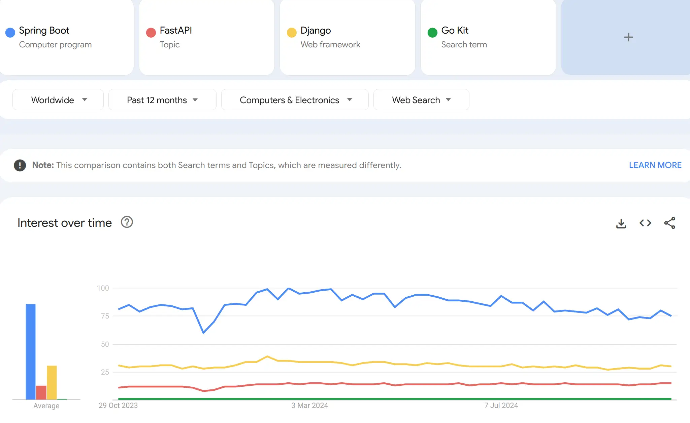

# The Spring Ecosystem

---

## Why Spring is Popular

* Widely used for **back-end development**, especially web applications
* Growing adoption due to **edge-cloud technologies** and **distributed architectures** ([O’Reilly 2024](https://www.oreilly.com/radar/technology-trends-for-2024/))

---

## Spring Boot

* Rapid application setup with **minimal configuration**

**Key Features:**

* Embedded web servers → no WAR deployment needed
* Starter dependencies → simplified builds
* Auto-configuration → reduces boilerplate
* Production-ready → metrics, health checks, externalized config
* Minimal XML configuration

---

## Spring Core

* Provides **essential building blocks** for Spring applications

**Key Features:**

* Core: Dependency Injection, Events, Resources, i18n, Validation, Data Binding, Type Conversion, SpEL, AOP
* Testing: Mock objects, TestContext, Spring MVC Test, WebTestClient
* Data Access: Transactions, DAO support, JDBC, ORM, XML Marshalling
* Integration: JMS, JMX, Email, Scheduling, Caching, Observability

---

## Spring Data

* Simplifies **data access across multiple data stores**

**Key Features:**

* Repository abstraction & custom object mapping
* Dynamic query derivation from method names
* Domain base classes with common properties
* Transparent auditing (created/last modified)

---

## Spring Cloud

* Supports **cloud-native and distributed architectures**

**Key Features:**

* Distributed configuration
* Service discovery & routing
* Load balancing
* Resiliency & fault tolerance tools

---

## Spring Security

* Provides **authentication, authorization, and protection mechanisms**

**Key Features:**

* Authentication & authorization
* Password encoding & user management
* Session & security context management
* CSRF & CORS protection
* HTTP headers hardening
* OAuth2 & OpenID Connect integration
* Method-level security & JWT stateless APIs

---

## Resources

* [Spring Framework](https://spring.io/projects/spring-framework)

