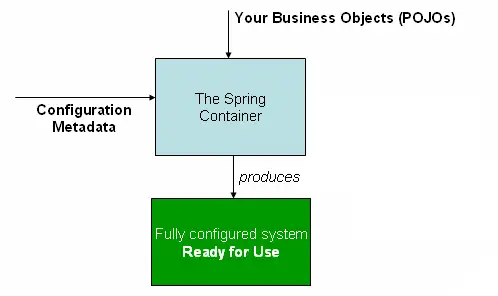

# Dependency Injection (DI)

---

* **Inversion of Control (IoC)** is a principle in software engineering that **transfers control of portions of a program to an external framework**.
* **Dependency Injection (DI)** is a **specific form of IoC**, where the framework provides objects that a class depends on rather than the class creating them itself.

--- 

**Without Dependency Injection**, the barista **creates its own coffee machine internally**.

```java
public class Barista {
    private CoffeeMachine coffeeMachine;

    public Barista() {
        // Barista decides which machine to use
        coffeeMachine = new EspressoMachine();
    }

    public void serveCoffee() {
        coffeeMachine.brew();
    }
}
```

**Problems:**

* If you want to switch machines (`FilterMachine`, `LatteMachine`), you must **modify the Barista**
* Testing the barista without a real machine is **difficult**

**With Dependency Injection**, the coffee machine is **provided from the outside** (injected by Spring).

```java
public class Barista {
    private CoffeeMachine coffeeMachine;

    // Machine is injected via the constructor
    public Barista(CoffeeMachine coffeeMachine) {
        this.coffeeMachine = coffeeMachine;
    }

    public void serveCoffee() {
        coffeeMachine.brew();
    }
}
```

**Benefits of DI:**

* Loosely coupled system → dependencies can be swapped easily
* Easier testing → mock dependencies instead of full implementations
* Promotes **clean architecture and flexibility**


---

## The Spring IoC Container

* The interface `org.springframework.context.ApplicationContext` represents the **Spring IoC container**.
* The container combines **application classes + configuration metadata** to produce a **fully configured, executable system**.



---

## Dependency Injection Types

### 1️⃣ Constructor Injection

* Dependencies are injected **via the constructor**.

```java
@Service
public class ProductService {
    private final ProductRepository productRepository;

    @Autowired
    public ProductService(ProductRepository productRepository) {
        this.productRepository = productRepository;
    }

    public Optional<Product> findByUuid(String uuid) {
        return productRepository.findByUuid(uuid);
    }

    public Iterable<Product> findAll() {
        return productRepository.findAll();
    }
}
```

**Advantages:**

* Dependencies are **immutable**
* Ensures required dependencies are always provided

---

### 2️⃣ Setter Injection

* Dependencies are injected **via setter methods**.

```java
@Service
public class ProductService {
    private ProductRepository productRepository;

    @Autowired
    public void setProductRepository(ProductRepository productRepository) {
        this.productRepository = productRepository;
    }

    public Optional<Product> findById(Long id) {
        return productRepository.findById(id);
    }

    public Iterable<Product> findAll() {
        return productRepository.findAll();
    }
}
```

**Advantages:**

* Allows optional dependencies
* Useful for **resolving circular dependencies**

---

## The `@Qualifier` and `@Primary` Annotations

* When multiple beans of the same type exist, we can control which one gets injected.

**@Qualifier:** specify the exact bean to inject

```java
@Component
public class Driver {
    private final Vehicle vehicle;

    @Autowired
    public Driver(@Qualifier("Car") Vehicle vehicle) {
        this.vehicle = vehicle;
    }

    public void drive() {
        vehicle.start();
    }
}
```

**@Primary:** marks a bean as the default if no `@Qualifier` is provided

```java
@Component
@Primary
public class Car implements Vehicle { ... }

@Component
public class Bike implements Vehicle { ... }
```

```java
@Component
public class Driver {
    private final Vehicle vehicle;

    @Autowired
    public Driver(Vehicle vehicle) { // Car is injected by default
        this.vehicle = vehicle;
    }

    public void drive() {
        vehicle.start();
    }
}
```

---

## Circular Dependencies in Spring

* Occurs when **two or more beans depend on each other**, forming a cycle.

```java
@Component
public class A {
    private final B b;

    @Autowired
    public A(B b) { this.b = b; }
}
```

```java
@Component
public class B {
    private final A a;

    @Autowired
    public B(A a) { this.a = a; }
}
```

* **Spring resolution:** works only if **at least one dependency uses setter or field injection**.

**Setter Injection Example:**

```java
@Component
public class A {
    private B b;

    @Autowired
    public void setB(B b) { this.b = b; }
}
```

```java
@Component
public class B {
    private A a;

    @Autowired
    public void setA(A a) { this.a = a; }
}
```

---

## Resources

* [IoC & DI – Martin Fowler](https://martinfowler.com/articles/injection.html)
* [Spring Dependency Injection Series – Baeldung](https://www.baeldung.com/spring-dependency-injection)

