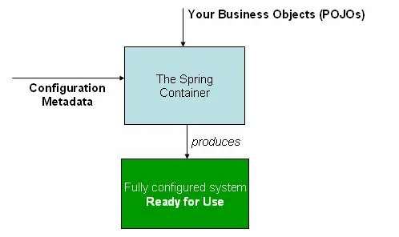

# Dependency Injection

## What Is Inversion of Control?

**Inversion of Control is a principle in software engineering which transfers the control of portions of a program to an external framework**. 

In contrast with traditional OOP, in which custom code makes calls to a library, IoC enables a framework to take control of the flow of a program and make calls to our custom code.

We can achieve Inversion of Control through various mechanisms. The one used is Spring is **Dependency Injection**.

## The Spring IoC Container
The interface `org.springframework.context.ApplicationContext` represents the Spring IoC container which is **responsible for instantiating, configuring, and assembling beans**. It allows you to express the objects that compose your application and the rich interdependencies between such objects. 

The following diagram is a high-level view of how Spring works. Your application classes are combined with configuration metadata so that after the `ApplicationContext` is created and initialized, you have a fully configured and executable system or application.



## Dependency Injection

_Class A has a dependency on Class B when it interacts with it in any way_

One option is for Class A to take on the responsibility of instantiating B by itself:

```java
public class A {
    private B bDependency;
  
    public A() {
        bDependency = new B();    
    }
}
```

Alternatively, that responsibility can be external, meaning the dependency comes from the outside:

```java
public class A {
    private B bDependency;
    
    public A(B bDependency) {
        this.bDependency = bDependency;
    }
}
```

**Injection is simply the process of injecting the dependency B in the object of type A.** Since the instantiation of the B dependency is no longer done in A, that responsibility will now belong to the framework. Separating the responsibility of instantiating a class from the logic in that class is a very useful concept:

* Leads to **a more loosely coupled system and adds flexibility** (dependencies can be swapped out at runtime).
* **Helpful in both application architecture, as well as testing, because DI make it easier to switch between different implementations of the dependency**. For example, we can pass in a mock of a dependency rather than a full dependency object.

## Dependency Injection Types

There are **two main ways to inject dependencies**:

* Constructor injection
* Setter injection

### Constructor Injection

In this case, we inject dependencies in a class via its constructor arguments (each argument represents a dependency that Spring will inject automatically).

```java
@Service
public class ProductService {
   private final ProductRepository productRepository;

   @Autowired
   public ProductService(ProductRepository productRepository) {
      this.productRepository = productRepository;
   }

   public Optional<Product> findByUuid(String uuid) {
      return productRepository.findByUuid(uuid);
   }

   public Iterable<Product> findAll() {
       return productRepository.findAll();
   }
   
   // ...
}
```

### Setter Injection

In setter-based injection, **we inject dependencies using the setter methods** of the required dependencies declared as fields.

```java
@Service
public class ProductService {
    private ProductRepository productRepository;

    @Autowired
    public void setProductRepository(ProductRepository productRepository) {
        this.productRepository = productRepository;
    }

    public Optional<Product> findById(Long id) {
        return productRepository.findById(id);
    }

    public Iterable<Product> findAll() {
        return productRepository.findAll();
    }

    // ...
}
```

## The _@Qualifier_ and _@Primary_ Annotations

`@Qualifier` and `@Primary` are annotations used to handle the injection of dependencies when there are multiple beans of the same type, allowing more control over which specific bean is chosen by the framework.

`@Qualifier` is used to disambiguate between multiple beans of the same type. 

Suppose you have two implementations of an interface `Vehicle`:

```java
public interface Vehicle {
    void start();
}

@Component
public class Car implements Vehicle {
    @Override
    public void start() {
        System.out.println("Car is starting");
    }
}

@Component
public class Bike implements Vehicle {
    @Override
    public void start() {
        System.out.println("Bike is starting");
    }
}
```

If you want to inject the `Car` bean into a class, you can use `@Qualifier`:

```java
@Component
public class Driver {
    private final Vehicle vehicle;

    @Autowired
    public Driver(@Qualifier("car") Vehicle vehicle) {
        this.vehicle = vehicle;
    }

    public void drive() {
        vehicle.start();
    }
}
```

`@Primary` is used to specify which bean should be preferred when no `@Qualifier` is specified. 


```java
@Component
@Primary
public class Car implements Vehicle {
    @Override
    public void start() {
        System.out.println("Car is starting");
    }
}

@Component
public class Bike implements Vehicle {
    @Override
    public void start() {
        System.out.println("Bike is starting");
    }
}
```

Here, `Car` is marked with `@Primary`, so if you inject a `Vehicle` without specifying a `@Qualifier`, Spring will automatically choose the `Car` bean:

```java
@Component
public class Driver {
    private final Vehicle vehicle;

    @Autowired
    public Driver(Vehicle vehicle) { // No @Qualifier needed
        this.vehicle = vehicle;
    }

    public void drive() {
        vehicle.start();
    }
}
```

## Circular Dependencies in Spring

A **circular dependency** occurs when two or more beans in a Spring application depend on each other, creating a cycle that Spring cannot resolve automatically.

```java
@Component
public class A {
    private final B b;

    @Autowired
    public A(B b) {
        this.b = b;
    }
}
```

```java
@Component
public class B {
    private final A a;

    @Autowired
    public B(A a) {
        this.a = a;
    }
}
```

Here, `A` depends on `B`, and `B` depends on `A`, creating a circular dependency.

### How Spring Handles Circular Dependencies

Spring can resolve circular dependencies **only if at least one of the dependencies is injected via a setter or field injection**, allowing the container to create one bean first and inject the other later.

**Setter Injection (Recommended)**

```java
@Component
public class A {
    private B b;

    @Autowired
    public void setB(B b) {
        this.b = b;
    }
}
```

```java
@Component
public class B {
    private A a;

    @Autowired
    public void setA(A a) {
        this.a = a;
    }
}
```

## Resources
- [Inversion of Control Containers and the Dependency Injection pattern (Martin Fowler)](https://martinfowler.com/articles/injection.html)
- [Spring Dependency Injection Series](https://www.baeldung.com/spring-dependency-injection)


