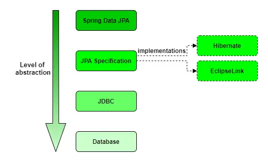

# Persistence

## Java Persistence Solutions

Spring Data is a family of projects designed for **data access and repository management**.

* [Spring Data Commons](https://github.com/spring-projects/spring-data-commons) – Core Spring concepts underpinning every Spring Data module
* [Spring Data JDBC](https://spring.io/projects/spring-data-jdbc) – Repository support for JDBC
* [Spring Data JPA](https://spring.io/projects/spring-data-jpa) – Repository support for JPA
* [Spring Data MongoDB](https://spring.io/projects/spring-data-mongodb) – Object-document support for MongoDB
* [Spring Data R2DBC](https://spring.io/projects/spring-data-r2dbc) – Repository support for R2DBC
* [Spring Data KeyValue](https://github.com/spring-projects/spring-data-keyvalue) – `Map`-based repositories for key-value stores
* [Spring Data LDAP](https://spring.io/projects/spring-data-ldap) – Repository support for Spring LDAP
* [Spring Data Redis](https://spring.io/projects/spring-data-redis) – Easy configuration and access to Redis
* [Spring Data REST](https://spring.io/projects/spring-data-rest) – Exports repositories as hypermedia-driven RESTful resources
* [Spring Data for Apache Cassandra](https://spring.io/projects/spring-data-cassandra) – Access to Cassandra for highly available apps
* [Spring Data for Apache Geode](https://spring.io/projects/spring-data-geode) – Access to Geode for low-latency, highly consistent apps

---

### Spring Data JDBC

* Standard JDBC approach, the **oldest way to access databases in Java**
* Uses **SQL statements directly**, which can be an advantage or disadvantage

**Advantages:**

* Improved performance due to direct database communication
* Lightweight, minimal abstraction

**Disadvantages:**

* Dependency on database vendor
* Changing DB (e.g., MySQL → Oracle) may require adjusting SQL for dialect differences

---

### Spring Data JPA

* **Higher-level alternative** to JDBC using JPA (Jakarta Persistence API)
* Uses **ORM (Object-Relational Mapping)** to map classes to database tables

**Key points:**

* Define **entities** instead of tables
* Framework handles SQL generation and persistence
* Popular implementations: **Hibernate** (most used) or **EclipseLink** (reference)



**Trade-offs:**

* **Less control** over generated SQL
* **Suitable for most projects**
* Custom queries or performance-critical paths can use **JPA customizations** or **direct JDBC**

---

## Configuration

### Maven (`pom.xml`)

```xml
<dependencies>
    <!-- Spring Boot JPA Starter -->
    <dependency>
        <groupId>org.springframework.boot</groupId>
        <artifactId>spring-boot-starter-data-jpa</artifactId>
    </dependency>

    <!-- PostgreSQL driver -->
    <dependency>
        <groupId>org.postgresql</groupId>
        <artifactId>postgresql</artifactId>
    </dependency>

    <!-- H2 in-memory database driver -->
    <dependency>
        <groupId>com.h2database</groupId>
        <artifactId>h2</artifactId>
        <scope>runtime</scope>
    </dependency>
</dependencies>
```

---

### Spring Boot (`application.yml`)

**PostgreSQL Configuration**

```yaml
spring:
  datasource:
    url: jdbc:postgresql://localhost:5432/jdbc_schema
    username: user
    password: secret
  jpa:
    open-in-view: false
    hibernate.ddl-auto: create-drop
    defer-datasource-initialization: true
  sql:
    init.mode: always
```

**H2 Configuration**

```yaml
spring:
  datasource:
    url: jdbc:h2:mem:testdb;DB_CLOSE_DELAY=-1
    username: sa
    password:
  jpa:
    open-in-view: false
    hibernate.ddl-auto: create-drop
    defer-datasource-initialization: true
  sql:
    init.mode: always
  h2:
    console:
      enabled: true
```

---

## Creating Spring Data JPA Repositories

* Repositories allow **CRUD operations without implementation code**
* Core interfaces:

    * [CrudRepository](https://docs.spring.io/spring-data/commons/docs/current/api/org/springframework/data/repository/CrudRepository.html) – CRUD methods
    * `PagingAndSortingRepository` – Pagination and sorting
    * `JpaRepository` – JPA-specific methods (flush, batch delete)

**Example repository:**

```java
@Repository
public interface ProductRepository extends CrudRepository<Product, Long> {
}
```

* Repository interfaces are **proxies created by Spring**, no implementation needed

---

## Using Spring Data Repositories

```java
@Log
@SpringBootApplication
public class App implements ApplicationRunner {
    private final ProductRepository productRepository;

    public App(ProductRepository productRepository) {
        this.productRepository = productRepository;
    }

    public static void main(final String... args) {
        SpringApplication.run(App.class, args);
    }

    @Override
    public void run(ApplicationArguments args) {
        productRepository.save(new Product("171f5df0-b213-4a40-8ae6-fe82239ab660", "Laptop", 2.2));
        productRepository.save(new Product("f89b6577-3705-414f-8b01-41c091abb5e0", "Bike", 5.5));
        productRepository.save(new Product("b1f4748a-f3cd-4fc3-be58-38316afe1574", "Shirt", 0.2));

        Iterable<Product> products = productRepository.findAll();
        for (Product product : products) {
            log.info(product.toString());
        }
    }
}
```

---

## Custom Queries

### 1️⃣ Method Naming Conventions

```java
List<Product> findByName(String name);
List<Product> findByWeightGreaterThan(Double weight);
List<Product> findByNameAndWeight(String name, Double weight);
List<Product> findByNameContaining(String nameFragment);
List<Product> findByWeightBetween(Double minWeight, Double maxWeight);
List<Product> findAllByOrderByNameAsc();
```

### 2️⃣ Using `@Query` Annotation

```java
@Query("SELECT p FROM Product p WHERE p.name = :name")
List<Product> findProductsByName(@Param("name") String name);

@Query("SELECT p FROM Product p WHERE p.weight > :weight")
List<Product> findProductsWithWeightGreaterThan(@Param("weight") Double weight);

@Query("SELECT p FROM Product p WHERE p.name LIKE %:nameFragment%")
List<Product> findProductsByNameContaining(@Param("nameFragment") String nameFragment);

@Query("SELECT p FROM Product p WHERE p.weight BETWEEN :minWeight AND :maxWeight")
List<Product> findProductsByWeightRange(@Param("minWeight") Double minWeight, @Param("maxWeight") Double maxWeight);

@Query(value = "SELECT * FROM product ORDER BY weight DESC", nativeQuery = true)
List<Product> findAllProductsOrderedByWeightDesc();
```

---

## Resources

* [Spring Data Projects](https://spring.io/projects/spring-data)
* [Baeldung – Spring Data Repositories](https://www.baeldung.com/spring-data-repositories)

