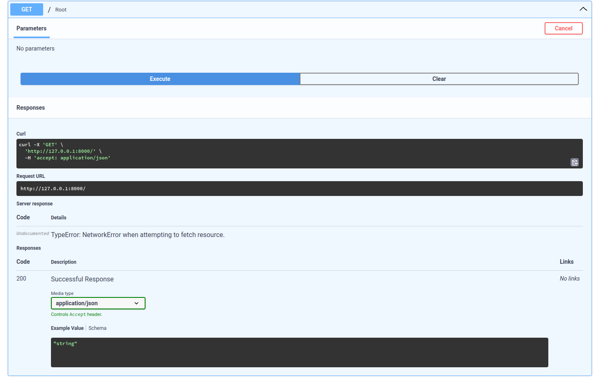

# Introduction to FastAPI

**FastAPI** is a modern, fast (high-performance) web framework for building APIs with Python 3.7+ based on standard Python type hints. 

It was created to make the development of RESTful APIs simple, efficient, and highly performant. 

One of its key advantages is its speed: it is one of the fastest Python frameworks available, thanks to its use of *Starlette* (for web parts) and *Pydantic* (for data validation).

Some of the main benefits of FastAPI are:

- **High performance** comparable to Node.js and Go.
- **Automatic interactive API documentation** with Swagger UI and ReDoc.
- **Validation and serialization** powered by Python type hints and Pydantic.
- **Easy to learn** and use, with concise, readable code.

## Install

If you use Conda, create a new environment called `fastapi` or whatever:

```bash
conda create -n fastapi python=3.12

conda activate fastapi 
```

Otherwise, create new [virtual environment](https://docs.python.org/3/library/venv.html) or install for main Python.

Then, following the [official documentation](https://fastapi.tiangolo.com/tutorial/#run-the-code), install FastAPI library running:

```bash
pip install "fastapi[standard]"
```

**That it's**, as usual in Python it is very easy.

Check installation running:

```bash
fastapi --version
```

## Hello world step-by-step

### 1. Import FastAPI

```py
from fastapi import FastAPI
```

The `FastAPI()` class is the core of every FastAPI application, it provides all the functionality for your API.

### 2. Create a FastAPI "instance"


```py
from fastapi import FastAPI

# Create the application instance
app = FastAPI()
```

You are creating an instance of the `FastAPI` class, which acts as the main application object.

This object has several responsibilities:

- **Routing**: It maps HTTP methods and paths (like `GET /` or `POST /`users) to the corresponding Python functions you define with decorators (`@app.get`, `@app.post`, etc.).
- **Dependency Injection**: It provides a way to declare and automatically resolve dependencies such as authentication, database connections, or reusable services.
- **Validation and Serialization**: It uses Pydantic to validate incoming request data and to format outgoing responses.
- **Documentation Generation**: It automatically generates interactive API documentation that you can access at `/docs` (Swagger UI) or `/redoc`.

> [!NOTE]
> `FastAPI` is a class that inherits directly from `Starlette`, therefore they share same base functionality.


### 3. Define a basic route

Following code achieves "Hello world" goal returning a JSON message if you will perform a GET request on `/` (root of web service).

```py
from fastapi import FastAPI  

# Create the application instance
app = FastAPI()  

# Define a basic route
@app.get("/")  
def read_root():  
    return {"message": "Hello, World!"}
```

### 4. Run application

To run the application, save the code in a file named `main.py` and use the command:

```
fastapi dev main.py
```

You should see something similar to:

```
INFO:     Uvicorn running on http://127.0.0.1:8000 (Press CTRL+C to quit)
```

Go to `http://127.0.0.1:8000/` to see the hello world JSON response:

```js
{"message": "Hello, World!"}
```


## Documentation

As already mentioned, FastAPI generates documentation automatically thanks to Swagger.
You can see it and interact go to `http://127.0.0.1:8000/docs`


