# Asynchronous communications

Asynchronous communication is a key architectural pattern in distributed systems. Unlike synchronous communication, where one service sends a request and waits for a response, **asynchronous communication allows services to continue processing other tasks while awaiting a response**. 

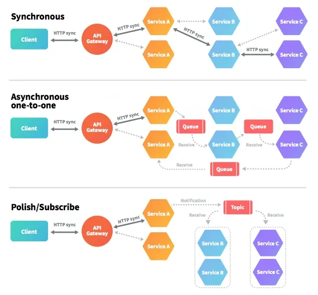

## Benefits of Asynchronous Communication


1. **Decoupled Services**:
   Services in asynchronous architectures are more loosely coupled. The **sender does not need to know when or how the recipient processes the message (solves temporal coupling!)**. 
2. **Better Resource Utilization**:
   In asynchronous communication, **system resources (such as threads and memory) are not blocked waiting for responses (solves thread pool exhaustion!)**. This improves resource utilization, especially in high-throughput environments.
3. **Improved Scalability**:
   Asynchronous systems are more scalable because **services are not waiting for immediate responses**. Instead, they handle tasks independently. **Message queues can also scale horizontally**, distributing load across services.
4. **Increased Resilience**:
   Since services do not rely on the immediate availability of others, the system is more resilient to failures. A **message broker can store messages** in case a service is down and deliver them when it becomes available again, making the system fault-tolerant.


## Challenges of Asynchronous Communication

1. **Complexity**:
   Managing asynchronous communication introduces **additional complexity** in system design. **Ensuring that messages are delivered, processed, and acknowledged properly** requires additional infrastructure components and configurations.

2. **Consistency**:
   Eventual consistency is a common model in asynchronous systems, where data updates propagate asynchronously between services. While this improves availability, it can lead to **data consistency** issues since updates may take time to propagate.

3. **Message Ordering**:
   **Ensuring messages are processed in the correct order can be a challenge**, particularly in distributed systems where messages might arrive out of order. Advanced message brokers provide support for message sequencing, but this adds complexity to the implementation.

4. **Error Handling**:
   Errors in asynchronous communication are often harder to detect and handle than in synchronous systems. **When a service fails to process a message, it may not be immediately obvious**. Retry mechanisms, dead-letter queues, and monitoring are essential to managing errors effectively.


## Messaging Systems Architectures

There are two primary approaches to asynchronous messaging passing: **broker-based** and **broker-less** (also known as peer-to-peer or direct messaging) systems.

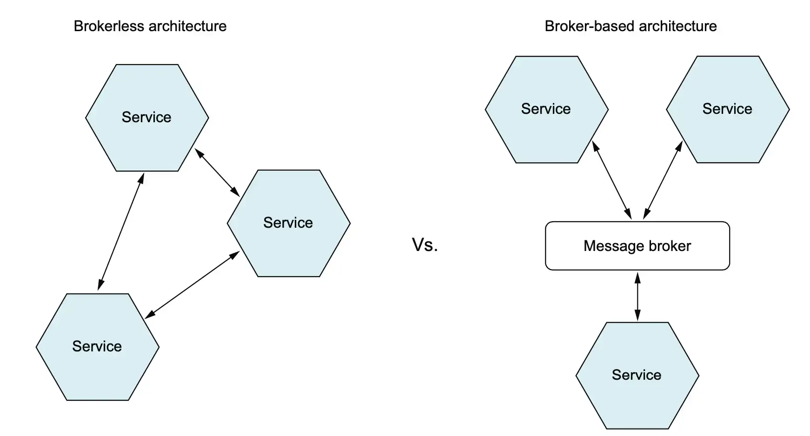

## Brokerless Messaging Systems

Brokerless messaging, eliminates the need for a central broker. Instead, services communicate directly with each other. Brokerless systems use protocols such as **gRPC**, **ZeroMQ**, and **HTTP-based messaging**.

For efficient communication, peers spawn **multiple threads or use asynchronous I/O to handle multiple connections at once**. This ensures that the peer can send/receive messages without blocking other tasks.

* ZeroMQ (https://zeromq.org/)
* NanoMsg (https://nanomsg.org/)

#### Advantages
1. **No Single Point of Failure**: Brokerless systems avoid the broker becoming a single point of failure, making the architecture more resilient to certain types of failures.
2. **Low Latency**: Messages travel directly between services, reducing the additional overhead introduced by a broker. This leads to faster communication and lower latency.
3. **More Control**: Direct communication gives services full control over how messages are handled, improving flexibility in handling specific scenarios like retries or error handling.

| Direct Communication            | Directory Service                |
|---------------------------------|----------------------------------|
| 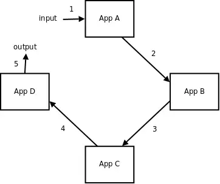 | 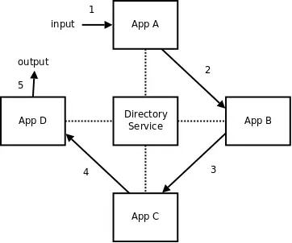 |

| Distributed Broker                        | Distributed Directory Service                |
|-------------------------------------------|----------------------------------------------|
|  | 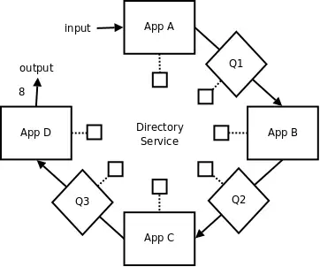 |


#### Disadvantages
1. **Tight Coupling**: In a brokerless system, services need to know how to communicate with each other directly. This increases the coupling between services and makes changes harder to manage (e.g., changing a service’s location or API may require updating all services that communicate with it).
2. **No Built-in Reliability**: In brokerless systems, reliability features like message persistence, retries, and delivery guarantees need to be implemented by the developers. This increases complexity, as the system lacks the reliability mechanisms provided by brokers.
3. **No Built-in Scaling**: Scaling brokerless systems can be more complex, especially in high-throughput environments. You may need to implement custom load balancing and failover mechanisms to ensure that the system can handle large numbers of connections or messages.
4. **No Built-in Concurrency**: Handling multiple concurrent connections or ensuring message ordering and delivery can become problematic, requiring careful design and management of the communication logic.

## Broker-Based Messaging Systems

Broker-based messaging systems rely on a **central message broker** to manage the communication between different services. The broker acts as an intermediary, receiving messages from producers and delivering them to consumers. 

Common systems:

| Software                | Protocol(s) Used                                      |
| ----------------------- | ----------------------------------------------------- |
| RabbitMQ                | AMQP (Advanced Message Queuing Protocol), MQTT, STOMP |
| Apache Kafka            | Kafka Protocol (custom TCP-based protocol)            |
| ActiveMQ                | AMQP, STOMP, MQTT, OpenWire                           ||

Proprietary systems:

| Proprietary Managed Broker | Provider  | Protocol(s)              |
|----------------------| --------- | ------------------------ |
| Amazon SQS           | AWS       | HTTPS/REST API           |
| Azure Service Bus    | Microsoft | AMQP 1.0, HTTPS/REST API |
| Google Cloud Pub/Sub | Google    | HTTPS/REST API, gRPC     |

#### Advantages
1. **Decoupling**: Producers and consumers don’t need to know about each other’s existence **(solves spatial coupling!)**. They only interact with the broker, making the system loosely coupled and easier to maintain and scale.
2. **Reliability**: Message brokers store messages and provide **delivery guarantees** (e.g., at-least-once, exactly-once). Even if a consumer is down, the broker ensures that the message will be delivered when the consumer is available.
3. **Scalability**: With proper configuration (e.g., Kafka partitions, RabbitMQ clusters), brokers can handle massive amounts of data and scale horizontally to accommodate high-throughput use cases.

#### Disadvantages
1. **Single Point of Failure**: If not properly configured with replication or failover, the **broker can become a single point of failure** in the system. In case of broker downtime, message flow can be interrupted. As a centralized component, the **broker can also become a bottleneck under heavy load** or misconfiguration, causing delays or failures in message delivery.
2. **Communication/Latency Overhead**: Every message must pass through the broker before being delivered to the intended recipient. This also introduces additional latency.

**Example:**

The following business logic implies many calls among services and the broker. Latency is added at each step. If the broker fails, the whole process fail.


```text
function AppA (x) {
    y = do_business_logic_A (x);
    return AppB (y);
}

function AppB (x) {
    y = do_business_logic_B (x);
    return AppC (y);
}

function AppC (x) {
    y = do_business_logic_C (x);
    return AppD (y);
}

function AppD (x) {
    return do_business_logic_D (x);
}
```

| SOA Model                       | Pipeline Model                  |
|---------------------------------|---------------------------------|
| 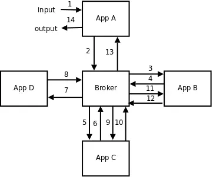 | 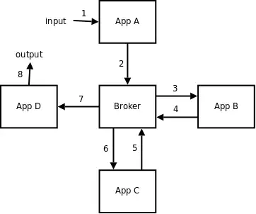 |


### Protocols

| Protocol                                                  | Description                                                                                                                                                                                                | Typical Use Cases                                                                                                                                          |
| --------------------------------------------------------- | ---------------------------------------------------------------------------------------------------------------------------------------------------------------------------------------------------------- | ---------------------------------------------------------------------------------------------------------------------------------------------------------- |
| AMQP (Advanced Message Queuing Protocol)                  | An open standard binary protocol for messaging. Defines a complete messaging system: message format, broker behavior, routing, and reliability. Designed for interoperability between clients and brokers. | Enterprise messaging, reliable message delivery, financial services, systems requiring guaranteed delivery. Used by RabbitMQ, ActiveMQ, Azure Service Bus. |
| STOMP (Simple/Streaming Text Oriented Messaging Protocol) | A simple, text-based protocol for messaging over TCP. Works like “HTTP for messaging” — easy to implement and debug. Less feature-rich than AMQP.                                                          | Lightweight messaging, simple pub/sub systems, connecting web clients to brokers. Supported by RabbitMQ, ActiveMQ.                                         |
| MQTT (Message Queuing Telemetry Transport)                | A lightweight publish/subscribe protocol designed for constrained devices and unreliable networks. Runs over TCP/IP. Focused on low bandwidth, low power usage, and small code footprint.                  | IoT devices, sensors, telemetry, mobile apps. Supported by RabbitMQ, ActiveMQ, AWS IoT, others.                                                            |
| Kafka Protocol                                            | A high-throughput, distributed messaging protocol designed for streaming data. Supports partitioning, replication, and fault-tolerant message delivery. Works over TCP.                                    | Real-time data streaming, event sourcing, log aggregation, analytics pipelines. Used by Apache Kafka and Kafka-compatible platforms.                       |


## Design Patterns

### Routing (Routing Key)

**Purpose:**
Route messages to different channels/services based on content.

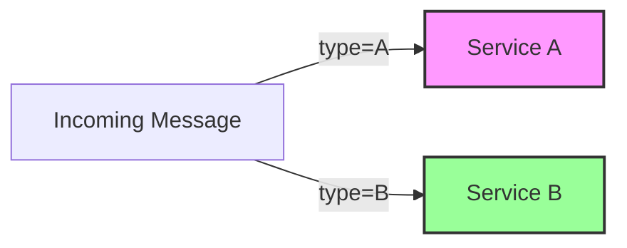

### Routing (Competing Consumers)

**Purpose:**
Increase throughput by letting multiple consumers share work.

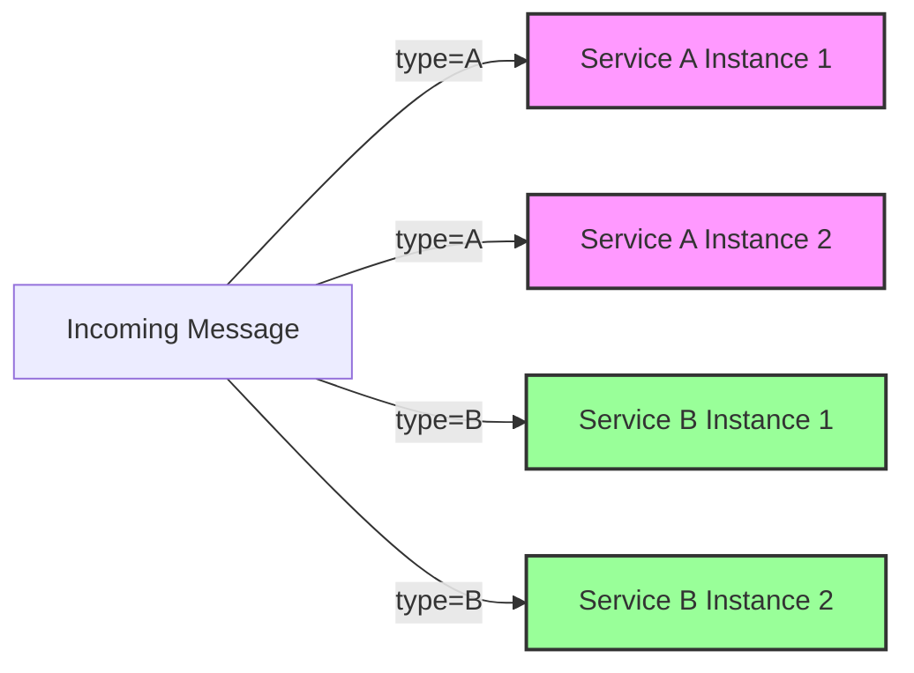

### Routing (Sharded Consumers)

**Purpose:**
Increase throughput by letting multiple consumers share work (each consumer receives events related to same entity).

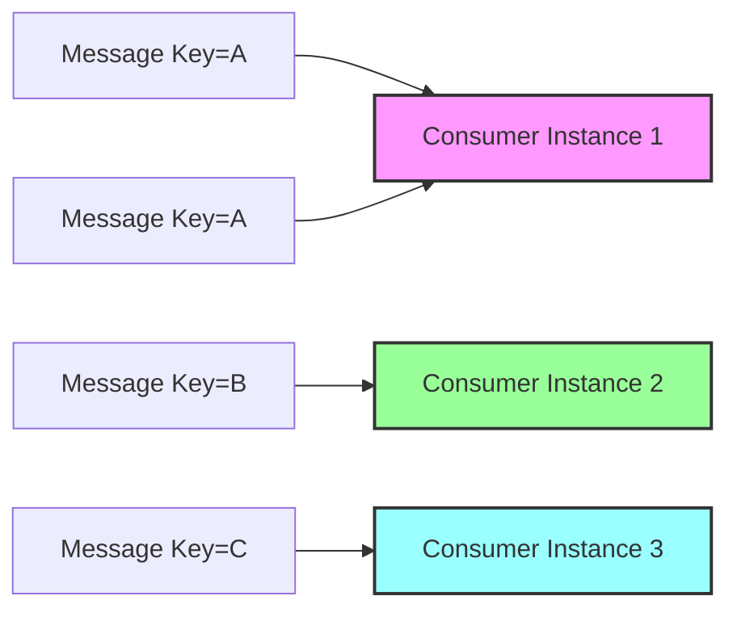

### Dead-Letter Queue (DLQ)

**Purpose:**
Handle messages that cannot be processed (nack, TTL expired, retries exceeded).

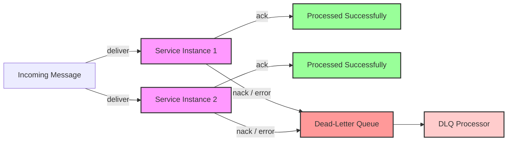


### Event-Carried State Transfer

**Purpose:**
Events *carry the state* needed by other services, so they maintain **local copies** and avoid synchronous calls.

**Characteristics:**

* Service A updates its state → publishes an event with the full relevant data. 
* Service B consumes the event → updates its local copy.
* Events act as a source of truth

**Use cases:**

* CQRS view creation
* Materialized product catalogs
* User profile replication

**Diagram:**

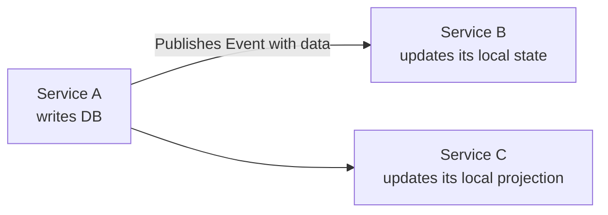

### Change Data Capture (CDC) AKA Automated Event-Carried State Transfer

**Purpose:**  
Capture database changes (inserts, updates, deletes) and propagate them as events so other services or systems can **maintain synchronized copies** without direct synchronous access.

**Characteristics:**

* Database-centric
* Produces a stream of change events
* Supports near real-time replication
* Decouples consumers from the database

**Use cases:**

* Data replication across microservices
* Event-driven pipelines
* Analytics and reporting
* Materialized views from legacy databases

**Diagram:**

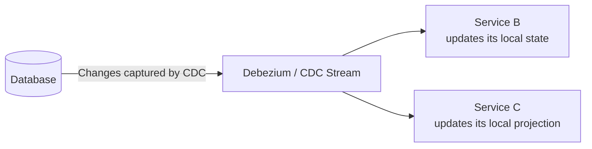

### Event Sourcing

**Purpose:**
The *event log is the system of record*, not a table with current state.

**Characteristics:**

* Every state change = event
* State is rebuilt by event replay
* Perfect audit log
* Enables temporal queries

**Use cases:**

* Finance / banking
* Inventory
* IoT state tracking

### Saga Pattern (Choreography)

**Purpose:**
Manage distributed transactions via *a series of local transactions* coordinated by events.

**Characteristics:**

* No central orchestrator
* Services listen/react to events
* Good for small flows

**Use cases:**

* E-commerce orders
* Booking systems (hotel/flight/car)

**Diagram:**

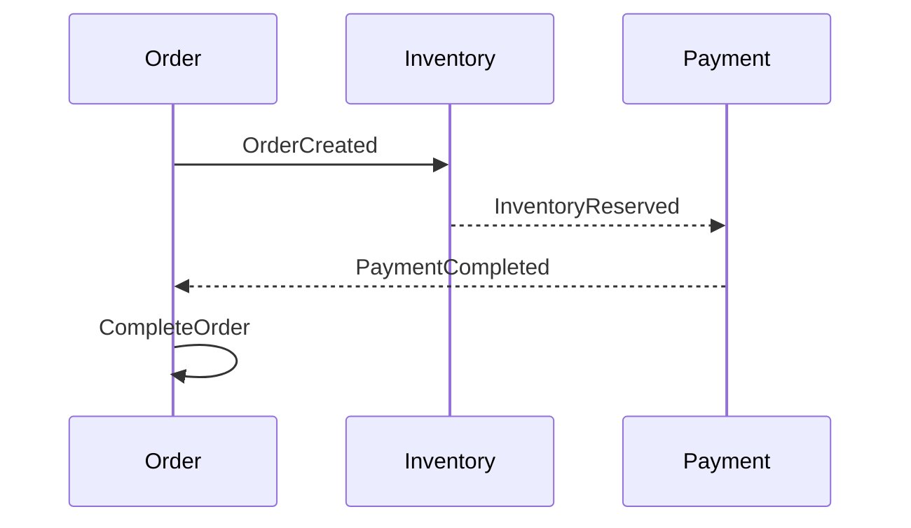

### Saga Pattern (Orchestration)

**Purpose:**
A *central coordinator service* commands steps and compensations.

**Characteristics:**

* Workflow is easier to follow
* Logic centralized
* Better for long/complex processes

**Diagram:**

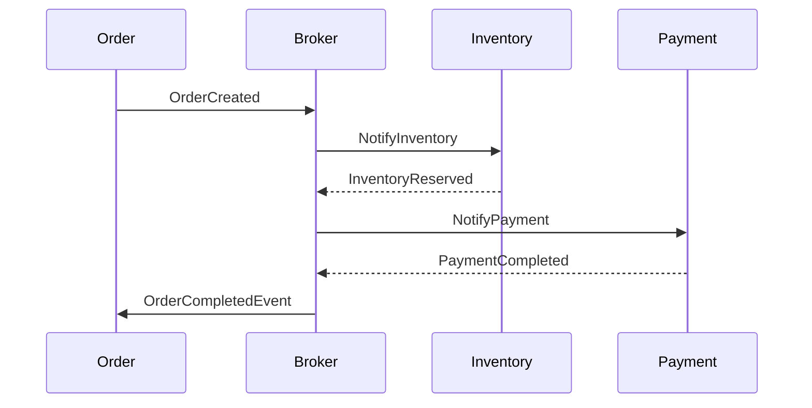

## Resources

