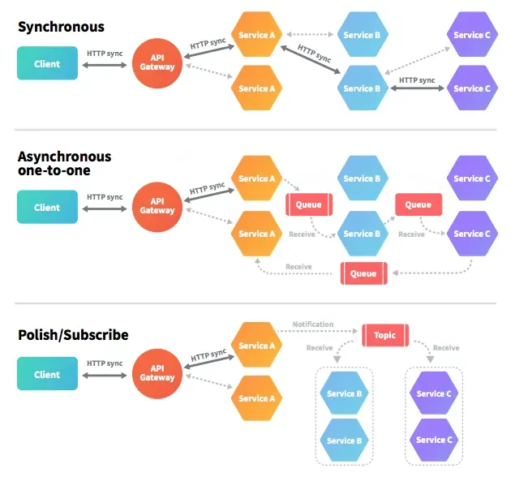
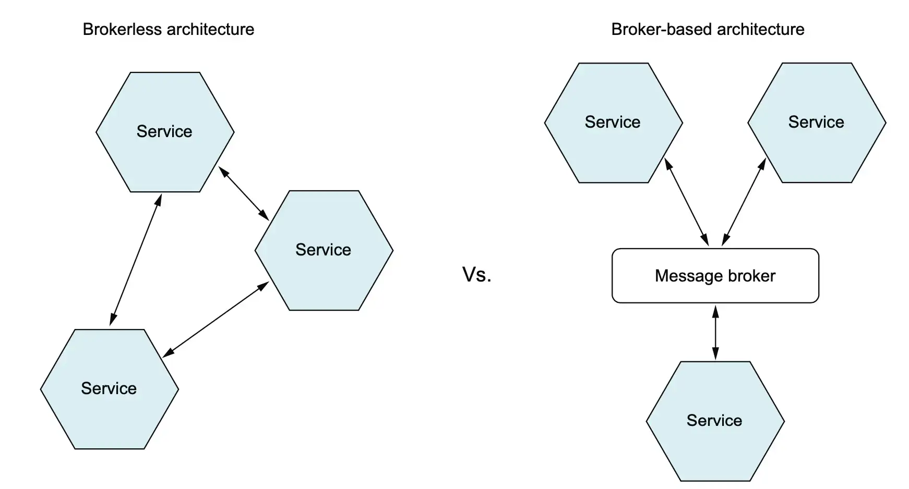
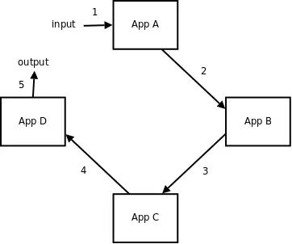
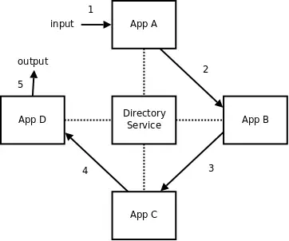
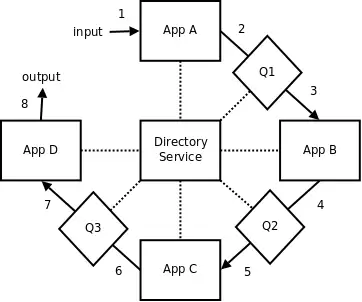
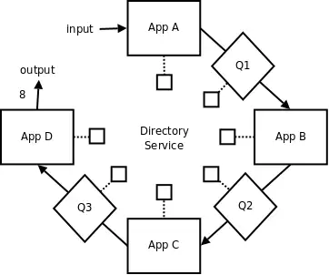
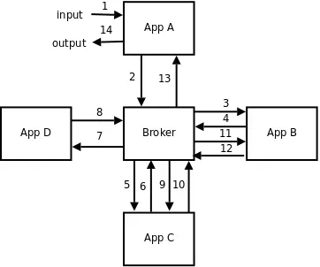
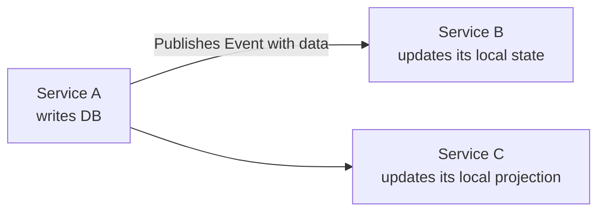
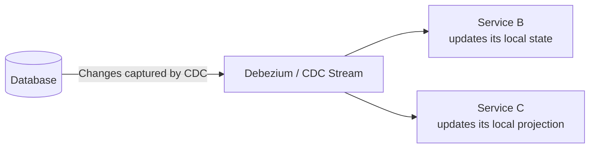
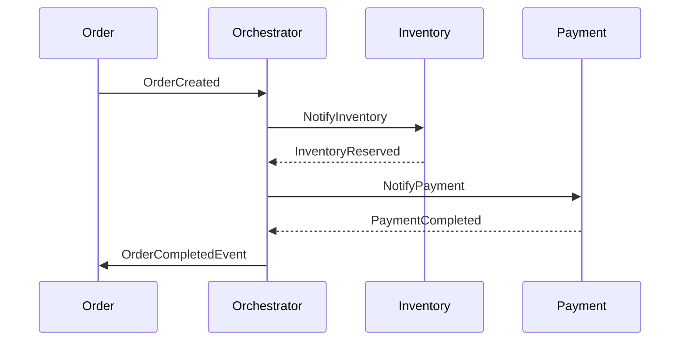

# Asynchronous communications

Asynchronous communication is a key architectural pattern in distributed systems. Unlike synchronous communication, where one service sends a request and waits for a response, **asynchronous communication allows services to continue processing other tasks while awaiting a response**. 



## Benefits of Asynchronous Communication

1. **Decoupled Services** – Sender and receiver operate independently, **eliminating temporal coupling**.
2. **Better Resource Utilization** – Threads and memory aren’t blocked waiting for responses, **preventing resource exhaustion**.
3. **Improved Scalability** – Services handle tasks independently; **queues distribute load**, allowing horizontal scaling.
4. **Increased Resilience** – Brokers **store and forward messages**, enabling fault-tolerance when services are temporarily unavailable.

## Challenges of Asynchronous Communication

1. **Complexity** – Requires extra infrastructure to **ensure message delivery, processing, and acknowledgment**.
2. **Consistency** – Eventual consistency can lead to **temporary data discrepancies** between services.
3. **Message Ordering** – Maintaining the **correct processing order** is challenging in distributed systems.
4. **Error Handling** – Failures are harder to detect; **retries, dead-letter queues, and monitoring** are needed for reliability.

## Messaging Systems Architectures

There are two primary approaches to asynchronous messaging passing: **broker-based** and **broker-less** (also known as peer-to-peer or direct messaging) systems.



## Brokerless Messaging Systems

Brokerless messaging enables direct communication between applications or components **without relying on a central message broker**. This reduces latency, simplifies deployment, and improves scalability, making it ideal for high-performance distributed systems.

[ZeroMQ](https://zeromq.org/) is a lightweight, high-performance messaging library that supports brokerless communication. It provides **asynchronous sockets** with patterns like **publish/subscribe, request/reply, and push/pull**, allowing low-latency messaging across threads, processes, and machines. ZeroMQ abstracts the network layer, letting developers focus on application logic.

[NanoMsg](https://nanomsg.org/) is a simplified, modular messaging library inspired by ZeroMQ. It supports **common messaging patterns** (pub/sub, pipeline, request/reply) and multiple transports (TCP, IPC, in-process). NanoMsg emphasizes **robustness, portability, and ease of maintenance**, making it suitable for scalable distributed applications.


#### Advantages
1. **No Single Point of Failure**: Brokerless systems avoid the broker becoming a single point of failure, making the architecture more resilient to certain types of failures.
2. **Low Latency**: Messages travel directly between services, reducing the additional overhead introduced by a broker. This leads to faster communication and lower latency.
3. **More Control**: Direct communication gives services full control over how messages are handled, improving flexibility in handling specific scenarios like retries or error handling.

| Direct Communication            | Directory Service                |
|---------------------------------|----------------------------------|
|  |  |

| Distributed Broker                        | Distributed Directory Service                |
|-------------------------------------------|----------------------------------------------|
|  |  |

* **Pure Brokerless:** Direct messaging, full control, manual management.
* **Broker as Directory Service:** Broker tracks locations, messages go direct.
* **Distributed Broker:** Lightweight queues handle messages, avoid bottlenecks.
* **Distributed Directory Service:** Replicated directory, no single point of failure, dynamic network.

#### Disadvantages
1. **Tight Coupling** – Services must know how to communicate directly, making changes harder and increasing dependencies.
2. **No Built-in Reliability** – Developers must implement **persistence, retries, and delivery guarantees**, adding complexity.
3. **No Built-in Scaling** – High-throughput scenarios require **custom load balancing and failover mechanisms**.
4. **No Built-in Concurrency** – Managing **multiple connections, message ordering, and delivery** is manual and error-prone.

## Broker-Based Messaging Systems

Broker-based messaging systems rely on a **central message broker** to manage the communication between different services. The broker acts as an intermediary, receiving messages from producers and delivering them to consumers. 

Common systems:

| Software              | Protocol(s) Used                                      |
|-----------------------| ----------------------------------------------------- |
| RabbitMQ              | AMQP (Advanced Message Queuing Protocol), MQTT, STOMP |
| Apache Kafka/RedPanda | Kafka Protocol (custom TCP-based protocol)            |
| ActiveMQ              | AMQP, STOMP, MQTT, OpenWire                           ||

Proprietary systems:

| Proprietary Managed Broker | Provider  | Protocol(s)              |
|----------------------| --------- | ------------------------ |
| Amazon SQS           | AWS       | HTTPS/REST API           |
| Azure Service Bus    | Microsoft | AMQP 1.0, HTTPS/REST API |
| Google Cloud Pub/Sub | Google    | HTTPS/REST API, gRPC     |


### Advantages

1. **Decoupling** – Producers and consumers interact only with the broker, **reducing spatial coupling** and simplifying maintenance and scaling.
2. **Reliability** – Brokers provide **message storage and delivery guarantees**, ensuring messages reach consumers even if they are temporarily unavailable.
3. **Scalability** – Brokers (e.g., Kafka partitions, RabbitMQ clusters) can **handle high throughput** and scale horizontally.

### Disadvantages

1. **Single Point of Failure** – Without replication/failover, the broker can **interrupt message flow** or become a bottleneck under heavy load.
2. **Latency Overhead** – Messages must pass through the broker, introducing **additional delay** in delivery.

**Example:**

The following business logic implies many calls among services and the broker. Latency is added at each step. If the broker fails, the whole process fail.


```text
function AppA (x) {
    y = do_business_logic_A (x);
    return AppB (y);
}

function AppB (x) {
    y = do_business_logic_B (x);
    return AppC (y);
}

function AppC (x) {
    y = do_business_logic_C (x);
    return AppD (y);
}

function AppD (x) {
    return do_business_logic_D (x);
}
```

 


## Architectural Patterns

### Event-Carried State Transfer (ECST)

**Purpose:**
Events *carry the state* needed by other services, so they maintain **local copies** and avoid synchronous calls.

**Characteristics:**

* Service A updates its state → publishes an event with the full relevant data. 
* Service B consumes the event → updates its local copy.
* Events act as a source of truth


```mermaid
flowchart LR
    A[Service A\nwrites DB] -->|Publishes Event with data| B[Service B\nupdates its local state]
    A --> C[Service C\nupdates its local projection]
```

### Change Data Capture (CDC) aka Automated ECST

**Purpose:**  
Capture database changes (inserts, updates, deletes) and propagate them as events so other services or systems can **maintain synchronized copies** without direct synchronous access.

**Characteristics:**

* Database-centric
* Produces a stream of change events
* Supports near real-time replication
* Decouples consumers from the database


```mermaid
flowchart LR
    DB[(Database)] -->|Changes captured by CDC| CDC[Debezium / CDC Stream]
    CDC --> B[Service B\nupdates its local state]
    CDC --> C[Service C\nupdates its local projection]
```

### Event Sourcing

**Purpose:**
The *event log is the system of record*, not a table with current state.

**Characteristics:**

* Every state change = event
* State is rebuilt by event replay
* Perfect audit log
* Enables temporal queries

### Saga Pattern (Orchestration)

**Purpose:**
A *central coordinator service* commands steps and compensations.

**Characteristics:**

* Workflow is easier to follow
* Logic centralized
* Better for long/complex processes


```mermaid
sequenceDiagram
    Order ->> Orchestrator: OrderCreated
    Orchestrator ->> Inventory: NotifyInventory
    Inventory -->> Orchestrator: InventoryReserved
    Orchestrator ->> Payment: NotifyPayment
    Payment -->> Orchestrator: PaymentCompleted
    Orchestrator ->> Order: OrderCompletedEvent
```


## Brokers at the Edge – Key Benefits

1. **Offline Resilience** – Buffer messages locally to survive **intermittent connectivity**.
2. **Resource Efficiency** – Queue messages asynchronously to avoid **blocking limited CPU/memory**.
3. **Bandwidth Optimization** – Batch or compress messages to **reduce network usage**.
4. **Local Security & Privacy** – Process sensitive data locally, sending only **encrypted updates** to the cloud.


## Resources

