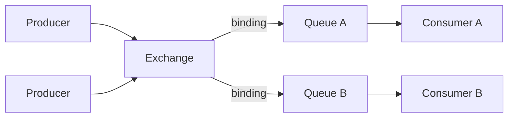
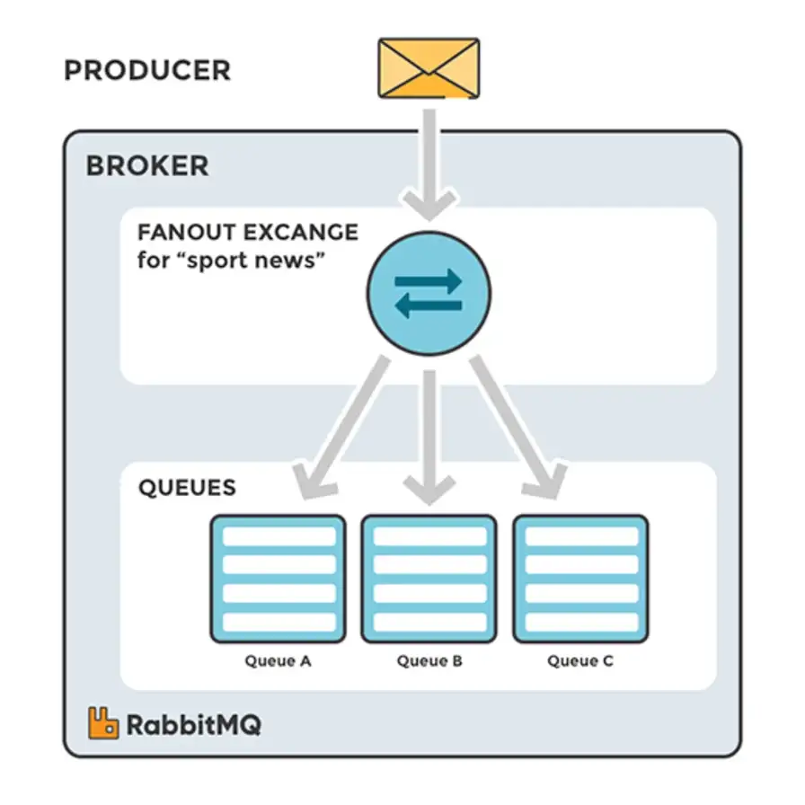
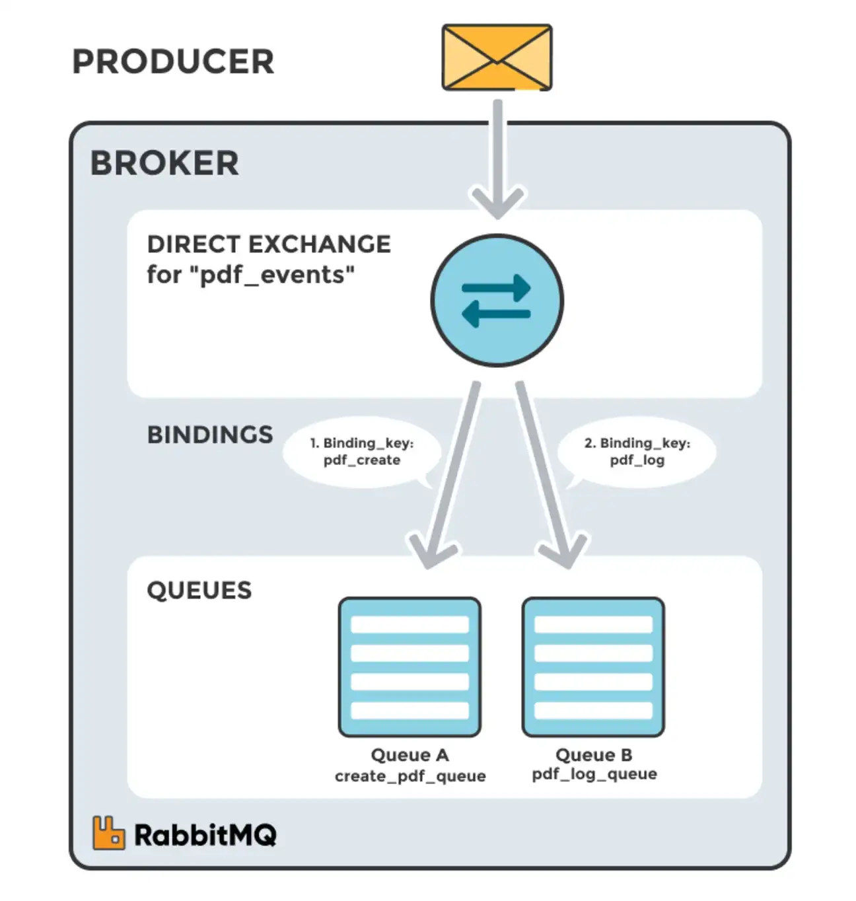
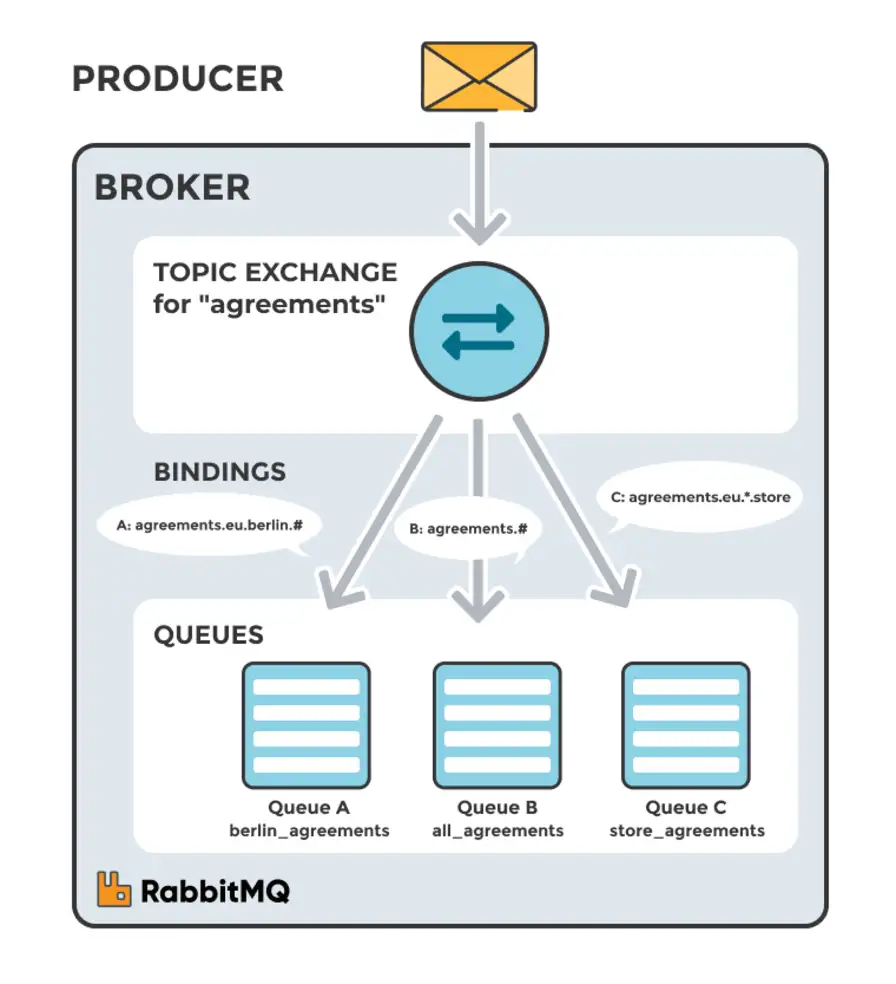
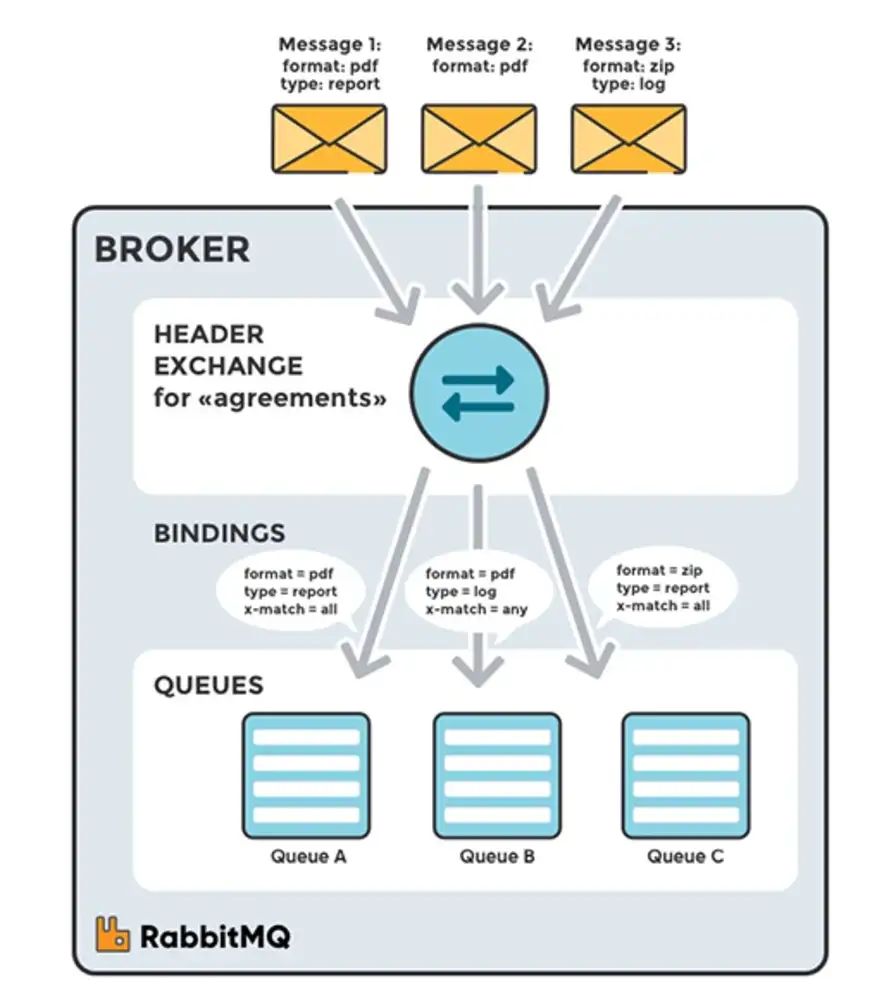

# Asynchronous communications (AMQP)

The [Advanced Message Queuing Protocol (AMQP)](https://www.amqp.org/) is an open standard designed to efficiently support a wide variety of messaging applications and communication patterns.

| Broker                           | AMQP Protocol Version | Notes                                                                                                           |
| -------------------------------- | --------------------- | --------------------------------------------------------------------------------------------------------------- |
| **RabbitMQ**                     | AMQP 0-9-1            | Open source, widely used, supports MQTT and STOMP. Great for microservices and enterprise systems.              |
| **LavinMQ**                      | AMQP 0-9-1            | Open source, written in Crystal, high-performance, compatible with standard AMQP clients.                       |
| **Apache Qpid**                  | AMQP 1.0              | Apache project, offers broker and client implementations in Java, C++, Python. Suitable for enterprise systems. |
| **ActiveMQ (Classic / Artemis)** | AMQP 1.0              | Supports STOMP, MQTT, OpenWire. Open source, flexible and robust.                                               |
| **Microsoft Azure Service Bus**  | AMQP 1.0              | Cloud service for reliable messaging between distributed applications.                                          |
| **IBM MQ**                       | AMQP 1.0              | Enterprise broker, integrates with legacy systems and mainframes.                                               |
| **Red Hat AMQ**                  | AMQP 1.0              | Commercial distribution based on Apache Qpid/ActiveMQ. Enterprise-grade management and middleware integration.  |
| **Solace PubSub+**               | AMQP 1.0              | Commercial broker optimized for real-time events and enterprise messaging; also supports MQTT and REST.         |

## Message Structure

### Message Overview

A **message** is the unit of communication in RabbitMQ.

**Components:**
- **Payload**: the actual data sent (e.g., JSON, string, byte array)
- **Properties / Headers**: metadata about the message
- **Message ID / Timestamp**: optional identifiers and timestamps

```
## Anatomy of a Message

Message {
    payload: { "accountId": "BA-1001-2025", "amount": 100.0 },
    headers: {
        "routingKey": "money.deposit",
        "paritionKey": "BA-1001-2025",
        "priority": 5,
        "source": "bank-service"
    },
    timestamp: 2025-11-19T13:30:00Z
}
```

### Headers

- Key-value pairs attached to the message
- Can be used for:
    - Filtering in headers exchange
    - Setting priorities
    - Traceability (correlation ID, origin)
    - Any custom metadata
- Example:
  headers = {
  "eventType": "money.deposit",
  "correlationId": "123e4567-e89b-12d3-a456-426614174000"
  }

#### Routing Key

- String used by **direct, topic** exchanges to route messages
- Examples:
    - Direct: "money.deposit" → routed to queue with exact match
    - Topic: "money.deposit.account" → routed to queues using wildcard patterns
- Allows selective message delivery to queues

#### Partition Key

- RabbitMQ does not have partitions like Kafka by default
- **Partitioning / sharding** can be achieved using:
    - Headers (custom partition key)
- Example: hash(partitionKey) % number_of_shards
- Ensures messages for the same entity go to the same consumer instance
- Useful for **stateful consumers** (e.g., account balances)


## Key Components

- **Broker**: system that implements AMQP and handles message exchange between *producers* and *consumers*
- **Producer**: application that sends messages to broker
- **Consumer**: application that receives messages from broker

Broker is internally composed by two main components:

- [**Exchange**](#exchange)
- [**Queue**](#queue)



## Queue

**Queue** is the fundamental component that stores messages sent by producers. In fact, messages sent by producers (and routed by exchanges) wait to be processed by consumer applications in queues.

* **Storage**: Queues store messages until they are processed or consumed by applications.
* **Durability**: Queues can be durable, meaning they survive broker restarts. Durability ensures that messages are not lost even if the broker restarts.
* **Message Order**: FIFO — First-In, First-Out.
* **Configurable Properties**: Queues have configurable properties such as maximum length, maximum priority levels, message TTL (Time-To-Live), etc., allowing fine-tuning to meet specific requirements.

## Exchange

**Exchange** is the AMPQ entity which receives messages from producers and routes them to one or more [queues](#queue) based on routing rules.

The relationship between an exchange and a queue (including routing rules) is called **binding**.

- Fanout exchanges
- Direct exchanges
- Topic exchanges 
- Header exchanges


### Fanout Exchange

A fanout exchange **routes messages to all queues that are bound to it, regardless of the routing key**. It broadcasts messages to multiple consumers.




### Direct Exchange

A direct exchange **routes messages with a specific routing key** to the queues that are bound to the exchange with the same routing key.




### Topic Exchange

A topic exchange **routes messages to one or more queues based on wildcard patterns in the routing key**. This allows for more complex routing logic.




### Headers Exchange

A headers exchange **routes messages based on the message's header attributes rather than the routing key**. It matches the headers against specified criteria.



### Why `topic` dominates in practice
* Supports a mix of **broadcast** and **selective delivery** in the same system.
* Event-driven architectures, microservices, and notification systems almost always require **selective message delivery**.
* Multiple consumers can subscribe to different patterns without changing producer logic.
* `Direct` is too rigid for complex systems; `fanout` is too blunt for most enterprise needs; `headers` exchanges are rarely used because pattern-matching on routing keys is simpler and more performant.

## Consumer Groups

* Concept borrowed from Kafka (and also supported in Spring Cloud Stream with RabbitMQ).
* Multiple consumers **subscribe to the same logical destination** (queue or topic).
* The broker (or framework) **distributes messages among consumers** automatically (**scaling!**).

**Behavior**

* Each message is **delivered to only one consumer** in the group.
* Parallelism is **dynamic**: any consumer can get the next message.
* Order is **not guaranteed globally**, but usually per queue.
* No control over **which consumer gets which message**.

**Example**

* Queue: `orders`

* Consumer group: 3 consumers (C1, C2, C3)

* Messages: M1, M2, M3, M4

* Delivery could be:

    * M1 → C2
    * M2 → C1
    * M3 → C3
    * M4 → C1


## Partitioned Producers

* Producer assigns messages to **logical partitions**, often based on a **key** (`partition-key-expression`).
* Spring Cloud Stream maps each partition to a **specific queue** (for RabbitMQ).
* Consumers can bind to **specific partitions**, ensuring **messages with same key always go to the same consumer**.

**Behavior**

* **Key-based ordering**: messages with same key always go to the same partition/queue.
* **Deterministic routing**: you control which consumer instance gets which messages.
* Parallelism is **aligned with partition count**, not just number of consumers.

**Example**

* Partition count: 3

* Partition key: `customerId`

* Messages from customer 123 always go to **partition 0** → specific consumer.

* Messages from customer 456 go to **partition 1** → another consumer.

* **Good for**: processing **per-key ordered streams**, e.g., financial transactions, user activity, IoT events.

## Resources

- [RabbitMQ Official Documentation](https://www.rabbitmq.com/documentation.html)
- [RabbitMQ Tutorials](https://www.rabbitmq.com/getstarted.html)
- [RabbitMQ in Action](https://www.manning.com/books/rabbitmq-in-action)
