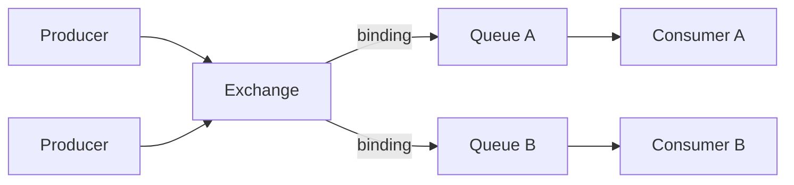
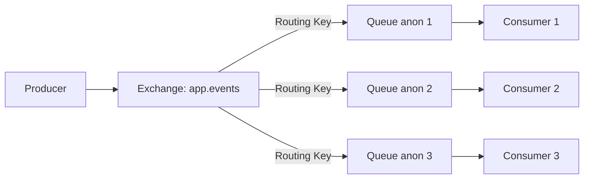
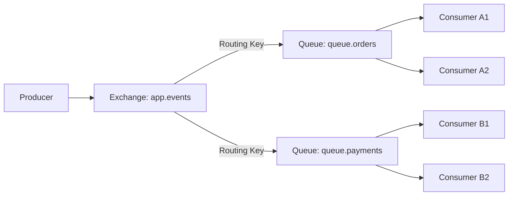
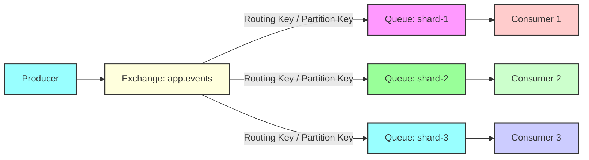
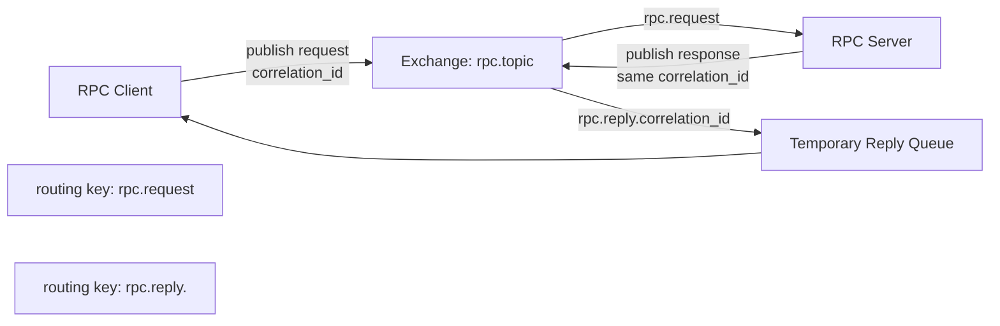
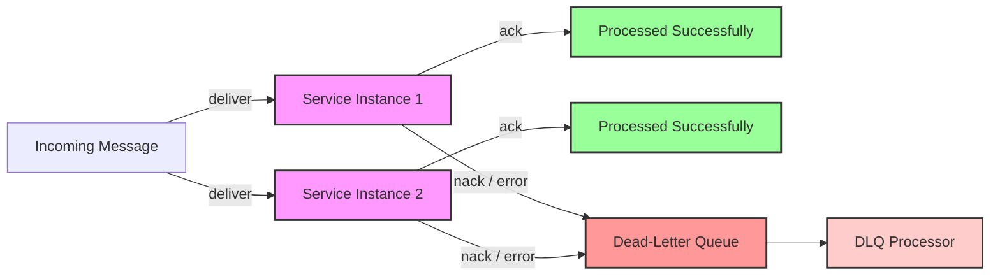

# Asynchronous communications (AMQP)

The [Advanced Message Queuing Protocol (AMQP)](https://www.amqp.org/) is an open standard designed to efficiently support a wide variety of messaging applications and communication patterns.

| Broker                           | AMQP Protocol Version | Notes                                                                                                           |
| -------------------------------- | --------------------- | --------------------------------------------------------------------------------------------------------------- |
| **RabbitMQ**                     | AMQP 0-9-1            | Open source, widely used, supports MQTT and STOMP. Great for microservices and enterprise systems.              |
| **LavinMQ**                      | AMQP 0-9-1            | Open source, written in Crystal, high-performance, compatible with standard AMQP clients.                       |
| **Apache Qpid**                  | AMQP 1.0              | Apache project, offers broker and client implementations in Java, C++, Python. Suitable for enterprise systems. |
| **ActiveMQ (Classic / Artemis)** | AMQP 1.0              | Supports STOMP, MQTT, OpenWire. Open source, flexible and robust.                                               |
| **Microsoft Azure Service Bus**  | AMQP 1.0              | Cloud service for reliable messaging between distributed applications.                                          |
| **IBM MQ**                       | AMQP 1.0              | Enterprise broker, integrates with legacy systems and mainframes.                                               |
| **Red Hat AMQ**                  | AMQP 1.0              | Commercial distribution based on Apache Qpid/ActiveMQ. Enterprise-grade management and middleware integration.  |
| **Solace PubSub+**               | AMQP 1.0              | Commercial broker optimized for real-time events and enterprise messaging; also supports MQTT and REST.         |

## Key Components

- **Broker**: system that implements AMQP and handles message exchange between *producers* and *consumers*
- **Producer**: application that sends messages to broker
- **Consumer**: application that receives messages from broker

Broker is internally composed by two main components:

- [**Exchange**](#exchange)
- [**Queue**](#queue)

```mermaid
flowchart LR
    Producer1[Producer]
    Producer2[Producer]
    Exchange[Exchange]
    Queue1[Queue A]
    Queue2[Queue B]
    Consumer1[Consumer A]
    Consumer2[Consumer B]

    Producer1 --> Exchange
    Producer2 --> Exchange
    Exchange -->|binding| Queue1
    Exchange -->|binding| Queue2
    Queue1 --> Consumer1
    Queue2 --> Consumer2
```

## Queue

**Queue** is the fundamental component that stores messages sent by producers. In fact, messages sent by producers (and routed by exchanges) wait to be processed by consumer applications in queues.

* **Storage**: Queues store messages until they are processed or consumed by applications.
* **Message Order**: FIFO — First-In, First-Out.
* **Configurable Properties**: Queues have configurable properties such as maximum length, maximum priority levels, message TTL (Time-To-Live), etc., allowing fine-tuning to meet specific requirements.

## Exchange

**Exchange** is the AMPQ entity which receives messages from producers and routes them to one or more [queues](#queue) based on routing rules.

The relationship between an exchange and a queue (including routing rules) is called **binding**.

- Fanout exchanges
- Direct exchanges
- Topic exchanges 
- Header exchanges

### Fanout Exchange

A fanout exchange **routes messages to all queues that are bound to it, regardless of the routing key**. It broadcasts messages to multiple consumers.

### Direct Exchange

A direct exchange **routes messages with a specific routing key** to the queues that are bound to the exchange with the same routing key.

### Topic Exchange

A topic exchange **routes messages to one or more queues based on wildcard patterns in the routing key**. This allows for more complex routing logic.

### Headers Exchange

A headers exchange **routes messages based on the message's header attributes rather than the routing key**. It matches the headers against specified criteria.

### Why `topic` dominates in practice
* Supports a mix of **broadcast** and **selective delivery** in the same system.
* Event-driven architectures, microservices, and notification systems almost always require **selective message delivery**.
* Multiple consumers can subscribe to different patterns without changing producer logic.
* `Direct` is too rigid for complex systems; `fanout` is too blunt for most enterprise needs; `headers` exchanges are rarely used because pattern-matching on routing keys is simpler and more performant.

## Communication Patterns

### One To Many

Each consumer listens on a dedicated anonymous queue. All queues are connected to the same exchange, ensuring that every message published to the exchange is delivered to all consumers.

```mermaid
flowchart LR
%% Exchange
  EX[Exchange: app.events]

%% Code dei server
  Q1[Queue anon 1]
  Q2[Queue anon 2]
  Q3[Queue anon 3]

%% Consumers
  C1[Consumer 1]
  C2[Consumer 2]
  C3[Consumer 3]

%% Producer invia messaggio
  P[Producer]

%% Flusso messaggi
  P --> EX
  EX -->|Routing Key| Q1
  EX -->|Routing Key| Q2
  EX -->|Routing Key| Q3

%% Flusso dai consumer
  Q1 --> C1
  Q2 --> C2
  Q3 --> C3
```

### One To Many (Competing Consumers)

All consumers share the same named queue, so each message is delivered to only one consumer. Messages are load-balanced across consumers.

```mermaid
flowchart LR
%% Exchange
  EX[Exchange: app.events]

%% Code nominate
  Q1[Queue: queue.orders]
  Q2[Queue: queue.payments]

%% Consumers collegati alle code
  C1[Consumer A1]
  C2[Consumer A2]
  C3[Consumer B1]
  C4[Consumer B2]

%% Producer invia messaggi
  P[Producer]

%% Flusso messaggi dal producer all'exchange
  P --> EX

%% Exchange distribuisce alle code con routing key
  EX -->|Routing Key| Q1
  EX -->|Routing Key| Q2

%% Flusso dai consumer
  Q1 --> C1
  Q1 --> C2
  Q2 --> C3
  Q2 --> C4
```

### One To Many (Sharded Consumers)

All consumers share the same named queue, so each message is delivered to only one consumer. Messages are load-balanced across consumers.
 (each consumer receives events related to same entity).

```mermaid
flowchart LR
    %% Exchange
    EX[Exchange: app.events]

    %% Sharded Queues
    Q1[Queue: shard-1]
    Q2[Queue: shard-2]
    Q3[Queue: shard-3]

    %% Consumers (one per queue)
    C1[Consumer 1]
    C2[Consumer 2]
    C3[Consumer 3]

    %% Producer sends messages
    P[Producer]

    %% Flow from producer to exchange
    P --> EX

    %% Exchange routes messages to shards (sharding logic)
    EX -->|Routing Key / Partition Key| Q1
    EX -->|Routing Key / Partition Key| Q2
    EX -->|Routing Key / Partition Key| Q3

    %% Flow from each queue to its consumer
    Q1 --> C1
    Q2 --> C2
    Q3 --> C3

    %% Optional styling
    style EX fill:#ffd,stroke:#333,stroke-width:2px
    style Q1 fill:#f9f,stroke:#333,stroke-width:2px
    style Q2 fill:#9f9,stroke:#333,stroke-width:2px
    style Q3 fill:#9ff,stroke:#333,stroke-width:2px
    style P fill:#9ff,stroke:#333,stroke-width:2px
    style C1 fill:#fcc,stroke:#333,stroke-width:2px
    style C2 fill:#cfc,stroke:#333,stroke-width:2px
    style C3 fill:#ccf,stroke:#333,stroke-width:2px
```

### RPC

**Messaging-based RPC** is a pattern where remote procedure calls are implemented on top of a **message broker** (e.g., RabbitMQ), instead of direct network calls.

A client sends a **request message** to a broker, which routes it to a server. The server processes the request and sends back a **response message**. The client typically waits for the reply, matching it using a **correlation identifier**.

```mermaid
flowchart LR
    %% Client
    C[RPC Client]

    %% Exchange
    EX[Exchange: rpc.topic]

    %% Request path
    REQ_KEY[routing key: rpc.request]
    S[RPC Server]

    %% Reply path
    REPLY_KEY[routing key: rpc.reply.<correlation_id>]
    Q[Temporary Reply Queue]

    %% Request flow
    C -->|publish request\ncorrelation_id| EX
    EX -->|rpc.request| S

    %% Reply flow
    S -->|publish response\nsame correlation_id| EX
    EX -->|rpc.reply.correlation_id| Q
    Q --> C
```

### Dead-Letter Queue (DLQ)

Handle messages that cannot be processed (nack, TTL expired, retries exceeded).

```mermaid
flowchart LR
    M[Incoming Message] -->|deliver| S1[Service Instance 1]
    M -->|deliver| S1b[Service Instance 2]

    %% Normal processing (ACK)
    S1 -->|ack| OK1[Processed Successfully]
    S1b -->|ack| OK2[Processed Successfully]

    %% Failure (dead-letter)
    S1 -->|nack / error| DLQ[Dead-Letter Queue]
    S1b -->|nack / error| DLQ

    DLQ --> DLP[DLQ Processor]

%% Same style family
    style S1 fill:#f9f,stroke:#333,stroke-width:2px
    style S1b fill:#f9f,stroke:#333,stroke-width:2px

    style OK1 fill:#9f9,stroke:#333,stroke-width:2px
    style OK2 fill:#9f9,stroke:#333,stroke-width:2px

    style DLQ fill:#f99,stroke:#333,stroke-width:2px
    style DLP fill:#fcc,stroke:#333,stroke-width:2px
```

## Resources

- [RabbitMQ Official Documentation](https://www.rabbitmq.com/documentation.html)
- [RabbitMQ Tutorials](https://www.rabbitmq.com/getstarted.html)
- [RabbitMQ in Action](https://www.manning.com/books/rabbitmq-in-action)

