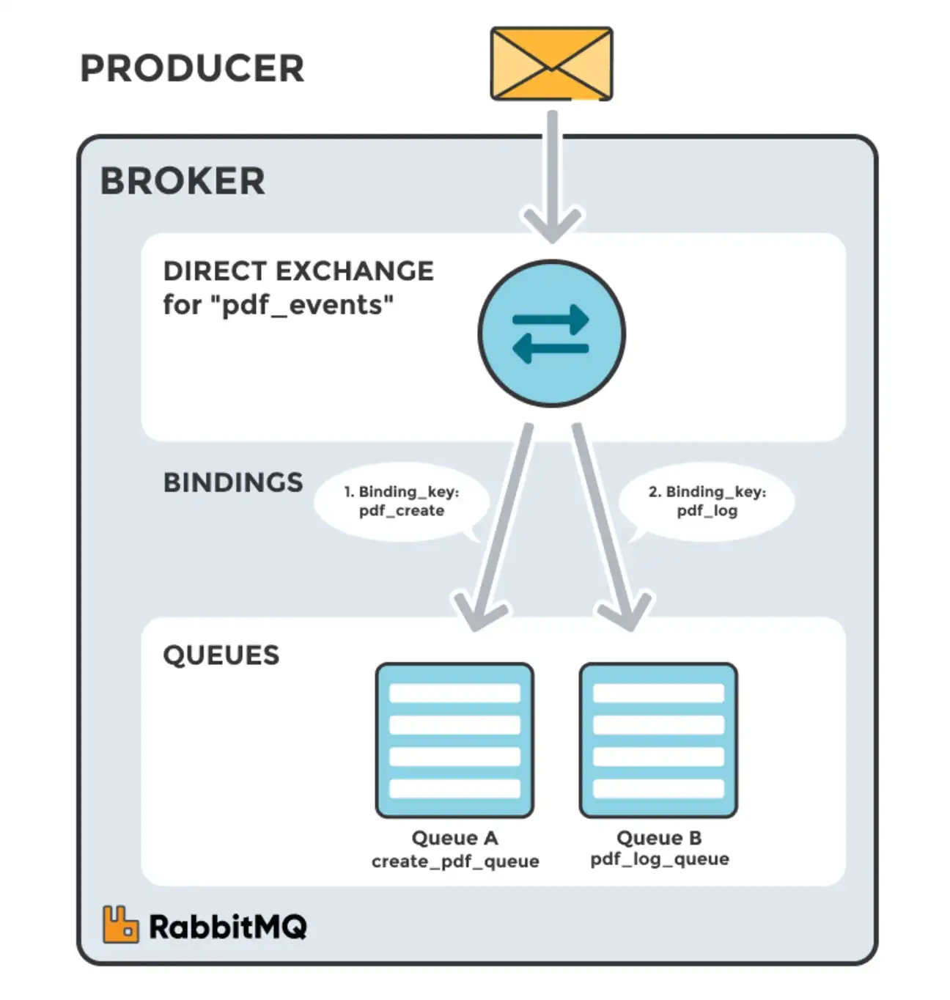
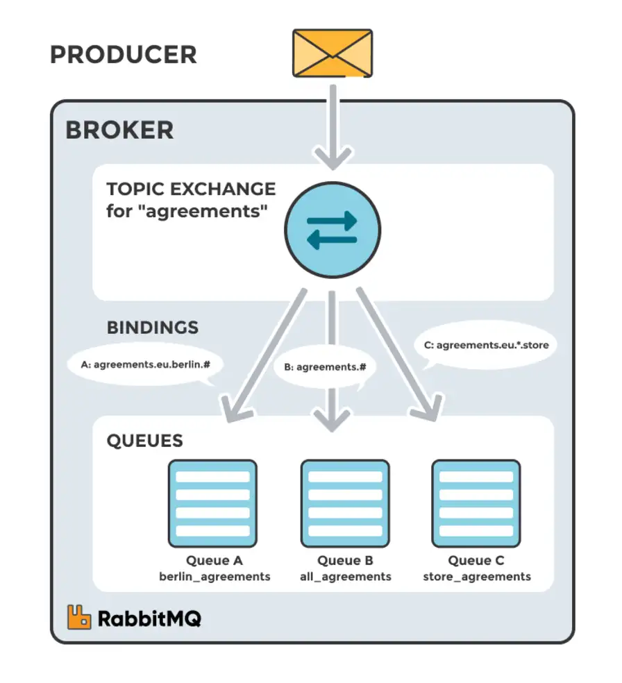
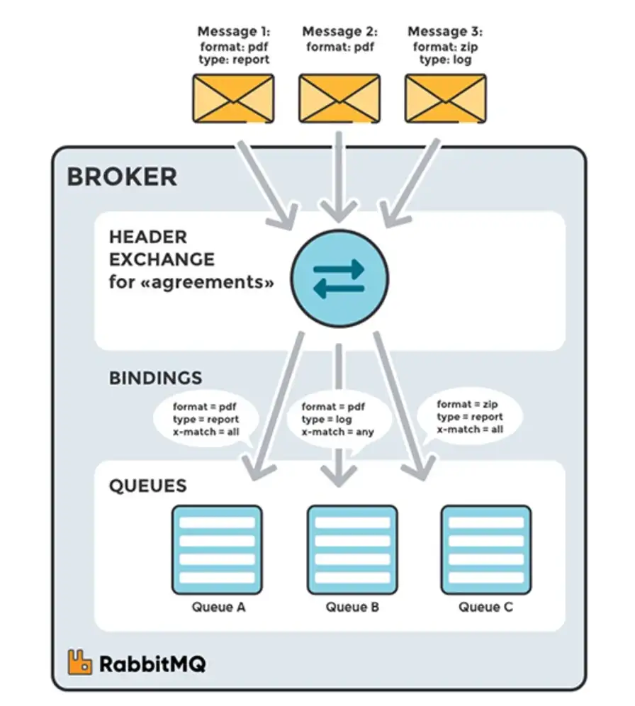

# Asynchronous communications (RabbitMQ)

The [Advanced Message Queuing Protocol (AMQP)](https://www.amqp.org/) is an open standard designed to efficiently support a wide variety of messaging applications and communication patterns.

[RabbitMQ](https://www.rabbitmq.com/) is a robust and widely used open-source message **broker**  based on AMQP.
It facilitates communication between different parts of a distributed system, enabling applications to send and receive messages.
RabbitMQ supports various messaging patterns, making it suitable for various use cases.

RabbitMQ can be managed via its management UI, or via command-line tools, or via code using RabbitMQ client libraries.

## Key Components

- **Broker**: system that implements AMQP (e.g., RabbitMQ) and handles message exchange between *producers* and *consumers*
- **Producer**: application that sends messages to broker
- **Consumer**: application that receives messages from broker

Broker is internally composed by two main components:

- [**Exchange**](#exchange)
- [**Queue**](#queue)

## Exchange

**Exchange** is the AMPQ entity which receives messages from producers and routes them to one or more [queues](#queue) based on routing rules.

The relationship between an exchange and a queue (including routing rules) is called **binding**.

Each exchange is declared with a number of different attributes (name, durability, auto-delete, arguments, etc.).

RabbitMQ provides four different types of exchanges:

- Fanout exchanges
- Direct exchanges
- Topic exchanges 
- Header exchanges

### 1. Fanout Exchange

A fanout exchange **routes messages to all queues that are bound to it, regardless of the routing key**. It broadcasts messages to multiple consumers.

The **routing key** is a message attribute generally provided by producer and taken into account by the exchange to decide how to route a message.

**Use Case**: Useful for scenarios where messages need to be delivered to multiple subscribers.

**Example**: A notification system where updates are sent to all subscribers regardless of their interests.

### 2. Direct Exchange

A direct exchange **routes messages with a specific routing key** to the queues that are bound to the exchange with the same routing key.

**Use Case**: Useful for point-to-point communication where messages must be routed to a specific queue.

**Example**: A logging system where logs of different severity levels (e.g., INFO, ERROR) are sent to different queues based on their severity.

### 3. Topic Exchange

A topic exchange **routes messages to one or more queues based on wildcard patterns in the routing key**. This allows for more complex routing logic.

**Use Case**: Useful for scenarios where messages need to be filtered based on multiple criteria.

**Example**: A news service where articles can be tagged with multiple categories (e.g., sports, politics), allowing subscribers to receive only the articles of interest.

### 4. Headers Exchange

A headers exchange **routes messages based on the message's header attributes rather than the routing key**. It matches the headers against specified criteria.

**Use Case**: Useful for scenarios requiring routing based on multiple attributes rather than a single routing key.

**Example**: An order processing system where orders are routed based on multiple criteria such as customer location, product type, and priority.

## Queue

**Queue** is the fundamental component that stores messages sent by producers. In fact, messages sent by producers (and routed by exchanges) wait to be processed by consumer applications in queues.

Key attributes of queues in RabbitMQ include:

* **Storage**: Queues store messages until they are processed or consumed by applications.
* **Durability**: Queues can be durable, meaning they survive broker restarts. Durability ensures that messages are not lost even if RabbitMQ restarts.
* **Message Order**: By default, RabbitMQ maintains the order of messages within a queue (FIFO — First-In, First-Out).
* **Configurable Properties**: Queues have configurable properties such as maximum length, maximum priority levels, message TTL (Time-To-Live), etc., allowing fine-tuning to meet specific requirements.

## Consumers

In RabbitMQ, consumers are applications or components that retrieve and process messages from queues. They play a pivotal role in the message processing flow within the RabbitMQ ecosystem.

Key aspects of consumers in RabbitMQ include:

* **Message Processing**: Once a consumer is connected and subscribed to a queue, it actively listens for incoming messages. Upon receiving a message from the queue, the consumer processes it based on predefined logic or business requirements.
* **Concurrency and Scaling**: Consumers can be scaled horizontally to handle increased message loads. Multiple instances of a consumer application can be created to process messages concurrently from the same queue, enabling better performance and scalability.
* **Message Acknowledgment Modes**: RabbitMQ supports different acknowledgment modes such as automatic acknowledgment (messages are marked as acknowledged as soon as they're delivered to consumers) and manual acknowledgment (consumers explicitly acknowledge messages after processing).
* **Error Handling**: Consumers need to handle errors gracefully. If a message processing fails, consumers can choose to reject, requeue, or handle the failed message according to predefined error-handling strategies.

## Resources

- [RabbitMQ Official Documentation](https://www.rabbitmq.com/documentation.html)
- [RabbitMQ Tutorials](https://www.rabbitmq.com/getstarted.html)
- [RabbitMQ in Action](https://www.manning.com/books/rabbitmq-in-action)
