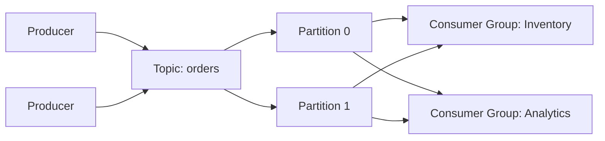

# **Asynchronous Communications (Kafka)**

[Apache Kafka](https://kafka.apache.org/) is a **distributed streaming platform** designed for **high-throughput, fault-tolerant, and scalable** data pipelines.
Kafka enables applications to **publish and subscribe to streams of records**, **store records durably**, and **process streams in real-time**.

---

## Kafka vs RabbitMQ

| Feature                | Kafka                                                            | RabbitMQ                                                                |
| ---------------------- | ---------------------------------------------------------------- | ----------------------------------------------------------------------- |
| **Messaging Model**    | Topic-based log; persistent; consumers track offsets             | Queue-based; messages removed after consumption; broker pushes messages |
| **Delivery Semantics** | At-most-once, At-least-once, Exactly-once                        | At-most-once, At-least-once (limited exactly-once)                      |
| **Persistence**        | Always persisted; configurable retention                         | Optional; durable vs transient queues                                   |
| **Ordering**           | Within partition                                                 | Within queue                                                            |
| **Throughput**         | Very high (millions msgs/sec)                                    | Moderate (tens of thousands msgs/sec per node)                          |
| **Scalability**        | Partitioned topics; automatic rebalancing                        | Queues can be sharded; horizontal scaling less automatic                |
| **Consumer Model**     | Pull-based; consumers fetch at own pace                          | Push-based; broker pushes messages                                      |
| **Replay**             | Full replay possible                                             | Limited; once consumed, messages gone unless requeued                   |
| **Use Cases**          | Event streaming, analytics, log aggregation, CDC, event sourcing | Work queues, notifications, RPC, pub/sub, small-scale messaging         |


## Key Components

* **Broker**: Kafka server that stores records and serves clients.
* **Producer**: Application that publishes messages to Kafka topics.
* **Consumer**: Application that subscribes to topics and processes messages.
* **Topic**: Stream of messages identified by a name.
* **Partition**: A topic is divided into partitions for **parallelism and scalability**.
* **Offset**: Each message in a partition has a unique sequential ID called an **offset**.
* **Retention**: Kafka keeps messages for a configurable duration or size, independent of consumption.
* **Replay**: Consumers can re-read messages by resetting their offsets.



## Kafka Topics

A **topic** is like a **channel** or **folder** where messages (called *records*) are stored.
Producers write to a topic, consumers read from it.

Key points:

* A topic is **append-only** (Kafka never modifies existing events).
* A topic can have **multiple partitions** (more below).
* Consumers can read the same topic independently without interfering with each other.
* Topics enable **logical separation** of data streams.

Example topics:

* `orders`
* `payments`
* `temperature-readings`

## Kafka Partitions

A **partition** is the *unit of parallelism and scaling* inside a topic.
When you create a topic, you decide how many partitions it has.

Imagine each partition as a **log file** that grows over time:

```
Partition 0: [event1][event2][event3]...
Partition 1: [event4][event5][event6]...
Partition 2: [event7][event8]...
```

Why partitions matter:

### Parallelism

More partitions → More consumers can process the topic **in parallel** 🏎️
Each consumer in a **consumer group** gets assigned one or more partitions.

### Ordering

**Ordering is guaranteed only within one partition**.
Across partitions, there is *no ordering guarantee*.

If you need ordering per key (e.g., same `orderId`), you send messages using a **key**, and Kafka ensures:
**same key → same partition → same order**.

### Scalability

Partitions allow Kafka to scale horizontally across many brokers 💪
More partitions → higher throughput.


## Relationship Between Topics and Partitions

A topic is split into N partitions:

```
Topic: orders
    ├── Partition 0
    ├── Partition 1
    └── Partition 2
```

A producer decides **which partition** to send a message to:

* By key hashing (preferred)
* Round-robin (if no key)
* Custom partitioner

## Consumer Groups and Partitions

Kafka ensures that **one partition is processed by only one consumer in the same group**.

Example with 3 partitions and 2 consumers:

```
Group A:
  Consumer 1 → Partition 0, 1
  Consumer 2 → Partition 2
```

This gives **load balancing** and **fault tolerance** 🎯.

If a consumer dies, others take over that partition.

## Replication

Partitions can be **replicated** across brokers for durability and fault tolerance.

Example:

```
Partition 0:
  Leader: Broker 1
  Followers: Broker 2, Broker 3
```

If the leader fails, a follower becomes the new leader 🛟.


## **Resources**

* [Kafka Official Documentation](https://kafka.apache.org/documentation/)
* [Kafka Tutorials](https://kafka.apache.org/quickstart)
* [Kafka in Action](https://www.manning.com/books/kafka-in-action)

