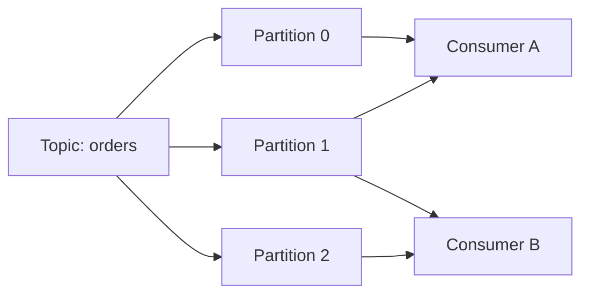

# **Asynchronous Communications (Kafka)**

[Apache Kafka](https://kafka.apache.org/) is a **distributed streaming platform** designed for **high-throughput, fault-tolerant, and scalable** data pipelines.
Kafka enables applications to **publish and subscribe to streams of records**, **store records durably**, and **process streams in real-time**.

---

## **Kafka vs RabbitMQ**

| Feature                | Kafka                                                            | RabbitMQ                                                                |
| ---------------------- | ---------------------------------------------------------------- | ----------------------------------------------------------------------- |
| **Messaging Model**    | Topic-based log; persistent; consumers track offsets             | Queue-based; messages removed after consumption; broker pushes messages |
| **Delivery Semantics** | At-most-once, At-least-once, Exactly-once                        | At-most-once, At-least-once (limited exactly-once)                      |
| **Persistence**        | Always persisted; configurable retention                         | Optional; durable vs transient queues                                   |
| **Ordering**           | Within partition                                                 | Within queue                                                            |
| **Throughput**         | Very high (millions msgs/sec)                                    | Moderate (tens of thousands msgs/sec per node)                          |
| **Scalability**        | Partitioned topics; automatic rebalancing                        | Queues can be sharded; horizontal scaling less automatic                |
| **Consumer Model**     | Pull-based; consumers fetch at own pace                          | Push-based; broker pushes messages                                      |
| **Replay**             | Full replay possible                                             | Limited; once consumed, messages gone unless requeued                   |
| **Use Cases**          | Event streaming, analytics, log aggregation, CDC, event sourcing | Work queues, notifications, RPC, pub/sub, small-scale messaging         |

## **Key Components**

* **Broker**: Kafka server that stores records and serves clients.
* **Producer**: Application that publishes messages to Kafka topics.
* **Consumer**: Application that subscribes to topics and processes messages.
* **Topic**: Logical channel where messages are published.
* **Partition**: Each topic is divided into partitions for parallelism and scalability.
* **Consumer Group**: A group of consumers sharing the work of reading a topic’s partitions.

---

## **Topics and Partitions**

* **Topic**: Stream of messages identified by a name.
* **Partition**: A topic is divided into partitions for **parallelism and scalability**.
* **Offset**: Each message in a partition has a unique sequential ID called an **offset**.
* **Retention**: Kafka keeps messages for a configurable duration or size, independent of consumption.
* **Replay**: Consumers can re-read messages by resetting their offsets.

**Explanation:**

* Partitions are **shards of a topic** → events are distributed across partitions.
* Ordering is **guaranteed within each partition**, not across partitions.
* Consumer groups can process the same topic independently.

## **Resources**

* [Kafka Official Documentation](https://kafka.apache.org/documentation/)
* [Kafka Tutorials](https://kafka.apache.org/quickstart)
* [Kafka in Action](https://www.manning.com/books/kafka-in-action)

