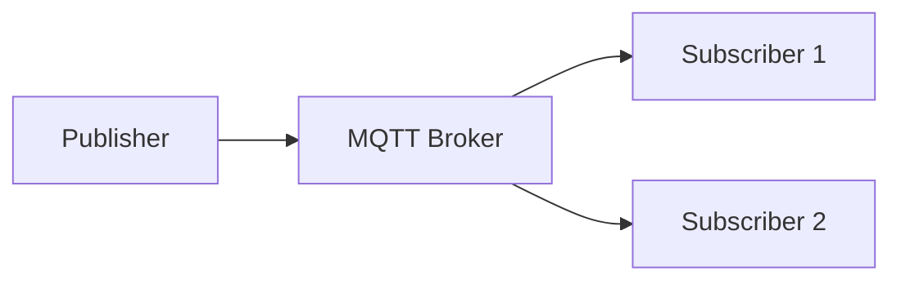
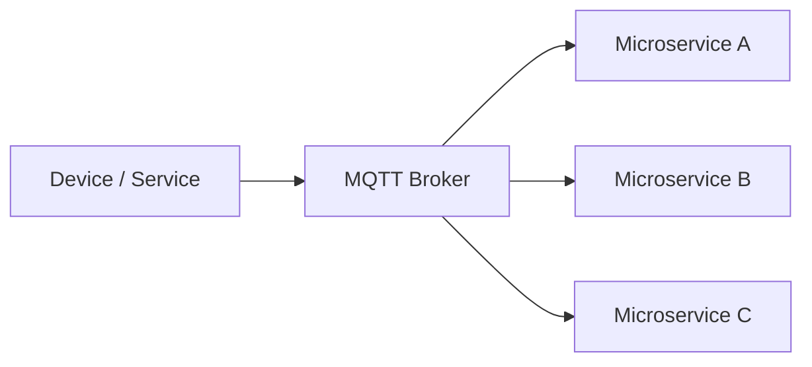
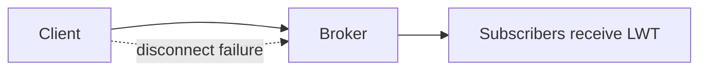
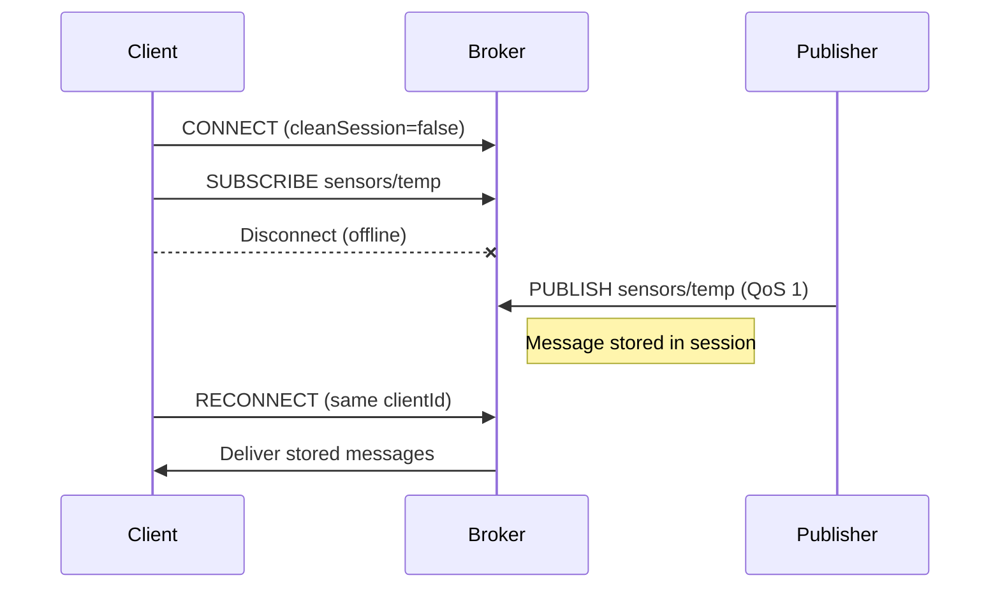
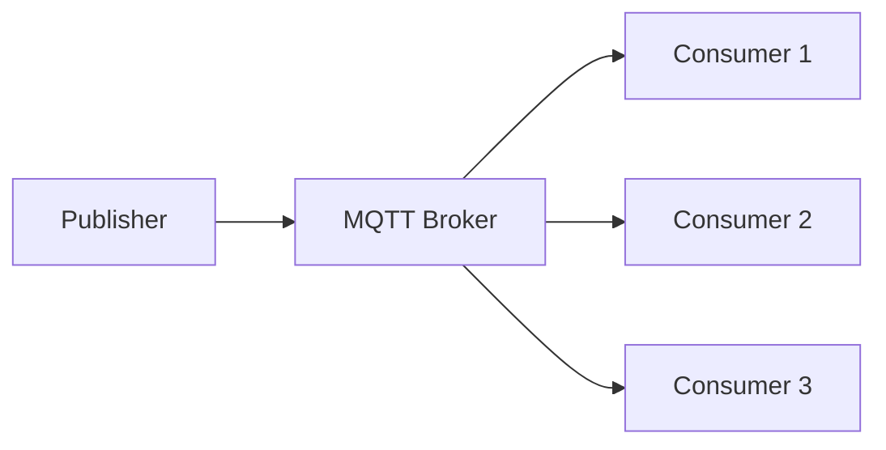
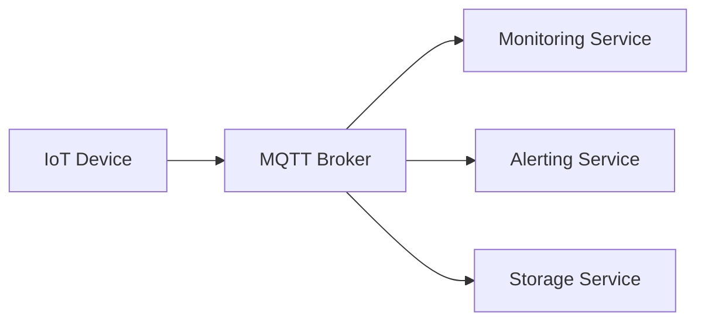
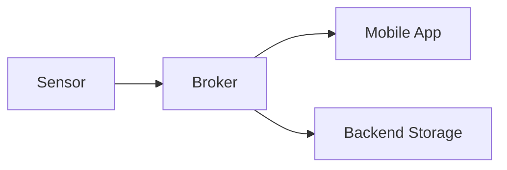
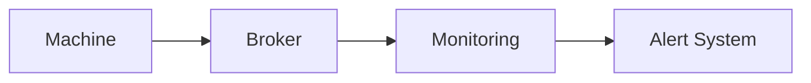
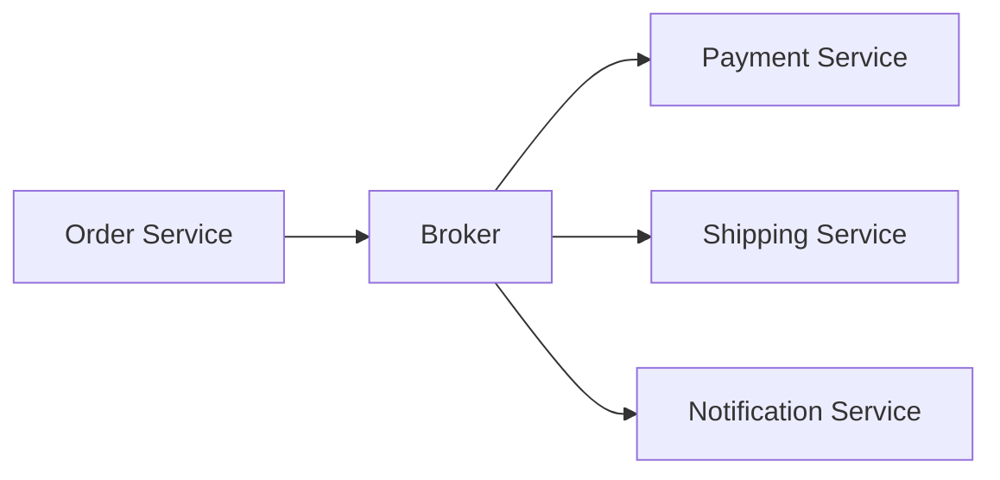
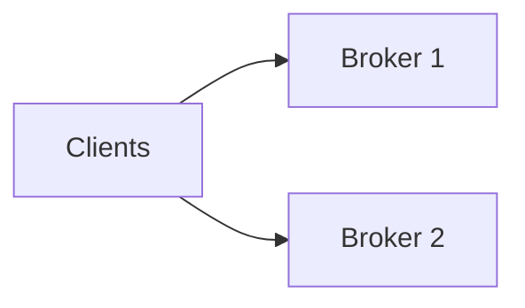

# Asynchronous communications (MQTT)

## What is MQTT?

**Message Queuing Telemetry Transport (MQTT)**

A lightweight publish/subscribe messaging protocol designed for:

* constrained devices
* unreliable or low-bandwidth networks
* IoT and edge computing scenarios

👉 Unlike HTTP (request/response), MQTT is **event-driven and asynchronous**.

---

## Key Characteristics

* Low bandwidth usage
* Low latency
* Asynchronous communication
* Decoupled architecture
* Native fit for IoT

👉 Ideal when you have many distributed producers and consumers.

---

## MQTT Architecture

Core components:

* **Publisher** → sends messages
* **Broker** → routes messages
* **Subscriber** → receives messages



👉 The broker is the central component.

---

## Decoupling

MQTT enables three types of decoupling:

* **Temporal** → clients do not need to be online at the same time
* **Spatial** → clients do not know each other
* **Technological** → different languages and platforms

👉 This is why MQTT works well with microservices.

---

## MQTT in Microservices

MQTT acts as a:

👉 **Lightweight Event Bus**

Typical use cases:

* notifications
* telemetry
* real-time updates



---

## Brokers

Common MQTT brokers:

* Mosquitto → lightweight, open-source
* HiveMQ → enterprise-grade
* EMQX → high-performance, clustered
* RabbitMQ (MQTT plugin)
* Cloud solutions (AWS IoT, Azure IoT)

---

## Message Structure

An MQTT message includes:

* **Topic** → routing key
* **Payload** → data (JSON, binary, etc.)
* **QoS** → delivery guarantee
* **Retain flag**
* **Properties** (MQTT 5.0)

---

## Topics

Topics are hierarchical strings:

```
bank/account/123/deposit
sensors/temperature/lab1
```

👉 Topics define routing, not the payload.

---

## Topic Design (Best Practices)

Recommended pattern:

```
<domain>/<entity>/<id>/<event>
```

Examples:

* iot/device/thermostat-1/temperature
* bank/account/123/withdraw

❗ Avoid:

* generic topics like `data`, `events`
* encoding routing logic inside payloads

---

## Subscriptions & Wildcards

* `+` → matches one level
* `#` → matches multiple levels

Examples:

```
home/+/temperature
home/#
```

---

## Quality of Service (QoS)

* QoS 0 → at most once
* QoS 1 → at least once
* QoS 2 → exactly once

---

## QoS Trade-offs

| QoS | Guarantee     | Cost   | Typical Use            |
| --- | ------------- | ------ | ---------------------- |
| 0   | None          | Low    | High-frequency sensors |
| 1   | At least once | Medium | Business events        |
| 2   | Exactly once  | High   | Critical operations    |

👉 QoS 2 is rarely used in practice due to overhead.

👉 QoS 1 may produce duplicates

* idempotent consumers
* message IDs
* deduplication logic


---

## Retained Messages vs Event Messages (MQTT)

### Retained Messages

- The broker stores the **last message per topic**
- New subscribers immediately receive the **latest retained value**

👉 This is used to represent the **current state** of a system

**Typical use case:**
- device status (online/offline)
- current configuration
- latest known sensor value

---

### Event Messages (Non-Retained)

- Messages are **transient**
- Delivered only at the time of publication
- Not stored by the broker

👉 This represents a **change or event over time**

**Typical use case:**
- temperature readings
- alerts
- activity logs

---

### Key Insight

👉 Retained messages represent **“what is true now”**  
👉 Event messages represent **“what just happened”**
---

## Last Will and Testament (LWT)

* Defined when the client connects
* Published by the broker on unexpected disconnect



Use case:

* failure detection in distributed systems

---

## Persistent Sessions (MQTT)

**clean session = false**

When a client reconnects, the broker preserves its session state instead of resetting everything.

The broker stores:
- subscriptions
- undelivered QoS 1/2 messages
- in-flight messages (awaiting acknowledgment)

👉 Useful for intermittently connected devices (IoT, mobile, edge systems)



## Multiple Consumers on the Same MQTT Topic

### Default Behavior (Standard MQTT)

In MQTT, when multiple clients subscribe to the **same topic**, each of them receives a **full copy** of every message.

👉 This is a **publish/subscribe broadcast model (fan-out)**

```mermaid
graph LR
    P[Publisher] --> B[MQTT Broker]
    B --> C1[Consumer A]
    B --> C2[Consumer B]
    B --> C3[Consumer C]
````

* Each subscriber receives **all messages**
* There is **no load balancing**
* Consumers are **independent of each other**

### Shared Subscriptions (MQTT 5.0)

MQTT 5.0 introduces **shared subscriptions** for load balancing:

```
$share/group1/sensors/temp
```



* each message is delivered to **only one consumer in the group**
* enables **horizontal scaling**
* behaves similarly to a **queue / consumer group**

---

## End-to-End Example



Flow:

1. Device publishes temperature
2. Broker distributes message
3. Multiple services react independently

---

## Integration Patterns

* MQTT → Kafka bridge
* MQTT → REST gateway
* MQTT → database sink

👉 MQTT is often part of a larger architecture.

---

## Case Study 1: Smart Home

Scenario:

* Sensors publish temperature and humidity
* Mobile app subscribes for real-time updates
* Backend stores data



Key benefits:

* real-time updates
* low power consumption

---

## Case Study 2: Industrial IoT

Scenario:

* Machines publish telemetry
* Monitoring service detects anomalies
* Alerting system triggers alarms



Key benefits:

* predictive maintenance
* decoupled analytics

---

## Case Study 3: Microservices Event System

Scenario:

* Order service publishes events
* Payment, shipping, and notification services react



Key benefits:

* loose coupling
* scalability

---

## When NOT to Use MQTT

Avoid MQTT for:

* large-scale streaming → use Kafka
* request/response APIs → use REST
* strong transactional workflows

---

## Failure Scenarios

### 1. Broker Failure

Problem:

* Single broker becomes a bottleneck or point of failure

Solution:

* clustering (EMQX, HiveMQ)
* broker redundancy



---

### 2. Network Partition

Problem:

* Clients disconnect intermittently

Solutions:

* persistent sessions
* message buffering
* retries with backoff

---

### 3. Message Loss (QoS 0)

Problem:

* messages can be dropped

Solution:

* use QoS 1 or QoS 2
* implement retry logic

---

### 4. Duplicate Messages (QoS 1)

Problem:

* at-least-once delivery → duplicates

Solution:

* idempotent consumers
* deduplication

---

### 5. Slow Consumers

Problem:

* consumers cannot keep up

Solutions:

* shared subscriptions
* horizontal scaling

---

## Resilience Patterns

### Retry with Backoff

* exponential retry strategy
* avoids overload during failures

---

### Circuit Breaker

* stop sending requests to failing services
* recover after cooldown

---

### Dead Letter Topic (DLT)

* failed messages redirected

```
sensors/temp → processing → DLT
```

---

### Idempotent Consumer

* process each message once logically

---

## Resources

* [MQTT Official Specification](https://mqtt.org/)
* [Eclipse Mosquitto](https://mosquitto.org/)
* [HiveMQ Documentation](https://www.hivemq.com/docs/)
* [MQTT Essentials Series](https://www.hivemq.com/mqtt-essentials/)
