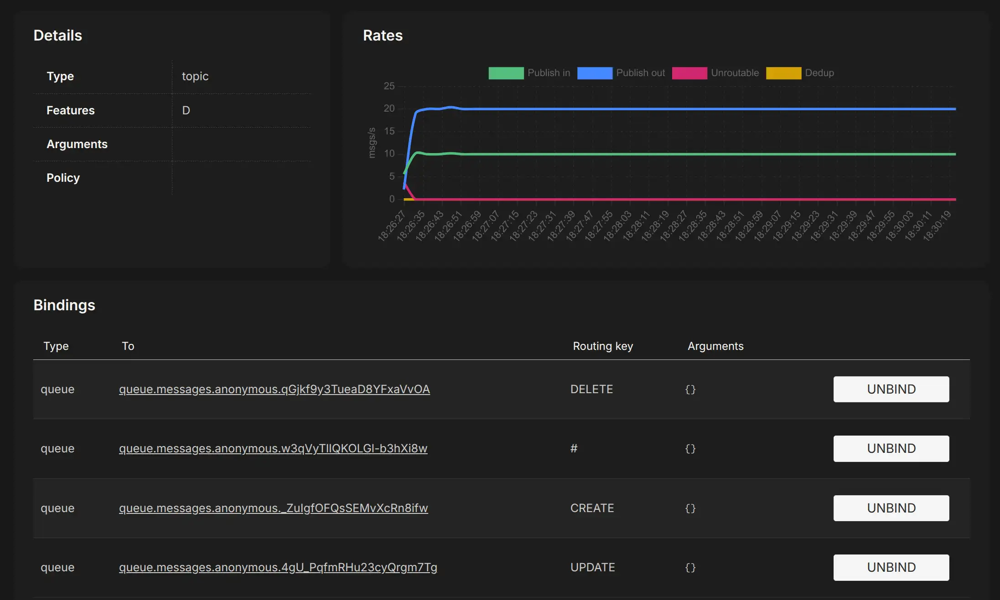

# Asynchronous communications (Spring Cloud Stream)

## Introduction
[Spring Cloud Stream](https://spring.io/projects/spring-cloud-stream) allows to abstract away the implementation details of the messaging platform (e.g., Apache Kafka, RabbitMQ). Thus, **implementation-specific details are kept out of the application code**. The publication and consumption of messages in applications is done through platform-neutral Spring interfaces.

Let’s begin our discussion by looking at the Spring Cloud Stream architecture through the lens of two services communicating via messaging. One service is the **message publisher**, and one service is the **message consumer**.


**Source**: takes a [Plain Old Java Object (POJO)](https://en.wikipedia.org/wiki/Plain_Old_Java_Object), which represents the message to be published, serializes it (the default serialization is JSON), and publishes the message to a channel.

**Channel**: is an *abstraction over the queue* that’s going to hold the message. It is always associated with a target queue name, but that queue name is never directly exposed to the code, which means that we can switch the queues the channel reads or writes without changing the application’s code (only the configuration).

**Binder**: talks to a specific message platform. The binder part of the Spring Cloud Stream framework allows us to work with messages without having to be exposed to platform-specific libraries and APIs for publishing and consuming messages.

**Sink**: listens to a channel for incoming messages and deserializes the message back into a POJO object. From there, the message can be processed by the business logic of the Spring service.

## Defining events

An event could be defined by the following:
* The type of event, for example, a create or delete event
* A key that identifies the data (e.g., a message ID)
* A data element, that is, the actual data in the event
* A timestamp, which describes when the event occurred

```java
@NoArgsConstructor
@AllArgsConstructor
@RequiredArgsConstructor
@Data
@Builder
public class Event<K, T> {
    public enum Type {CREATE, DELETE, UPDATE}
    @NonNull private Type eventType;
    @NonNull private K key;
    @NonNull private T data;
    private ZonedDateTime eventCreatedAt = ZonedDateTime.now();
}
```


## Project dependencies

To include Spring Cloud Stream in our project, we need to add `spring-cloud-stream` and at least one binder (e.g., `spring-cloud-starter-stream-rabbit` or `spring-cloud-starter-stream-kafka`) as shown below.

The `<dependencyManagement>` section is typically used in Spring-based projects to manage Spring Cloud dependencies consistently. By using the `spring-cloud-dependencies` [BOM](https://www.baeldung.com/spring-maven-bom), you can ensure that the correct dependencies are used and avoid version conflicts.

```xml
<properties>
    <spring-cloud.version>2024.0.0</spring-cloud.version>
</properties>

<dependencies>
    <dependency>
        <groupId>org.springframework.cloud</groupId>
        <artifactId>spring-cloud-stream</artifactId>
    </dependency>
    <dependency>
        <groupId>org.springframework.cloud</groupId>
        <artifactId>spring-cloud-starter-stream-rabbit</artifactId>
    </dependency>
</dependencies>

<dependencyManagement>
    <dependencies>
        <dependency>
            <groupId>org.springframework.cloud</groupId>
            <artifactId>spring-cloud-dependencies</artifactId>
            <version>${spring-cloud.version}</version>
            <type>pom</type>
            <scope>import</scope>
        </dependency>
    </dependencies>
</dependencyManagement>
```

## Publishing events

To publish an event we need to:

- Create an `Event` object
- Use the `StreamBridge` class to publish events on the desired topic
- Add configuration required for publishing events

```java
@Log4j2
@Component
public class ScheduledTask {
    private final StreamBridge streamBridge;
    
    // constructor here
    
    @Scheduled(fixedRate = 100)
    public void randomMessage() {
        Event<UUID, Integer> event = new Event<>(
                // fill with right information...
                type,
                uuid,
                data
        );

        //          <binding-name>, <payload>
        sendMessage("message-out-0", event);
        log.info(event.toString());
    }

    private void sendMessage(String bindingName, Event<UUID, Integer> event) {
        Message<Event<UUID, Integer>> message = MessageBuilder.withPayload(event)
                .setHeader("routingKey", event.getType().name())
                .setHeader("partitionKey", event.getKey())
                .build();
        streamBridge.send(bindingName, message);
    }
}
```

Note that, in order be able to use `@Scheduled` capabilities, we must decorate application main with `@EnableScheduling`

Regarding the configuration, we need to provide RabbitMQ as the default messaging system (including connectivity information), JSON as the default content type, and which topics should be used.

```yaml
spring.cloud.stream:
  bindings:
    message-out-0:
      contentType: application/json
      destination: queue.messages
      binder: local_rabbit
  binders:
    local_rabbit:
      type: rabbit
      environment:
        spring:
          rabbitmq:
            host: 127.0.0.1
            port: 5672
            username: guest
            password: guest
```


- `spring.cloud.stream.bindings`: list of all available bindings (i.e. channels in which application shares messages) 
    - **`message-out-0`**: binding (*channel*) name in which messages are sent, it is used as a reference in the code.
        - **`contentType`**: Sets the message format to `application/json`, meaning messages sent to this channel will be serialized as JSON.
        - **`destination`**: Sets the target destination (queue) for messages to `queue.messages`.
        - **`binder`**: Specifies `local_rabbit` as the binder to be used, which connects this binding to the defined RabbitMQ setup.

Output binding names follow a convention: `<binding-name>-out-<n>` 

`out` indicates to Spring that the binding is used as an *output channel*. While, number `n` is used to enumerate the binding (i.e. in this case there is only one binding associated to `message`).

- `spring.cloud.stream.binders`: list of all available binders (i.e. brokers)
    - **`local_rabbit`**: Defines a custom RabbitMQ binder.
        - **`type`**: Specifies the type as `rabbit`, indicating that RabbitMQ is the message broker.
        - **`environment`**: Configures the environment-specific RabbitMQ settings.
            - **`spring.rabbitmq`**: Specifies RabbitMQ connection properties:
                - **`host`**: The hostname of the RabbitMQ server (`127.0.0.1`, which is localhost).
                - **`port`**: The port for connecting to RabbitMQ, set to the default `5672`.
                - **`username`** and **`password`**: Credentials for accessing RabbitMQ, here set to `guest`.

## Receiving events

To be able to consume events, we need to do the following:
* Declare *message processors* which are methods that consume events.
* Add the configuration required for consuming events from the broker.

An example of *message processor* is declared below. We can see that the class is annotated with `@Configuration`, telling Spring to look for Spring beans in the class. The class actually provides a bean providing an implementation of the `Consumer<Event<String, Integer>>` interface.

```java
@Log4j2
@Component
public class EventReceiver {
    @Bean
    public Consumer<Event<String, Integer>> messageProcessor() {
        return event -> {
            log.info(event.toString());

            switch (event.getType()) {
                case CREATE:
                    // do something
                    break;
                case DELETE:
                    // do something
                    break;
                case UPDATE:
                    // do something
                    break;
                default:
                    String errorMessage = "Incorrect event type: " + event.getType();
                    throw new RuntimeException(errorMessage);
            }
        };
    }
}
```

```yaml
spring.cloud.stream:
  function:
    definition: messageProcessor
  bindings:
    messageProcessor-in-0:
      binder: local_rabbit
      contentType: application/json
      destination: queue.messages
  binders:
    local_rabbit:
      type: rabbit
      environment:
        spring:
          rabbitmq:
            host: 127.0.0.1
            port: 5672
            username: guest
            password: guest
```

- `spring.cloud.stream.function.definition`:
    - **`messageProcessor`**: Defines a function name, `messageProcessor`, which represents the logic that will process incoming messages. This function will act as a handler for messages received on the configured input channel.

- `spring.cloud.stream.bindings`
    - **`messageProcessor-in-0`**: Configures an input binding (channel) for the `messageProcessor` function.
        - **`binder`**: Specifies `local_rabbit` as the binder, linking this binding to the custom RabbitMQ configuration.
        - **`contentType`**: Sets the message format as `application/json`, meaning the incoming messages will be deserialized from JSON.
        - **`destination`**: Specifies the message queue to listen to, here set to `queue.messages`. This queue is where RabbitMQ will forward messages for the `messageProcessor` function to handle.

Similarly to output binding names, input binding names follow a convention: `<binding-name>-in-<n>` 

`in` indicates to Spring that the binding is used as an *input channel*. While, number `n` is used to enumerate the parameters of binding (in this case there is only one parameter sent to binding, i.e. `event`).


## Trying out the messaging system

[LavinMQ](https://lavinmq.com/) is an extremely fast message broker capable of handling large amounts of messages and connections. It implements the AMQP protocol (so that it can transparently replace RabbitMQ) and can run on both a single node or a cluster.

### One publisher, many consumers (publish-subscribe)

```yaml
services:
  publisher:
    image: async-rabbitmq-publisher
    build: async-rabbitmq-publisher
    environment:
      - SPRING_PROFILES_ACTIVE=docker
    depends_on:
      lavinmq:
        condition: service_healthy

  consumer:
    image: async-rabbitmq-consumer
    build: async-rabbitmq-consumer
    environment:
      - SPRING_PROFILES_ACTIVE=docker
    depends_on:
      lavinmq:
        condition: service_healthy
    deploy:
      mode: replicated
      replicas: 3

  lavinmq:
    image: cloudamqp/lavinmq:latest
    ports:
      - 5672:5672
      - 15672:15672
    healthcheck:
      test: [ "CMD", "lavinmqctl", "status" ]
      interval: 5s
      timeout: 2s
      retries: 60
    deploy:
      resources:
        limits:
          memory: 512m
```

Start the system landscape with the following commands:

```bash
export COMPOSE_FILE=docker-compose.yml
mvn clean package -Dmaven.test.skip=true
docker compose up --build --detach
```

Using the [LavinMQ web interface](http://localhost:15672/) (login: guest/guest) we can see the *queue.messages* **topic exchange** receiving 10 events/s and publishing the same events on n different queues (one for each consumer). As a consequence, the output rate is 10 events/s * n, where n is the number of consumer replicas.


### Consumer groups
The problem is that all instances of a message consumer consume the same messages. **This is not useful for scaling**. We can avoid this issue by making use of *consumer groups*. Each consumer binding can use the `spring.cloud.stream.bindings.<bindingName>.group` property to specify a group name. Consumers within the same group compete for the same messages.

Modify `docker-compose.yml` to activate the *groups* profile for the consumers.

```yaml
  consumer:
    image: async-rabbitmq-consumer
    build: async-rabbitmq-consumer
    environment:
      - SPRING_PROFILES_ACTIVE=docker,groups
    depends_on:
      lavinmq:
        condition: service_healthy
    deploy:
      mode: replicated
      replicas: 3
```

The *groups* profile, adds the following configurations (see *application.yml*):

```yaml
spring.config.activate.on-profile: groups
spring.cloud.stream:
  bindings:
    messageProcessor-in-0:
      group: messagesGroup
```

Start the landscape with the following commands:

```bash
export COMPOSE_FILE=docker-compose-one-to-many-groups.yml
mvn clean package -Dmaven.test.skip=true
docker compose up --build --detach
```

Using the [LavinMQ web interface](http://localhost:15672/), we can see that the exchange receives 10 events/s and publishes them to a single queue (*queue.messages.messagesGroup*) having three consumers. As a consequence, the output rate is 10 events/s.


### Partitions

The problem is, each event is received by only one consumer. However, we don't have any guarantee that all the messages concerning the same entity (e.g. the same product, the same order) reach the same consumer instance. This might lead to misbehaviour. 

`partition-key-expression` is a Spring Cloud Stream configuration that determines how messages are partitioned across multiple queues in RabbitMQ.
* Uses a message attribute (e.g., customerId, orderId, etc.) to decide which queue (partition) the message should go to.
* Ensures messages with the same key always go to the same queue (ordering within partitions).
* Enables parallel processing by distributing messages across multiple queues.

```yaml
services:
  publisher:
    image: async-rabbitmq-publisher
    build: async-rabbitmq-publisher
    environment:
      - SPRING_PROFILES_ACTIVE=docker,partitioned
    depends_on:
      lavinmq:
        condition: service_healthy

  consumer-0:
    image: async-rabbitmq-consumer
    build: async-rabbitmq-consumer
    environment:
      - SPRING_PROFILES_ACTIVE=docker,groups,partitioned_instance_0
    depends_on:
      lavinmq:
        condition: service_healthy
    deploy:
      resources:
        limits:
          memory: 512m

  consumer-1:
    image: async-rabbitmq-consumer
    build: async-rabbitmq-consumer
    environment:
      - SPRING_PROFILES_ACTIVE=docker,groups,partitioned_instance_1
    depends_on:
      lavinmq:
        condition: service_healthy
    deploy:
      resources:
        limits:
          memory: 512m

  consumer-2:
    image: async-rabbitmq-consumer
    build: async-rabbitmq-consumer
    environment:
      - SPRING_PROFILES_ACTIVE=docker,groups,partitioned_instance_2
    depends_on:
      lavinmq:
        condition: service_healthy
    deploy:
      resources:
        limits:
          memory: 512m
```

The *partitioned* profile, adds the following configurations.

Publisher-side:
```yaml
spring.config.activate.on-profile: partitioned

spring.cloud.stream.bindings.message-out-0.producer:
  partition-key-expression: headers['partitionKey']
  partition-count: 3
```

Consumer-side:
```yaml
spring.config.activate.on-profile: partitioned_instance_0
spring.cloud.stream.bindings:
  messageProcessor-in-0:
    consumer:
      partitioned: true
      instanceIndex: 0
      instanceCount: 3

---
spring.config.activate.on-profile: partitioned_instance_1
spring.cloud.stream.bindings:
  messageProcessor-in-0:
    consumer:
      partitioned: true
      instanceIndex: 1
      instanceCount: 3

---
spring.config.activate.on-profile: partitioned_instance_2
spring.cloud.stream.bindings:
  messageProcessor-in-0:
    consumer:
      partitioned: true
      instanceIndex: 2
      instanceCount: 3
```

The `instanceCount` value represents the total number of application instances between which the data should be partitioned. The `instanceIndex` must be a unique value across the multiple instances, with a value between 0 and `instanceCount` - 1. The instance index helps each application instance to identify the unique partition(s) from which it receives data. It is required by binders using technology that does not support partitioning natively. For example, with RabbitMQ, there is a queue for each partition, with the queue name containing the instance index.

Start the system landscape with the following commands:

```bash
export COMPOSE_FILE=docker-compose-one-to-many-partitioned.yml
mvn clean package -Dmaven.test.skip=true
docker compose up --build --detach
```

Using the [LavinMQ web interface](http://localhost:15672/), we can see that the messages exchange receives 10 events/s and publishes the same events on three different queues. Each event is consumed once by only one consumer. Thus, the output rate is 10 events/s. However, by checking the logs, it is possible to observe how **each consumer receives all messages pertaining to same ID**.


**Partitions are however a pretty static approach**:
* The number of partitions (partition-count) must be predefined.
* If you need more partitions (queues), you must manually reconfigure and redeploy.
* Consumers are assigned statically to specific partitions, limiting dynamic load balancing.

### Routing
Consider a scenario where multiple consumers need to handle messages of different types, such as CREATE, UPDATE, and DELETE. This can be efficiently managed using routing techniques within a message broker. Producers can assign messages a *routing key* (a string that represents the type of message), allowing the broker to forward each message to the appropriate queue based on its key.

```yaml
services:
  publisher:
    image: async-rabbitmq-publisher
    build: async-rabbitmq-publisher
    environment:
      - SPRING_PROFILES_ACTIVE=docker,routed
    depends_on:
      lavinmq:
        condition: service_healthy

  consumer-0:
    image: async-rabbitmq-consumer
    build: async-rabbitmq-consumer
    environment:
      - SPRING_PROFILES_ACTIVE=docker,routed_instance_CREATE
    depends_on:
      lavinmq:
        condition: service_healthy

  consumer-1:
    image: async-rabbitmq-consumer
    build: async-rabbitmq-consumer
    environment:
      - SPRING_PROFILES_ACTIVE=docker,routed_instance_UPDATE
    depends_on:
      lavinmq:
        condition: service_healthy

  consumer-2:
    image: async-rabbitmq-consumer
    build: async-rabbitmq-consumer
    environment:
      - SPRING_PROFILES_ACTIVE=docker,routed_instance_DELETE
    depends_on:
      lavinmq:
        condition: service_healthy

  consumer-3:
    image: async-rabbitmq-consumer
    build: async-rabbitmq-consumer
    environment:
      - SPRING_PROFILES_ACTIVE=docker,routed_instance_ALL
    depends_on:
      lavinmq:
        condition: service_healthy
```

The *routed* profile, adds the following configurations.

Publisher-side:

```yaml
spring.config.activate.on-profile: routed
spring.cloud.stream:
  rabbit:
    bindings:
      message-out-0:
        producer:
          routingKeyExpression: headers['routingKey']
```

Consumer-side:

```yaml
spring.config.activate.on-profile: routed_instance_CREATE
spring.cloud.stream:
  rabbit:
    bindings:
      messageProcessor-in-0:
        consumer:
          binding-routing-key: 'CREATE'

---
spring.config.activate.on-profile: routed_instance_UPDATE
spring.cloud.stream:
  rabbit:
    bindings:
      messageProcessor-in-0:
        consumer:
          binding-routing-key: 'UPDATE'

---
spring.config.activate.on-profile: routed_instance_DELETE
spring.cloud.stream:
  rabbit:
    bindings:
      messageProcessor-in-0:
        consumer:
          binding-routing-key: 'DELETE'

---
spring.config.activate.on-profile: routed_instance_ALL
spring.cloud.stream:
  rabbit:
    bindings:
      messageProcessor-in-0:
        consumer:
          binding-routing-key: '#'
```

Start the system landscape with the following commands:

```bash
export COMPOSE_FILE=docker-compose-one-to-many-routed.yml
mvn clean package -Dmaven.test.skip=true
docker compose up --build --detach
```

Using the [LavinMQ web interface](http://localhost:15672/), it is possible to observe that the messages exchange receives 10 events/s and publishes the same events on four different (anonymous) queues. Three of them receive messages of a specific type (**CREATE, DELETE, UPDATE**), one consumer receives all messages (**#**).



## Resources
- https://www.baeldung.com/spring-maven-bom