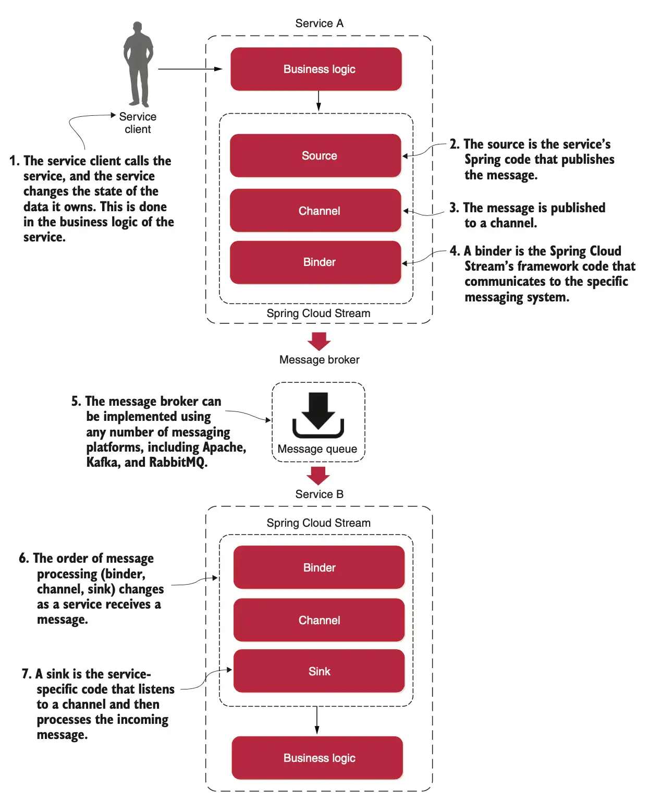

# Asynchronous communications (Spring Cloud Stream)

## Introduction
[Spring Cloud Stream](https://spring.io/projects/spring-cloud-stream) allows to abstract away the implementation details of the messaging platform (e.g., Apache Kafka, RabbitMQ). Thus, **implementation-specific details are kept out of the application code**. The publication and consumption of messages in applications is done through platform-neutral Spring interfaces.

Let’s begin our discussion by looking at the Spring Cloud Stream architecture through the lens of two services communicating via messaging. One service is the **message publisher**, and one service is the **message consumer**.



**Source**: takes a [Plain Old Java Object (POJO)](https://en.wikipedia.org/wiki/Plain_Old_Java_Object), which represents the message to be published, serializes it (the default serialization is JSON), and publishes the message to a channel.

**Channel**: is an *abstraction over the queue* that’s going to hold the message. It is always associated with a target queue name, but that queue name is never directly exposed to the code, which means that we can switch the queues the channel reads or writes without changing the application’s code (only the configuration).

**Binder**: talks to a specific message platform. The binder part of the Spring Cloud Stream framework allows us to work with messages without having to be exposed to platform-specific libraries and APIs for publishing and consuming messages.

**Sink**: listens to a channel for incoming messages and deserializes the message back into a POJO object. From there, the message can be processed by the business logic of the Spring service.

## Defining events

An event could be defined by the following:
* The type of event, for example, a create or delete event
* A key that identifies the data (e.g., a message ID)
* A data element, that is, the actual data in the event
* A timestamp, which describes when the event occurred

```java
public class Event<K, T> {
    @NonNull private K key;
    @NonNull private T data;
    private ZonedDateTime eventCreatedAt = ZonedDateTime.now();
}
```


## Project dependencies

To include Spring Cloud Stream in our project, we need to add `spring-cloud-stream` and at least one binder (e.g., `spring-cloud-starter-stream-rabbit` or `spring-cloud-starter-stream-kafka`) as shown below.

The `<dependencyManagement>` section is typically used in Spring-based projects to manage Spring Cloud dependencies consistently. By using the `spring-cloud-dependencies` [BOM](https://www.baeldung.com/spring-maven-bom), you can ensure that the correct dependencies are used and avoid version conflicts.

```xml
<properties>
    <spring-cloud.version>2024.0.0</spring-cloud.version>
</properties>

<dependencies>
    <dependency>
        <groupId>org.springframework.cloud</groupId>
        <artifactId>spring-cloud-stream</artifactId>
    </dependency>
    <dependency>
        <groupId>org.springframework.cloud</groupId>
        <artifactId>spring-cloud-starter-stream-rabbit</artifactId>
    </dependency>
</dependencies>

<dependencyManagement>
    <dependencies>
        <dependency>
            <groupId>org.springframework.cloud</groupId>
            <artifactId>spring-cloud-dependencies</artifactId>
            <version>${spring-cloud.version}</version>
            <type>pom</type>
            <scope>import</scope>
        </dependency>
    </dependencies>
</dependencyManagement>
```

## Resources
- https://www.baeldung.com/spring-maven-bom