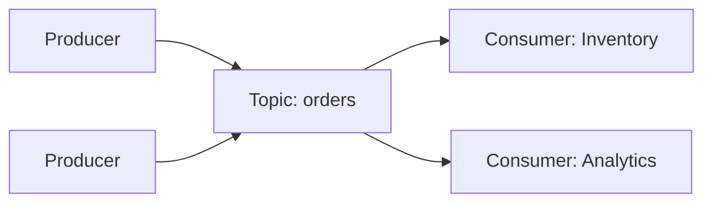
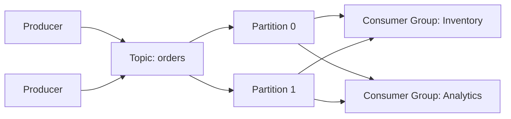
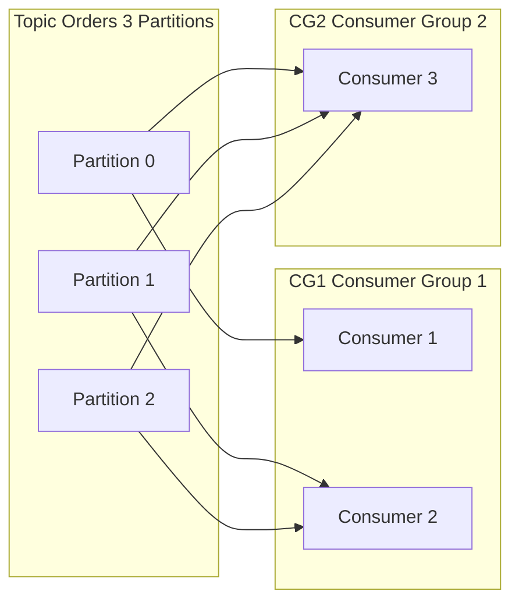

# **Asynchronous Communications (Kafka)**

[Apache Kafka](https://kafka.apache.org/) is a **distributed streaming platform** designed for **high-throughput, fault-tolerant, and scalable** data pipelines.
Kafka enables applications to:
* **publish and subscribe to streams of records**
* **store records durably**
* **process streams in real-time**

---

## Key Components

* **Broker**: Kafka server that stores records and serves clients.
* **Producer**: Application that publishes messages to Kafka topics.
* **Consumer**: Application that subscribes to topics and processes messages.

---

## Kafka Topics



A **topic** is like a **channel** or **folder** where messages (called *records*) are stored.
Producers write to a topic, consumers read from it. Topics enable **logical separation** of data streams.

* A topic is **append-only** (Kafka never modifies existing events).
* Consumers can read the same topic independently without interfering with each other.
* **Offset**: Each message in a partition has a unique sequential ID called an **offset**.
* **Retention**: Kafka keeps messages for a configurable duration or size, independent of consumption.
* **Replay**: Consumers can re-read messages by resetting their offsets.


Example topics:

* `orders`
* `payments`
* `temperature-readings`

## Kafka Partitions



A **partition** is the *unit of parallelism and scaling* inside a topic.


A topic is split into N partitions:

```
Topic: orders
    ├── Partition 0
    ├── Partition 1
    └── Partition 2
```

```
Partition 0: [event1][event2][event3]...
Partition 1: [event4][event5][event6]...
Partition 2: [event7][event8]...
```

A producer decides **which partition** to send a message to:

* By key hashing (preferred)
* Round-robin (if no key)
* Custom partitioner

### Scalability

Partitions allow Kafka to scale horizontally across many brokers.

More partitions → More consumers can process the topic **in parallel** → higher throughput.


### Replication

Partitions can be **replicated** across brokers for durability and fault tolerance.

Example:

```
Partition 0:
  Leader: Broker 1
  Followers: Broker 2, Broker 3
```

If the leader fails, a follower becomes the new leader (**RAFT**).


## Kafka – Consumer Groups

* **Consumer Group** = a set of consumers that **work together to read a topic**
* **Each partition** is read by **only one consumer per group** → preserves **message order**
* **Multiple consumers in the same group** → Kafka **balances partitions** among them
* **Multiple consumer groups** → each group receives **all messages independently**




### Ordering

**Ordering is guaranteed only within one partition**.
Across partitions, there is *no ordering guarantee*.

If you need ordering per key (e.g., same `orderId`), you send messages using a **key**, and Kafka ensures:
**same key → same partition → same order**.


## **Resources**

* [Kafka Official Documentation](https://kafka.apache.org/documentation/)
* [Kafka Tutorials](https://kafka.apache.org/quickstart)
* [Kafka in Action](https://www.manning.com/books/kafka-in-action)
* https://www.redpanda.com/

