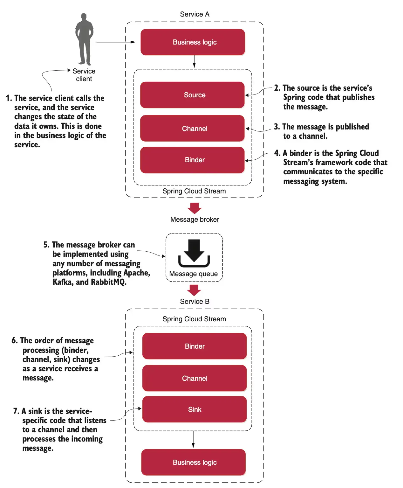

# Asynchronous communications (Spring Cloud Stream)

## Introduction
[Spring Cloud Stream](https://spring.io/projects/spring-cloud-stream) allows to abstract away the implementation details of the messaging platform (e.g., Apache Kafka, RabbitMQ). Thus, **implementation-specific details are kept out of the application code**. The publication and consumption of messages in applications is done through platform-neutral Spring interfaces.

Let’s begin our discussion by looking at the Spring Cloud Stream architecture through the lens of two services communicating via messaging. One service is the **message publisher**, and one service is the **message consumer**.



* **Source**: Converts a POJO into a serialized message (default JSON) and publishes it to a channel.
* **Channel**: An abstraction over a queue; decouples the application from the actual queue name, allowing configuration changes without code changes.
* **Binder**: Connects to a specific messaging platform, letting the application send and receive messages without using platform-specific APIs.
* **Sink**: Listens on a channel, deserializes messages back into POJOs, and passes them to the service’s business logic.

## Project dependencies

Add `spring-cloud-stream`

Add at least one binder (e.g., `spring-cloud-starter-stream-rabbit` or `spring-cloud-starter-stream-kafka`).

The `<dependencyManagement>` section is typically used in Spring-based projects to manage Spring Cloud dependencies consistently. By using the `spring-cloud-dependencies` [BOM](https://www.baeldung.com/spring-maven-bom), you can ensure that the correct dependencies are used and avoid version conflicts.

```xml
<properties>
    <spring-cloud.version>2025.1.0</spring-cloud.version>
</properties>

<dependencies>
    <dependency>
        <groupId>org.springframework.cloud</groupId>
        <artifactId>spring-cloud-stream</artifactId>
    </dependency>
    <dependency>
        <groupId>org.springframework.cloud</groupId>
        <artifactId>spring-cloud-starter-stream-rabbit</artifactId>
    </dependency>
</dependencies>

<dependencyManagement>
    <dependencies>
        <dependency>
            <groupId>org.springframework.cloud</groupId>
            <artifactId>spring-cloud-dependencies</artifactId>
            <version>${spring-cloud.version}</version>
            <type>pom</type>
            <scope>import</scope>
        </dependency>
    </dependencies>
</dependencyManagement>
```

## Resources
- https://www.baeldung.com/spring-maven-bom