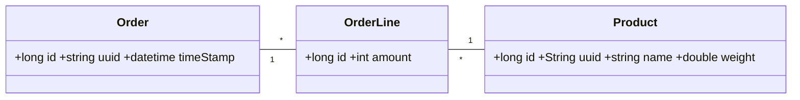
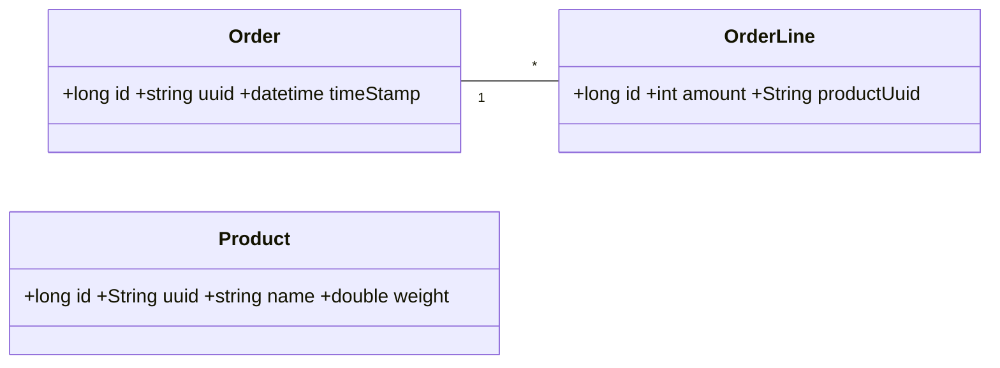
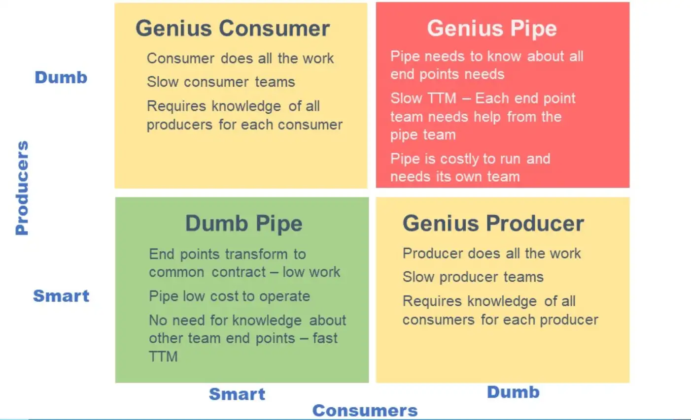
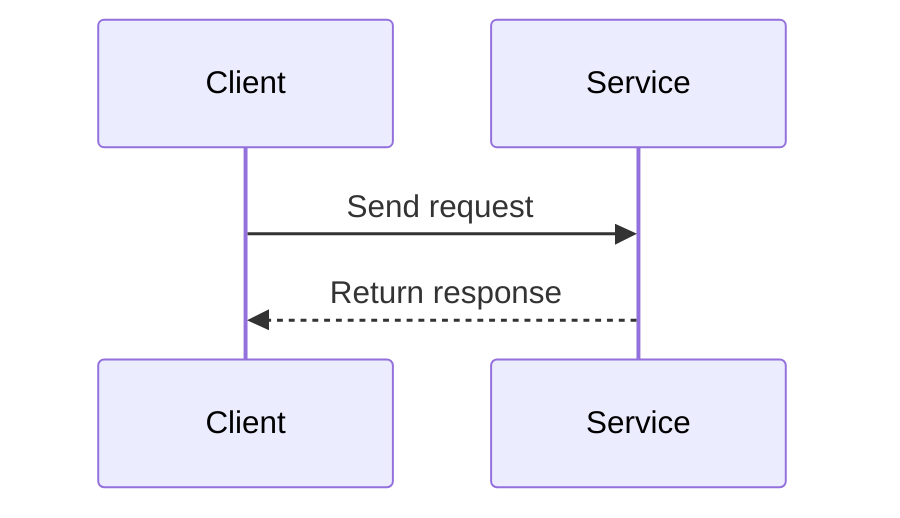
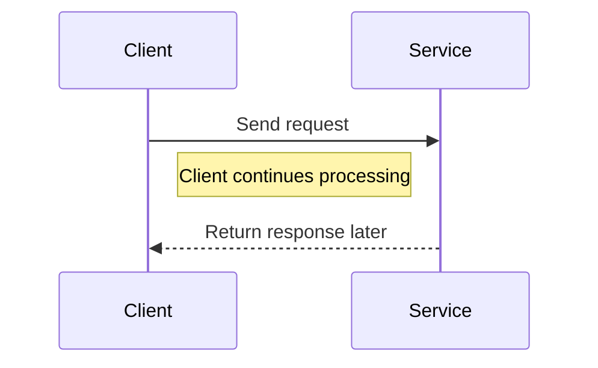
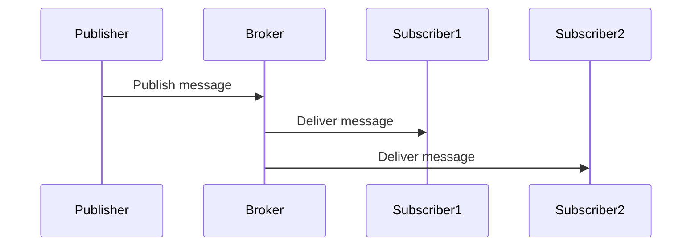
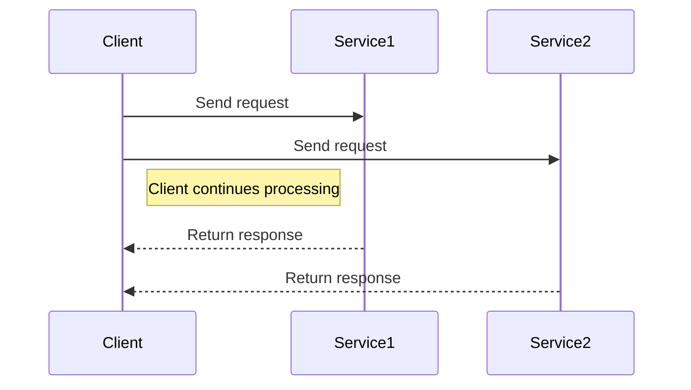

Absolutely! We can expand the technical depth of each section, adding **real-world implications, patterns, and implementation details**. Here’s an enhanced version that keeps all your fallacies, images, and examples but adds **more technical content** and reasoning:

---

# Communication styles

## Towards a Distributed Data Model

Monolithic architectures store **all data in a single database**, e.g., `Order`, `OrderLine`, and `Product`. Relationships are straightforward:



Microservices split data:

* **Order Service:** `Order` + `OrderLine`, without product details.
* **Product Service:** `Product` data separately.



**Technical implications:**

* **Distributed joins** are impossible; must query multiple services.
* **Consistency challenges:** eventual consistency, sagas, or compensating transactions may be needed.
* **Caching and CQRS:** Frequently requested aggregated data might require a **read-optimized view**.

---

## Fallacies of Distributed Computing

Distributed systems introduce subtle complexities. Here’s a **deep technical view of each fallacy**:

---

### 1. The Network is Reliable

**Reality:** Networks fail due to hardware, misconfigurations, or transient errors.

**Implications:**

* **Timeouts and retries:** Use **exponential backoff** to avoid cascading failures.
* **Idempotency:** Ensure repeated requests do not corrupt state.
* **Circuit breakers:** Stop calling failing services temporarily to preserve system stability (Hystrix, Resilience4j).

```java
@RestController
public class NetworkReliabilityController {
    NetworkService remoteService;

    @PostMapping("/reliable")
    public ResponseEntity<String> reliableService(@RequestBody String data) {
        String response = remoteService.process(data); // could timeout
        return ResponseEntity.ok(response);
    }
}
```

---

### 2. Latency is Zero

**Reality:** Every network call adds delay; distributed calls amplify latency.

| Operation            | Duration | Normalized  |
| -------------------- | -------- | ----------- |
| 1 CPU cycle          | 0.3ns    | 1s          |
| L1 cache access      | 1ns      | 3s          |
| L2 cache access      | 3ns      | 9s          |
| L3 cache access      | 13ns     | 43s         |
| DRAM access          | 120ns    | 6min        |
| SSD I/O              | 0.1ms    | 4days       |
| HDD I/O              | 1–10ms   | 1–12 months |
| Internet SF → NY     | 40ms     | 4years      |
| Internet SF → London | 80ms     | 8years      |
| Internet SF → Sydney | 130ms    | 13years     |
| TCP retransmit       | 1s       | 100years    |
| Container reboot     | 4s       | 400years    |

**Mitigation strategies:**

* **Asynchronous messaging:** Avoid blocking client threads (e.g., Kafka, RabbitMQ).
* **Batching:** Combine multiple small requests.
* **Caching:** Reduce remote calls (Redis, Memcached).
* **Timeouts:** Set realistic deadlines for service calls.

---

### 3. Bandwidth is Infinite

**Reality:** Network throughput is limited; serialization and TCP/IP overhead reduce effective bandwidth.

* 1 Gbps → 128 MB/s → after TCP/IP & serialization → ~32 MB/s

**Technical consequences:**

* **Backpressure:** Slow consumers can overwhelm faster producers.
* **Throttling & rate limiting:** Use token buckets or leaky bucket algorithms.
* **Compression:** Reduce payload size with gzip or protobuf.

---

### 4. The Network is Secure

**Reality:** Network traffic must be protected with **encryption, authentication, and authorization**.

* **TLS/SSL:** Encrypt transport layer.
* **OAuth2/JWT:** Secure API calls.
* **Audit logging:** Track access to sensitive data.
* **Social engineering risk:** Policies and training are as important as tech controls.

---

### 5. Topology Doesn’t Change

**Reality:** Dynamic scaling, failovers, and network partitions affect service discovery and connectivity.

* **Service registries:** Consul, Eureka, or Kubernetes DNS for dynamic discovery.
* **Load balancers:** Handle node additions/removals transparently.
* **Retries and idempotency:** Required to avoid duplicate side effects during topology changes.

---

### 6. There is One Administrator

**Reality:** Multiple admins and developers can deploy changes independently.

* **Configuration management:** Centralized tools like Spring Cloud Config, Consul, or Vault.
* **Infrastructure as code:** Terraform, Ansible, or Kubernetes manifests reduce human error.
* **Observability:** Logging, metrics, and distributed tracing essential to detect misconfigurations.

---

### 7. Transport Cost is Zero

**Reality:** Data movement has **latency, CPU, and monetary costs**, especially in cloud environments.

* **Serialization:** JSON vs Protobuf vs Avro; compact formats save bandwidth.
* **Message size optimization:** Avoid sending entire objects when only partial data is needed.
* **Cost analysis:** Cloud egress charges can accumulate for high-volume systems.

---

### 8. The Network is Homogeneous

**Reality:** Nodes vary in **language, platform, database, and protocol**.

* **Polyglot persistence:** Mix of relational and NoSQL databases (Postgres, MongoDB, Cassandra).
* **Cross-language communication:** REST, gRPC, or message brokers handle interoperability.
* **Data serialization challenges:** JSON, Protobuf, Avro may have different defaults.

---

## Smart Endpoints, Dumb Pipes

**Principle:** Keep the **communication layer simple** and put **business logic in services**.

* Avoids complex ESBs and orchestration layers
* Promotes **scalability, resilience, and independent evolution**



---

## Taxonomy of Client-Service Interactions

### Relationship

* **One-to-One:** Single client interacts with one service; simple but tightly coupled.
* **One-to-Many:** Single client invokes multiple services; allows flexibility and scaling.

### Response Timing

* **Synchronous:** Client blocks; simple but latency accumulates.
* **Asynchronous:** Non-blocking; improves responsiveness but adds complexity.

### Request/Response (One-to-One, Sync)



* Classic blocking call.
* Client waits until the service responds.

---

### Async Request/Response (One-to-One, Async)



* Non-blocking.
* Client can do other work while waiting for a response.

---

### Publish/Subscribe (One-to-Many, Async)



* Publisher sends messages to a broker.
* Multiple subscribers consume messages independently.
* Decouples publisher and consumers.

---

### Publish/Async Responses (One-to-Many, Async)



* Client sends requests to multiple services asynchronously.
* Responses arrive later without blocking the client.

## Resources

* *Microservices Patterns*, Chapter 3
* [Fallacies of Distributed Systems](https://www.youtube.com/watch?v=8fRzZtJ_SLk&list=PL1DZqeVwRLnD3EjyciYAO82dT9Owiq8I5)
