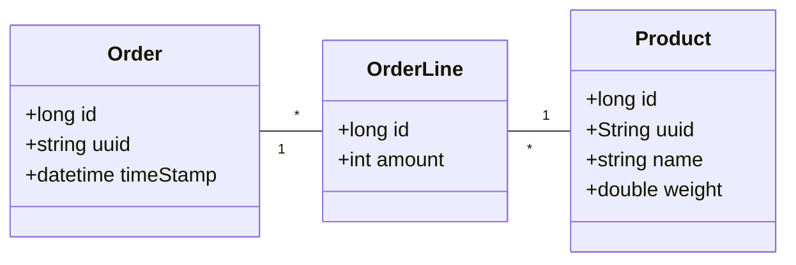
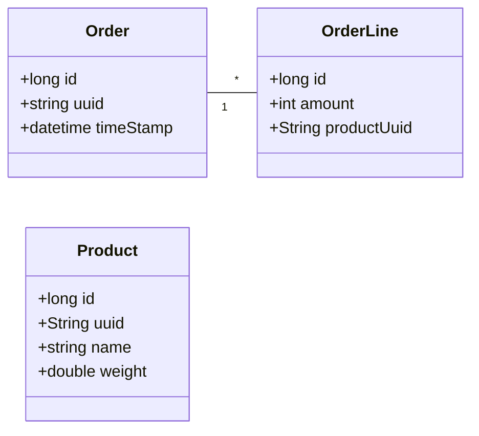
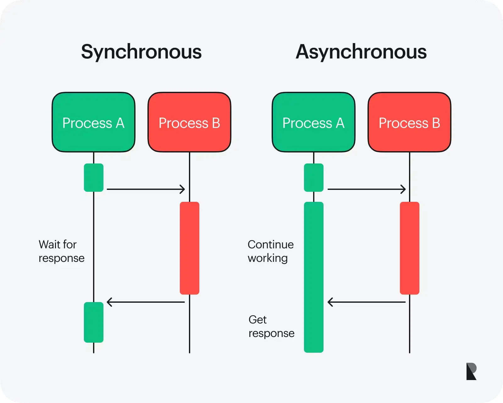
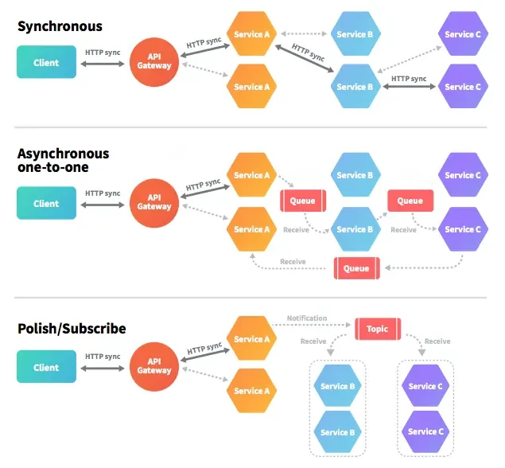

# Communication styles

## Towards a Distributed Data Model

In a monolithic architecture, all data resides in a **single database** with direct relationships (e.g., `JOIN` operations). In microservices, **each service has its own database**, leading to **data splitting**.

**Monolith:** `Order`, `OrderLine`, and `Product` in the same DB. **It is straightforward to determine which products belong to the same order**.



**Microservices:**
- **Order Service:** Manages `Order` and `OrderLine` (without product details).
- **Product Service:** Manages `Product` data separately.


Since data is no longer in the same database, **to determine which products belong to the same order, services must communicate!**

## Fallacies of Distributed Computing

Distributed systems are inherently complex. While they offer scalability, fault tolerance, and flexibility, developers often make assumptions that don’t hold in real-world networks. The **fallacies of distributed computing** highlight these common misconceptions that can lead to subtle bugs, performance issues, and system failures.


### #1 The Network is Reliable
This fallacy assumes that network connections are always stable and that there will be no disruptions. In reality, **networks can fail due to various reasons** like hardware issues, configuration errors, or transient faults.

```java
@RestController
public class NetworkReliabilityController {
    
    @PostMapping("/reliable")
    public ResponseEntity<String> reliableService(@RequestBody String data) {
        NetworkService remoteService = new NetworkService();
        String response = remoteService.process(data);
        return ResponseEntity.ok(response);
    }
}
```

```java
// version using dependency injection
@RestController
public class NetworkReliabilityController {
    NetworkService remoteService;
    
    @PostMapping("/reliable")
    public ResponseEntity<String> reliableService(@RequestBody String data) {
        String response = remoteService.process(data);
        return ResponseEntity.ok(response);
    }
}
```

How do you handle HttpTimeoutException?
* Is the remote service still processing (legit timeout)?
* Is the data actually arrived at the remote service?
* Should we show the user an error (nah!), log it (mhhh), or retry (better, but not always!).

### #2 Latency is Zero
This fallacy assumes that communication between services occurs instantaneously, neglecting the fact that **requests and responses take time**. The programming models used today (e.g., Dependency Injection) **hide performance differences**.

| Process                             | Duration | Normalized |
|-------------------------------------|----------|------------|
| 1 CPU cycle                         | 0.3ns    | 1s         |
| L1 cache access                     | 1ns      | 3s         |
| L2 cache access                     | 3ns      | 9s         |
| L3 cache access                     | 13ns     | 43s        |
| DRAM access (from CPU)              | 120ns    | 6min       |
| SSD I/O                             | 0.1ms    | 4days      |
| HDD I/O                             | 1-10ms   | 1-12months |
| Internet: San Francisco to New York | 40ms     | 4years     |
| Internet: San Francisco to London   | 80ms     | 8years     |
| Internet: San Francisco to Sydney   | 130ms    | 13years    |
| TCP retransmit                      | 1s       | 100years   |
| Container reboot                    | 4s       | 400years   |

### #3 Bandwidth is Infinite
This fallacy assumes that the network can handle any amount of data being sent or received at any time without degradation in performance. In reality, bandwidth is limited, and **how much data you can move through the network has severe implications of the performance of the system**.

* 1 Gbps = 128MBps
* Deduct TCP/IP overhead -> 64MBps
* Deduct serialization overhead -> 32MBps
* **As this limit is approached (e.g., additional machines are installed on the same network due to performance issues), slow things like TCP retransmits become more frequent, latency adds up ultimately impacting reliability (e.g. HttpTimeoutException)!**

### #4 The Network is Secure
This fallacy assumes that all communications over the network are inherently secure. In reality, security must be explicitly designed into network communications to protect against threats like eavesdropping, tampering, and unauthorized access. Furthermore, as [Kevin Mitnick](https://en.wikipedia.org/wiki/Kevin_Mitnick) initially showed, **social aspects become more and more relevant as the organizations complexity increases**.

For example, *everyone can find on Linkedin the DBA admins of a company, discover their habits on social media, and eventually "ask" them to put a recent organization backup on a pendrive and drop it from their car at a specific location.*

### #5 Topology Doesn't Change
This fallacy assumes that the network structure remains constant over time. In reality, distributed systems often experience changes due to scaling, failure, or reconfiguration, which can impact service discovery and availability.

For example, a network topology change can introduce reliability issues when, *callback contracts* are used in a distributed system.
* Callbacks rely on a stable connection between the caller and the callee
* Disruptions in network communication can lead to delayed, lost, or duplicated callbacks
* **Prolonged waiting times in the caller can increase resource consumption, potentially leading to system failure**.

### #6 There is One Administrator
This fallacy assumes a single authority manages and controls all aspects of the distributed system.
* Possible in small networks
    * Until admins get ~~run over by a truck~~ promoted

- **Will everything run smoothly if multiple admins roll out upgrades and patches simultaneously?**
- **If developers create configurations for every uncertainty, who will understand the actual impact of a specific set of settings?**
- **Investing time in clear, well-documented, and centralized configuration is essential.**


### #7 Transport Cost is Zero
This fallacy assumes that transferring data across the network incurs no cost, neglecting the reality that **data transfer can lead to operational costs**, and resource usage, especially when dealing with large volumes of data.

* **Network hardware** has upfront and ongoing costs
* **Serialization** before crossing the network (and deserialization on the other side) takes time.
* In the cloud, It can be a big cost factor (e.g., 70K$ cloud bill at the end of the month)

### #8 The Network is Homogeneous
This fallacy assumes that all components in the network are similar, ignoring the reality that different **services may be implemented in various programming languages, run on different platforms, or operate under different configurations**.

- Interoperability between .NET and Java used to be straightforward (**2005**).
- Now, the landscape includes Go, Rust, Python, MongoDB, Cassandra, and loosely integrated systems over HTTP (e.g., REST), leading to challenges such as:
    - Incompatible JSON serializers/deserializers
    - Shifts from relational to NoSQL data models
- It will get worse before it gets better

## Smart Endpoints Dumb Pipes

Deciding **where to place complexity** is a key design decision. The principle of **smart endpoints and dumb pipes** reflects this choice: business logic resides within the services themselves (smart endpoints), while communication between services remains simple (dumb pipes).

This approach **avoids complex middleware (like ESBs in traditional SOA) by making the pipes solely responsible for message transport**, not transformation or orchestration. The result is loose coupling, better scalability, resilience as services can evolve independently without relying on a complex communication layer.


## Taxonomy

Client-service interactions form the backbone of distributed systems and can be categorized along two key dimensions:
* **the relationship between the client and the service (one-to-one vs. one-to-many)**
* **the nature of the response timing (synchronous vs. asynchronous)**

### Relationship between the client and the service

- **One-to-One**: In this interaction style, each client request is directed to a specific service, and the response comes from that same service. This approach is **straightforward** and simplifies the relationship between clients and services but **can lead to tight coupling**.
  - **Example**: A user requests their account information from a banking service; the request is processed by the account service, which retrieves and sends the relevant data back.

- **One-to-Many**: In this model, a **single client request can invoke multiple services**. This is useful in scenarios where multiple services need to collaborate to fulfill a request. This approach allows for greater flexibility and scalability, as different services can be updated or replaced independently. 
  - **Example**: A request for a travel itinerary might be sent to a service that interacts with multiple services: a flight booking service, a hotel booking service, and a car rental service.

### Response timing

- **Synchronous**: In synchronous interactions, **the client sends a request and waits for a response** blocking further actions until the response is received. This model is intuitive but **latency adds up** if the service takes time to process the request. 
  - **Example**: A client submits a form on a website and waits for the server to confirm the submission before continuing. This tight coupling can lead to performance bottlenecks if the service is slow to respond.

- **Asynchronous**: Asynchronous interactions **allow the client to continue processing other tasks without waiting** for a response. The client may receive the response later or be notified when the response is ready. This non-blocking approach **improves responsiveness and user experience but introduces complexity**. 
  - **Example**: A user uploads a large file to a cloud storage service. Instead of waiting for the upload to complete, the user can continue working, and the service notifies them when the upload is finished.



## Types of interaction



**Request/Response (One-to-One, Synchronous)**: In this classic interaction style, a client sends a request to a service and waits for a direct response. The expectation is for a timely reply, which can lead to tight coupling between the client and the service. This pattern is common in traditional web applications and APIs where immediate feedback is required. 

**Asynchronous Request/Response (One-to-One, Asynchronous)**: In this interaction, a client sends a request but does not wait for an immediate response. Instead, it can continue processing other tasks. The service will eventually respond, but the client does not block while waiting. 

**Publish/Subscribe (One-to-Many, Asynchronous)**: This interaction model allows a client to publish messages to a *topic* that can be consumed by multiple services. Interested services subscribe to these messages, which can be processed independently of the publisher. This decouples clients from services, enabling a more flexible architecture. 

**Publish/Async Responses (One-to-Many, Asynchronous)**: In this variation, a client publishes a request message to multiple services and waits for responses for a specified amount of time. This allows the client to receive inputs from various services while still not blocking its operation, enhancing its efficiency. 

## Resources
- Microservices Patterns (Chapter 3)
- [Fallacies of Distributed Systems](https://www.youtube.com/watch?v=8fRzZtJ_SLk&list=PL1DZqeVwRLnD3EjyciYAO82dT9Owiq8I5)

