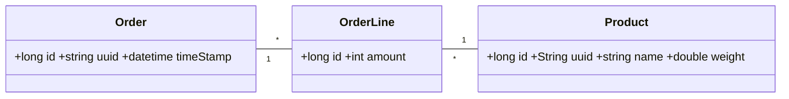
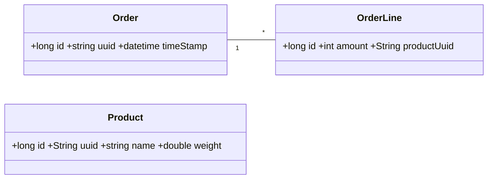
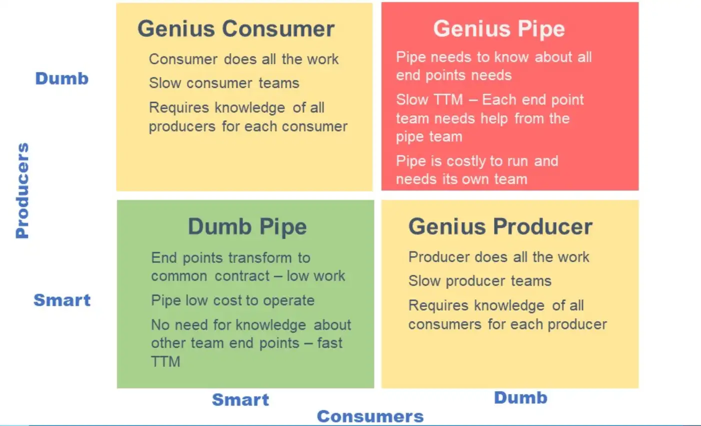
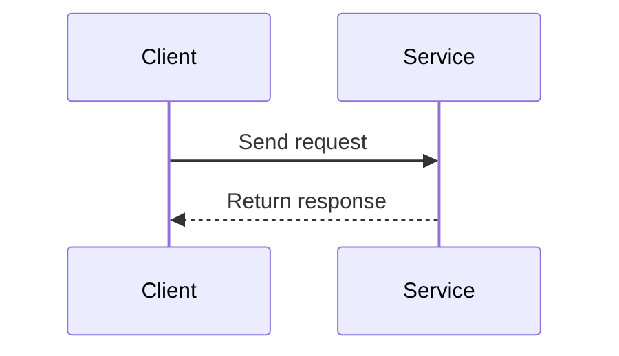
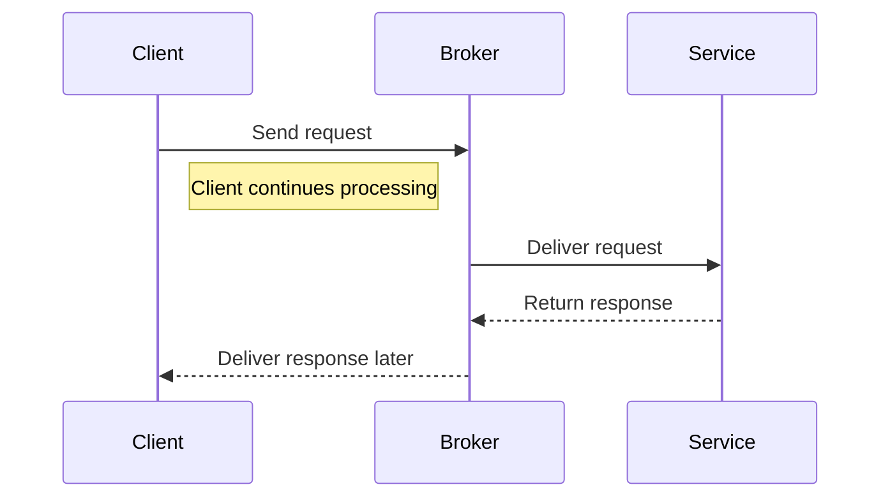
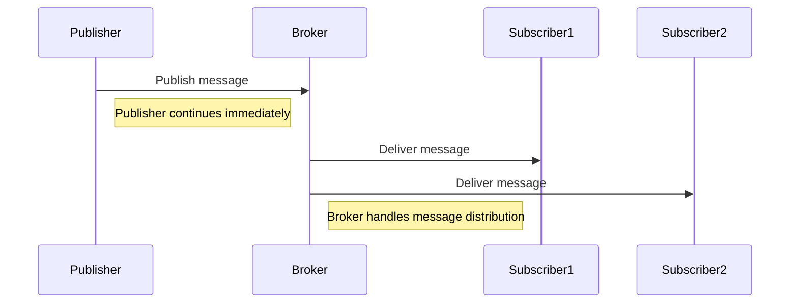
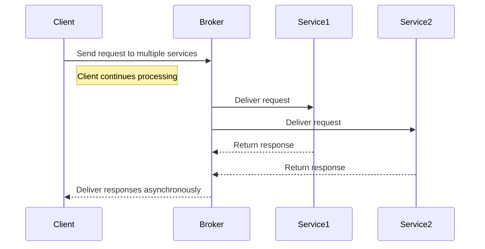

# Communication styles

## Consequences of a Distributed Data Model

Monolithic architectures store **all data in a single database**, e.g., `Order`, `OrderLine`, and `Product`. Relationships are straightforward:


```mermaid
classDiagram
direction LR
    class Order {+long id +string uuid +datetime timeStamp}
    class OrderLine {+long id +int amount}
    class Product {+long id +String uuid +string name +double weight}

    Order "1" -- "*" OrderLine
    OrderLine "*" -- "1" Product
```

Microservices split data:

* **Order Service:** `Order` + `OrderLine`, without product details.
* **Product Service:** `Product` data separately.


```mermaid
classDiagram
direction LR
    class Order {+long id +string uuid +datetime timeStamp}
    class OrderLine {+long id +int amount +String productUuid}
    class Product {+long id +String uuid +string name +double weight}

    Order "1" -- "*" OrderLine
```

As a consequence, services must communicate!

---

## Fallacies of Distributed Computing

Distributed systems introduce subtle complexities. Here’s a **deep technical view of each fallacy**:

---

### 1. The Network is Reliable

**Reality:** Networks fail due to hardware, misconfigurations, or transient errors.

```java
@RestController
public class NetworkReliabilityController {

    @PostMapping("/reliable")
    public ResponseEntity<String> reliableService(@RequestBody String data) {
        NetworkService remoteService = new NetworkService();
        String response = remoteService.process(data); // could timeout
        return ResponseEntity.ok(response);
    }
}
```

What to do when **HttpTimeoutException** is received?

* **Retry:** Ensure repeated requests do not corrupt state (idempotent calls).
* **Circuit breaker:** Stop calling failing services temporarily to preserve stability (Hystrix, Resilience4j).

---

### 2. Latency is Zero

**Reality:** Network calls add significant delays; 

* **Latency:** Time for a single request to travel from sender to receiver, including propagation, transmission, and queuing.
* **Round-Trip Time (RTT):** Time for a request to go to the receiver and back, including **serialization, processing, network delays, and deserialization**.


| Operation            | Duration | Normalized  |
| -------------------- | -------- | ----------- |
| 1 CPU cycle          | 0.3ns    | 1s          |
| L1 cache access      | 1ns      | 3s          |
| L2 cache access      | 3ns      | 9s          |
| L3 cache access      | 13ns     | 43s         |
| DRAM access          | 120ns    | 6min        |
| SSD I/O              | 0.1ms    | 4days       |
| HDD I/O              | 1–10ms   | 1–12 months |
| Internet SF → NY     | 40ms     | 4years      |
| Internet SF → London | 80ms     | 8years      |
| Internet SF → Sydney | 130ms    | 13years     |
| TCP retransmit       | 1s       | 100years    |
| Container reboot     | 4s       | 400years    |

Dependency Injection can be problematic here, as it obscures the true behavior of the `NetworkService`.

```java
@RestController
public class NetworkReliabilityController {
    NetworkService remoteService;
    
    public NetworkReliabilityController(NetworkService remoteService) {
        this.remoteService = remoteService; // <- minutes
    }

    @PostMapping("/reliable")
    public ResponseEntity<String> reliableService(@RequestBody String data) {
        String response = remoteService.process(data); // <- years ??
        return ResponseEntity.ok(response);
    }
}
```

**Mitigation strategies:**

* **Batching:** Combine multiple small requests.
* **Caching:** Reduce remote calls (Redis, Memcached).
* **Timeouts:** Set realistic deadlines for service calls.

---

### 3. Bandwidth is Infinite

**Reality:** Network throughput is limited; serialization and TCP/IP overhead reduce effective bandwidth.

* 1 Gbps → 128 MB/s → after TCP/IP & serialization → ~32 MB/s


```
Esempio: invio del numero 42 via HTTP/TCP/IP

┌─────────────────────────────────────────────┐
│ Ethernet header (14 B)                       │
└─────────────────────────────────────────────┘
┌─────────────────────────────────────────────┐
│ IP header (20 B)                             │
└─────────────────────────────────────────────┘
┌─────────────────────────────────────────────┐
│ TCP header (20 B)                            │
└─────────────────────────────────────────────┘
┌─────────────────────────────────────────────┐
│ HTTP headers (~100 B)                        │
│ POST /api/number HTTP/1.1                    │
│ Host: example.com                            │
│ Content-Type: application/json              │
│ Content-Length: 13                           │
└─────────────────────────────────────────────┘
┌─────────────────────────────────────────────┐
│ JSON body (13 B)                             │
│ {"value":42}                                 │
└─────────────────────────────────────────────┘
┌─────────────────────────────────────────────┐
│ Dato reale (1-2 B)                           │
│ 42                                           │
└─────────────────────────────────────────────┘

Totale trasmesso sul cavo: ~167 B
Dati utili: 1–2 B → solo ~1% dei byte è reale dato
```

**Mitigation strategies:**

* **Backpressure:** Slow consumers can overwhelm faster producers.
* **Throttling & rate limiting:** Use token buckets or leaky bucket algorithms.
* **Compression:** Reduce payload size with gzip or protobuf.

---

### 4. The Network is Secure

**Reality:** Network traffic must be protected with **encryption, authentication, and authorization**.

* **TLS/SSL:** Encrypt transport layer.
* **OAuth2/JWT:** Secure API calls.
* **Audit logging:** Track access to sensitive data.
* **Social engineering risk:** Policies and training are as important as tech controls.

---

### 5. Topology Does Not Change

**Reality:** Logical service topology can appear fixed, but in real systems, **dynamic scaling, and network partitions** constantly affect service discovery and connectivity.

**Example – Callback scenario:**

1. **Service A** registers a **callback** with **Service B** to receive event notifications.
2. **Service B** is removed or fails due to topology changes.
3. **Service A** continues to attempt communication, consuming **threads, CPU, and memory** for a service that no longer exists.

> ⚠️ **Takeaway:** Dynamic topology can lead to wasted resources if callbacks, connections, or retries aren’t properly managed.

**Mitigation strategies:**

* **Service registries:** Tools like **Consul, Eureka, or Kubernetes DNS** enable dynamic discovery of services.
* **Retries and idempotency:** Ensure operations don’t cause duplicate side effects during transient failures or service moves.

---

### 6. There is One Administrator

**Reality:** Rarely is there a single administrator who knows the entire system. Even if someone designed the network from scratch, over time people leave or change roles, and no one retains complete knowledge.

On top of this, developers often make system behavior **highly configurable** to allow runtime adjustments. Every new switch, lever, or toggle increases flexibility—but also reduces the likelihood that anyone fully understands the system.

> ⚠️ **Takeaway:** The combination of staff turnover and extensive configurability creates an environment where unexpected behaviors and misconfigurations are much more likely.

**Mitigation strategies:**

* **Configuration management:** Centralized tools like Spring Cloud Config, Consul, or Vault.
* **Infrastructure as code:** Terraform, Ansible, or Kubernetes manifests reduce human error.
* **Observability:** Logging, metrics, and distributed tracing essential to detect misconfigurations.

---

### 7. Transport Cost is Zero

**Reality:** Data movement always incurs **latency and CPU costs**, but in **cloud environments** the impact is even higher. Every time data is moved between nodes:

* You pay for **network bandwidth**.
* You incur **CPU usage** for **serialization and deserialization**.
* These CPU costs translate directly into **monetary cost** on cloud platforms.

> ⚠️ **Takeaway:** Minimizing unnecessary data transfers is critical for both **performance** and **cost efficiency** in cloud systems.

**Mitigation strategies:**

* **Serialization:** JSON vs Protobuf vs Avro; compact formats save bandwidth.
* **Message size optimization:** Avoid sending entire objects when only partial data is needed (GraphQL).
---

### 8. The Network is Homogeneous

**Reality:** Nodes vary in **language, platform, database, and protocol**.

**Mitigation strategies:**

* **Polyglot persistence:** Mix of relational and NoSQL databases (Postgres, MongoDB, Cassandra).
* **Cross-language communication:** REST, gRPC, or message brokers handle interoperability.
* **Data serialization challenges:** JSON, Protobuf, Avro may have different defaults.

---

## Smart Endpoints, Dumb Pipes

**Principle:** Keep the **communication layer simple** and put **business logic in services**.

* Avoids complex ESBs and orchestration layers
* Promotes **scalability, resilience, and independent evolution**



---

## Taxonomy of Client-Service Interactions

### Relationship

* **One-to-One:** Single client interacts with one service; simple but tightly coupled.
* **One-to-Many:** Single client invokes multiple services; allows flexibility and scaling.

### Response Timing

* **Synchronous:** Client blocks; simple but latency accumulates.
* **Asynchronous:** Non-blocking; improves responsiveness but adds complexity.

### Request/Response (One-to-One, Sync)


```mermaid
sequenceDiagram
    participant Client
    participant Service
    Client->>Service: Send request
    Service-->>Client: Return response
```

* Classic blocking call.
* Client waits until the service responds.

---

### Async Request/Response (One-to-One, Async)


```mermaid
sequenceDiagram
    participant Client
    participant Broker
    participant Service

    Client->>Broker: Send request
    Note right of Client: Client continues processing
    Broker->>Service: Deliver request
    Service-->>Broker: Return response
    Broker-->>Client: Deliver response later
```

* Non-blocking.
* Client can do other work while waiting for a response.

---

### Publish/Subscribe (One-to-Many, Async)


```mermaid
sequenceDiagram
    participant Publisher
    participant Broker
    participant Subscriber1
    participant Subscriber2

    Publisher->>Broker: Publish message
    Note right of Publisher: Publisher continues immediately
    Broker->>Subscriber1: Deliver message
    Broker->>Subscriber2: Deliver message
    Note right of Broker: Broker handles message distribution
```

* Publisher sends messages to a broker.
* Multiple subscribers consume messages independently.
* Decouples publisher and consumers.

---

### Publish/Async Responses (One-to-Many, Async)


```mermaid
sequenceDiagram
    participant Client
    participant Broker
    participant Service1
    participant Service2

    Client->>Broker: Send request to multiple services
    Note right of Client: Client continues processing
    Broker->>Service1: Deliver request
    Broker->>Service2: Deliver request
    Service1-->>Broker: Return response
    Service2-->>Broker: Return response
    Broker-->>Client: Deliver responses asynchronously
```

* Client sends requests to multiple services asynchronously.
* Responses arrive later without blocking the client.

## Resources

* *Microservices Patterns*, Chapter 3
* [Fallacies of Distributed Systems](https://www.youtube.com/watch?v=8fRzZtJ_SLk&list=PL1DZqeVwRLnD3EjyciYAO82dT9Owiq8I5)
