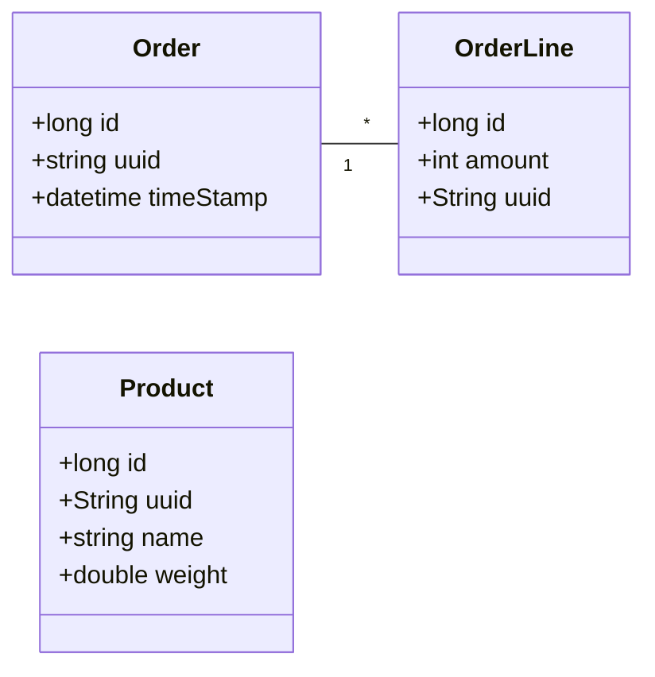
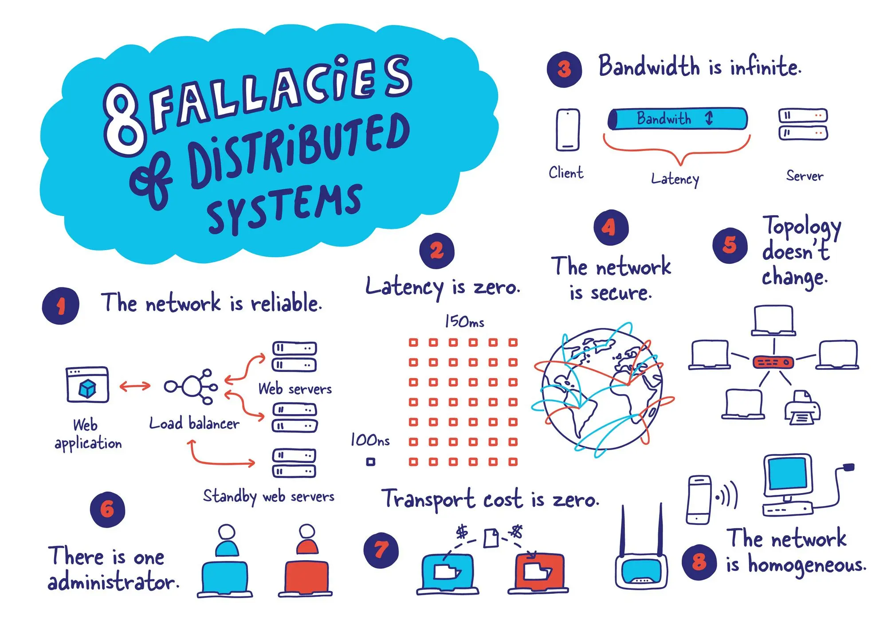

# Communication styles

## Towards a Distributed Data Model

In a monolithic architecture, all data resides in a **single database** with direct relationships (e.g., `JOIN` operations). In microservices, **each service has its own database**, leading to **data splitting**.

**Monolith:** `Order`, `OrderLine`, and `Product` in the same DB. **It is straightforward to determine which products belong to the same order**.

**Microservices:**
- **Order Service:** Manages `Order` and `OrderLine` (without product details).
- **Product Service:** Manages `Product` data separately.

Since data is no longer in the same database, **to determine which products belong to the same order, services must communicate!**

## Fallacies of Distributed Computing
**The biggest challenge when changing from a monolithic application to a microservices-based application lies in changing the communication mechanism.** A direct conversion from in-process method calls into RPC calls to services will cause a chatty and not efficient communication that won't perform well in distributed environments.

The challenges of designing distributed system are so notorious that there's even a canon known as the [Fallacies of Distributed Computing](0%20-%20Fallacies%20of%20distributed%20computing.md) listing **wrong assumptions that developers often make** when moving from monolithic to distributed designs.

## Smart Endpoints Dumb Pipes
The microservice community promotes the philosophy of **smart endpoints and dumb pipes**.
* Business logic is handled at the service level (smart endpoints), while communication between services is kept simple (dumb pipes).
* This approach **avoids complex middleware (like ESBs in traditional SOA) by making the pipes solely responsible for message transport**, not transformation or orchestration. The result is loose coupling, better scalability, resilience as services can evolve independently without relying on a complex communication layer.

## Taxonomy

Client-service interactions form the backbone of distributed systems and can be categorized along two key dimensions:
* **the relationship between the client and the service (one-to-one vs. one-to-many)**
* **the nature of the response timing (synchronous vs. asynchronous)**

### Relationship between the client and the service

- **One-to-One**: In this interaction style, each client request is directed to a specific service, and the response comes from that same service. This approach is **straightforward** and simplifies the relationship between clients and services but **can lead to tight coupling**.
  - **Example**: A user requests their account information from a banking service; the request is processed by the account service, which retrieves and sends the relevant data back.

- **One-to-Many**: In this model, a **single client request can invoke multiple services**. This is useful in scenarios where multiple services need to collaborate to fulfill a request. This approach allows for greater flexibility and scalability, as different services can be updated or replaced independently. 
  - **Example**: A request for a travel itinerary might be sent to a service that interacts with multiple services: a flight booking service, a hotel booking service, and a car rental service.

### Response timing

- **Synchronous**: In synchronous interactions, **the client sends a request and waits for a response** blocking further actions until the response is received. This model is intuitive but **latency adds up** if the service takes time to process the request. 
  - **Example**: A client submits a form on a website and waits for the server to confirm the submission before continuing. This tight coupling can lead to performance bottlenecks if the service is slow to respond.

- **Asynchronous**: Asynchronous interactions **allow the client to continue processing other tasks without waiting** for a response. The client may receive the response later or be notified when the response is ready. This non-blocking approach **improves responsiveness and user experience but introduces complexity**. 
  - **Example**: A user uploads a large file to a cloud storage service. Instead of waiting for the upload to complete, the user can continue working, and the service notifies them when the upload is finished.

## Types of interaction

**Request/Response (One-to-One, Synchronous)**: In this classic interaction style, a client sends a request to a service and waits for a direct response. The expectation is for a timely reply, which can lead to tight coupling between the client and the service. This pattern is common in traditional web applications and APIs where immediate feedback is required. 

**Asynchronous Request/Response (One-to-One, Asynchronous)**: In this interaction, a client sends a request but does not wait for an immediate response. Instead, it can continue processing other tasks. The service will eventually respond, but the client does not block while waiting. 

**Publish/Subscribe (One-to-Many, Asynchronous)**: This interaction model allows a client to publish messages to a *topic* that can be consumed by multiple services. Interested services subscribe to these messages, which can be processed independently of the publisher. This decouples clients from services, enabling a more flexible architecture. 

**Publish/Async Responses (One-to-Many, Asynchronous)**: In this variation, a client publishes a request message to multiple services and waits for responses for a specified amount of time. This allows the client to receive inputs from various services while still not blocking its operation, enhancing its efficiency. 

## Resources
- Microservices Patterns (Chapter 3)

