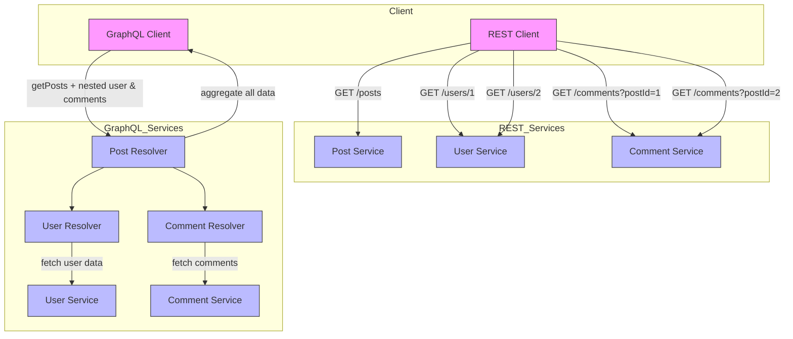

# Synchronous Communications

In synchronous communication, services interact in a *request–response* manner — the caller sends a request and waits for a reply before continuing. This model is simple and intuitive, resembling traditional client-server interactions. Typical implementations include **REST**, **GraphQL**, and **gRPC** (using Protobuf), each offering different trade-offs in flexibility, performance, and data format (best for edge, cloud, or both).

---

## Definitions and Known Issues

**Spatial coupling** refers to the degree of dependency between different components or services in a system at a given point in time. A high degree of spatial coupling means that components are tightly connected, requiring direct knowledge of each other’s existence, interfaces, or locations. This can lead to reduced flexibility and increased maintenance complexity.

```java
public class Payment {
    private double amount;
    private String paymentMethod;
    private boolean isApproved;
}
```

```java
@RestController
public class OrderController {
    
    public Order createOrder(Order order) {
        // Directly calling Payment Service location, port, endpoint (tightly coupled)
        String url = "http://payment-service:8080/api/payments";
        RestClient restClient = RestClient.builder().build();
        Payment payment = restClient.get()
                .uri(url)
                .retrieve()
                .body(new ParameterizedTypeReference<>() {});   
        // ...
    }
}
```

**Temporal coupling** occurs when components or services must be available and responsive at the same time to function correctly. This often happens in synchronous communication patterns, where one component must wait for another to process a request before proceeding. In cases where a chain of multiple services need to communicate, **the cumulated latency can significantly degrade performance**. **[unsolvable with synchronous approaches!]**

**API coupling** refers to the degree of dependency between a client and an API. A highly coupled API means that changes in the API can easily break the client, while a loosely coupled API provides more flexibility and resilience to changes.

*Example*: Modifying the `Payment` class:

```java
public class Payment {
    private double amount;
    private String currency;
    private String paymentMethod;
    private boolean isApproved;
}
```

**Over-fetching** occurs when an API returns more data than the client actually needs, leading to wasted bandwidth and increased processing time. This typically happens in REST APIs with fixed response structures, where a client cannot specify exactly which fields it requires.

*Scenario*: A client wants only the title and author of a book, but the API returns the entire book object, including unnecessary fields like ISBN, description, publisher, etc.

```java
public class Book {
    private String title;
    private String author;
    private String isbn;
    private String description;
    private String publisher;
    private int pages;
    
    // ...
}
```

```java
@RestController
@RequestMapping("/books")
public class BookController {

    @GetMapping
    public Iterable<Book> findAll() {
        return List.of(
            new Book("Spring Boot", "John Doe", "123456789", "Comprehensive guide", "TechPub", 500),
            new Book("Microservices", "Jane Smith", "987654321", "Detailed explanation", "CloudPub", 300)
        );
    }
}
```

**Under-fetching (aka chattiness)** occurs when a client requests data from an API but does not receive all the necessary information in a single response. As a result, the client must make additional requests to retrieve the missing data, leading to inefficiencies and increased latency.

*Scenario*: The endpoint `/books` returns a simplified model for books. If the client also needs the publisher, it must make additional requests to fetch publisher details such as: `GET /books/{title}`

```java
public class BookBasicDTO {
    private String title;
    private String author;
}
```

```java
@RestController
@RequestMapping("/books")
public class BookController {

    @GetMapping
    public Iterable<BookBasicDTO> findAll() {
        List<Book> books = List.of(
                new Book("Spring Boot", "John Doe", "123456789", "Comprehensive guide", "TechPub", 500),
                new Book("Microservices", "Jane Smith", "987654321", "Detailed explanation", "CloudPub", 300)
        );
        
        // Returns only title and author
        return books.stream()
                .map(book -> new BookBasicDTO(book.getTitle(), book.getAuthor()))
                .toList();
    }
}
```

**Thread pool exhaustion (on client side)**: Clients waiting for a response from the server consume system resources (threads, memory), which can be problematic in high-concurrency environments. **[unsolvable with synchronous approaches!]**

*Scenario*: A client queries the endpoint `/books` 100 times every second. Each request takes on average 1 second to complete. At any moment, the **client** has approximately 100 threads in a waiting state. Given that each thread requires 1MB of RAM, what happens if the books service stops responding for 10 seconds? The client will need ~1GB of RAM just to manage waiting threads.


---

## REST (JSON over HTTP)

**Limitations of REST**:

| Characteristic                  | REST |
| ------------------------------- | ---- |
| **Serialization**               | Y    |
| **Temporal Coupling**           | Y    |
| **API Coupling**                | Y    |
| **Over-fetching**               | Y    |
| **Under-fetching (chattiness)** | Y    |
| **Thread Pool Exhaustion**      | Y    |

---

## gRPC (Protobuf over gRPC)

* **gRPC** is a **Remote Procedure Call (RPC) framework** developed by Google.
* It allows you to **define services** and **call methods on remote servers as if they were local**.
* Supports:

    * Unary RPC (normal request-response)
    * Bi-directional streaming
    * Client and server stub generation
    * HTTP/2 for multiplexing, flow control, and performance

**Protobuf** is a **serialization format and schema language**:

* Defines messages and types in `.proto` files
* Generates **language-specific classes**
* Serializes data efficiently in a **compact binary format**
* **Used by gRPC by default** for message payloads


**How gRPC Solves REST Limitations**:

* **Serialization**: Uses Protobuf (compact binary format) for efficient size and speed.
* **API Coupling**: Strict API contracts with backward/forward compatibility.
* **Over-fetching**: Efficient binary serialization reduces unnecessary data.
* **Under-fetching (chattiness)**: HTTP/2 multiplexing minimizes multiple round trips.

| Characteristic                  | REST | gRPC    |
| ------------------------------- | ---- | ------- |
| **Serialization**               | Y    | Reduced |
| **Temporal Coupling**           | Y    | Y       |
| **API Coupling**                | Y    | Reduced |
| **Over-fetching**               | Y    | Reduced |
| **Under-fetching (chattiness)** | Y    | Reduced |
| **Thread Pool Exhaustion**      | Y    | Y       |

**Limitations of gRPC**:

* Schema complexity and code generation
* Poor browser support
* Strict typing can reduce flexibility

---

## Apache Avro

* **Apache Avro** is a **data serialization system** from the Apache Hadoop ecosystem.
* Optimized for **compact, fast, and schema-based binary serialization**.
* Supports **cross-language communication** (Java, Python, C++, Go, etc.).
* Can embed **schema with data**, unlike Protobuf which requires pre-shared schema.

**Avro Schema Example**

```json
{
  "type": "record",
  "name": "User",
  "namespace": "com.example.avro",
  "fields": [
    {"name": "name", "type": "string"},
    {"name": "age",  "type": "int"},
    {"name": "email", "type": ["null", "string"], "default": null}
  ]
}
```

**Serialization Example (Java)**

```java
Schema schema = new Schema.Parser().parse(new File("user.avsc"));
GenericRecord user = new GenericData.Record(schema);
user.put("name", "Alice");
user.put("age", 30);

ByteArrayOutputStream out = new ByteArrayOutputStream();
DatumWriter<GenericRecord> writer = new SpecificDatumWriter<>(schema);
BinaryEncoder encoder = EncoderFactory.get().binaryEncoder(out, null);
writer.write(user, encoder);
encoder.flush();
byte[] bytes = out.toByteArray();
```

**Deserialization Example**

```java
DatumReader<GenericRecord> reader = new SpecificDatumReader<>(schema);
BinaryDecoder decoder = DecoderFactory.get().binaryDecoder(bytes, null);
GenericRecord user = reader.read(null, decoder);
System.out.println(user);
```

**How Apache Avro Solves REST Limitations**:

* Compact binary serialization
* Flexible schema evolution reduces API coupling
* Avoids over-fetching
* Reduces payload sizes, improving repeated call efficiency
* Works well with messaging systems (Kafka)

---

## GraphQL (JSON over HTTP)




*REST Flow*: Multiple HTTP requests to gather data → high chattiness
*GraphQL Flow*: Single query; server aggregates → reduced chattiness

**GraphQL Advantages**:

* Reduces API coupling
* Eliminates over-fetching and under-fetching
* Single endpoint simplifies serialization

**GraphQL Limitations**:

* Query optimization complexity
* Caching challenges
* Schema and resolver overhead

| Characteristic                  | REST | GraphQL |
| ------------------------------- | ---- | ------- |
| **Serialization**               | Y    | Reduced |
| **Temporal Coupling**           | Y    | Y       |
| **API Coupling**                | Y    | Reduced |
| **Over-fetching**               | Y    | Reduced |
| **Under-fetching (chattiness)** | Y    | Reduced |
| **Thread Pool Exhaustion**      | Y    | Y       |

---

## Protocols in the Edge-Cloud Continuum

* **REST (JSON/HTTP)**: simple, widely supported, cloud-friendly; higher latency limits edge suitability
* **GraphQL**: flexible queries, reduces over/under-fetching; JSON parsing may add latency at edge
* **gRPC (Protobuf)**: low-latency, binary, streaming; great for IoT, edge, real-time pipelines
* **Avro**: schema-based, compact binary; excellent for streaming, edge-cloud messaging, schema evolution

---

## DTOs

A **DTO (Data Transfer Object)** is used to transfer data between layers or over the network.

**Characteristics**:

* Encapsulation
* No business logic
* Serializable

**Use Cases**:

* APIs and microservices
* Reducing data load
* Decoupling layers

**Entity-to-DTO Mapping Libraries**:

* **Java**: MapStruct, ModelMapper
* **Python**: Marshmallow, Pydantic

---

## Resources

