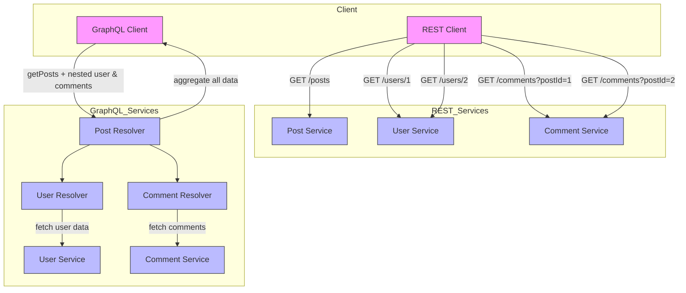

# Synchronous communications

In synchronous communication, services interact in a *request–response* manner — the caller sends a request and waits for a reply before continuing. This model is simple and intuitive, resembling traditional client-server interactions. Typical implementations include REST, GraphQL, and gRPC (using Protobuf), each offering different trade-offs in flexibility, performance, and data format (best for edge/cloud/both). 


## Definitions and Know Issues

**Spatial coupling** refers to the degree of dependency between different components or services in a system at a given point in time. A high degree of spatial coupling means that components are tightly connected, requiring direct knowledge of each other’s existence, interfaces, or locations. This can lead to reduced flexibility and increased maintenance complexity.

```java
public class Payment {
    private double amount;
    private String paymentMethod;
    private boolean isApproved;
}
```

```java
@RestController
public class OrderController {
    
    public Order createOrder(Order order) {
        // Directly calling Payment Service location, port, endpoint (tightly coupled)
        String url = "http://payment-service:8080/api/payments";
        RestClient restClient = RestClient.builder().build();
        Payment payment = restClient.get()
                .uri(url)
                .retrieve()
                .body(new ParameterizedTypeReference<>() {});   
        // ...
    }
}
```

**Temporal coupling** occurs when components or services must be available and responsive at the same time to function correctly. This often happens in synchronous communication patterns, where one component must wait for another to process a request before proceeding. In cases where a chain of multiple services need to communicate, **the cumulated latency can significantly degrade performance**. **[unsolvable with sync approaches!]**

**API coupling** refers to the degree of dependency between a client and an API. A highly coupled API means that changes in the API can easily break the client, while a loosely coupled API provides more flexibility and resilience to changes.

What happens if we have to modify the *Payment* class?

```java
public class Payment {
    private double amount;
    private String currency;
    private String paymentMethod;
    private boolean isApproved;
}
```

**Over-fetching** occurs when an API returns more data than the client actually needs, leading to wasted bandwidth and increased processing time. This typically happens in REST APIs with fixed response structures, where a client cannot specify exactly which fields it requires.

*Scenario*: A client wants only the title and author of a book, but the API returns the entire book object, including unnecessary fields like ISBN, description, publisher, etc.

```java
public class Book {
    private String title;
    private String author;
    private String isbn;
    private String description;
    private String publisher;
    private int pages;
    
    // ...
}
```

```java
@RestController
@RequestMapping("/books")
public class BookController {

    @GetMapping
    public Iterable<Book> findAll() {
        return List.of(
            new Book("Spring Boot", "John Doe", "123456789", "Comprehensive guide", "TechPub", 500),
            new Book("Microservices", "Jane Smith", "987654321", "Detailed explanation", "CloudPub", 300)
        );
    }
}
```

**Under-fetching (aka chattiness)** occurs when a client requests data from an API but does not receive all the necessary information in a single response. As a result, the client must make additional requests to retrieve the missing data, leading to inefficiencies and increased latency.

*Scenario*: The endpoint `/books` returns a simplified model for books. If the client also needs the publisher, it must make additional requests to fetch publisher details such as: `GET /books/{title}`

```java
public class BookBasicDTO {
    private String title;
    private String author;
}
```

```java
@RestController
@RequestMapping("/books")
public class BookController {

    @GetMapping
    public Iterable<BookBasicDTO> findAll() {
        List<Book> books = List.of(
                new Book("Spring Boot", "John Doe", "123456789", "Comprehensive guide", "TechPub", 500),
                new Book("Microservices", "Jane Smith", "987654321", "Detailed explanation", "CloudPub", 300)
        );
        
        // Returns only title and author
        return books.stream()
                .map(book -> new BookBasicDTO(book.getTitle(), book.getAuthor()))
                .toList();
    }
}
```


**Thread pool exhaustion (on client!)** clients waiting for a response from the server consumes system resources (threads, memory), which can be problematic in high-concurrency environments. **[unsolvable with sync approaches!]**

*Scenario*: A client queries the endpoint `/books` 100 times every second. Each request takes on average 1 second to be satisfied. At any moment in time, the **client** has approximately 100 threads in waiting state (waiting the server reply). Given that each thread requires 1MB of RAM, what happens if the books service stop responding for 10 seconds? The client will need 1GB of RAM only for managing them!


## REST (JSON over HTTP)

**Limitations of REST**:

| Characteristic            | REST  |
|---------------------------|------|
| **Serialization**         | Y    |
| **Temporal Coupling**     | Y    |
| **API Coupling**          | Y    |
| **Over-fetching**         | Y    |
| **Under-fetching (chattiness)** | Y  |
| **Thread Pool Exhaustion** | Y    |

## gRPC (Protobuf over gRPC)

* **gRPC** is a **Remote Procedure Call (RPC) framework** developed by Google.
* It allows you to **define services** and **call methods on remote servers as if they were local**.
    * Bi-directional streaming
    * Unary RPC (normal request-response)
    * Client and server stubs generation
    * Works over HTTP/2 for multiplexing, flow control, and performance

* **Protobuf** is a **serialization format and schema language**:

    * Defines messages and types in `.proto` files
    * Generates **language-specific classes**
    * Serializes data efficiently in a **compact binary format**
    * **Used by gRPC by default** for defining message payloads.


**How gRPC Solves REST Limitations**:

- **Serialization**: gRPC uses Protocol Buffers (Protobuf), a compact binary format, for data serialization instead of JSON or XML (commonly used in REST APIs). Binary formats are much more efficient in terms of size and speed because they take up less space and are faster to serialize and deserialize.
- **API Coupling**: gRPC defines strict API contracts, ensuring strong typing and reducing the risk of breaking changes. With built-in support for both backward and forward compatibility, API evolution is smoother compared to REST, where changes in JSON payloads or specifications can more easily introduce incompatibilities.
- **Over-fetching**: gRPC reduces over-fetching by efficient binary serialization.
- **Under-fetching (chattiness)**: gRPC minimizes multiple round trips by leveraging [HTTP/2](https://www.cloudflare.com/learning/performance/http2-vs-http1.1/) multiplexing, enabling efficient communication. 


| Characteristic            | REST  | gRPC    |
|---------------------------|-------|---------|
| **Serialization**         | Y     | Reduced |
| **Temporal Coupling**     | Y     | Y       |
| **API Coupling**          | Y     | Reduced |
| **Over-fetching**         | Y     | Reduced |
| **Under-fetching (chattiness)** | Y  | Reduced |
| **Thread Pool Exhaustion** | Y     | Y       |


**Limitations of gRPC**:

- **Complexity**: Protobuf introduces more complexity in terms of schema definitions and code generation.
- **Browser Support**: While gRPC is excellent for backend and service-to-service communication, it is not well-supported in browser environments, limiting its use for frontend applications.
- **Strict Typing**: While strict typing ensures robustness, it also introduces rigidity, as changes to the API require careful management of Protobuf contracts.

## Apache Avro

* **Apache Avro** is a **data serialization system** from the Apache Hadoop ecosystem.
* Optimized for **compact, fast, and schema-based binary serialization**.
* Supports **cross-language communication** (Java, Python, C++, Go, etc.).

**Key difference from Protobuf**:

* Avro can embed **schema with the data** (self-describing), while Protobuf requires the schema to be **pre-shared** between client and server. This allows Avro to be **more flexible** in evolving schemas dynamically.

**Avro Schema Example**

```json
{
  "type": "record",
  "name": "User",
  "namespace": "com.example.avro",
  "fields": [
    {"name": "name", "type": "string"},
    {"name": "age",  "type": "int"},
    {"name": "email", "type": ["null", "string"], "default": null}
  ]
}
```

**Serialization Example (Java)**

```java
Schema schema = new Schema.Parser().parse(new File("user.avsc"));
GenericRecord user = new GenericData.Record(schema);
user.put("name", "Alice");
user.put("age", 30);

ByteArrayOutputStream out = new ByteArrayOutputStream();
DatumWriter<GenericRecord> writer = new SpecificDatumWriter<>(schema);
BinaryEncoder encoder = EncoderFactory.get().binaryEncoder(out, null);
writer.write(user, encoder);
encoder.flush();
byte[] bytes = out.toByteArray();
```

**Deserialization Example**

```java
DatumReader<GenericRecord> reader = new SpecificDatumReader<>(schema);
BinaryDecoder decoder = DecoderFactory.get().binaryDecoder(bytes, null);
GenericRecord user = reader.read(null, decoder);
System.out.println(user);
```

**How Apache Avro Solves REST Limitations**:

* **Serialization**: Avro uses a **compact binary format** with schemas, which is much more efficient than JSON or XML. Binary encoding reduces message size and improves serialization/deserialization speed, making it suitable for edge-cloud communication and streaming pipelines.

* **Schema Evolution / API Coupling**: Avro provides **flexible schema evolution**. Fields can be added or removed with defaults, and readers can use schemas different from the writers’ schemas. This reduces the risk of breaking changes compared to REST JSON payloads and allows smoother cross-service evolution.

* **Over-fetching**: Avro payloads include only the required data fields, avoiding unnecessary data transfer compared to verbose JSON responses in REST.

* **Under-fetching / Chattiness**: While Avro does not inherently solve network chattiness like gRPC’s HTTP/2 streaming, it **reduces payload sizes**, making repeated calls more efficient. When combined with messaging systems like Kafka, it enables high-throughput, low-latency communication across edge and cloud components.


## GraphQL (JSON over HTTP)




The figure illustrates the difference in client-server communication between a traditional REST architecture and a GraphQL-based architecture, highlighting the concept of *chattiness*.

* **REST Flow (left side):** The REST client must make multiple HTTP requests to different services to aggregate all the data it needs. For example, it calls the Post Service to get posts, then individually calls the User Service for each post’s author and the Comment Service for each post’s comments. This results in a high number of round-trips between client and server, representing high *chattiness*.

* **GraphQL Flow (right side):** The GraphQL client sends a single query requesting posts along with nested user and comment information. The GraphQL server uses resolvers (`PostResolver`, `UserResolver`, `CommentResolver`) to fetch the required data from the underlying microservices (Post, User, Comment services) and aggregates it before sending it back to the client. Although multiple internal calls occur between services, the client receives all requested data in a single response, significantly reducing chattiness from the client’s perspective.

* **Key Point:** GraphQL reduces client-side chattiness by delegating data aggregation to the server, even if internal service-to-service communication still happens.

**How GraphQL Solves REST Limitations**:

- **API Coupling**: Unlike REST, where different resources are exposed via multiple endpoints, GraphQL operates through a single endpoint for all queries, simplifying the API structure. Unlike REST, which often requires versioning to handle changes, GraphQL’s flexible schema allows for non-breaking changes, such as adding new fields without impacting existing clients.
- **Over-fetching and under-fetching (chattiness)**: GraphQL allows clients to request only the fields they need, addressing REST’s issue of returning unnecessary data (over-fetching) or making multiple requests to retrieve the needed data (under-fetching).
- **Serialization**: The reduced number of requests and responses (because a single flexible endpoint is used), reduces the overall serialization burden as well.

| Characteristic            | REST  | GraphQL |
|---------------------------|-------|---------|
| **Serialization**         | Y     | Reduced |
| **Temporal Coupling**     | Y     | Y       |
| **API Coupling**          | Y     | Reduced |
| **Over-fetching**         | Y     | Reduced |
| **Under-fetching (chattiness)** | Y  | Reduced |
| **Thread Pool Exhaustion** | Y     | Y       |

**Limitations of GraphQL**:

- **Complexity in Query Optimization**: While GraphQL gives clients flexibility, it also puts more responsibility on the server to optimize the queries. If not properly managed, complex or deeply nested queries can lead to performance bottlenecks on the server side.
- **Caching Challenges**: Caching in GraphQL is more complex than REST, as queries can be dynamic and granular. REST APIs can leverage HTTP-based caching more easily (based on endpoints), while GraphQL requires more sophisticated caching strategies.
- **Schemas Overhead**: The overhead of managing schemas and resolvers might not justify the benefits in all use cases.

## Protocols in the Edge-Cloud Continuum

* **REST (JSON/HTTP)**

    * Simple and widely supported
    * Ideal for cloud-facing APIs and interoperability
    * Higher latency and larger payloads limit suitability for edge or real-time

* **GraphQL**

    * Flexible queries allow fetching exactly needed data
    * Reduces over-fetching in cloud-aggregated services
    * JSON parsing and query processing can introduce latency at the edge

* **gRPC (Protobuf)**

    * Compact binary messages and streaming support
    * Low-latency, high-throughput communication across cloud and edge
    * Excellent for IoT, real-time pipelines, and edge-device microservices

* **Avro**

    * Schema-based binary serialization with optional embedded schema
    * Well-suited for **data pipelines**, edge-cloud messaging, and streaming systems (Kafka, Spark)
    * Slightly higher complexity than Protobuf for direct RPC, but ideal where **schema evolution and cross-language compatibility** matter


## DTOs
A **DTO (Data Transfer Object)** is a design pattern used in software engineering to transfer data between different parts of an application, often across network boundaries or between layers within the same application. The main purpose of a DTO is to encapsulate data and reduce the amount of information sent over the network by only containing necessary fields, and it’s commonly used in distributed systems and applications that follow the layered architecture (such as MVC or service-oriented architectures).

### Key Characteristics of DTOs
- **Encapsulation**: DTOs wrap data in a structure that hides complex entities or potentially sensitive information, only exposing fields relevant for the specific data transfer operation.
- **No Business Logic**: DTOs typically don’t contain business logic, as they serve only as containers for data. Their purpose is purely data transfer, so methods like getters and setters are usually the only ones included.
- **Serialization**: Since DTOs are often transferred over a network or between application boundaries, they are usually designed to be serializable (e.g., JSON or XML).

### When to Use DTOs
- **APIs and Microservices**: DTOs are commonly used in REST APIs and microservices. They provide a way to define the format and content of the data being exchanged without exposing internal models or database entities.
- **Reducing Data Load**: By selecting only relevant fields, DTOs can reduce the amount of data transmitted, especially useful in mobile applications or low-bandwidth networks.
- **Decoupling Layers**: In a layered architecture (e.g., separating data access, business logic, and presentation layers), DTOs help maintain separation by acting as an intermediary between the business and presentation layers.

Automatic mapping between entities and DTOs is a common requirement, as it simplifies the process of converting data between different layers of an application. In both Java and Python, libraries are available to facilitate this mapping, reducing boilerplate code and improving code readability.

### Entity-to-DTO Mapping
Several libraries provide automatic mapping capabilities. Here are the most popular ones:

**MapStruct**: (Java) MapStruct is a powerful, compile-time, code-generating library that creates type-safe mappers between Java objects (e.g., entities and DTOs). It generates code at compile-time, so there's no runtime overhead, making it fast and efficient.

**ModelMapper**: (Java) ModelMapper is a more flexible, runtime-based library that provides a convention-based approach to object mapping. It can automatically map properties with similar names and is highly customizable.

**Marshmallow**: (Python) Marshmallow is a popular library for object serialization/deserialization in Python. It is typically used to convert objects to and from JSON, but it can also be used for DTO mappings.

**Pydantic**: (Python) Pydantic is primarily used for data validation and settings management, but it also serves as a great DTO library. It provides data validation and conversion between Python objects and JSON-compatible formats.


## Resources