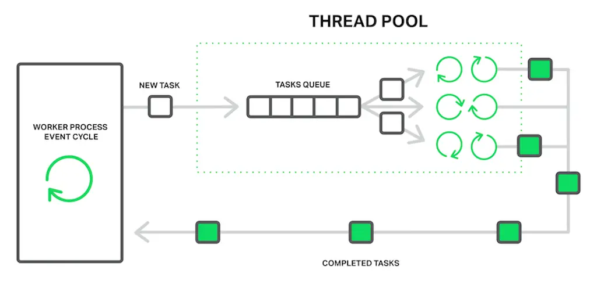
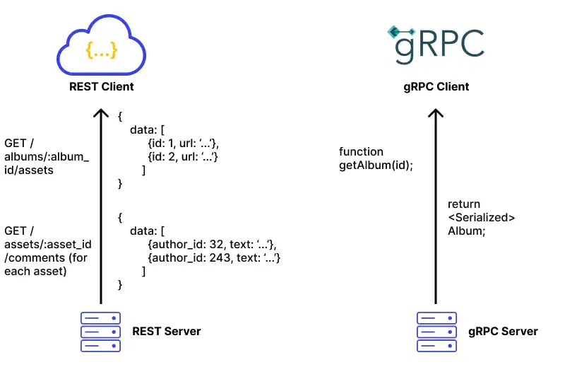
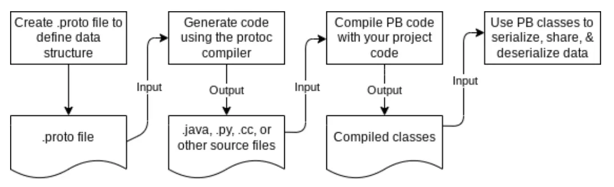
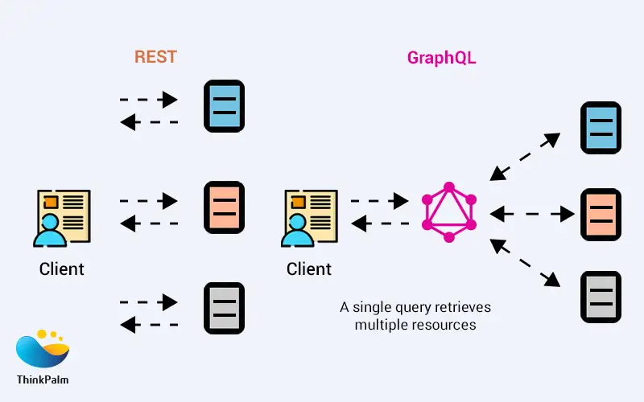

# Synchronous communications

In synchronous communication, services interact in a *request–response* manner — the caller sends a request and waits for a reply before continuing. This model is simple and intuitive, resembling traditional client-server interactions. Typical implementations include REST, GraphQL, and gRPC (using Protobuf), each offering different trade-offs in flexibility, performance, and data format (best for edge/cloud/both). 


## Definitions and Know Issues

**Spatial coupling** refers to the degree of dependency between different components or services in a system at a given point in time. A high degree of spatial coupling means that components are tightly connected, requiring direct knowledge of each other’s existence, interfaces, or locations. This can lead to reduced flexibility and increased maintenance complexity.

```java
public class Payment {
    private double amount;
    private String paymentMethod;
    private boolean isApproved;
}
```

```java
@RestController
public class OrderController {
    
    public Order createOrder(Order order) {
        // Directly calling Payment Service location, port, endpoint (tightly coupled)
        String url = "http://payment-service:8080/api/payments";
        RestClient restClient = RestClient.builder().build();
        Payment payment = restClient.get()
                .uri(url)
                .retrieve()
                .body(new ParameterizedTypeReference<>() {});   
        // ...
    }
}
```

**Temporal coupling** occurs when components or services must be available and responsive at the same time to function correctly. This often happens in synchronous communication patterns, where one component must wait for another to process a request before proceeding. In cases where a chain of multiple services need to communicate, **the cumulated latency can significantly degrade performance**. **[unsolvable with sync approaches!]**

**API coupling** refers to the degree of dependency between a client and an API. A highly coupled API means that changes in the API can easily break the client, while a loosely coupled API provides more flexibility and resilience to changes.

What happens if we have to modify the *Payment* class?

```java
public class Payment {
    private double amount;
    private String currency;
    private String paymentMethod;
    private boolean isApproved;
}
```

**Over-fetching** occurs when an API returns more data than the client actually needs, leading to wasted bandwidth and increased processing time. This typically happens in REST APIs with fixed response structures, where a client cannot specify exactly which fields it requires.

*Scenario*: A client wants only the title and author of a book, but the API returns the entire book object, including unnecessary fields like ISBN, description, publisher, etc.

```java
public class Book {
    private String title;
    private String author;
    private String isbn;
    private String description;
    private String publisher;
    private int pages;
    
    // ...
}
```

```java
@RestController
@RequestMapping("/books")
public class BookController {

    @GetMapping
    public Iterable<Book> findAll() {
        return List.of(
            new Book("Spring Boot", "John Doe", "123456789", "Comprehensive guide", "TechPub", 500),
            new Book("Microservices", "Jane Smith", "987654321", "Detailed explanation", "CloudPub", 300)
        );
    }
}
```

**Under-fetching (aka chattiness)** occurs when a client requests data from an API but does not receive all the necessary information in a single response. As a result, the client must make additional requests to retrieve the missing data, leading to inefficiencies and increased latency.

*Scenario*: The endpoint `/books` returns a simplified model for books. If the client also needs the publisher, it must make additional requests to fetch publisher details such as: `GET /books/{title}`

```java
public class BookBasicDTO {
    private String title;
    private String author;
}
```

```java
@RestController
@RequestMapping("/books")
public class BookController {

    @GetMapping
    public Iterable<BookBasicDTO> findAll() {
        List<Book> books = List.of(
                new Book("Spring Boot", "John Doe", "123456789", "Comprehensive guide", "TechPub", 500),
                new Book("Microservices", "Jane Smith", "987654321", "Detailed explanation", "CloudPub", 300)
        );
        
        // Returns only title and author
        return books.stream()
                .map(book -> new BookBasicDTO(book.getTitle(), book.getAuthor()))
                .toList();
    }
}
```


**Thread pool exhaustion (on client!)** clients waiting for a response from the server consumes system resources (threads, memory), which can be problematic in high-concurrency environments. **[unsolvable with sync approaches!]**

*Scenario*: A client queries the endpoint `/books` 100 times every second. Each request takes on average 1 second to be satisfied. At any moment in time, the **client** has approximately 100 threads in waiting state (waiting the server reply). Given that each thread requires 1MB of RAM, what happens if the books service stop responding for 10 seconds? The client will need 1GB of RAM only for managing them!



## REST (Representational State Transfer)

**Limitations of REST**:

| Characteristic            | REST  |
|---------------------------|------|
| **Serialization**         | Y    |
| **Temporal Coupling**     | Y    |
| **API Coupling**          | Y    |
| **Over-fetching**         | Y    |
| **Under-fetching (chattiness)** | Y  |
| **Thread Pool Exhaustion** | Y    |

## gRPC (Google Remote Procedure Call)





**How gRPC Solves REST Limitations**:

- **Serialization**: gRPC uses Protocol Buffers (Protobuf), a compact binary format, for data serialization instead of JSON or XML (commonly used in REST APIs). Binary formats are much more efficient in terms of size and speed because they take up less space and are faster to serialize and deserialize.
- **API Coupling**: gRPC defines strict API contracts, ensuring strong typing and reducing the risk of breaking changes. With built-in support for both backward and forward compatibility, API evolution is smoother compared to REST, where changes in JSON payloads or specifications can more easily introduce incompatibilities.
- **Over-fetching**: gRPC reduces over-fetching by efficient binary serialization.
- **Under-fetching (chattiness)**: gRPC minimizes multiple round trips by leveraging [HTTP/2](https://www.cloudflare.com/learning/performance/http2-vs-http1.1/) multiplexing, enabling efficient communication. 


| Characteristic            | REST  | gRPC    |
|---------------------------|-------|---------|
| **Serialization**         | Y     | Reduced |
| **Temporal Coupling**     | Y     | Y       |
| **API Coupling**          | Y     | Reduced |
| **Over-fetching**         | Y     | Reduced |
| **Under-fetching (chattiness)** | Y  | Reduced |
| **Thread Pool Exhaustion** | Y     | Y       |


**Limitations of gRPC**:

- **Complexity**: Protobuf introduces more complexity in terms of schema definitions and code generation.
- **Browser Support**: While gRPC is excellent for backend and service-to-service communication, it is not well-supported in browser environments, limiting its use for frontend applications.
- **Strict Typing**: While strict typing ensures robustness, it also introduces rigidity, as changes to the API require careful management of Protobuf contracts.

## GraphQL (Meta)




**GraphQL Example Query**

```graphql
query {
  user(id: "123") {
    id
    name
    email
    posts {
      title
      content
    }
  }
}
```

- This query requests data for a specific user with `id: "123"`.
- It retrieves the `id`, `name`, and `email` of the user.
- It also fetches a list of posts written by the user, including each post's `title` and `content`.

**How GraphQL Solves REST Limitations**:

- **API Coupling**: Unlike REST, where different resources are exposed via multiple endpoints, GraphQL operates through a single endpoint for all queries, simplifying the API structure. Unlike REST, which often requires versioning to handle changes, GraphQL’s flexible schema allows for non-breaking changes, such as adding new fields without impacting existing clients.
- **Over-fetching and under-fetching (chattiness)**: GraphQL allows clients to request only the fields they need, addressing REST’s issue of returning unnecessary data (over-fetching) or making multiple requests to retrieve the needed data (under-fetching).
- **Serialization**: The reduced number of requests and responses (because a single flexible endpoint is used), reduces the overall serialization burden as well.

| Characteristic            | REST  | GraphQL |
|---------------------------|-------|---------|
| **Serialization**         | Y     | Reduced |
| **Temporal Coupling**     | Y     | Y       |
| **API Coupling**          | Y     | Reduced |
| **Over-fetching**         | Y     | Reduced |
| **Under-fetching (chattiness)** | Y  | Reduced |
| **Thread Pool Exhaustion** | Y     | Y       |

**Limitations of GraphQL**:

- **Complexity in Query Optimization**: While GraphQL gives clients flexibility, it also puts more responsibility on the server to optimize the queries. If not properly managed, complex or deeply nested queries can lead to performance bottlenecks on the server side.
- **Caching Challenges**: Caching in GraphQL is more complex than REST, as queries can be dynamic and granular. REST APIs can leverage HTTP-based caching more easily (based on endpoints), while GraphQL requires more sophisticated caching strategies.
- **Schemas Overhead**: The overhead of managing schemas and resolvers might not justify the benefits in all use cases.

## Protocols in the Edge-Cloud Continuum

* **REST (JSON/HTTP)**

    * Simple and widely supported
    * Ideal for cloud-facing APIs and interoperability
    * Higher latency and larger payloads limit suitability for edge or real-time

* **GraphQL**

    * Flexible queries allow fetching exactly needed data
    * Reduces over-fetching in cloud-aggregated services
    * JSON parsing and query processing can introduce latency at the edge

* **gRPC (Protobuf)**

    * Compact binary messages and streaming support
    * Low-latency, high-throughput communication across cloud and edge
    * Excellent for IoT, real-time pipelines, and edge-device microservices

## Resources