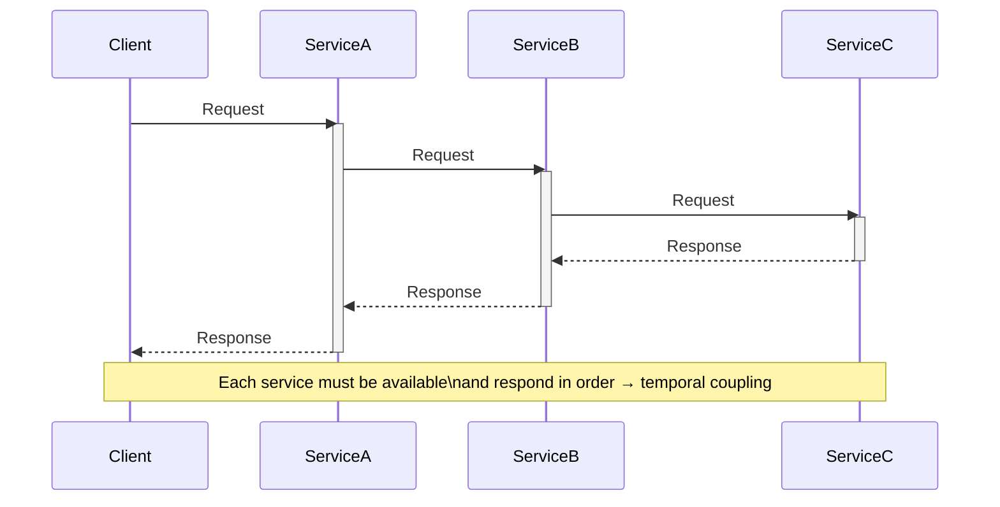
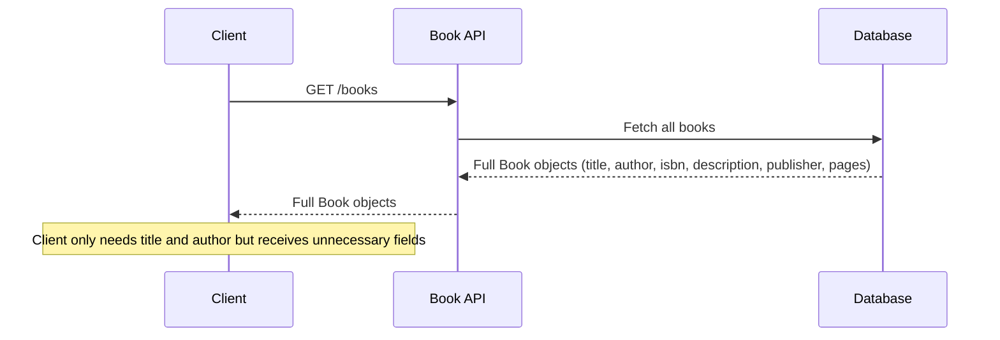
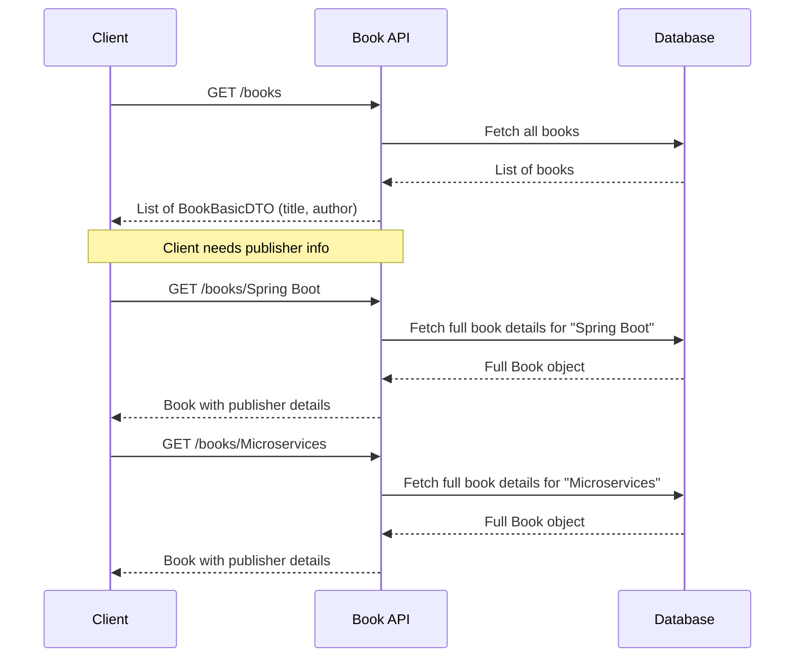
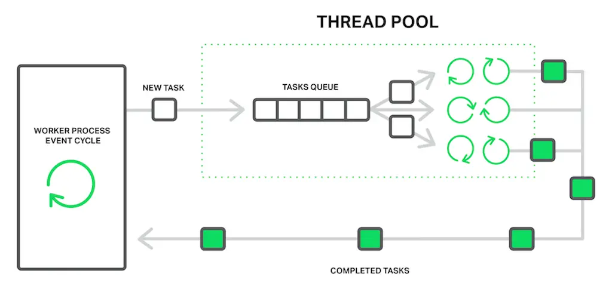

# Synchronous Communications

In synchronous communication, services interact in a *request–response* manner — the caller sends a request and waits for a reply before continuing. This model is simple and intuitive, resembling traditional client-server interactions. Typical implementations include **REST**, **GraphQL**, **gRPC**, **Avro**, each offering different trade-offs in flexibility, performance, and data format (best for edge or cloud).

---

## Definitions and Known Issues

**Spatial coupling** refers to the degree of dependency between different components or services in a system at a given point in time. A high degree of spatial coupling means that components are tightly connected, requiring direct knowledge of each other’s existence, interfaces, or locations. This can lead to reduced flexibility and increased maintenance complexity.

```java
public class Payment {
    private double amount;
    private String paymentMethod;
    private boolean isApproved;
}
```

```java
@RestController
public class OrderController {
    
    public Order createOrder(Order order) {
        // Directly calling Payment Service location, port, endpoint (tightly coupled)
        String url = "http://payment-service:8080/api/payments";
        RestClient restClient = RestClient.builder().build();
        Payment payment = restClient.get()
                .uri(url)
                .retrieve()
                // Direct deserialization (tightly coupled)
                .body(new ParameterizedTypeReference<Payment>() {});
        // ...
    }
}
```

**Temporal coupling** occurs when components or services must be available and responsive at the same time to function correctly. This often happens in synchronous communication patterns, where one component must wait for another to process a request before proceeding. In cases where a chain of multiple services need to communicate, **the cumulated latency can significantly degrade performance**. **[unsolvable with synchronous approaches!]**


```mermaid
sequenceDiagram
    participant Client
    participant ServiceA
    participant ServiceB
    participant ServiceC

    Client->>ServiceA: Request
    activate ServiceA
    ServiceA->>ServiceB: Request
    activate ServiceB
    ServiceB->>ServiceC: Request
    activate ServiceC
    ServiceC-->>ServiceB: Response
    deactivate ServiceC
    ServiceB-->>ServiceA: Response
    deactivate ServiceB
    ServiceA-->>Client: Response
    deactivate ServiceA

    Note over Client,ServiceC: Each service must be available\nand respond in order → temporal coupling
```

**API coupling** refers to the degree of dependency between a client and an API. A highly coupled API means that changes in the API can easily break the client, while a loosely coupled API provides more flexibility and resilience to changes.

*Example*: Modifying the `Payment` class:

```java
public class Payment {
    private double amount;
    private String currency;
    private String paymentMethod;
    private boolean isApproved;
}
```

**Over-fetching** occurs when an API returns more data than the client actually needs, leading to wasted bandwidth and increased serialization time. This typically happens in REST APIs with fixed response structures, where a client cannot specify exactly which fields it requires.

*Scenario*: A client wants only the title and author of a book, but the API returns the entire book object, including unnecessary fields like ISBN, description, publisher, etc.

```java
public class Book {
    private String title;
    private String author;
    private String isbn;
    private String description;
    private String publisher;
    private int pages;
    
    // ...
}
```

```java
@RestController
@RequestMapping("/books")
public class BookController {

    @GetMapping
    public Iterable<Book> findAll() {
        return List.of(
            new Book("Spring Boot", "John Doe", "123456789", "Comprehensive guide", "TechPub", 500),
            new Book("Microservices", "Jane Smith", "987654321", "Detailed explanation", "CloudPub", 300)
        );
    }
}
```


```mermaid
sequenceDiagram
    participant Client
    participant API as Book API
    participant DB as Database

    Client->>API: GET /books
    API->>DB: Fetch all books
    DB-->>API: Full Book objects (title, author, isbn, description, publisher, pages)
    API-->>Client: Full Book objects

    Note over Client: Client only needs title and author but receives unnecessary fields
```

**Under-fetching (aka chattiness)** occurs when a client requests data from an API but does not receive all the necessary information in a single response. As a result, the client must make additional requests to retrieve the missing data, leading to inefficiencies, increased latency and costs.

*Scenario*: The endpoint `/books` returns a simplified model for books. If the client also needs the publisher, it must make additional requests to fetch publisher details such as: `GET /books/{title}`

```java
public class BookBasicDTO {
    private String title;
    private String author;
}
```

```java
@RestController
@RequestMapping("/books")
public class BookController {

    @GetMapping
    public Iterable<BookBasicDTO> findAll() {
        List<Book> books = List.of(
                new Book("Spring Boot", "John Doe", "123456789", "Comprehensive guide", "TechPub", 500),
                new Book("Microservices", "Jane Smith", "987654321", "Detailed explanation", "CloudPub", 300)
        );
        
        // Returns only title and author
        return books.stream()
                .map(book -> new BookBasicDTO(book.getTitle(), book.getAuthor()))
                .toList();
    }
}
```


```mermaid
sequenceDiagram
    participant Client
    participant API as Book API
    participant DB as Database

    Client->>API: GET /books
    API->>DB: Fetch all books
    DB-->>API: List of books
    API-->>Client: List of BookBasicDTO (title, author)

    Note over Client,API: Client needs publisher info

    Client->>API: GET /books/Spring Boot
    API->>DB: Fetch full book details for "Spring Boot"
    DB-->>API: Full Book object
    API-->>Client: Book with publisher details

    Client->>API: GET /books/Microservices
    API->>DB: Fetch full book details for "Microservices"
    DB-->>API: Full Book object
    API-->>Client: Book with publisher details
```

**Thread pool exhaustion (on client side)**: Clients waiting for a response from the server consume system resources (threads, memory), which can be problematic in high-throughput environments. **[unsolvable with synchronous approaches!]**

*Scenario*: A client queries the endpoint `/books` 100 times every second. Each request takes on average 1 second to complete. At any moment, the **client** has approximately 100 threads in a waiting state. Given that each thread requires 2MB of RAM, what happens if the books service stops responding for 10 seconds? The client will need ~2GB of RAM just to manage waiting threads.



---

## REST (JSON over HTTP) Alternatives

**Limitations of REST**:

| Characteristic                  | REST |
| ------------------------------- | ---- |
| **Serialization**               | Y    |
| **Temporal Coupling**           | Y    |
| **API Coupling**                | Y    |
| **Over-fetching**               | Y    |
| **Under-fetching (chattiness)** | Y    |
| **Thread Pool Exhaustion**      | Y    |

---

### gRPC (Protobuf over gRPC) / Avro

* **Serialization**: Compact binary serialization
* **API Coupling**: Support backward/forward compatibility.
* **Over-fetching**: Efficient binary serialization reduces unnecessary data.
* **Under-fetching (chattiness)**: HTTP/2 multiplexing minimizes multiple round trips.

| Characteristic                  | REST | gRPC    |
| ------------------------------- | ---- | ------- |
| **Serialization**               | Y    | Reduced |
| **Temporal Coupling**           | Y    | Y       |
| **API Coupling**                | Y    | Reduced |
| **Over-fetching**               | Y    | Reduced |
| **Under-fetching (chattiness)** | Y    | Reduced |
| **Thread Pool Exhaustion**      | Y    | Y       |

---

## GraphQL

* **Serialization**: JSON responses include only the fields requested by the client.
* **API Coupling**: Schema evolution supports backward and forward compatibility.
* **Over-fetching**: Clients fetch exactly the data they need, avoiding unnecessary fields.
* **Under-fetching (chattiness)**: Nested queries allow fetching multiple related resources in a single request.


| Characteristic                  | REST | GraphQL |
| ------------------------------- | ---- | ------- |
| **Serialization**               | Y    | Reduced |
| **Temporal Coupling**           | Y    | Y       |
| **API Coupling**                | Y    | Reduced |
| **Over-fetching**               | Y    | Reduced |
| **Under-fetching (chattiness)** | Y    | Reduced |
| **Thread Pool Exhaustion**      | Y    | Y       |

---

### Protocols in the Edge-Cloud Continuum

* **REST (JSON/HTTP)**: simple, widely supported, cloud-friendly; higher latency limits edge suitability
* **GraphQL**: flexible queries, reduces over/under-fetching; JSON parsing may add latency at edge
* **gRPC (Protobuf)**: low-latency, binary, streaming; great for IoT, edge, real-time pipelines
* **Avro**: schema-based, compact binary; excellent for streaming, edge-cloud messaging, schema evolution

---

## Resources

