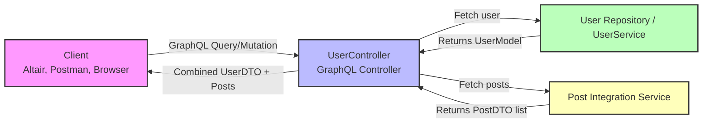

# GraphQL

GraphQL is a query language for APIs (Application Programming Interfaces), developed by Meta.

Unlike traditional REST APIs, where the client has to make multiple requests to obtain all the information it needs, GraphQL allows the client to specify exactly what data it wants to obtain and from where, in a single request.

In addition, GraphQL provides a strong typing system, which allows developers to clearly define the data structure and validate queries at compile time. This leads to better automatic API documentation and greater robustness in client and server code.

### Queries & Mutations
 Both queries and mutations are defined in the GraphQL schema and can be executed by clients to interact with the server.

- **Query**: Used to retrieve data from the server.
- **Mutation**: Used to modify or create data on the server. 

```graphql
query {
  allUsers {
    userUUID
    nickname
    birthDate
    posts {
      timestamp
      content
    }
  }
}
```

```graphql
query {
  userByUUID(userUUID: "b1f4748a-f3cd-4fc3-be58-38316afe1574") {
    userUUID
    nickname
    birthDate
    posts {
      timestamp
      content
    }
  }
}
```

```graphql
mutation {
  addUser(input: {
    userUUID: "new-uuid"
    nickname: "nickname123"
    birthDate: "2000-01-01"
  }) {
    userUUID
    nickname
    birthDate
    posts {
      timestamp
      content
    }
  }
}
```


### Aliases
In GraphQL, aliases are used to request the same field or fields multiple times within a single query, but with different names for each occurrence.
This is particularly useful when you want to retrieve similar data from a GraphQL server but need to differentiate between them in the response.

```
query GetUsers {
  alias0: userByUUID(userUUID: "171f5df0-b213-4a40-8ae6-fe82239ab660") {
    userUUID
    nickname
    birthDate
    posts {
      timestamp
      content
    }
  }

  alias1: userByUUID(userUUID: "b1f4748a-f3cd-4fc3-be58-38316afe1574") {
    userUUID
    nickname
    birthDate
    posts {
      timestamp
      content
    }
  }
}
```

### Fragments
Fragments in GraphQL are like reusable units of fields. They allow you to define a set of fields that you can include in multiple queries, mutations, or other fragments.

```graphql
query GetUsers {
  alias0: userByUUID(userUUID: "171f5df0-b213-4a40-8ae6-fe82239ab660") {
    ...UserFields
    posts {
      ...PostFields
    }
  }

  alias1: userByUUID(userUUID: "b1f4748a-f3cd-4fc3-be58-38316afe1574") {
    ...UserFields
    posts {
      ...PostFields
    }
  }
}

# -----------------------
# Fragments
# -----------------------
fragment UserFields on User {
  userUUID
  nickname
  birthDate
}

fragment PostFields on Post {
  timestamp
  content
}
```

### Operations
In GraphQL, you can send multiple operations (queries, mutations, or subscriptions) in a single request separated by curly braces {}. This is particularly useful when you want to fetch or mutate multiple sets of data in a single round trip to the server.

```graphql
# First operation
query PleaseGetHannibal {
  userByUUID(userUUID: "171f5df0-b213-4a40-8ae6-fe82239ab660") {
    userUUID
    nickname
    birthDate
    posts {
      timestamp
      content
    }
  }
}

# Second operation
query PleaseGetShyGuy {
  userByUUID(userUUID: "b1f4748a-f3cd-4fc3-be58-38316afe1574") {
    userUUID
    nickname
    birthDate
    posts {
      timestamp
      content
    }
  }
}
```

### Variables

Variables in GraphQL allow you to parameterize your queries or mutations, making them dynamic and reusable.
Instead of hardcoding values directly into your GraphQL operations, you can use variables to pass values from the client to the server at runtime.

```graphql
query GetUser($userUUID: String!) {
  userByUUID(userUUID: $userUUID) {
    userUUID
    nickname
    birthDate
    posts {
      timestamp
      content
    }
  }
}
```

You can also provide a **default value** for the variable:

```graphql
query GetUser($userUUID: String = "171f5df0-b213-4a40-8ae6-fe82239ab660") {
  userByUUID(userUUID: $userUUID) {
    userUUID
    nickname
    birthDate
    posts {
      timestamp
      content
    }
  }
}
```

Pass the variable values when executing the operation

```json
{
  "userUUID": "b1f4748a-f3cd-4fc3-be58-38316afe1574"
}
```

The server will replace `$userUUID` with the provided value at runtime.

---

### Directives

Directives in GraphQL are used to **conditionally include or skip fields** in a query based on runtime conditions.
They allow you to customize the response without changing the query itself.

```graphql
query GetUser($includeBirthDate: Boolean!) {
  userByUUID(userUUID: "171f5df0-b213-4a40-8ae6-fe82239ab660") {
    userUUID
    nickname
    birthDate @include(if: $includeBirthDate)
    posts {
      timestamp
      content
    }
  }
}
```

* The `@include(if: $includeBirthDate)` directive will include the `birthDate` field **only if `$includeBirthDate` is `true`**.
* If `$includeBirthDate` is `false`, `birthDate` will not appear in the response.

```json
{
  "includeBirthDate": true
}
```

---

## GraphQL in Spring Boot

GraphQL allows clients to request exactly the data they need in a single request. In Spring Boot, you define a **schema**, provide a **controller** to handle queries and mutations, and use dependencies to enable GraphQL support.

---

### 1. Dependencies

```xml
<dependency>
    <groupId>org.springframework.boot</groupId>
    <artifactId>spring-boot-starter-graphql</artifactId>
</dependency>

<dependency>
    <groupId>org.springframework.boot</groupId>
    <artifactId>spring-boot-starter-web</artifactId>
</dependency>
```

---

### 2. Schema

The **GraphQL schema** defines your API:

* **Object Types**: Represent entities (e.g., `User`, `Post`).
* **Fields**: Properties of each object (can be scalar or another object).
* **Input Types**: Structure for mutation inputs (`UserDTOInput`).
* **Queries**: Read operations (like GET in REST).
* **Mutations**: Write operations (like POST/PUT/DELETE in REST).

**Example: User/Post Schema**

```graphql
type User {
  userUUID: String!
  nickname: String!
  birthDate: String
  posts: [Post!]!
}

type Post {
  userUUID: String!
  timestamp: String
  content: String!
}

input UserDTOInput {
  userUUID: String!
  nickname: String!
  birthDate: String
}

type Query {
  allUsers: [User!]!
  userByUUID(userUUID: String!): User
}

type Mutation {
  addUser(input: UserDTOInput!): User!
  removeUser(userUUID: String!): Boolean!
}
```

* Queries: `allUsers`, `userByUUID`
* Mutations: `addUser`, `removeUser`

---

### 3. Writing a GraphQL Controller

* `@QueryMapping` → handles queries
* `@MutationMapping` → handles mutations
* `@Argument` → maps method parameters to GraphQL arguments



```java
@RestController
@RequestMapping("/users")
public class UserController {

    private final UserRepository userRepository;
    private final PostIntegration postIntegration;

    public UserController(UserRepository userRepository, PostIntegration postIntegration) {
        this.userRepository = userRepository;
        this.postIntegration = postIntegration;
    }

    // -------------------------------
    // Queries
    // -------------------------------
    @QueryMapping
    public List<UserDTO> allUsers() {
        return userRepository.findAll().stream()
                .map(this::mapToDTO)
                .collect(Collectors.toList());
    }

    @QueryMapping
    public UserDTO userByUUID(@Argument String userUUID) {
        UserModel user = userRepository.findByUserUUID(userUUID)
                .orElseThrow(() -> new ResponseStatusException(HttpStatus.NOT_FOUND));

        UserDTO dto = mapToDTO(user);
        // Fetch posts from Post service
        Iterable<PostDTO> posts = postIntegration.findByUserUUID(userUUID);
        dto.setPosts(StreamSupport.stream(posts.spliterator(), false)
                    .collect(Collectors.toSet()));

        return dto;
    }

    // -------------------------------
    // Mutations
    // -------------------------------
    @MutationMapping
    public UserDTO addUser(@Argument UserDTOInput input) {
        if (userRepository.findByUserUUID(input.getUserUUID()).isPresent()) {
            throw new ResponseStatusException(HttpStatus.CONFLICT, "User already exists");
        }

        UserModel newUser = mapToModel(input);
        return mapToDTO(userRepository.save(newUser));
    }

    @MutationMapping
    public Boolean removeUser(@Argument String userUUID) {
        Optional<UserModel> user = userRepository.findByUserUUID(userUUID);
        if (user.isEmpty()) return false;

        userRepository.delete(user.get());
        return true;
    }

    // -------------------------------
    // Mapping helpers
    // -------------------------------
    private UserDTO mapToDTO(UserModel user) {
        UserDTO dto = new UserDTO(user.getUserUUID(), user.getNickname(), user.getBirthDate());
        dto.setPosts(new HashSet<>());
        return dto;
    }

    private UserModel mapToModel(UserDTOInput dto) {
        UserModel user = new UserModel();
        user.setUserUUID(dto.getUserUUID());
        user.setNickname(dto.getNickname());
        user.setBirthDate(dto.getBirthDate());
        return user;
    }
}
```
