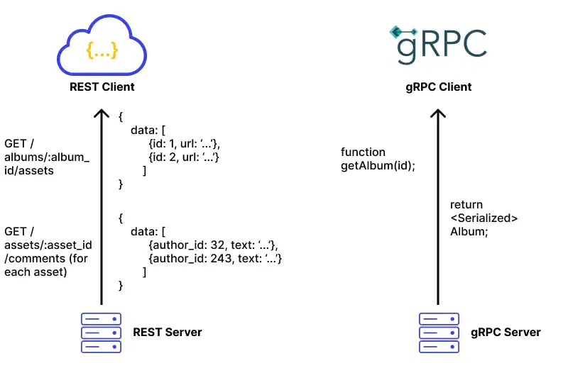
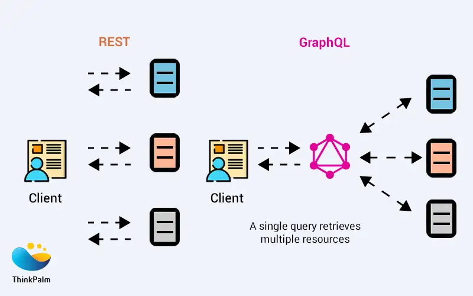

# Synchronous communications

## REST (Representational State Transfer)

**Key Features:**

- **HTTP-based Communication**: REST is built on top of HTTP, which means it leverages standard HTTP methods such as GET, POST, PUT, DELETE to interact with resources identified by URLs.
- **Stateless**: Each REST request from a client to a server must contain all the necessary information to understand and process the request. No client state is stored on the server between requests.
- **Resource-Oriented**: REST focuses on resources, which are represented using URLs, and these resources can be manipulated using standard HTTP methods.
- **Human-Readable Data Formats**: REST typically uses **JSON** or **XML** for data serialization, making it easier for developers to read and debug.

**Limitations of REST**:

- **Over-fetching and Under-fetching**: REST often leads to over-fetching (getting more data than needed) or under-fetching (inadequate data that requires multiple requests), resulting in inefficiencies, especially in complex applications.
- **Chattiness**: In a microservice architecture, fetching related data often requires multiple REST calls to different services, which can increase latency due to network overhead and multiple round trips.
- **Performance and Latency**: REST's reliance on HTTP/1.1, combined with text-based data formats like JSON, results in larger payloads and slower parsing, which can degrade performance in high-throughput systems.
- **Tight Coupling**: REST APIs can lead to a tight coupling between services and clients, as each API change may require clients to adapt. Versioning is required to manage this, which adds complexity.
- **Limited Real-time Support**: REST is inherently request-response based, lacking built-in support for real-time communication or streaming data.

## gRPC (Google Remote Procedure Call)

**Key Features:**

- **Efficient Binary Protocol (Protobuf)**: gRPC uses **Protocol Buffers (Protobuf)** for data serialization, which is more compact and faster than JSON or XML, significantly reducing payload sizes and improving performance.
- **HTTP/2-based Communication**: gRPC leverages **HTTP/2**, enabling features like multiplexing, where multiple requests can be handled concurrently over a single connection, reducing latency and improving throughput.
- **Strongly Typed Contracts**: gRPC enforces strict typing through Protobuf definitions, which ensures that APIs are more robust and easier to maintain with backward/forward compatibility.
- **Bidirectional Streaming**: gRPC supports **client-side, server-side, and bidirectional streaming**, making it highly effective for real-time data transfer and asynchronous communication between services.
- **Asynchronous and Non-blocking**: While gRPC operates synchronously by default, it also supports asynchronous, non-blocking calls, which improve system throughput in microservice architectures.

**How gRPC Solves REST Limitations**:

- **Over-fetching and Chattiness**: gRPC, by design, avoids multiple round trips by enabling efficient communication through its binary format and multiplexing over HTTP/2. It reduces the network overhead common in REST-based systems.
- **Performance**: gRPC’s binary serialization (Protobuf) and the use of HTTP/2 reduce the latency and overhead associated with REST’s text-based protocols and HTTP/1.1. This makes it ideal for high-throughput and low-latency applications.
- **Tight Coupling**: gRPC’s use of Protobuf ensures that API contracts are strictly enforced, reducing the likelihood of breaking changes. With its backward and forward compatibility, API evolution is smoother compared to REST.

**Limitations of gRPC**:

- **Complexity**: gRPC’s use of Protobuf introduces more complexity in terms of schema definitions and code generation. It requires a learning curve for teams unfamiliar with RPC models and binary serialization.
- **Browser Support**: While gRPC is excellent for backend and service-to-service communication, it is not well-supported in browser environments, limiting its use for frontend applications. Workarounds like gRPC-Web are available, but they are less widely adopted.
- **Strict Typing**: While strict typing ensures robustness, it also introduces rigidity, as changes to the API require careful management of Protobuf contracts.

## GraphQL

**Key Features:**

- **Flexible Queries**: One of the primary features of GraphQL is that it allows clients to request exactly the data they need, avoiding the over-fetching and under-fetching problems commonly encountered in REST APIs.
- **Single Endpoint**: Unlike REST, where different resources are exposed via multiple endpoints, GraphQL operates through a single endpoint for all queries, mutations, and subscriptions, simplifying the API structure.
- **Schema-based**: GraphQL operates on a strong schema, which defines the types and structure of the API. This schema allows for introspection, enabling automatic API documentation and tooling.
- **Efficient Data Fetching**: With GraphQL, a single query can retrieve related data from multiple services or entities, reducing the need for multiple network requests and minimizing chattiness.
- **Subscriptions for Real-time Communication**: GraphQL supports real-time communication through **subscriptions** (often over WebSockets), enabling the client to receive live updates without polling.

**How GraphQL Solves REST Limitations**:

- **Over-fetching and Under-fetching**: GraphQL allows clients to request only the fields they need, addressing REST’s issue of returning unnecessary data (over-fetching) or making multiple requests to retrieve the needed data (under-fetching).
- **Chattiness**: GraphQL reduces the chattiness problem by allowing clients to make a single query that aggregates data from multiple microservices or sources, resulting in fewer round trips compared to REST.
- **API Evolution**: Unlike REST, which often requires versioning to handle changes, GraphQL’s flexible schema allows for non-breaking changes, such as adding new fields without impacting existing clients.

**Limitations of GraphQL**:

- **Complexity in Query Optimization**: While GraphQL gives clients flexibility, it also puts more responsibility on the server to optimize the queries. If not properly managed, complex or deeply nested queries can lead to performance bottlenecks on the server side.
- **Caching Challenges**: Caching in GraphQL is more complex than REST, as queries can be dynamic and granular. REST APIs can leverage HTTP-based caching more easily (based on endpoints), while GraphQL requires more sophisticated caching strategies.
- **Overhead in Complex Schemas**: For simple data models, GraphQL may introduce unnecessary complexity due to its schema-driven approach. The overhead of managing schemas and resolvers might not justify the benefits in all use cases.

## Summary

Here’s a table summarizing the key differences between **REST**, **gRPC**, and **GraphQL**:

| **Feature**                        | **REST**                                      | **gRPC**                                     | **GraphQL**                                 |
|-------------------------------------|-----------------------------------------------|----------------------------------------------|---------------------------------------------|
| **Data Format**                     | JSON, XML                                     | Binary (Protocol Buffers - Protobuf)         | JSON                                        |
| **Transport Protocol**              | HTTP/1.1                                      | HTTP/2                                       | HTTP/1.1                                    |
| **Communication Style**             | Synchronous, request-response                 | Synchronous (with async support), streaming  | Synchronous, but supports subscriptions     |
| **Request-Response Type**           | Fixed response structures                     | RPC (Remote Procedure Call), predefined methods | Customizable queries by client             |
| **API Design**                      | Resource-oriented (uses URLs)                 | Function/method-oriented (RPC-style)         | Query-based (single endpoint)               |
| **Streaming Support**               | Limited (client-server)                       | Full support for client/server/bidirectional streaming | Subscriptions for real-time updates     |
| **Over-fetching/Under-fetching**    | Common, rigid response structures             | N/A                                          | Flexible: clients request specific data     |
| **Performance**                     | Moderate (JSON/XML parsing)                   | High (binary Protobuf, low latency)          | Variable, based on query complexity         |
| **Error Handling**                  | HTTP status codes                             | gRPC status codes (more standardized)        | Customizable error responses               |
| **Versioning**                      | Often requires explicit versioning            | Strongly typed, Protobuf ensures backward compatibility | Typically not required due to flexible schema |
| **Browser Support**                 | Native support                                | Limited (requires gRPC-Web for browsers)     | Full browser support                        |
| **Ease of Use**                     | Widely adopted, simple                        | Complex (requires Protobuf schema management) | More complex query structure for clients    |
| **Real-time Communication**         | Limited (polling, WebSockets via workaround)   | Supported (streaming with HTTP/2)            | Supported (via subscriptions)               |
| **Use Case**                        | General web APIs, mobile applications         | Low-latency, high-performance internal service-to-service communication | Client-facing APIs with flexible data needs |
| **Caching Support**                 | Native HTTP caching                           | No native HTTP caching                       | More complex caching, dynamic queries       |
| **Security**                        | Standard HTTP security (OAuth, TLS)           | Supports TLS, but more complex for authentication | Standard HTTP security                      |

- **REST** is best for simpler, resource-based APIs where standard HTTP methods are enough, but it suffers from performance issues and over-fetching/under-fetching.
- **gRPC** excels in high-performance, low-latency environments and streaming, ideal for internal microservice communication, though it's more complex and has limited browser support.
- **GraphQL** is more flexible, client-driven, and suitable for client-facing APIs needing efficient data retrieval, but can have complexity in query optimization and caching.

## Common Limitations of Synchronous Communications (REST, gRPC, GraphQL)

Despite the advantages of each protocol, synchronous communication approaches share several limitations:

1. **Tight Coupling**: Synchronous communication often leads to tight coupling between services. If one service is unavailable or slow to respond, it can impact the entire system, leading to cascading failures.

2. **Scalability Challenges**: Synchronous requests can create bottlenecks under heavy load. Each client waiting for a response from the server consumes system resources (threads, memory), which can be problematic in high-concurrency environments.

3. **Latency Sensitivity**: The time it takes to complete a request in synchronous communication is directly tied to the time it takes for the server to process and respond. In cases where multiple services need to communicate, the cumulative latency can significantly degrade performance.

While **REST**, **gRPC**, and **GraphQL** offer distinct advantages in specific contexts, they all have limitations due to their synchronous nature. gRPC and GraphQL address many of REST’s inefficiencies, such as performance bottlenecks, over-fetching/under-fetching, and API evolution issues. However, the inherent challenges of synchronous communication often necessitate a shift toward **asynchronous, broker-based communication** (e.g., RabbitMQ or Kafka).