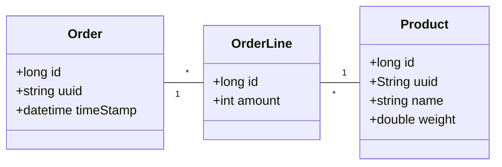
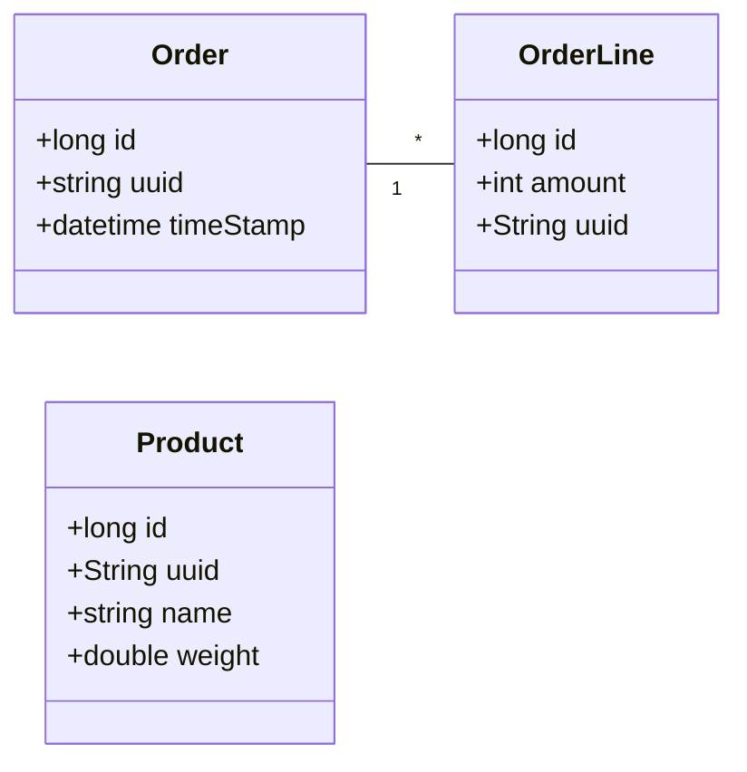

# Communication styles (RESTClient)

## Transition to Microservices: Data Model Changes  

In a monolithic architecture, all data resides in a **single database** with direct relationships (e.g., `JOIN` operations). In microservices, **each service has its own database**, leading to **data splitting**.

**Monolith:** `Order`, `OrderLine`, and `Product` in the same DB.



**Microservices:**
   - **Order Service:** Manages `Order` and `OrderLine` (without product details).
   - **Product Service:** Manages `Product` data separately.



Since data is no longer in the same database, **services must communicate!**

## Building RESTful Services

We can use an existing REST service for managing products (tools/code/product-service-h2):

The model class represents the data structure of the resource. In this case, a `Product`:

```java
@AllArgsConstructor
@NoArgsConstructor
@RequiredArgsConstructor
@Data
@Entity
public class Product {
   @Id
   @GeneratedValue(strategy = GenerationType.IDENTITY)
   private Long id;
   @NonNull @EqualsAndHashCode.Include private String uuid;
   @NonNull private String name;
   @NonNull private Double weight;
}
```

The REST controller handles incoming HTTP requests and responds with the appropriate data:

```java
@RestController
@RequestMapping("/products")
public class ProductController {
   ProductService productService;

   public ProductController(ProductService productService) {
      this.productService = productService;
   }

   @GetMapping("/{uuid}")
   public Product findByUuid(@PathVariable String uuid) {
      return productService.findByUuid(uuid).orElseThrow(() -> new ResponseStatusException(HttpStatus.NOT_FOUND));
   }

   @GetMapping
   public Iterable<Product> findAll() {
      return productService.findAll();
   }

   @PostMapping
   public Product create(@RequestBody Product product) {
      return productService.save(product);
   }

   @PutMapping("/{uuid}")
   public Product update(@PathVariable String uuid, @RequestBody Product product) {
      Optional<Product> optionalProject = productService.findByUuid(uuid);
      optionalProject.orElseThrow(() -> new ResponseStatusException(HttpStatus.NOT_FOUND));
      product.setId(optionalProject.get().getId());
      return productService.save(product);
   }

   @DeleteMapping("/{uuid}")
   public void delete(@PathVariable String uuid) {
      Optional<Product> optionalProject = productService.findByUuid(uuid);
      optionalProject.orElseThrow(() -> new ResponseStatusException(HttpStatus.NOT_FOUND));
      productService.delete(optionalProject.get());
   }
}
```

## Consuming RESTful Services (RestClient)

In a microservices architecture, it is often necessary for services to consume APIs provided by other services. Spring Boot provides a simple way to achieve this through the `RestClient` class, which allows for HTTP requests to be made and handled effectively.

To consume a RESTful service, follow these steps (code/sync-request-response):

1. **Use RestClient**:
   Use `RestClient` to make HTTP requests to other services. Here's an example of a service that consumes a REST API to fetch product data using a dedicated bean named _ProductIntegration_:

```java
@RestController
@RequestMapping("/orders")
public class OrderController {
   OrderRepository orderRepository;
   ProductIntegration productIntegration;

   public OrderController(OrderRepository orderRepository, ProductIntegration productIntegration) {
      this.orderRepository = orderRepository;
      this.productIntegration = productIntegration;
   }

   @GetMapping(value = "/local/{id}")
   public Order findById(@PathVariable Long id) {
      return orderRepository.findById(id).orElseThrow(() -> new RuntimeException("Order not found"));
   }

   @GetMapping(value = "/remote/{id}")
   public OrderDto findByIdWithRemoteCall(@PathVariable Long id) {
      Optional<Order> optionalOrder = orderRepository.findById(id);
      optionalOrder.orElseThrow(() -> new RuntimeException("Order not found"));

      Order foundOrder = optionalOrder.get();
      OrderDto orderDto = new OrderDto(
              foundOrder.getUuid(),
              foundOrder.getTimestamp(),
              new HashSet<>()
      );

      for (OrderLine orderLine : foundOrder.getOrderLines()) {
         ProductDto product = productIntegration.findbyUuid(orderLine.getUuid());
         orderDto.getOrderLineDtos().add(
                 new OrderLineDto(
                         product.getUuid(),
                         product.getName(),
                         product.getWeight(),
                         orderLine.getAmount()));
      }
      return orderDto;
   }
}
```

```java
@Component
public class ProductIntegration {
   String productServiceHost;
   int productServicePort;

   public ProductIntegration(
           @Value("${app.product-service.host}") String productServiceHost,
           @Value("${app.product-service.port}") int productServicePort) {
      this.productServiceHost = productServiceHost;
      this.productServicePort = productServicePort;
   }

   public List<ProductDto> findAll() {
      String url = "http://" + productServiceHost + ":" + productServicePort + "/products";
      RestClient restClient = RestClient.builder().build();
      return restClient.get()
              .uri(url)
              .retrieve()
              .body(new ParameterizedTypeReference<>() {});
   }

   public ProductDto findbyUuid(String uuid) {
      String url = "http://" + productServiceHost + ":" + productServicePort + "/products" + "/" + uuid;
      RestClient restClient = RestClient.builder().build();
      return restClient.get()
              .uri(url)
              .retrieve()
              .body(new ParameterizedTypeReference<>() {});
   }
}
```

When consuming external APIs, it is important to handle errors properly. You can use try-catch blocks to manage exceptions that may occur during API calls.

```
try {
    User user = restClient.getForObject(url, User.class);
} catch (RestClientException e) {
    // Handle the error, e.g., log it or throw a custom exception
}
```


## Trying out the messaging system

```yaml
services:
   product-service:
      image: product-service-h2
      environment:
         - SPRING_PROFILES_ACTIVE=docker
      deploy:
         resources:
            limits:
               memory: 512m

   order-service:
      build: order-service
      image: order-service
      ports:
         - 8080:8080
      environment:
         - SPRING_PROFILES_ACTIVE=docker
      deploy:
         resources:
            limits:
               memory: 512m
```

```bash
cd order-service
mvn clean package -Dmaven.test.skip=true
cd ..
docker compose build
docker compose up --detach
```

The following command shows the locally stored data about orders.

```bash
curl -X GET http://localhost:8080/orders/local/1 | jq
```

```json
{
   "id": 2,
   "uuid": "45750c00-c7cf-4987-ab94-de5920f3a7ca",
   "timestamp": "2025-03-10T22:04:59.287086",
   "orderLines": [
      {
         "id": 3,
         "uuid": "b1f4748a-f3cd-4fc3-be58-38316afe1574",
         "amount": 2
      },
      {
         "id": 2,
         "uuid": "f89b6577-3705-414f-8b01-41c091abb5e0",
         "amount": 2
      }
   ]
}
```

The following command shows the locally stored data about orders, augmented with product data.

```bash
curl -X GET http://localhost:8080/orders/remote/1 | jq
```

```json
{
   "uuid": "45750c00-c7cf-4987-ab94-de5920f3a7ca",
   "timestamp": "2025-03-10T22:04:59.287086",
   "orderLineDtos": [
      {
         "uuid": "b1f4748a-f3cd-4fc3-be58-38316afe1574",
         "name": "Shirt",
         "weight": 0.2,
         "amount": 2
      },
      {
         "uuid": "f89b6577-3705-414f-8b01-41c091abb5e0",
         "name": "Bike",
         "weight": 5.5,
         "amount": 2
      }
   ]
}
```

## DTOs
A **DTO (Data Transfer Object)** is a design pattern used in software engineering to transfer data between different parts of an application, often across network boundaries or between layers within the same application. The main purpose of a DTO is to encapsulate data and reduce the amount of information sent over the network by only containing necessary fields, and it’s commonly used in distributed systems and applications that follow the layered architecture (such as MVC or service-oriented architectures).

### Key Characteristics of DTOs
- **Encapsulation**: DTOs wrap data in a structure that hides complex entities or potentially sensitive information, only exposing fields relevant for the specific data transfer operation.
- **No Business Logic**: DTOs typically don’t contain business logic, as they serve only as containers for data. Their purpose is purely data transfer, so methods like getters and setters are usually the only ones included.
- **Serialization**: Since DTOs are often transferred over a network or between application boundaries, they are usually designed to be serializable (e.g., JSON or XML).

### When to Use DTOs
- **APIs and Microservices**: DTOs are commonly used in REST APIs and microservices. They provide a way to define the format and content of the data being exchanged without exposing internal models or database entities.
- **Reducing Data Load**: By selecting only relevant fields, DTOs can reduce the amount of data transmitted, especially useful in mobile applications or low-bandwidth networks.
- **Decoupling Layers**: In a layered architecture (e.g., separating data access, business logic, and presentation layers), DTOs help maintain separation by acting as an intermediary between the business and presentation layers.

Automatic mapping between entities and DTOs is a common requirement, as it simplifies the process of converting data between different layers of an application. In both Java and Python, libraries are available to facilitate this mapping, reducing boilerplate code and improving code readability.

### Entity-to-DTO Mapping
Several libraries provide automatic mapping capabilities. Here are the most popular ones:

**MapStruct**: (Java) MapStruct is a powerful, compile-time, code-generating library that creates type-safe mappers between Java objects (e.g., entities and DTOs). It generates code at compile-time, so there's no runtime overhead, making it fast and efficient.
   
**ModelMapper**: (Java) ModelMapper is a more flexible, runtime-based library that provides a convention-based approach to object mapping. It can automatically map properties with similar names and is highly customizable.

**Marshmallow**: (Python) Marshmallow is a popular library for object serialization/deserialization in Python. It is typically used to convert objects to and from JSON, but it can also be used for DTO mappings.

**Pydantic**: (Python) Pydantic is primarily used for data validation and settings management, but it also serves as a great DTO library. It provides data validation and conversion between Python objects and JSON-compatible formats.

## Resources
* https://www.baeldung.com/spring-boot-restclient