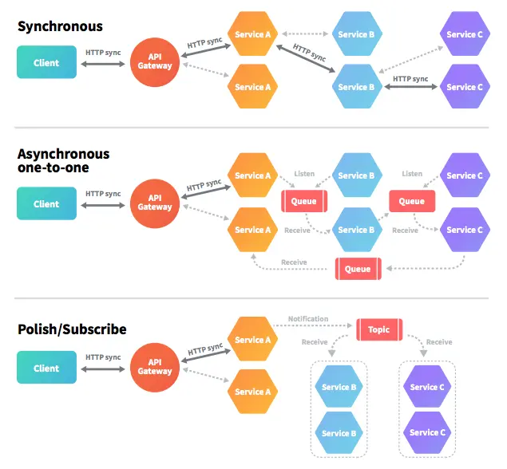

# Asynchronous communications

Asynchronous communication is a key architectural pattern in distributed systems where services need to communicate without blocking each other. Unlike synchronous communication, where one service sends a request and waits for a response, asynchronous communication allows services to continue processing other tasks while awaiting a response.

In an asynchronous communication model, services are decoupled, meaning they do not rely on immediate responses to continue functioning. This improves scalability, fault tolerance, and overall system performance, making it an attractive approach for handling large-scale, high-concurrency workloads.

## Benefits of Asynchronous Communication

1. **Improved Scalability**:
   Asynchronous systems are more scalable because services are not waiting for immediate responses. Instead, they handle tasks independently, allowing more efficient use of resources. Message queues can scale horizontally, distributing load across services.

2. **Increased Resilience and Fault Tolerance**:
   Since services do not rely on the immediate availability of others, the system is more resilient to failures. A message broker can store messages in case a service is down and deliver them when it becomes available again, making the system fault-tolerant.

3. **Decoupled Services**:
   Services in asynchronous architectures are more loosely coupled. The sender does not need to know when or how the recipient processes the message. This decoupling allows easier system updates, as changes in one service do not require changes in others.

4. **Better Resource Utilization**:
   In asynchronous communication, system resources (such as threads and memory) are not blocked waiting for responses. This improves resource utilization, especially in high-throughput environments, enabling the system to handle more requests simultaneously.

## Challenges of Asynchronous Communication

1. **Complexity**:
   Managing asynchronous communication introduces additional complexity in system design. Ensuring that messages are delivered, processed, and acknowledged properly requires careful planning and infrastructure.

2. **Consistency**:
   Eventual consistency is a common model in asynchronous systems, where data updates propagate asynchronously between services. While this improves availability, it can lead to **data consistency** issues since updates may take time to propagate.

3. **Message Ordering**:
   Ensuring messages are processed in the correct order can be a challenge, particularly in distributed systems where messages might arrive out of order. Advanced message brokers provide support for message sequencing, but this adds complexity to the implementation.

4. **Error Handling**:
   Errors in asynchronous communication are often harder to detect and handle than in synchronous systems. When a service fails to process a message, it may not be immediately obvious. Retry mechanisms, dead-letter queues, and monitoring are essential to managing errors effectively.

## When to Use Asynchronous Communication

- **High-Throughput Applications**: Asynchronous communication is ideal for systems that handle large volumes of requests and need to process them efficiently without blocking.

- **Decoupled Systems**: When microservices need to operate independently without waiting for immediate responses, asynchronous communication is essential. It ensures that services are not tightly coupled and can scale independently.

- **Event-Driven Architectures**: In architectures where changes in one service trigger actions in others, asynchronous communication via event streaming or message brokers is the natural choice.

- **Resilient Systems**: Systems that need to be fault-tolerant and continue operating even when some services are down or slow to respond should rely on asynchronous messaging.

## Comparison Between Broker-Based and Brokerless Messaging Systems

In distributed systems, message-passing is a core mechanism for enabling communication between microservices. There are two primary approaches to messaging systems: **broker-based** and **brokerless** (also known as peer-to-peer or direct messaging) systems.

### Broker-Based Messaging Systems

Broker-based messaging systems rely on a **central message broker** to manage the communication between different services. The broker acts as an intermediary, receiving messages from producers and delivering them to consumers. Common broker-based systems include **RabbitMQ**, **Apache Kafka**, and **ActiveMQ**.

* RabbitMQ (https://www.rabbitmq.com)
* Apache Kafka (http://kafka.apache.org)
* ActiveMQ (http://activemq.apache.org)

* AWS SQS (https://aws.amazon.com/sqs/)
* Microsoft Azure Service Bus (https://azure.microsoft.com/en-us/products/service-bus/)
* Google Cloud Pub/Sub (https://cloud.google.com/pubsub)

#### Key Characteristics:
- **Message Broker**: A central server or cluster that mediates the sending and receiving of messages.
- **Producer and Consumer Separation**: Producers send messages to the broker, which then routes or queues them for consumers.
- **Queue and Topic Mechanisms**: Messages can be organized into queues (FIFO) or topics (publish-subscribe).
- **Reliability**: Message brokers often provide mechanisms for reliable delivery, such as **acknowledgments**, **retry logic**, and **persistence** to avoid message loss.

#### Advantages:
1. **Reliability and Durability**: Message brokers store messages and provide delivery guarantees (e.g., at-least-once, exactly-once). Even if a consumer is down, the broker ensures that the message will be delivered when the consumer is available.
2. **Decoupling of Services**: Producers and consumers don’t need to know about each other’s existence. They only interact with the broker, making the system loosely coupled and easier to maintain and scale.
3. **Advanced Features**: Many brokers support sophisticated features like **message routing**, **load balancing**, **priority queues**, and **message persistence**, offering flexibility for complex use cases.
4. **Scalability**: With proper configuration (e.g., Kafka partitions, RabbitMQ clusters), brokers can handle massive amounts of data and scale horizontally to accommodate high-throughput use cases.

#### Disadvantages:
1. **Single Point of Failure**: If not properly configured with replication or failover, the broker can become a single point of failure in the system. In case of broker downtime, message flow can be interrupted.
2. **Latency Overhead**: The broker introduces additional latency since messages must pass through the broker before reaching the consumer, adding extra hops and processing overhead.
3. **Complexity**: Managing a message broker infrastructure (e.g., maintaining clusters, ensuring availability, monitoring throughput) can be operationally complex, especially at large scale.
4. **Bottleneck Potential**: As a centralized component, the broker can become a bottleneck under heavy load or misconfiguration, causing delays or failures in message delivery.

### Brokerless Messaging Systems

Brokerless messaging, also known as **peer-to-peer (P2P)** messaging or direct messaging, eliminates the need for a central broker. Instead, services communicate directly with each other. Popular brokerless systems include **gRPC**, **ZeroMQ**, and **HTTP-based messaging**.

* ZeroMQ (https://zeromq.org/)
* NanoMsg (https://nanomsg.org/)

#### Key Characteristics:
- **Direct Communication**: Services (peers) communicate directly with one another without an intermediary.
- **Peer-to-Peer Model**: Messages are sent from the producer directly to the consumer, typically using protocols like TCP, HTTP, or WebSockets.
- **Lightweight Architecture**: Without a broker, the system has fewer components to manage, which can simplify the architecture.

#### Advantages:
1. **Low Latency**: Messages travel directly between services, reducing the additional overhead introduced by a broker. This leads to faster communication and lower latency.
2. **Simpler Infrastructure**: Without the need for a broker, the system has fewer components to configure and maintain. This can reduce operational complexity and lower resource consumption.
3. **No Single Point of Failure**: Brokerless systems avoid the broker becoming a single point of failure, making the architecture more resilient to certain types of failures.
4. **More Control**: Direct communication gives services full control over how messages are handled, improving flexibility in handling specific scenarios like retries or error handling.

#### Disadvantages:
1. **Tight Coupling**: In a brokerless system, services need to know how to communicate with each other directly. This increases the coupling between services and makes changes harder to manage (e.g., changing a service’s location or API may require updating all services that communicate with it).
2. **No Built-in Reliability**: In brokerless systems, reliability features like message persistence, retries, and delivery guarantees need to be implemented by the developers. This increases complexity, as the system lacks the reliability mechanisms provided by brokers.
3. **Scaling Challenges**: Scaling brokerless systems can be more complex, especially in high-throughput environments. You may need to implement custom load balancing and failover mechanisms to ensure that the system can handle large numbers of connections or messages.
4. **Concurrency Issues**: Handling multiple concurrent connections or ensuring message ordering and delivery can become problematic, requiring careful design and management of the communication logic.

### Comparison Table

| **Aspect**                      | **Broker-Based Messaging**                                              | **Brokerless Messaging**                                   |
|---------------------------------|-------------------------------------------------------------------------|------------------------------------------------------------|
| **Architecture**                | Centralized message broker mediates communication                       | Direct communication between services                      |
| **Message Routing**             | Managed by the broker, with advanced routing options                    | Custom implementation required by services                 |
| **Latency**                     | Higher, due to additional hops via the broker                           | Lower, direct communication between services               |
| **Reliability**                 | High (with features like persistence, retries, and delivery guarantees) | Low by default; must be handled manually                   |
| **Scalability**                 | Easily scalable with broker clusters and partitioning                   | Requires custom handling of scaling (load balancing)       |
| **Complexity**                  | Broker adds complexity to the infrastructure                            | Simpler infrastructure, but more complex logic in services |
| **Failure Handling**            | Brokers often provide failover and recovery mechanisms                  | More prone to failures if not carefully managed            |
| **Service Decoupling**          | Services are loosely coupled via the broker                             | Services are more tightly coupled                          |
| **Operational Overhead**        | High: managing broker infrastructure                                    | Lower: fewer components, but custom features required      |
| **Message Delivery Guarantees** | Strong (at-least-once, exactly-once delivery)                           | Weak: requires custom implementation                       |

