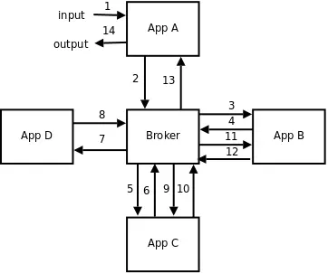
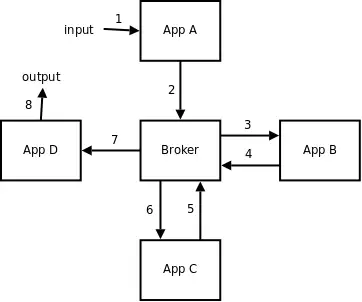
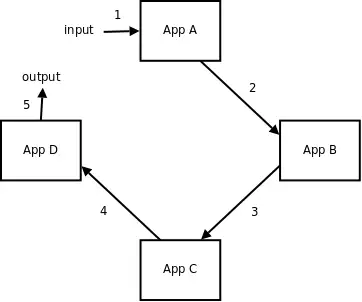
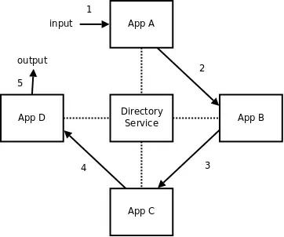
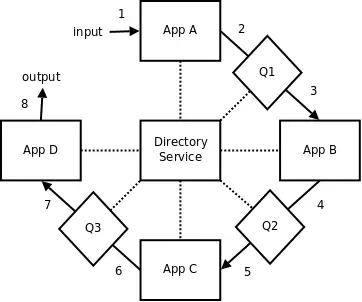
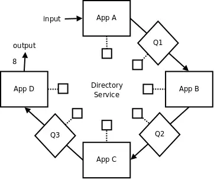

# Asynchronous communications

Asynchronous communication is a key architectural pattern in distributed systems. Unlike synchronous communication, where one service sends a request and waits for a response, **asynchronous communication allows services to continue processing other tasks while awaiting a response**. 


## Benefits of Asynchronous Communication


1. **Decoupled Services**:
   Services in asynchronous architectures are more loosely coupled. The **sender does not need to know when or how the recipient processes the message (solves temporal coupling!)**. 
2. **Better Resource Utilization**:
   In asynchronous communication, **system resources (such as threads and memory) are not blocked waiting for responses (solves thread pool exhaustion!)**. This improves resource utilization, especially in high-throughput environments.
3. **Improved Scalability**:
   Asynchronous systems are more scalable because services are not waiting for immediate responses. Instead, they handle tasks independently. Message queues can also scale horizontally, distributing load across services.
4. **Increased Resilience**:
   Since services do not rely on the immediate availability of others, the system is more resilient to failures. A **message broker can store messages** in case a service is down and deliver them when it becomes available again, making the system fault-tolerant.


## Challenges of Asynchronous Communication

1. **Complexity**:
   Managing asynchronous communication introduces **additional complexity** in system design. **Ensuring that messages are delivered, processed, and acknowledged properly** requires additional infrastructure components and configurations.

2. **Consistency**:
   Eventual consistency is a common model in asynchronous systems, where data updates propagate asynchronously between services. While this improves availability, it can lead to **data consistency** issues since updates may take time to propagate.

3. **Message Ordering**:
   **Ensuring messages are processed in the correct order can be a challenge**, particularly in distributed systems where messages might arrive out of order. Advanced message brokers provide support for message sequencing, but this adds complexity to the implementation.

4. **Error Handling**:
   Errors in asynchronous communication are often harder to detect and handle than in synchronous systems. **When a service fails to process a message, it may not be immediately obvious**. Retry mechanisms, dead-letter queues, and monitoring are essential to managing errors effectively.


## Broker-Based and Broker-less Messaging Systems

There are two primary approaches to asynchronous messaging passing: **broker-based** and **broker-less** (also known as peer-to-peer or direct messaging) systems.


### Broker-Based Messaging Systems

Broker-based messaging systems rely on a **central message broker** to manage the communication between different services. The broker acts as an intermediary, receiving messages from producers and delivering them to consumers. Common broker-based systems include:

* RabbitMQ (https://www.rabbitmq.com)
* Apache Kafka (http://kafka.apache.org)
* ActiveMQ (http://activemq.apache.org)

* AWS SQS (https://aws.amazon.com/sqs/)
* Microsoft Azure Service Bus (https://azure.microsoft.com/en-us/products/service-bus/)
* Google Cloud Pub/Sub (https://cloud.google.com/pubsub)

#### Advantages
1. **Decoupling**: Producers and consumers don’t need to know about each other’s existence. They only interact with the broker, making the system loosely coupled and easier to maintain and scale.
2. **Reliability**: Message brokers store messages and provide delivery guarantees (e.g., at-least-once, exactly-once). Even if a consumer is down, the broker ensures that the message will be delivered when the consumer is available.
3. **Scalability**: With proper configuration (e.g., Kafka partitions, RabbitMQ clusters), brokers can handle massive amounts of data and scale horizontally to accommodate high-throughput use cases.

#### Disadvantages
1. **Single Point of Failure**: If not properly configured with replication or failover, the **broker can become a single point of failure** in the system. In case of broker downtime, message flow can be interrupted. As a centralized component, the **broker can also become a bottleneck under heavy load** or misconfiguration, causing delays or failures in message delivery.
2. **Communication/Latency Overhead**: Every message must pass through the broker before being delivered to the intended recipient. This also introduces additional latency.

**Example:**

The following business logic implies many calls among services and the broker. Latency is added at each step. If the broker fails, the whole process fail.


```text
function AppA (x) {
    y = do_business_logic_A (x);
    return AppB (y);
}

function AppB (x) {
    y = do_business_logic_B (x);
    return AppC (y);
}

function AppC (x) {
    y = do_business_logic_C (x);
    return AppD (y);
}

function AppD (x) {
    return do_business_logic_D (x);
}
```

| SOA Model                       | Pipeline Model                  |
|---------------------------------|---------------------------------|
|  |  |


### Brokerless Messaging Systems

Brokerless messaging, eliminates the need for a central broker. Instead, services communicate directly with each other. Brokerless systems use protocols such as **gRPC**, **ZeroMQ**, and **HTTP-based messaging**. 

For efficient communication, peers spawn **multiple threads or use asynchronous I/O to handle multiple connections at once**. This ensures that the peer can send/receive messages without blocking other tasks.

* ZeroMQ (https://zeromq.org/)
* NanoMsg (https://nanomsg.org/)

#### Advantages
1. **No Single Point of Failure**: Brokerless systems avoid the broker becoming a single point of failure, making the architecture more resilient to certain types of failures.
2. **Low Latency**: Messages travel directly between services, reducing the additional overhead introduced by a broker. This leads to faster communication and lower latency.
3. **More Control**: Direct communication gives services full control over how messages are handled, improving flexibility in handling specific scenarios like retries or error handling.

| Direct Communication            | Directory Service                |
|---------------------------------|----------------------------------|
|  |  |

| Distributed Broker                        | Distributed Directory Service                |
|-------------------------------------------|----------------------------------------------|
|  |  |


#### Disadvantages
1. **Tight Coupling**: In a brokerless system, services need to know how to communicate with each other directly. This increases the coupling between services and makes changes harder to manage (e.g., changing a service’s location or API may require updating all services that communicate with it).
2. **No Built-in Reliability**: In brokerless systems, reliability features like message persistence, retries, and delivery guarantees need to be implemented by the developers. This increases complexity, as the system lacks the reliability mechanisms provided by brokers.
3. **No Built-in Scaling**: Scaling brokerless systems can be more complex, especially in high-throughput environments. You may need to implement custom load balancing and failover mechanisms to ensure that the system can handle large numbers of connections or messages.
4. **No Built-in Concurrency**: Handling multiple concurrent connections or ensuring message ordering and delivery can become problematic, requiring careful design and management of the communication logic.


## Resources

