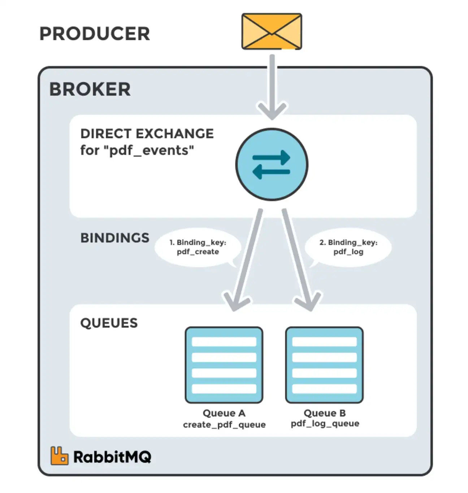
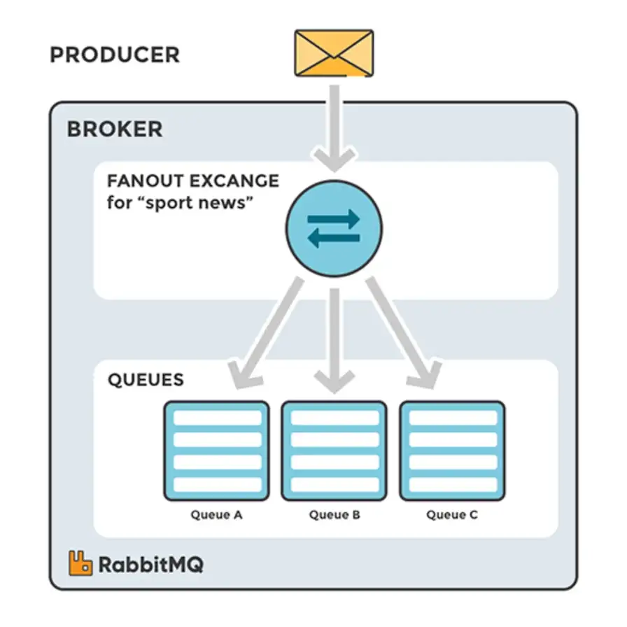
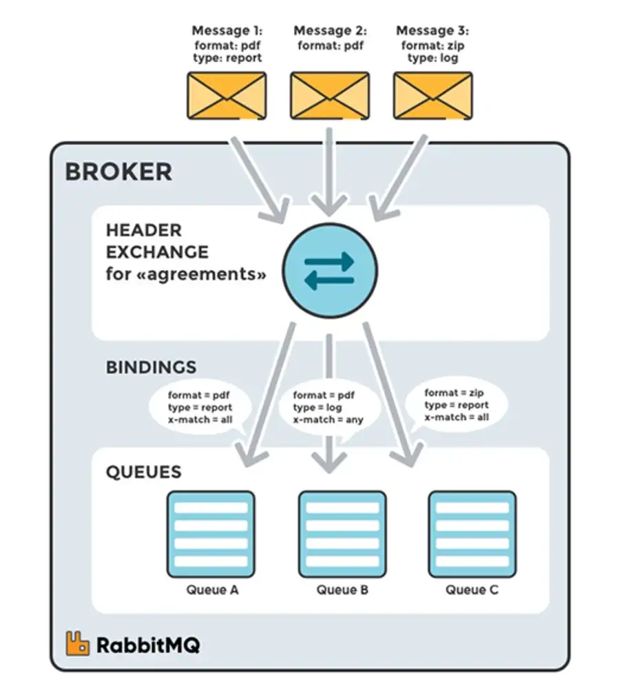

# Asynchronous communications (RabbitMQ)

RabbitMQ is a widely used open-source message broker that facilitates communication between different parts of a distributed system. It enables applications to send and receive messages through a robust and flexible messaging system based on the Advanced Message Queuing Protocol (AMQP). RabbitMQ supports various messaging patterns, making it suitable for various use cases.

## Key Components of RabbitMQ

- **Producer**: The application that sends messages to the broker.
- **Consumer**: The application that receives messages from a queue.
- **Queue**: A buffer that stores messages until they are consumed by a consumer.
- **Exchange**: A routing mechanism that determines how messages are distributed to queues.
- **Binding**: A link between an exchange and a queue that defines the routing rules for messages.
- **Routing Key**: The routing key is a message attribute taken into account by the exchange when deciding how to route a message.

## Types of Exchanges

RabbitMQ provides several types of exchanges that determine how messages are routed to queues. The main types of exchanges are:

### 1. Direct Exchange

- **Description**: A direct exchange routes messages with a specific routing key to the queues that are bound to the exchange with the same routing key.
- **Use Case**: Useful for point-to-point communication where messages must be routed to a specific queue.

**Example**: A logging system where logs of different severity levels (e.g., INFO, ERROR) are sent to different queues based on their severity.

### 2. Fanout Exchange

- **Description**: A fanout exchange routes messages to all queues that are bound to it, regardless of the routing key. It broadcasts messages to multiple consumers.
- **Use Case**: Useful for scenarios where messages need to be delivered to multiple subscribers.

**Example**: A notification system where updates are sent to all subscribers regardless of their interests.

### 3. Topic Exchange

- **Description**: A topic exchange routes messages to one or more queues based on wildcard patterns in the routing key. This allows for more complex routing logic.
- **Use Case**: Useful for scenarios where messages need to be filtered based on multiple criteria.

**Example**: A news service where articles can be tagged with multiple categories (e.g., sports, politics), allowing subscribers to receive only the articles of interest.

### 4. Headers Exchange

- **Description**: A headers exchange routes messages based on the message's header attributes rather than the routing key. It matches the headers against specified criteria.
- **Use Case**: Useful for scenarios requiring routing based on multiple attributes rather than a single routing key.

**Example**: An order processing system where orders are routed based on multiple criteria such as customer location, product type, and priority.

## Types of Queues

RabbitMQ supports several types of queues, each with specific characteristics and use cases:

### 1. Standard Queue

- **Description**: The default type of queue in RabbitMQ. Messages are stored in FIFO (First-In-First-Out) order.
- **Use Case**: Suitable for most general messaging scenarios.

### 2. Durable Queue

- **Description**: A durable queue ensures that messages are not lost even if the broker crashes. The queue definition is persisted to disk.
- **Use Case**: Essential for critical applications where message loss cannot be tolerated.

### 3. Temporary (Exclusive) Queue

- **Description**: A temporary queue is created for a specific connection and is automatically deleted when the connection closes. It is not visible to other connections.
- **Use Case**: Useful for scenarios where a consumer needs a unique queue for its temporary use, such as handling a user session.

### 4. Priority Queue

- **Description**: A priority queue allows messages to have priorities. Higher priority messages are processed before lower priority messages, even if they arrive later.
- **Use Case**: Suitable for scenarios where certain messages need to be processed before others, such as urgent notifications.

### 5. Dead Letter Queue (DLQ)

- **Description**: A dead letter queue is a special queue where messages that cannot be processed successfully are sent. It allows for the examination of failed messages.
- **Use Case**: Useful for error handling and debugging, as it helps identify and isolate problematic messages.

## Resources

- [RabbitMQ Official Documentation](https://www.rabbitmq.com/documentation.html)
- [RabbitMQ Tutorials](https://www.rabbitmq.com/getstarted.html)
- [RabbitMQ in Action](https://www.manning.com/books/rabbitmq-in-action)
