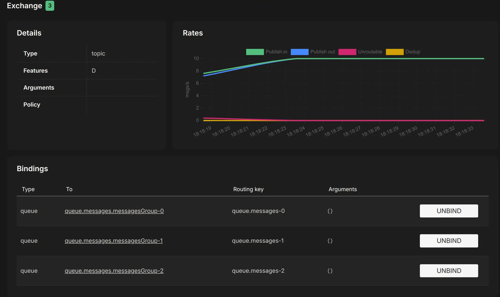

# Asynchronous communications (Spring Cloud Stream)

## Introduction
Spring Cloud Stream also allows to abstract away the implementation details of the messaging platform that we’re using. We can use multiple message platforms, including Apache Kafka and RabbitMQ, and the platform’s implementation-specific details are kept out of the application code. The implementation of message publication and consumption in your application is done through platform-neutral Spring interfaces.

Let’s begin our discussion by looking at the Spring Cloud Stream architecture through the lens of two services communicating via messaging. One service is the message publisher, and one service is the message consumer.


A **source** takes a Plain Old Java Object (POJO), which represents the message to be published, serializes it (the default serialization is JSON), and publishes the message to a channel.

A **channel** is an abstraction over the queue that’s going to hold the message. It is always associated with a target queue name, but that queue name is never directly exposed to the code, which means that we can switch the queues the channel reads or writes without changing the application’s code (only the configuration).

A **binder** talks to a specific message platform. The binder part of the Spring Cloud Stream framework allows us to work with messages without having to be exposed to platform-specific libraries and APIs for publishing and consuming messages.

A **sink** listens to a channel for incoming messages and deserializes the message back into a POJO object. From there, the message can be processed by the business logic of the Spring service.

## Defining events
Messaging systems handle messages that typically consist of headers and a body. An event is a message that describes something that has happened. For events, the message body can be used to describe the type of event, the event data, and a timestamp for when the event occurred.

An event could be defined by the following:
* The type of event, for example, a create or delete event
* A key that identifies the data (e.g., a message ID)
* A data element, that is, the actual data in the event
* A timestamp, which describes when the event occurred

```java
@NoArgsConstructor
@AllArgsConstructor
@Data
public class Event<K, T> {
    public enum Type {CREATE, DELETE, UPDATE}
    @NonNull private Type eventType;
    private K key;
    private T data;
    private ZonedDateTime eventCreatedAt;

    public Event(@NonNull Type eventType, K key, T data) {
        this.eventType = eventType;
        this.key = key;
        this.data = data;
        this.eventCreatedAt = ZonedDateTime.now();
    }
}
```


## Project dependencies

To include Spring Cloud Stream in our project, we need to add *spring-cloud-stream* and at least one binder (e.g., spring-cloud-starter-stream-rabbit or spring-cloud-starter-stream-kafka) as shown below.

```
    <properties>
        <java.version>21</java.version>
        <spring-cloud.version>2023.0.0</spring-cloud.version>
    </properties>
    
    <dependencies>
        ...
        <dependency>
            <groupId>org.projectlombok</groupId>
            <artifactId>lombok</artifactId>
            <optional>true</optional>
        </dependency>
        <dependency>
            <groupId>org.springframework.cloud</groupId>
            <artifactId>spring-cloud-stream</artifactId>
        </dependency>
        <dependency>
            <groupId>org.springframework.cloud</groupId>
            <artifactId>spring-cloud-starter-stream-rabbit</artifactId>
        </dependency>
        ...
    </dependencies>
    <dependencyManagement>
        <dependencies>
            <dependency>
                <groupId>org.springframework.cloud</groupId>
                <artifactId>spring-cloud-dependencies</artifactId>
                <version>${spring-cloud.version}</version>
                <type>pom</type>
                <scope>import</scope>
            </dependency>
        </dependencies>
    </dependencyManagement>
```

## Publishing events
To publish an event we need to:
* Create an Event object
* Use the *StreamBridge* class to publish events on the desired topic
* Add configuration required for publishing events

```java
@Component
public class EventSender {
    private static final RandomGenerator RANDOM = RandomGenerator.getDefault();
    private static final Logger LOG = LoggerFactory.getLogger(EventSender.class);
    private final StreamBridge streamBridge;

    public EventSender(StreamBridge streamBridge) {
        this.streamBridge = streamBridge;
    }

    @Scheduled(fixedRate = 1000)
    public void randomMessage() {
        int index = RANDOM.nextInt(Event.Type.class.getEnumConstants().length);
        Event<String, Integer> event = new Event(
                Event.Type.class.getEnumConstants()[index],
                UUID.randomUUID().toString(),
                RANDOM.nextInt(100)
        );
        sendMessage("message-out-0", event);
    }

    private void sendMessage(String bindingName, Event<String, Integer> event) {
        for (int i = 0; i < 5; i++) {
            Message<Event<String, Integer>> message = MessageBuilder.withPayload(event)
                    .setHeader("routingKey", event.getEventType().name())
                    .setHeader("partitionKey", event.getKey())
                    .build();
            LOG.info("Sending message {} to {}", event, bindingName);
            streamBridge.send(bindingName, message);
        }
    }
}
```

We also need to set up the configuration for the messaging system, to be able to publish events. In particular, we need to provide RabbitMQ as the default messaging system (including connectivity information), JSON as the default content type, and which topics should be used.

```yaml
spring.cloud.stream:
  bindings:
    message-out-0:
      contentType: application/json
      destination: queue.messages
      binder: local_rabbit
  binders:
    local_rabbit:
      type: rabbit
      environment:
        spring:
          rabbitmq:
            host: 127.0.0.1
            port: 5672
            username: guest
            password: guest
```


- `spring.cloud.stream.bindings`
    - **`message-out-0`**: This is a defined output binding (a channel) for sending messages.
        - **`contentType`**: Sets the message format to `application/json`, meaning messages sent to this channel will be serialized as JSON.
        - **`destination`**: Sets the target destination (queue) for messages to `queue.messages`.
        - **`binder`**: Specifies `local_rabbit` as the binder to be used, which connects this binding to the defined RabbitMQ setup.

- `spring.cloud.stream.binders`
    - **`local_rabbit`**: Defines a custom RabbitMQ binder.
        - **`type`**: Specifies the type as `rabbit`, indicating that RabbitMQ is the message broker.
        - **`environment`**: Configures the environment-specific RabbitMQ settings.
            - **`spring.rabbitmq`**: Specifies RabbitMQ connection properties:
                - **`host`**: The hostname of the RabbitMQ server (`127.0.0.1`, which is localhost).
                - **`port`**: The port for connecting to RabbitMQ, set to the default `5672`.
                - **`username`** and **`password`**: Credentials for accessing RabbitMQ, here set to `guest`.

## Receiving events

To be able to consume events, we need to do the following:
* Declare message processors that consume events published on specific topics
* Add configuration required for consuming events

The message receiver (frequently called *processor*) is declared as below. From the code, we can see that:
* The class is annotated with *@Configuration*, telling Spring to look for Spring beans in the class.
* We declare a Spring bean that implements the functional interface *Consumer*, accepting an event as an input parameter of type Event<String,Integer>.

```java
@Configuration
public class EventReceiver {

    private static final Logger LOG = LoggerFactory.getLogger(EventReceiver.class);

    @Bean
    public Consumer<Event<String, Integer>> messageProcessor() {
        return event -> {
            switch (event.getEventType()) {
                case CREATE:
                    LOG.info(String.format("[CREATE] --> %s", event));
                    break;
                case DELETE:
                    LOG.info(String.format("[DELETE] --> %s", event));
                    break;
                case UPDATE:
                    LOG.info(String.format("[UPDATE] --> %s", event));
                    break;
                default:
                    String errorMessage = "Incorrect event type: " + event.getEventType() + ", expected a CREATE/DELETE/UPDATE event";
                    throw new RuntimeException(errorMessage);
            }
        };
    }
}
```

We also need to set up a configuration for the messaging system to be able to consume events, as shown below.

```yaml
spring.cloud.stream:
  function:
    definition: messageProcessor
  bindings:
    messageProcessor-in-0:
      binder: local_rabbit
      contentType: application/json
      destination: queue.messages
  binders:
    local_rabbit:
      type: rabbit
      environment:
        spring:
          rabbitmq:
            host: 127.0.0.1
            port: 5672
            username: guest
            password: guest
```

- `spring.cloud.stream.function.definition`:
    - **`messageProcessor`**: Defines a function name, `messageProcessor`, which represents the logic that will process incoming messages. This function will act as a handler for messages received on the configured input channel.

- `spring.cloud.stream.bindings`
    - **`messageProcessor-in-0`**: Configures an input binding (channel) for the `messageProcessor` function.
        - **`binder`**: Specifies `local_rabbit` as the binder, linking this binding to the custom RabbitMQ configuration.
        - **`contentType`**: Sets the message format as `application/json`, meaning the incoming messages will be deserialized from JSON.
        - **`destination`**: Specifies the message queue to listen to, here set to `queue.messages`. This queue is where RabbitMQ will forward messages for the `messageProcessor` function to handle.

## Trying out the messaging system
[LavinMQ](https://lavinmq.com/) is an extremely fast Message Broker that handles a large amounts of messages and connections. It implements the AMQP protocol (so that it can transparently replace RabbitMQ) and can run on both a single node or a cluster (more details [here](https://github.com/cloudamqp/lavinmq)).

### One publisher, one consumer

```yaml
services:
  publisher:
    image: async-rabbitmq-publisher
    build: async-rabbitmq-publisher
    mem_limit: 512m
    environment:
      - SPRING_PROFILES_ACTIVE=docker
    depends_on:
      lavinmq:
        condition: service_healthy
    deploy:
      mode: replicated
      replicas: 1

  consumer:
    image: async-rabbitmq-consumer
    build: async-rabbitmq-consumer
    mem_limit: 512m
    environment:
      - SPRING_PROFILES_ACTIVE=docker
    depends_on:
      lavinmq:
        condition: service_healthy
    deploy:
      mode: replicated
      replicas: 1

  lavinmq:
    image: cloudamqp/lavinmq:latest
    mem_limit: 512m
    ports:
      - 5672:5672
      - 15672:15672
    healthcheck:
      test: [ "CMD", "lavinmqctl", "status" ]
      interval: 5s
      timeout: 2s
      retries: 60

```

Start the system landscape with the following commands:

```
export COMPOSE_FILE=docker-compose-one-to-one.yml
mvn clean package -Dmaven.test.skip=true
docker compose build
docker compose up --detach
```

Using the [LavinMQ web interface](http://localhost:15672/) (login: guest/guest) we can see the *messages* exchange receiving 5 events/s and publishing the same events on one (anonymous) queue. 


### One publisher, many consumers (publish-subscribe)

```yaml
  consumer:
    image: async-rabbitmq-consumer
    build: async-rabbitmq-consumer
    mem_limit: 512m
    environment:
      - SPRING_PROFILES_ACTIVE=docker
    depends_on:
      lavinmq:
        condition: service_healthy
    deploy:
      mode: replicated
      replicas: 3
```

```
export COMPOSE_FILE=docker-compose-one-to-many.yml
mvn clean package -Dmaven.test.skip=true
docker compose build
docker compose up --detach
```

Using the [web interface](http://localhost:15672/) of LavinMQ (login: guest/guest) we can see the *messages* exchange receiving 5 events/s and publishing 15 same events on three different (anonymous) queue.


### Consumer groups
The problem is, if we scale up the number of instances of a message consumer, they will all consume the same messages. We can avoid this issue by making use of *consumer groups*. Each consumer binding can use the `spring.cloud.stream.bindings.<bindingName>.group` property to specify a group name. Consumers within the same group compete for the same messages.

Modify `docker-compose.yml` to activate the *groups* profile for the consumers.

```yaml
  consumer:
    image: async-rabbitmq-consumer
    build: async-rabbitmq-consumer
    mem_limit: 512m
    environment:
      - SPRING_PROFILES_ACTIVE=docker,groups
    depends_on:
      lavinmq:
        condition: service_healthy
    deploy:
      mode: replicated
      replicas: 3
```

The *groups* profile, adds the following configurations (see *application.yml*):

```yaml
spring.config.activate.on-profile: groups
spring.cloud.stream:
  bindings:
    messageProcessor-in-0:
      group: messagesGroup
```

Start the landscape with the following commands:

```
export COMPOSE_FILE=docker-compose-one-to-many-groups.yml
mvn clean package -Dmaven.test.skip=true
docker compose build
docker compose up --detach
```

Using the [LavinMQ web interface](http://localhost:15672/), we can exchange that the exchange receives 5 events/s and publishes them to a single message group having three consumers. As a consequence, the output rate is 5 events/s.


### Partitions

The problem is, each event is received by only one consumer. However, we do have any guarantee that all the messages concerning the same ID (e.g. the same product) reach the same consumer instance. This might lead to misbehaviour. To solve this issue, we can activate the use of *partitions* with Spring profiles.

```yaml
services:
  publisher:
    image: async-rabbitmq-publisher
    build: async-rabbitmq-publisher
    mem_limit: 512m
    environment:
      - SPRING_PROFILES_ACTIVE=docker,partitioned
    depends_on:
      lavinmq:
        condition: service_healthy

  consumer-0:
    image: async-rabbitmq-consumer
    build: async-rabbitmq-consumer
    mem_limit: 512m
    environment:
      - SPRING_PROFILES_ACTIVE=docker,groups,partitioned_instance_0
    depends_on:
      lavinmq:
        condition: service_healthy

  consumer-1:
    image: async-rabbitmq-consumer
    build: async-rabbitmq-consumer
    mem_limit: 512m
    environment:
      - SPRING_PROFILES_ACTIVE=docker,groups,partitioned_instance_1
    depends_on:
      lavinmq:
        condition: service_healthy

  consumer-2:
    image: async-rabbitmq-consumer
    build: async-rabbitmq-consumer
    mem_limit: 512m
    environment:
      - SPRING_PROFILES_ACTIVE=docker,groups,partitioned_instance_2
    depends_on:
      lavinmq:
        condition: service_healthy
```

The *partitioned* profile, adds the following configurations.

Publisher-side:
```yaml
spring.config.activate.on-profile: partitioned

spring.cloud.stream.bindings.message-out-0.producer:
  partition-key-expression: headers['partitionKey']
  partition-count: 3
```

Consumer-side:
```yaml
spring.config.activate.on-profile: partitioned_instance_0
spring.cloud.stream.bindings:
  messageProcessor-in-0:
    consumer:
      partitioned: true
      instanceIndex: 0
      instanceCount: 3

---
spring.config.activate.on-profile: partitioned_instance_1
spring.cloud.stream.bindings:
  messageProcessor-in-0:
    consumer:
      partitioned: true
      instanceIndex: 1
      instanceCount: 3

---
spring.config.activate.on-profile: partitioned_instance_2
spring.cloud.stream.bindings:
  messageProcessor-in-0:
    consumer:
      partitioned: true
      instanceIndex: 2
      instanceCount: 3
```

The `instanceCount` value represents the total number of application instances between which the data should be partitioned. The `instanceIndex` must be a unique value across the multiple instances, with a value between 0 and `instanceCount` - 1. The instance index helps each application instance to identify the unique partition(s) from which it receives data. It is required by binders using technology that does not support partitioning natively. For example, with RabbitMQ, there is a queue for each partition, with the queue name containing the instance index.

Start the system landscape with the following commands:

```
export COMPOSE_FILE=docker-compose-one-to-many-partitions.yml
mvn clean package -Dmaven.test.skip=true
docker compose build
docker compose up --detach
```

Using the [web interface](http://localhost:15672/) of LavinMQ it is possible to observe that the messages exchange receives 5 events/s and publishes the same events on three different (named) queues. Each event is consumed once by only one consumer. Thus, the output rate is 5 events/s. However, by checking the logs, it is possible to observe how each consumer receives *all* five messages pertaining to same ID.



### Routing
Consider a scenario where multiple consumers need to handle messages of different types, such as CREATE, UPDATE, and DELETE. This can be efficiently managed using routing techniques within a message broker. Producers can assign messages a *routing key* (a string that represents the type of message), allowing the broker to forward each message to the appropriate queue based on its key.

```yaml
services:
  publisher:
    image: async-rabbitmq-publisher
    build: async-rabbitmq-publisher
    mem_limit: 512m
    environment:
      - SPRING_PROFILES_ACTIVE=docker,routed
    depends_on:
      lavinmq:
        condition: service_healthy
    deploy:
      mode: replicated
      replicas: 1

  consumer-0:
    image: async-rabbitmq-consumer
    build: async-rabbitmq-consumer
    mem_limit: 512m
    environment:
      - SPRING_PROFILES_ACTIVE=docker,routed_instance_CREATE
    depends_on:
      lavinmq:
        condition: service_healthy

  consumer-1:
    image: async-rabbitmq-consumer
    build: async-rabbitmq-consumer
    mem_limit: 512m
    environment:
      - SPRING_PROFILES_ACTIVE=docker,routed_instance_UPDATE
    depends_on:
      lavinmq:
        condition: service_healthy

  consumer-2:
    image: async-rabbitmq-consumer
    build: async-rabbitmq-consumer
    mem_limit: 512m
    environment:
      - SPRING_PROFILES_ACTIVE=docker,routed_instance_DELETE
    depends_on:
      lavinmq:
        condition: service_healthy
```

The *routed* profile, adds the following configurations.

Publisher-side:

```yaml
spring.config.activate.on-profile: routed
spring.cloud.stream:
  rabbit:
    bindings:
      message-out-0:
        producer:
          routingKeyExpression: headers['routingKey']
```

Consumer-side:

```yaml
spring.config.activate.on-profile: routed_instance_CREATE
spring.cloud.stream:
  rabbit:
    bindings:
      messageProcessor-in-0:
        consumer:
          binding-routing-key: 'CREATE'

---
spring.config.activate.on-profile: routed_instance_UPDATE
spring.cloud.stream:
  rabbit:
    bindings:
      messageProcessor-in-0:
        consumer:
          binding-routing-key: 'UPDATE'

---
spring.config.activate.on-profile: routed_instance_DELETE
spring.cloud.stream:
  rabbit:
    bindings:
      messageProcessor-in-0:
        consumer:
          binding-routing-key: 'DELETE'
```

Start the system landscape with the following commands:

```
export COMPOSE_FILE=docker-compose-one-to-many-routed.yml
mvn clean package -Dmaven.test.skip=true
docker compose build
docker compose up --detach
```

Using the [LavinMQ web interface](http://localhost:15672/), it is possible to observe that the messages exchange receives 5 events/s and publishes the same events on three different (anonymous) queues. Each event is consumed once by only one consumer. However, by checking the logs, it is possible to observe how each consumer receives *all* messages of the same type.


## Resources
