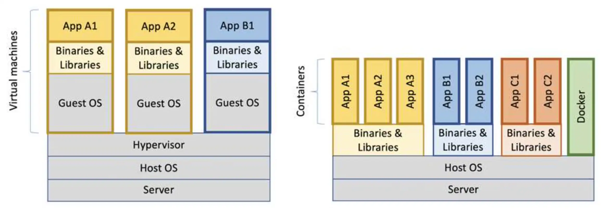
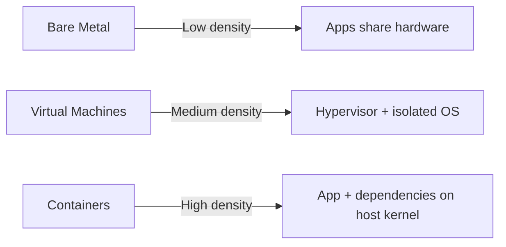
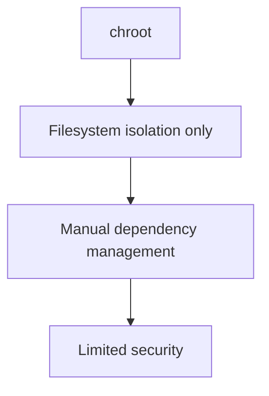
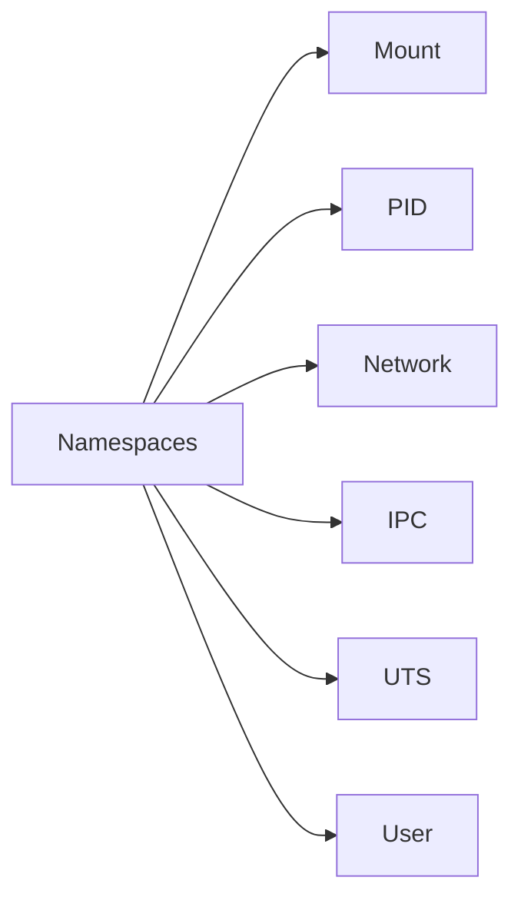
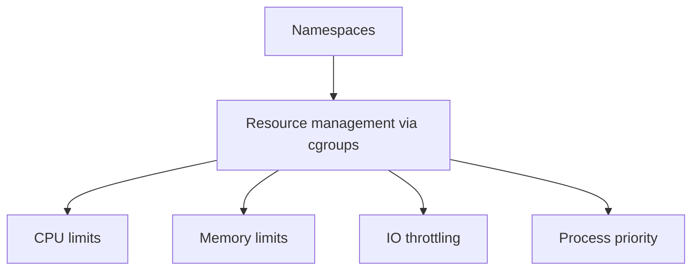
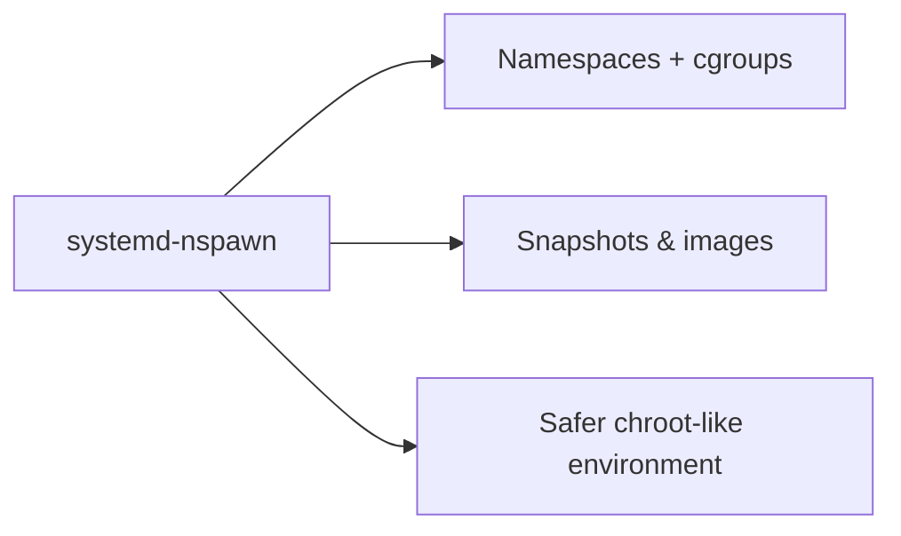
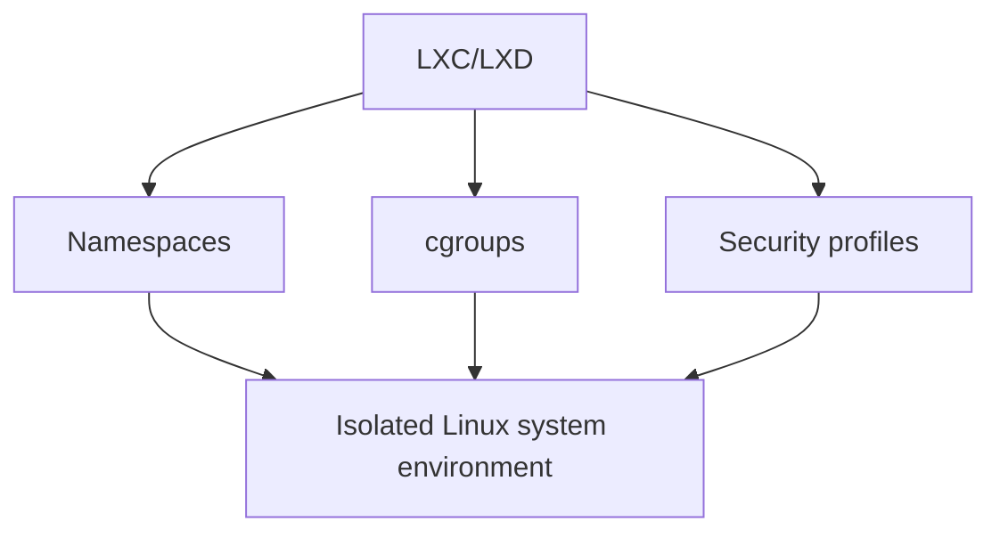
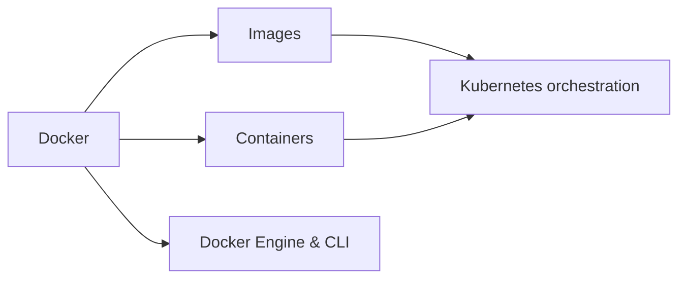
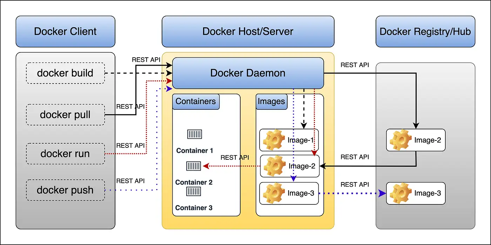
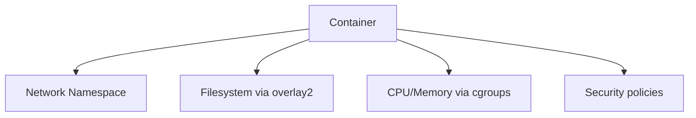

# Introduction to Containerization

---

## Deployment Models



**Deployment density:** how efficiently workloads share infrastructure.
Higher density → better utilization, but requires careful resource isolation.



### Bare Metal

* Apps run directly on physical servers
* Conflicts due to shared libraries & dependencies
* One-app-per-server → high cost, low utilization
* Minimal isolation, difficult scaling

### Virtual Machines

* Hypervisor (KVM, Xen, VMware ESXi) runs multiple VMs
* Each VM has its **own kernel and OS**
* Strong isolation, easier management than bare metal
* Drawback: high memory & storage overhead, slower boot

### Containers

* Run on **host kernel** with **namespaces + cgroups**
* Package **only app + dependencies**
* Fast startup (<1s), minimal overhead
* Highly portable & scalable
* Perfect for **microservices and ephemeral workloads**

---

## Chroot: Early Isolation

`chroot` changes a process root directory → “filesystem jail.”

**Pros:**

* Lightweight, easy to set up

**Cons:**

* Manual dependency management
* No resource control
* Breakable by root users

Example dependency inspection:

```
ldd /bin/ls
ldd /bin/bash
```

Example minimal root filesystem:

```
cage/
  bin/{bash, ls}
  usr/lib/{libc.so.6, libreadline.so.8, ...}
  lib64 -> usr/lib64
```

Run inside the jail:

```bash
sudo chroot cage /bin/ls
sudo chroot cage /bin/bash
```



---

## Modern Isolation Primitives

### Linux Namespaces

* Kernel feature isolating system resources:

    * **Mount** → filesystem views
    * **PID** → isolated process tree
    * **Network** → private network stack
    * **IPC** → inter-process communication
    * **UTS** → hostname/domainname
    * **User** → UID/GID mapping

**Example:**

```bash
unshare -mpf --mount-proc bash
```



### Control Groups (cgroups)

* Kernel mechanism to **limit & prioritize resources**:

    * CPU shares → fair CPU allocation
    * Memory limits → prevent OOMs
    * I/O throttling → control disk bandwidth
    * Process priority → scheduling weight



### systemd-nspawn

* Lightweight system container tool built on **namespaces + cgroups**
* Supports:

    * PID & network isolation
    * User namespaces
    * Snapshots & images
    * Resource limits

Example:

```bash
sudo systemd-nspawn -D myrootfs
```



### LXC / LXD

* Full system containers, behaves like lightweight VM
* Built on:

    * Namespaces
    * cgroups
    * AppArmor / SELinux profiles
* Use cases:

    * VPS
    * CI/CD runners
    * Legacy app isolation

Example:

```bash
lxc launch ubuntu:22.04 mycontainer
```

* LXD adds management features: REST API, networking, storage pools, clustering
* Supports rootless containers, custom storage backends (ZFS, Btrfs)



---

## Container Technologies

| Tool       | Description                                          | Use Case                                    |
| ---------- | ---------------------------------------------------- | ------------------------------------------- |
| Docker     | Application containers, layered images, OCI standard | Microservices, DevOps pipelines             |
| Podman     | Docker-compatible, daemonless, rootless              | Secure dev/test environments                |
| Kubernetes | Orchestrator, scheduling, scaling, networking        | Multi-node deployments, production clusters |



---

## Why Containers?

* Microservices → independent, scalable services
* Consistency → dev/test/prod parity
* Isolation → fault tolerance
* Rollback → immutable images

---

## Container Registries & Image Formats

**Registries:**

* Public: Docker Hub
* Cloud: AWS ECR, Azure ACR, Google Artifact Registry

**Image formats:**

* OCI → modern, standard
* Docker format → legacy
* SIF → HPC workloads
* LXD → system containers

---

## Docker Architecture



* Docker CLI → user interface
* Docker Engine/Daemon → build/run containers
* Images → immutable, versioned app bundles
* Containers → isolated runtime instances
* Registry → centralized storage

---

## Dockerfile Example

```dockerfile
FROM eclipse-temurin:21-jdk
ARG JAR_FILE=target/*.jar
COPY ${JAR_FILE} application.jar
ENTRYPOINT ["java","-jar","/application.jar"]
```

---

## Docker Compose Example

```yaml
services:
  postgres:
    image: postgres:17-alpine
    environment:
      POSTGRES_USER: user
      POSTGRES_PASSWORD: secret
      POSTGRES_DB: jdbc_schema
    volumes:
      - pg-data:/var/lib/postgresql/data
```

---

## Essential Docker CLI

```bash
docker pull busybox
docker images
docker run -it busybox
docker ps
docker stop/start <id>
docker rm <id>
docker exec -it <id> bash
docker rmi busybox
```

---

## Networking & Storage

* Networking: bridge, overlay, macvlan, host
* Storage: volumes, bind mounts, tmpfs, storage drivers (overlay2, aufs)
* Security: namespaces + cgroups + AppArmor/SELinux + seccomp



---

## Resources

* [Docker Docs](https://docs.docker.com)
* [Top 8 Container Registries](https://octopus.com/blog/top-8-container-registries)
* [LXC/LXD Documentation](https://linuxcontainers.org)
* [Kernel Namespaces & cgroups](https://man7.org/linux/man-pages/man7/namespaces.7.html)


