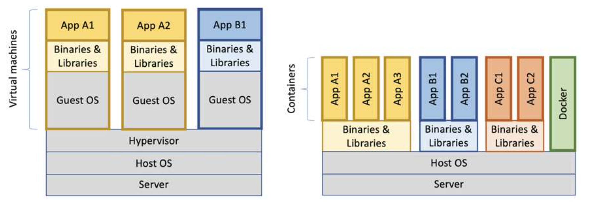

# Introduction to Containerization

## Types of Deployment


### Bare Metal Deployment

Initially, applications were deployed on physical servers where multiple applications shared the same hardware resources. This led to conflicts between libraries, dependencies, and performance needs. One solution was to allocate separate physical servers for each application, but this resulted in high costs, underutilized resources, and increased maintenance overhead.

### Virtualized Deployment

Virtualization introduced a more efficient way to utilize resources by creating multiple virtual machines (VMs) on a single physical server. This is done through a **hypervisor**, which manages the underlying hardware resources (CPU, memory, storage) and allows multiple VMs to run independently. Each VM contains its own guest operating system and application stack. This approach enhances scalability, reduces hardware costs, and provides isolation between applications. However, the overhead of running separate operating systems for each VM remains a drawback.

### Container Deployment

Containers are lightweight, standalone software units that run directly on the host's operating system, eliminating the need for a separate OS for each application. They package everything an application needs to run, including libraries, dependencies, and binaries, providing **portability**, **efficiency**, and **isolation** without the overhead of VMs.

The following diagram illustrates the difference in resource usage between virtual machines and containers, showing that containers can run more efficiently on the same server since they don't need a full operating system.


### Key Differences:
- **VMs** run a full OS, whereas **containers** share the host OS.
- Containers are more **lightweight** and offer faster **start-up times** compared to VMs.
- Containers ensure **application isolation** while reducing resource consumption.

## Container Technologies

Here are some container technologies offering various capabilities for containerization, each suited for different requirements:

- **Docker**: The most popular containerization platform, allowing developers to package applications and their dependencies into containers. Docker images (read-only templates) are built using **Dockerfiles**, which provide step-by-step instructions for assembling containers.
- **Podman**: A daemonless, open-source alternative to Docker, focusing on security. It is fully compatible with Docker’s CLI, offering similar functionality without the need for a central daemon.
- **Kubernetes**: Not a container technology itself but a powerful container orchestration platform that automates deploying, scaling, and managing containerized applications. Kubernetes works seamlessly with Docker and other container runtimes.

## Key Use Cases

### Microservices and Application Isolation

Containers are ideal for developing microservices-based architectures, which decompose large, monolithic applications into smaller, independently deployable services. Here’s why:

- **Decoupling of Services**: Each service can be packaged in its own container, running independently with its own dependencies.
- **Team Efficiency**: Different teams can work on separate microservices without worrying about interference, leading to faster development cycles.
- **Consistent Environments**: Containers ensure consistency across development, testing, and production environments, reducing deployment issues.
- **Resource and Fault Isolation**: Containers provide isolation, meaning that one service failure doesn’t affect others. This makes containers excellent for fault-tolerant systems.
- **Scalability**: Containers can be scaled independently to handle varying loads. Orchestration tools like Kubernetes make it easy to manage scaling and load balancing.

### CI/CD Integration

Containers play a crucial role in Continuous Integration/Continuous Deployment (CI/CD) pipelines by enabling:

- **Faster Build and Deployment**: Containers can be built quickly, making deployments faster and more efficient.
- **Isolation of CI/CD Stages**: Each stage of the CI/CD pipeline (e.g., build, test, deploy) can be containerized, ensuring that issues in one stage don’t affect others.
- **Parallel Testing**: Multiple tests can be run simultaneously in separate containers, reducing testing time.
- **Environment Parity**: Containers ensure that code behaves the same in development, testing, and production environments.
- **Rollback Capabilities**: Since containers are immutable, rolling back to a previous version is simple in case of deployment failures.


## Container Registries

Container images are stored in **registries**, which serve as repositories where developers can push and pull images. Registries save time by centralizing image management across environments.

Registries can be:

- **Public** (e.g., Docker Hub): Accessible by anyone.
- **Private** (e.g., enterprise registries): Access is restricted and includes additional security controls.

Popular registries include:
- **Docker Hub**: The most widely used public registry.
- **Amazon ECR**: Integrated with AWS, offering advanced features like vulnerability scanning.
- **Azure Container Registry**: Provides geo-replication for faster access worldwide.
- **Google Artifact Registry**: Part of Google Cloud, optimized for Google services.

### Image Formats

Several container image formats are in use today, each with its advantages:

1. **OCI (Open Container Initiative)**: A widely adopted open standard supported by Docker, Kubernetes, and other platforms.
2. **Docker Image Format**: Still widely used, providing compatibility with legacy systems.
3. **Singularity Image Format (SIF)**: Designed for high-performance computing (HPC) environments.
4. **LXD Image Format**: Used primarily for system containers that need lightweight virtualization.

## Docker

Docker is an open-source platform that enables developers to automate the deployment, scaling, and management of applications within lightweight, portable containers. This guarantees that applications run consistently across different environments, regardless of the underlying machine's customized settings. Consequently, developers can write code and test it in a container that behaves the same way on any machine, leading to fewer deployment issues.

### Docker Architecture



The Docker architecture consists of several key components that work together to create and manage containers effectively:

- **Docker CLI**: The Command Line Interface (CLI) is the primary way users interact with Docker. It allows users to issue commands for managing Docker containers, images, networks, and volumes. The CLI serves as the user-friendly front end for developers to communicate with the underlying Docker Daemon.

- **Socket**: The socket acts as the communication bridge between the Docker CLI and the Docker Daemon. It enables the CLI commands to be transmitted to the Daemon, which then executes the requested actions.

- **Docker Daemon (Docker Engine)**: The core component of Docker that runs on the host machine. The Daemon is responsible for creating, running, and managing containers. It listens for Docker API requests and manages Docker objects such as images, containers, networks, and volumes.

- **Containers**: Applications that run inside containers are isolated from each other. Multiple applications can run concurrently within their containers, providing a robust environment for development and production.

- **Images**: Docker images are lightweight, standalone, and executable packages that include everything needed to run a piece of software, such as the application code, runtime, libraries, environment variables, and configuration files. Images are immutable and can be versioned.

- **Docker Registry**: A Docker registry is a service for storing and distributing Docker images. It acts as a repository where users can push, pull, and manage Docker images. Public registries like Docker Hub are available, and users can also set up private registries for internal use within organizations.


### Key Elements
- **Dockerfile**: A Dockerfile is a script containing a series of commands to build a Docker image. It specifies the base image, the commands to install dependencies, the files to copy, environment variables to set, and the command to run the application. The Dockerfile serves as a blueprint for creating images.

```dockerfile
FROM eclipse-temurin:21-jre-ubi9-minimal
ARG JAR_FILE=target/*.jar
COPY ${JAR_FILE} application.jar
ENTRYPOINT ["java","-jar","/application.jar"]
```

- **docker-compose.yml**: Docker Compose is a tool that simplifies the management of multi-container Docker applications through a YAML configuration file. This file defines the services (containers) that comprise your application, including their configurations, such as images to use, ports to expose, network settings, and volume mounts. With Docker Compose, you can start and manage all services with a single terminal command, making it easier to replicate and manage complex applications across different environments.

```yaml
services:
  postgres:
    image: postgres:latest
    container_name: postgres
    restart: always
    environment:
      POSTGRES_USER: user
      POSTGRES_PASSWORD: secret
      POSTGRES_DB: jdbc_schema
    volumes:
      - pg-data:/var/lib/postgresql/data
    healthcheck:
      test: [ "CMD-SHELL", "pg_isready -U user -d jdbc_schema" ]
      interval: 30s
      timeout: 10s
      retries: 5

  pgadmin:
    image: dpage/pgadmin4
    container_name: pgadmin
    restart: always
    ports:
      - "8888:80"
    environment:
      PGADMIN_DEFAULT_EMAIL: user@domain.com
      PGADMIN_DEFAULT_PASSWORD: password
    volumes:
      - pgadmin-data:/var/lib/pgadmin

  product-service:
    build: product-service-postgres
    image: product-service-postgres
    mem_limit: 512m
    ports:
      - 8080:8080
    environment:
      - SPRING_PROFILES_ACTIVE=docker

volumes:
  pg-data:
  pgadmin-data:

```
### Terminal Commands (Bash)

The Docker CLI provides several commands for managing images and containers. Here are some of the most important commands:

**Build an Image**: Creates a new Docker image from a Dockerfile located in the specified context (directory).

```bash
docker buildx build -t <image-name> <context>
```

**Pull an Image**: Downloads a specified image from a Docker registry, such as Docker Hub.

```bash
docker pull <image-name>
```

**Run a Container**: Creates and starts a container from the specified image.

```bash
docker run <image-name>
```

**List Running Containers**: Displays a list of currently running containers.

```bash
docker ps
```

**Start and Stop a Container**:  Starts/Stops a previously created container.

```bash
docker start <container-id>
docker stop <container-id>
```

**Remove a Container**: Deletes a specified container. The container must be stopped before it can be removed.

```bash
docker rm <container-id>
```

**Execute a Command in a Running Container**: Runs a specified command inside a running container. The `-it` flags enable an interactive terminal session.

```bash
docker exec -it <container-id> bash
```

## Resources
- https://docs.docker.com
- https://octopus.com/blog/top-8-container-registries
- https://www.linkedin.com/advice/1/what-common-container-image-formats-standards-how


