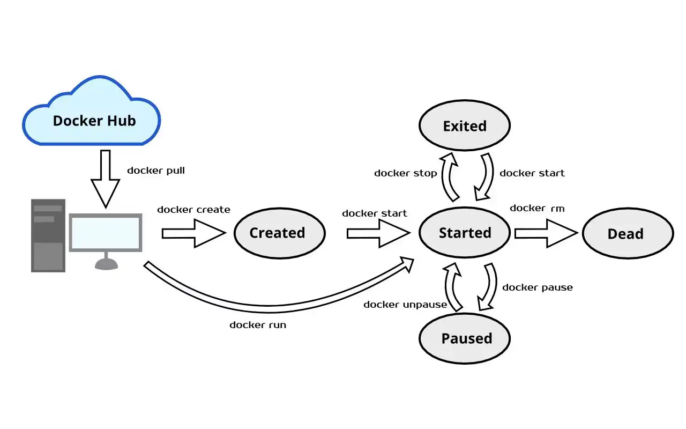

# Introduction to Containerization

## Types of Deployment


**Deployment density** refers to the measure of how many instances of a particular application, or service can be deployed and run within a given environment. **High deployment density** means more workloads are running on fewer resources, often leading to better utilization of available infrastructure, but it can also present challenges related to resource contention, performance, and scaling.

### Bare Metal Deployment (No isolation, Low density)

Initially, applications were deployed on physical servers where multiple applications shared the same hardware resources. This led to **conflicts between libraries, dependencies, and performance needs**. One solution was to **allocate separate physical servers for each application**, but this resulted in **high costs, underutilized resources, and increased maintenance overhead**.

### Virtualized Deployment (Isolation, Mid density)

Virtualization introduced a more efficient way to utilize resources by creating multiple virtual machines (VMs) on a single physical server. This is done through a **hypervisor**, which manages the underlying hardware resources (CPU, memory, storage) and allows multiple VMs to run independently. **Each VM contains its own guest operating system and application stack**. This approach enhances scalability, reduces hardware costs, and provides isolation between applications. However, **the overhead of running separate operating systems for each VM remains a drawback**.

### Container Deployment (Isolation, High density)

Containers are lightweight, **standalone software units that run directly on the host's operating system, eliminating the need for a separate OS for each application**. They package everything an application needs to run, including libraries, dependencies, and binaries, providing **portability**, **efficiency**, and **isolation** without the overhead of VMs. As a rule of thumb, containers provide **application isolation** while reducing resource consumption.

## Chroot: the first attempt at containerization

The `chroot` command in Unix-like operating systems changes the apparent root directory for a process and its children. This essentially "jails" the process within a specified directory, making it impossible for the process to access files outside that directory. This is commonly referred to as a "chroot jail."

* **Minimal environment**: When a process is run inside a chroot environment, it loses access to the system libraries, binaries, and utilities located outside of the `NEWROOT`. You need to ensure that essential tools (e.g., `/bin/bash`, libraries, `/etc/passwd`) are available in the chrooted environment.

* **Not a full security measure**: Although `chroot` can isolate a process, it is not foolproof. Root users within a chroot environment can potentially break out of the jail and access other parts of the system. For strong isolation, other techniques like containers (e.g., Docker) or virtual machines are more secure.

Let's show the dependencies of the `ls` and `bash` commands:

```
╰> ldd /bin/ls  
	linux-vdso.so.1 (0x0000702f32aff000)
	libcap.so.2 => /usr/lib/libcap.so.2 (0x0000702f32aa5000)
	libc.so.6 => /usr/lib/libc.so.6 (0x0000702f328b4000)
	/lib64/ld-linux-x86-64.so.2 => /usr/lib64/ld-linux-x86-64.so.2 (0x0000702f32b01000)
```

```
╰> ldd /bin/bash
	linux-vdso.so.1 (0x000072b8f1860000)
	libreadline.so.8 => /usr/lib/libreadline.so.8 (0x000072b8f16c5000)
	libc.so.6 => /usr/lib/libc.so.6 (0x000072b8f14d4000)
	libncursesw.so.6 => /usr/lib/libncursesw.so.6 (0x000072b8f1465000)
	/lib64/ld-linux-x86-64.so.2 => /usr/lib64/ld-linux-x86-64.so.2 (0x000072b8f1862000)
```

We can build a cage organizing the needed dependencies as in the host system:

```
cage
├── bin
│  ├── bash
│  └── ls
├── lib64 -> usr/lib64
└── usr
    ├── lib
    │  ├── libcap.so.2
    │  ├── libc.so.6
    │  ├── libncursesw.so.6
    │  └── libreadline.so.8
    └── lib64
        └── ld-linux-x86-64.so.2
```

Now we can run both the commands (packaged will all their dependencies but without a kernel) within a chroot cage:

```bash
$ sudo chroot cage /bin/ls
$ sudo chroot cage /bin/bash
```


## Container Technologies

Here are some container technologies offering various capabilities for containerization, each suited for different requirements:

- **Docker**: The most popular containerization platform, allowing developers to package applications and their dependencies into containers. 
- **Podman**: A daemonless, open-source alternative to Docker, focusing on security. It is fully compatible with Docker’s CLI, offering similar functionality without the need for a central daemon.
- **Kubernetes**: Not a container technology itself but a powerful container orchestration platform that automates deploying, scaling, and managing containerized applications. Kubernetes works seamlessly with Docker and other container runtimes.


## Key Use Cases

### Microservices and Application Isolation

Containers are ideal for developing microservices-based architectures, which decompose large, monolithic applications into independently deployable (smaller) services:

- **Decoupling**: Each service can be packaged in its own container, running independently.
- **Consistent Environments**: Containers ensure consistency across development, testing, and production environments.
- **Resource and Fault Isolation**: Containers provide isolation, meaning that one service failure does not *directly* affect others. This makes containers excellent for fault-tolerant systems.
- **Scalability**: Containers can be scaled independently to handle varying loads. Orchestration tools (e.g., Kubernetes) make it easy to manage scaling and load balancing.
- **Rollback**: Since containers are immutable, rolling back to a previous version is simple in case of deployment failures.


## Container Registries

Container images are stored in **registries**, which serve as repositories where developers can push and pull images. Registries save time by centralizing image management across environments. They can be:

- **Public** (e.g., Docker Hub): Accessible by anyone.
- **Private** (e.g., enterprise registries): Access is restricted and includes additional security controls.

Popular registries include:
- **Docker Hub**: The most widely used public registry.
- **Amazon ECR**: Integrated with AWS, offering advanced features like vulnerability scanning.
- **Azure Container Registry**: Provides geo-replication for faster access worldwide.
- **Google Artifact Registry**: Part of Google Cloud, optimized for Google services.

### Image Formats

Several container image formats are in use today, each with its advantages:

1. **OCI (Open Container Initiative)**: A widely adopted open standard supported by Docker, Kubernetes, and other platforms.
2. **Docker Image Format**: Still widely used, providing compatibility with legacy systems.
3. **Singularity Image Format (SIF)**: Designed for high-performance computing (HPC) environments.
4. **LXD Image Format**: Used primarily for system containers that need lightweight virtualization.

## Docker Architecture


[Docker](https://www.datadoghq.com/docker-adoption/) is an open-source platform that enables developers to automate the deployment, scaling, and management of applications within containers. The Docker architecture consists of several key components:

- **Docker CLI**: The Command Line Interface (CLI) is the primary way users interact with Docker. It allows users to issue commands for managing Docker containers, images, networks, and volumes. The CLI serves as the user-friendly front end for developers to communicate with the underlying Docker Daemon.

- **Docker Engine**: The core component of Docker that runs on the host machine. The Daemon is responsible for creating, running, and managing containers. It listens for Docker API requests and manages Docker objects such as images, containers, networks, and volumes.

- **Docker Registry**: A Docker registry is a service for storing and distributing Docker images. It acts as a repository where users can push, pull, and manage Docker images. Public registries like Docker Hub are available, and users can also set up private registries for internal use within organizations.

- **Images**: Docker images are lightweight, standalone, and executable packages that include everything needed to run a piece of software, such as the application code, runtime, libraries, environment variables, and configuration files. Images are immutable and can be versioned.

- **Containers**: Applications that run inside containers are isolated from each other. Multiple applications can run concurrently within their containers, providing a robust environment for development and production.


## Container lifecycle




## Docker key files

**Dockerfile**: is a blueprint for creating a Docker image. It specifies the base image, the commands to install dependencies, the files to copy, environment variables to set, and the command to run the application.

```dockerfile
FROM eclipse-temurin:21-jdk
ARG JAR_FILE=target/*.jar
COPY ${JAR_FILE} application.jar
ENTRYPOINT ["java","-jar","/application.jar"]
```

**docker-compose.yml**: defines the services (containers) that comprise your application, including their configurations, such as images to use, ports to expose, network settings, and external volumes. With Docker Compose, you can manage all services at once making it easier to replicate complex applications across different environments.

```yaml
services:
  postgres:
    image: postgres:latest
    container_name: postgres
    restart: always
    environment:
      POSTGRES_USER: user
      POSTGRES_PASSWORD: secret
      POSTGRES_DB: jdbc_schema
    volumes:
      - pg-data:/var/lib/postgresql/data
    healthcheck:
      test: [ "CMD-SHELL", "pg_isready -U user -d jdbc_schema" ]
      interval: 30s
      timeout: 10s
      retries: 5

  pgadmin:
    image: dpage/pgadmin4
    container_name: pgadmin
    restart: always
    ports:
      - "8888:80"
    environment:
      PGADMIN_DEFAULT_EMAIL: user@domain.com
      PGADMIN_DEFAULT_PASSWORD: password
    volumes:
      - pgadmin-data:/var/lib/pgadmin

  product-service:
    build: product-service-postgres
    image: product-service-postgres
    mem_limit: 512m
    ports:
      - 8080:8080
    environment:
      - SPRING_PROFILES_ACTIVE=docker

volumes:
  pg-data:
  pgadmin-data:
```


## Docker CLI
The Docker CLI provides several commands for managing images and containers. Here are some of the most important commands:

**Pull an image from a Docker registry:**

```bash
docker pull busybox:latest
```

**Show local images:**

```bash
docker images
```

**Creates and starts a container from the specified image:**

```bash
docker run -it busybox:latest
```

**List running containers**: 

```bash
docker ps
```

**Start and stop a container**: 

```bash
docker stop <container-id>
docker start <container-id>
```

**Deletes a specified container. The container must be stopped before it can be removed:**

```bash
docker rm <container-id>
```

**Execute a command in a running container**: Runs a specified command inside a running container. The `-it` flags enable an interactive terminal session.

```bash
docker exec -it <container-id> /bin/echo "Hello World!"
```

**Remove an image from the local registry**:

```bash
docker rmi -f busybox:latest
```

## Docker GUI

### Docker Desktop
https://www.docker.com/products/docker-desktop/

### Lazydocker
https://github.com/jesseduffield/lazydocker

## Resources
- https://docs.docker.com
- https://octopus.com/blog/top-8-container-registries


