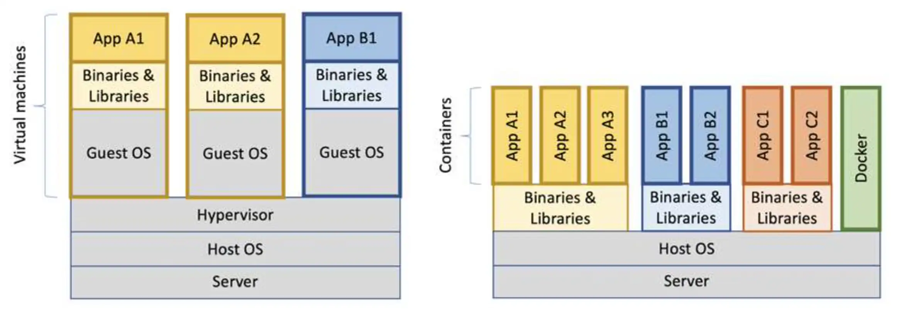
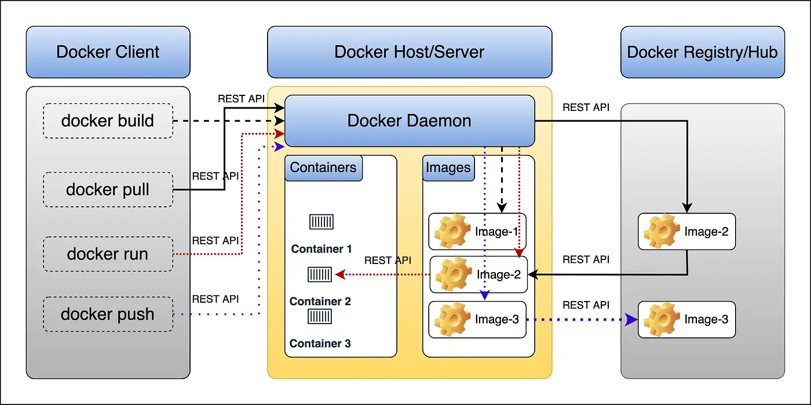

# Introduction to Containerization

---

## Deployment Models



* **Deployment density:** how efficiently workloads share the same infrastructure. Higher density leads to better resource utilization.
* **Isolation:** mechanisms that keep workloads separated (CPU, memory, filesystem, network), preventing interference and improving security and stability when many workloads run on the same infrastructure.

### Bare Metal

* Apps run directly on physical servers
* Conflicts due to shared libraries & dependencies
* One-app-per-server → high cost, strong isolation
* Many-apps-per-server → low cost, low isolation

### Virtual Machines

* Hypervisor (KVM, Xen, VMware ESXi) runs multiple VMs
* Each VM has its **own kernel and OS**
* OK density, strong isolation
* Drawback: memory & storage overhead, complex management

### Containers

* Run on **host kernel** with **namespaces + cgroups**
* Package **only app + dependencies**
* Fast startup (<1s), minimal overhead
* High density, OK isolantion
* Perfect for **microservices and ephemeral workloads**

---

## Chroot: Early Isolation

`chroot` changes a process root directory → “filesystem jail.”

**Pros:**

* Lightweight, easy to set up

**Cons:**

* Manual dependency management
* No resource control
* Breakable by root users

Example dependency inspection:

```
ldd /bin/ls
ldd /bin/bash
```

Example minimal root filesystem:

```
cage/
  bin/{bash, ls}
  usr/lib/{libc.so.6, libreadline.so.8, ...}
  lib64 -> usr/lib64
```

Run inside the jail:

```bash
sudo chroot cage /bin/ls
sudo chroot cage /bin/bash
```

---

## Modern Isolation Primitives

### Namespaces

* Kernel feature isolating system resources:

    * **Mount** → filesystem views
    * **PID** → isolated process tree
    * **Network** → private network stack
    * **IPC** → inter-process communication
    * **UTS** → hostname/domainname
    * **User** → UID/GID mapping

```bash
sudo unshare --mount --pid --fork --mount-proc bash
ps aux 
```

### Control Groups (cgroups)

* Kernel mechanism to **limit & prioritize resources**:

    * CPU shares → fair CPU allocation
    * Memory limits → prevent OOMs
    * I/O throttling → control disk bandwidth
    * Process priority → scheduling weight

---

## Container Technologies

| Tool           | Description                                              | Use Case                                    |
|----------------| -------------------------------------------------------- | ------------------------------------------- |
| systemd-nspawn | Lightweight OS-level containers, integrates with systemd | Testing, lightweight isolated environments  |
| LXC / Incus    | Full Linux OS containers, system-level isolation         | Multi-service environments, lightweight VMs |
| Docker         | Application containers, layered images, OCI-compliant    | Running microservices, CI/CD pipelines      |
| Podman         | Docker-compatible, daemonless, supports rootless mode    | Secure development and testing environments |
| Kubernetes     | Container orchestrator: scheduling, scaling, networking  | Multi-node deployments, production clusters |

1. **LXC / LXD** → closest to a full OS, low-level containerization, more isolation, can run multiple services like a lightweight VM.
2. **systemd-nspawn** → lightweight system container, integrates with host systemd, good for sandboxed environments.
3. **Podman** → application-level containers, daemonless, rootless, very close to Docker but more secure.
4. **Docker** → application containers, layered images, widely used for microservices and CI/CD pipelines.
5. **Kubernetes** → orchestrates multiple containers across nodes; highest level of abstraction.

## Docker Architecture



* Docker CLI → user interface
* Docker Engine/Daemon → build/run containers
* Images → immutable, versioned app bundles
* Containers → isolated runtime instances
* Registry → centralized storage

---

## Essential Docker CLI

```bash
docker pull busybox
docker images
docker run -it busybox
docker ps
docker stop/start <id>
docker rm <id>
docker exec -it <id> bash
docker rmi busybox
```

---

## Resources

* [Docker Docs](https://docs.docker.com)
* [Top 8 Container Registries](https://octopus.com/blog/top-8-container-registries)
* [LXC/LXD Documentation](https://linuxcontainers.org)
* [Kernel Namespaces & cgroups](https://man7.org/linux/man-pages/man7/namespaces.7.html)


