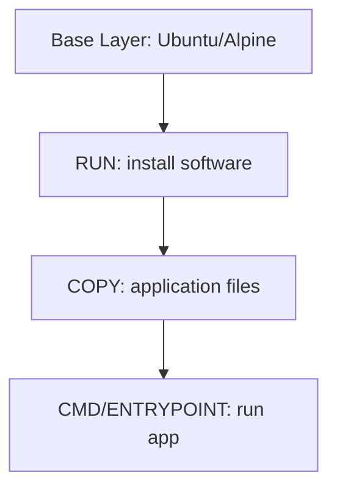

# Image Creation

## Docker Images and Layers

Docker images are **immutable snapshots** of an application and its environment. They include everything needed to run the app: code, runtime, libraries, configuration files, environment variables, and dependencies. Images are built in **layers**, where each Dockerfile instruction creates a new layer.

* **Base layer**: minimal OS/runtime (e.g., Alpine, Ubuntu).
* **Intermediate layers**: modifications like installing packages, copying files, setting environment variables.
* **Read-only layers**: once built, layers are immutable. Docker combines them using a **Union File System** (e.g., OverlayFS) when running a container.
* **Writable layer**: added on top when a container starts. Changes are temporary and discarded when the container stops.

Layers provide:

* **Faster builds**: unchanged layers are cached.
* **Layer reuse**: multiple images can share layers, saving storage.
* **Isolation**: read-only layers separate image from container runtime changes.



You can inspect layers with tools like [dive](https://github.com/wagoodman/dive).

---

## Key Dockerfile Instructions

* `FROM <image>`: sets the base image.
* `ARG <var>`: defines build-time variables.
* `COPY <src> <dest>`: copies files or directories into the image.
* `RUN <cmd>`: executes commands during image build.
* `CMD ["cmd"]` / `CMD-SHELL "cmd"`: sets default container command. Only the last `CMD` is effective.
* `ENTRYPOINT ["cmd"]`: sets a fixed container process. `ENTRYPOINT` is rarely overridden by `docker run` arguments.
* `WORKDIR <dir>`: sets the working directory for subsequent commands.
* `EXPOSE <port>`: documents the port the app will listen on (does not publish it).
* `ENV <key>=<value>`: sets environment variables inside the image.
* `USER <user>`: sets the user for subsequent commands in the container.

> **Difference between `RUN` and `CMD`**: `RUN` executes at **build time**, `CMD` at **container start**.

---

## Example: Python Application

### Python script

```python
# app.py
print("Hello, Docker!")
```

### Dockerfile

```dockerfile
FROM python:3.9-slim
WORKDIR /app
COPY . .
CMD ["python", "app.py"]
```

### Build and Run

```bash
docker build -t $(basename "$PWD"):latest .
docker run simple-app-python
```

---

## Example: Java Application

### Java code

```java
// App.java
public class App {
    public static void main(String[] args) {
        System.out.println("Hello, Docker!");
    }
}
```

### Dockerfile

```dockerfile
FROM eclipse-temurin:21
WORKDIR /app
COPY . .
RUN javac App.java
CMD ["java", "App"]
```

---

## Simple Command Image

Dockerfile for `ls` command:

```dockerfile
FROM alpine:3.18
CMD ["ls", "-al"]
```

---

## Flask Echo Server

```dockerfile
FROM python:3.9-slim
WORKDIR /app
COPY . .
RUN pip install -r requirements.txt
CMD ["python", "app.py"]
```

```bash
docker build -t $(basename "$PWD"):latest .
docker run -p 5000:5000 echo-server-flask
```

Test with:

```bash
curl -X POST http://localhost:5000/echo -H "Content-Type: application/json" -d '{"message": "Hello"}'
```

---

## Spring Boot Echo Server

```dockerfile
FROM eclipse-temurin:21
ARG JAR_FILE=target/*.jar
COPY ${JAR_FILE} application.jar
ENTRYPOINT ["java","-jar","/application.jar"]
```

```bash
mvn clean package -Dmaven.test.skip=true
docker build -t $(basename "$PWD"):latest .
docker run -p 5000:5000 echo-server-java
```
