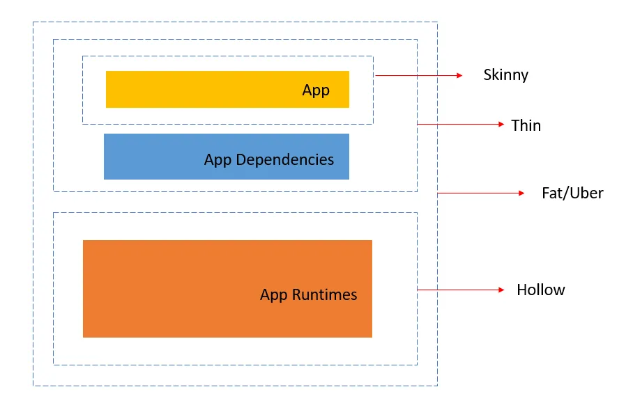

# Image creation (Java)

## Multi-Layer Jars

Whilst this approach works fine, and it’s nice and concise, there are a few things that are sub-optimal.

The first problem with above file is that the jar file is not unpacked. There’s always a certain amount of overhead when running a fat jar, and in a containerized environment this can be noticeable. It’s generally best to unpack your jar and run in an exploded form.

The second issue with the file is that it isn’t very efficient if you frequently update your application. Docker images are built in layers, and in this case your application and all its dependencies are put into a single layer. Since you probably recompile your code more often than you upgrade the version of Spring Boot you use, it’s often better to separate things a bit more. If you put jar files in the layer before your application classes, Docker often only needs to change the very bottom layer and can pick others up from its cache.


**A Docker image is made up of layers. Each layer represents a certain instruction written in a Dockerfile.** This layered approach is useful because layers from one image can be reused in other images.

By default, Spring defines four layers after we package the JAR. **We can inspect these layers using the _layertools_ mechanism** added by the Spring team:

```
$ java -Djarmode=layertools -jar target/spring-with-docker-end-0.1.0-SNAPSHOT.jar list
dependencies
spring-boot-loader
snapshot-dependencies
application
```

The command lists these four layers:

-   _dependencies:_ contains all the application dependencies
-   _spring-boot-loader:_ contains the Spring Boot loader classes
-   _snapshot-dependencies:_ contains snapshot dependencies that might change more often than normal dependencies
-   _application:_ contains our code

The [official documentation](https://docs.spring.io/spring-boot/docs/current/reference/html/executable-jar.html#appendix.executable-jar) describes the internal structure of JAR files.

**We can use this same _layertools_ instrument to extract and make use of the layers when we build the Docker image.**

For instance, let's have a look at the Dockerfile included in this project:

```
FROM eclipse-temurin:21 as builder
WORKDIR extracted
ARG JAR_FILE=target/*.jar
COPY ${JAR_FILE} application.jar
RUN java -Djarmode=layertools -jar application.jar extract

FROM eclipse-temurin:21
WORKDIR application
COPY --from=builder extracted/dependencies/ ./
COPY --from=builder extracted/spring-boot-loader/ ./
COPY --from=builder extracted/snapshot-dependencies/ ./
COPY --from=builder extracted/application/ ./

ENTRYPOINT ["java", "org.springframework.boot.loader.launch.JarLauncher"]
```

Let’s go through the main instructions. The first line indicates we’re using _openjdk_ as builder. We are using a feature in Docker called multi-stage builds, please note you can only do this in Docker v17+. Doing this will keep the size of our build down because we can make builders copy its content to other stages and then discard them on the final stage. As you can see, we’re using _layertools_ to extract the layers we just saw. Then we run our actual build accessing the extracted content in the next stage. Finally, we are using the Spring _JarLauncher_ to execute the Spring Boot application.

Let’s now build the image from the project root directory using the Docker CLI:

```
$ mvn clean package
$ docker build -f docker/Dockerfile --tag spring-with-docker-end-dockerfile-layers:0.1.0-SNAPSHOT .

Step 8/12 : COPY --from=builder application/dependencies/ ./
 ---> Using cache
 ---> d65f759258a2
Step 9/12 : COPY --from=builder application/spring-boot-loader/ ./
 ---> Using cache
 ---> d96dc51846be
Step 10/12 : COPY --from=builder application/snapshot-dependencies/ ./
 ---> Using cache
 ---> 5b749d9b6d50
Step 11/12 : COPY --from=builder application/application/ ./
 ---> 948e098fa982
...
```

**If we change something in our application, repackage it and rebuild the image we'll be able to see the build is using the cached layers except for the application layer:**


```
$ docker images

spring-with-docker-end-dockerfile-layers   0.1.0-SNAPSHOT   ced0604ee6d0   9 seconds ago        483MB
spring-with-docker-end-dockerfile-simple   0.1.0-SNAPSHOT   64d2ceaa7d8c   About a minute ago   483MB
...
```

To run the image:

```
$ docker run --name spring-with-docker-end-dockerfile-layers -p 8080:8080 spring-with-docker-end-dockerfile-layers:0.1.0-SNAPSHOT
```


## Thin JARs with Spring Boot



### JAR Types

- **Skinny** Contains ONLY the bits you literally type into your code editor, and NOTHING else. 
- **Thin** Contains all of the above PLUS the app’s direct dependencies of your app (db drivers, utility libraries, etc).
- **Hollow** The inverse of Thin. Contains only the bits needed to run your app but does NOT contain the app itself. Basically a pre-packaged “app server” to which you can later deploy your app, in the same style as traditional Java EE app servers.
- **Fat/Uber** – Contains the bit you literally write yourself PLUS the direct dependencies of your app PLUS the bits needed to run your app _on its own_.

### Why Bother?
The popularity of DevOps processes, Linux containers, and microservice architectures has made app footprint (the number of bytes that make up your app) important again. When you’re deploying to dev, test, and production environments multiple times a day (sometimes hundreds per hour or even [2 billion times a week](https://www.infoq.com/news/2014/06/everything-google-containers/)), minimizing the size of your app can have a huge impact on overall DevOps efficiency, and your operational sanity. You don’t have to minimize the lines of code in your app, but you should reduce the number of times your app and its app dependencies have to pass across a network, move onto or off of a disk, or be processed by a program. 

### How to Create a Thin JAR?
The [Spring Boot Thin Launcher](https://github.com/spring-projects-experimental/spring-boot-thin-launcher) is a small library that reads an artifact’s dependencies from a file bundled in the archive itself, downloads them from a Maven repository and finally launches the main class of the application.

So, when we build a project with the library, we get a JAR file with our code, a file enumerating its dependencies, and the main class from the library that performs the above tasks.

In a Maven project, we have to modify the declaration of the Boot plugin to include a dependency on the custom “thin” layout:

```
<plugin>
    <groupId>org.springframework.boot</groupId>
    <artifactId>spring-boot-maven-plugin</artifactId>
    <dependencies>
        <!-- The following enables the "thin jar" deployment option. -->
        <dependency>
            <groupId>org.springframework.boot.experimental</groupId>
            <artifactId>spring-boot-thin-layout</artifactId>
            <version>1.0.11.RELEASE</version>
        </dependency>
    </dependencies>
</plugin>
```

### Storing Dependencies
The point of thin jars is to avoid bundling the dependencies with the application. However, dependencies don’t magically disappear, they’re simply stored elsewhere.

In particular, the Thin Launcher uses the Maven infrastructure to resolve dependencies, so: 
* it checks the local Maven repository, which by default lies in ~/.m2/repository but can be moved elsewhere
* it downloads missing dependencies from Maven Central (or any other configured repository);
finally, it caches them in the local repository, so that it won’t have to download them again the next time we run the application.

Of course, the download phase is the slow and error-prone part of the process, because it requires access to Maven Central through the Internet, or access to a local proxy, and we all know how those things are generally unreliable.

Fortunately, there are various ways of deploying the dependencies together with the application, for example in a prepackaged container for cloud deployment.

#### Running the Application for Warm-up

The simplest way to cache the dependencies is to do a warm-up run of the application in the target environment. As we’ve seen earlier, this will cause the dependencies to be downloaded and cached in the local Maven repository. If we run more than one app, the repository will end up containing all the dependencies without duplicates.

Since running an application can have unwanted side effects, we can also perform a “dry run” that only resolves and downloads the dependencies without running any user code:

```
$ java -Dthin.dryrun=true -jar my-app-1.0.jar
```

#### Packaging the Dependencies During the Build

Another option is to collect the dependencies during the build, without bundling them in the JAR. Then, we can copy them to the target environment as part of the deployment procedure.

This is generally simpler because it’s not necessary to run the application in the target environment. However, if we’re deploying multiple applications, we’ll have to merge their dependencies, either manually or with a script.

We can point an application using the Thin Launcher to any such directory (including a local Maven repository) at runtime with the thin.root property:

```
$ java -jar my-app-1.0.jar --thin.root=my-app/deps
```

We can also safely merge multiple such directories by copying them one over another, thus obtaining a Maven repository with all the necessary dependencies.


#### Packaging the Dependencies With Maven

To have Maven package the dependencies for us, we use the resolve goal of the spring-boot-thin-maven-plugin. We can invoke it manually or automatically in our pom.xml:

```
<plugin>
    <groupId>org.springframework.boot.experimental</groupId>
    <artifactId>spring-boot-thin-maven-plugin</artifactId>
    <version>${thin.version}</version>
    <executions>
        <execution>
        <!-- Download the dependencies at build time -->
        <id>resolve</id>
        <goals>
            <goal>resolve</goal>
        </goals>
        <inherited>false</inherited>
        </execution>
    </executions>
</plugin>
```

After building the project, we’ll find a directory target/thin/root/ with the structure that we’ve discussed in the previous section.

## GraalVM Native Image Support
[GraalVM Native Images](https://www.graalvm.org/native-image/) are standalone executables that can be generated by processing compiled Java applications ahead-of-time. Compared to the Java Virtual Machine, native images can run with a smaller memory footprint and with much faster startup times. They are well suited to applications that are deployed using container images and are especially interesting when combined with "Function as a service" (FaaS) platforms.

A GraalVM Native Image is a complete, platform-specific executable. You do not need to ship a Java Virtual Machine in order to run a native image.

### Key Differences with JVM Deployments
Unlike traditional applications written for the JVM, GraalVM Native Image applications require ahead-of-time processing in order to create an executable. This involves statically analyzing your application code from its main entry point. The fact that GraalVM Native Images are produced ahead-of-time means that there are some key differences between native and JVM based applications. 

The main differences are:
* Static analysis of your application is performed at build-time from the main entry point.
* Code that cannot be reached when the native image is created will be removed and won’t be part of the executable.
* GraalVM is not directly aware of dynamic elements of your code and must be told about reflection, resources, serialization, and dynamic proxies.
* The application classpath is fixed at build time and cannot change.
* There is no lazy class loading, everything shipped in the executables will be loaded in memory on startup.
* There are some limitations around some aspects of Java applications that are not fully supported. 

On top of those differences, Spring uses a process called Spring Ahead-of-Time processing, which imposes further limitations. Please make sure to read at least the beginning of the next section to learn about those.

### Building a Native Image Using Buildpacks
Spring Boot includes buildpack support for native images directly for both Maven and Gradle. This means you can just type a single command and quickly get a sensible image into your locally running Docker daemon. The resulting image doesn’t contain a JVM, instead the native image is compiled statically. This leads to smaller images.

To build a native image container using Maven you should ensure that your `pom.xml` file uses the `spring-boot-starter-parent` and the `org.graalvm.buildtools:native-maven-plugin`. You should have a `<parent>` section that looks like this:

```xml
<parent>
    <groupId>org.springframework.boot</groupId>
    <artifactId>spring-boot-starter-parent</artifactId>
    <version>3.2.1</version>
</parent>
```

You additionally should have this in the `<build> <plugins>` section:

```xml
<plugin>
    <groupId>org.graalvm.buildtools</groupId>
    <artifactId>native-maven-plugin</artifactId>
</plugin>
```

The `spring-boot-starter-parent` declares a `native` profile that configures the executions that need to run in order to create a native image. You can activate profiles using the `-P` flag on the command line.

To build the image, you can run the `spring-boot:build-image` goal with the `native` profile active:

```shell
$ mvn -Pnative spring-boot:build-image
```

Once you have run the appropriate build command, a Docker image should be available. You can start your application using `docker run`:


```
$ docker run --rm -p 8080:8080 docker.io/library/spring-with-docker-end:0.1.0-SNAPSHOT
```

### Building a Native Image using Native Build Tools

You can also use GraalVM Native Build Tools. Native Build Tools are plugins shipped by GraalVM for both Maven and Gradle. You can use them to perform a variety of GraalVM tasks, including generating a native image.

To build a native image using the Native Build Tools, you’ll need a GraalVM distribution on your machine. You can either download it manually on the [Liberica Native Image Kit page](https://bell-sw.com/pages/downloads/native-image-kit/#/nik-22-17), or you can use a download manager like SDKMAN!.

Verify that the correct version has been configured by checking the output of `java -version`:

```shell
$ java -version
openjdk version "17.0.5" 2022-10-18 LTS
OpenJDK Runtime Environment GraalVM 22.3.0 (build 17.0.5+8-LTS)
OpenJDK 64-Bit Server VM GraalVM 22.3.0 (build 17.0.5+8-LTS, mixed mode)
```

As with the [buildpack support](https://docs.spring.io/spring-boot/docs/current/reference/html/native-image.html#native-image.developing-your-first-application.buildpacks.maven), you need to make sure that you’re using `spring-boot-starter-parent` in order to inherit the `native` profile and that the `org.graalvm.buildtools:native-maven-plugin` plugin is used.

With the `native` profile active, you can invoke the `native:compile` goal to trigger `native-image` compilation:

```shell
$ mvn -Pnative native:compile
```

The native image executable can be found in the `target` directory.

## Resources
