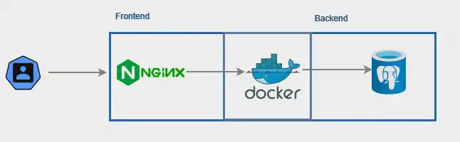

# Docker Compose Overview
Docker Compose is a powerful tool that allows us to define and manage multi-container Docker applications. It is particularly useful when working with microservice ecosystems, as it enables the easy launch and coordination of multiple containers simultaneously. With Compose, we can configure networking, define infrastructure as code, and also address scalability requirements.

The `docker-compose.yaml` file is the heart of Docker Compose, it is a YAML file that allows to define an application ecosystem including services, networking, disk space and more. It follows a hierarchical structure by the use of indentations.

- **services**: Defines the containers of the application, each service represents a container.
  - **[service-name]**: Name of the single service, the choice is at our discretion.
    - **image**: Specifies the image to use for the service.
    - **build**: Alternative to `image`, allows to build an image from a Dockerfile.
    - **ports**: Maps the host's ports.
    - **volumes**: Allows to share data between container and host or between containers.
    - **networks**: Defines the networks which the containers will utilize to communicate.
    - **depends_on: `<service>`**: Defines dependencies between services (which service start first).
    - **environment**: Used to pass environment variables to configure containers and applications.
    - **healthcheck**: Ensures that the service is healthy, specifying the interval and number of tries.

### Basic example of `docker-compose.yml`
Now we will deploy a simple application mapped to the port 5000 (code/echo-server-logs-java). It's controller is reported below:

```java
@Log
@RestController
public class EchoController {
    @PostMapping(value = "/echo")
    public Map<String, Object> echo(@RequestBody String message) {
        log.info(message);
        return Map.of("echoed_data", message);
    }

    @GetMapping(value = "/logs")
    public Map<String, Object> logs() throws IOException {
        log.info("requested_logs");
        Path path = FileSystems.getDefault().getPath("/tmp", "application.log");
        return Map.of("lines", Files.readAllLines(path));
    }
}
```

```yaml
services:
  echo:
    build: .
    ports:
      - "5000:5000"
```

Now with everything set up, we will start the ecosystem with the `docker-compose up` command in the context of the project directory.

```bash
export COMPOSE_FILE=docker-compose-simple.yaml
mvn clean package -Dmaven.test.skip=true
docker compose build
docker compose up --detach
```

To test:

```bash
curl -X POST http://localhost:5000/echo -H "Content-Type: application/json" -d '{"message": "Hello, Echo Server!"}'
```

## Resource limitation
In Docker Compose we can limit CPU and memory for containers (code/cpu-memory-meter). Its controller is reported below:

```java
@RestController
public class MeterController {

    @GetMapping(value = "/")
    public Map<String, Object> echo() {
        long maxMemory = Runtime.getRuntime().maxMemory();
        long totalMemory = Runtime.getRuntime().totalMemory();
        long freeMemory = Runtime.getRuntime().freeMemory();

        return Map.of(
                "Available processors (cores)", Runtime.getRuntime().availableProcessors(),
                "Free memory (MB)", Runtime.getRuntime().freeMemory() / 1_000_000,
                "Maximum memory (MB)", maxMemory == Long.MAX_VALUE ? "no limit" : maxMemory / 1_000_000,
                "Total memory (MB)", Runtime.getRuntime().totalMemory() / 1_000_000,
                "Allocated memory (MB)", (totalMemory - freeMemory) / 1_000_000
        );
    }

    @GetMapping(value = "/allocate/{size}")
    public Map<String, Object> allocate(@PathVariable Integer size) {
        try {
            byte[] array = new byte[size * 1_000_000];
            return Map.of("array allocation", "OK");
        } catch (OutOfMemoryError e) {
            return Map.of("array allocation", "Out of memory");
        }
    }
}
```

To apply the resource limitation to a specific `service` we need to add the `resources.limits` attribute under `deploy`.

```yaml
services:
  meter:
    build: .
    ports:
      - "8080:8080"
    deploy:
      resources:
        limits:
          memory: 512M    # Restrict memory to 512MB
          cpus: '2'       # Restrict cpus to 2 cores
```

```bash
unset COMPOSE_FILE
mvn clean package -Dmaven.test.skip=true
docker compose build
docker compose up --detach
```

```bash
curl http://localhost:8080 | jq
{
  "Total memory (MB)": 37,
  "Maximum memory (MB)": 129,
  "Available processors (cores)": 2,
  "Allocated memory (MB)": 21,
  "Free memory (MB)": 16
}
```

As expected the number of (perceived) cores is 2. Maximum memory (MB) represents the *estimated* maximum size of the HEAP memory. The JVM usually sets it between 25pc and 50pc of the total memory. In this case 129MB is approximately 25pc of the total 512MB.

As a final test, you can try to allocate memory inside the service. This example allocates 10MB and works fine.

```bash
curl http://localhost:8080/allocate/10
{"array allocation":"OK"}%
```

Instead, this example allocates 100MB and produces an error.

```bash
curl http://localhost:8080/allocate/100
{"array allocation":"Out of memory"}%   
```


## Replicas
A **Replica** in Docker refers to the ability to instantiate more replicas of the same container, this allows us to scale it horizontally (code/echo-server-logs-java).
The `deploy` field allows us to manage replicas and is composed of:
 - `mode`: **global** or **replicated**
   - `replicas`: the number of replicas.

> [!NOTE]
> If not specified, `mode` is defaulted to `replicated`

```yaml
services:
  echo:
    build: .
    ports:
      - "5000"
    deploy:
      replicas: 3

```
> [!NOTE]
> Since the service we're replicating is mapping ports, we will specify only the container port (omitting the host port), otherwise it will show an error.

As standard procedure we will start up the ecosystem and see the running containers.

```bash
export COMPOSE_FILE=docker-compose-replicas.yaml
mvn clean package -Dmaven.test.skip=true
docker compose build
docker compose up --detach
```

```bash
$ docker ps

CONTAINER ID   IMAGE        COMMAND         ...    PORTS
abc123         echo-server-logs-java-echo    "java -jar /applicat" ...    0.0.0.0:32768->5000/tcp
def456         echo-server-logs-java-echo    "java -jar /applicat" ...    0.0.0.0:32769->5000/tcp
ghi789         echo-server-logs-java-echo    "java -jar /applicat" ...    0.0.0.0:32770->5000/tcp
```

## Volumes and Bind Mounts
Docker containers allow us to maintain persistent data surviving beyond the container lifecycle, facilitating sharing data between containers, backup and restore.

| Feature              | Anonymous Volume                               | Named Volume                                      | Bind Mount                                      |
|----------------------|------------------------------------------------|---------------------------------------------------|-------------------------------------------------|
| **Definition**       | Automatically created by Docker without a name | Defined and named manually by the user            | Links a host directory/file to a container path |
| **Persistence**      | Temporary, removed with the container          | Persistent, exists independently of the container | Depends on the host filesystem                  |
| **Access from Host** | Not directly accessible                        | Accessible via Docker commands                    | Direct access from the host                     |
| **Typical Usage**    | Temporary or transient data                    | Persistent data (e.g., databases)                 | Sync files during development                   |
| **Security**         | Secure, Docker-managed                         | Secure, Docker-managed                            | Full host access                                |

_Is also important to say that if a service doesn't specify a volumes section, it means that the service won't have any volumes mounted. Essentially, **no data will be persisted outside the container** for that service._

In the following example (code/echo-server-logs-java) we have an echo server configured to save logs in '/tmp/application.log'. This file can be written inside the container or externalized with either volumes or bind mounts.

```java
@Log
@RestController
public class EchoController {
    @PostMapping(value = "/echo")
    public Map<String, Object> echo(@RequestBody String message) {
        log.info(message);
        return Map.of("echoed_data", message);
    }

    @GetMapping(value = "/logs")
    public Map<String, Object> logs() throws IOException {
        log.info("requested_logs");
        Path path = FileSystems.getDefault().getPath("/tmp", "application.log");
        return Map.of("lines", Files.readAllLines(path));
    }
}
```

### Volumes

```yaml
services:
  echo:
    build: .
    ports:
      - "5000:5000"
    volumes:
      - tmp:/tmp

volumes:
  tmp:
```

- **services**: Defines the services (containers) to be created. Here, only one service named `echo` is defined.
- **build**: Instructs Docker to build the image using a Dockerfile located in the current dir.
- **ports**: Maps a port on the host (left side) to a port on the container (right side). Here, both are set to `5000`.
- **volumes**: Specifies volumes to be mounted inside the container. The `ymp` volume is mounted at `/tmp` within the container, which could be used for persistent storage.
- **volumes** section: Defines the `tmp` volume, which persists data independent of the container lifecycle.

```bash
export COMPOSE_FILE=docker-compose-volume.yaml
mvn clean package -Dmaven.test.skip=true
docker compose build
docker compose up --detach
```

### Anonymous Volumes

```yaml
services:
  echo:
    build: .
    ports:
      - "5000:5000"
    volumes:
      - /tmp
```

- **Anonymous Volume**: The path `/tmp` refers to an anonymous volume. Docker will automatically create a volume without a specific name, and it will be mounted to the `/tmp` directory inside the container. This volume is used for storing data but won't have a persistent identity unless managed externally (i.e., you won't be able to reuse or easily reference this volume by name later).

```bash
export COMPOSE_FILE=docker-compose-anonvolume.yaml
mvn clean package -Dmaven.test.skip=true
docker compose build
docker compose up --detach
```

### Bind mounts

```yaml
services:
  echo:
    build: .
    ports:
      - "5000:5000"
    volumes:
      - ./data:/tmp
```

- **Bind Mount**: The path `./data:/tmp` specifies a bind mount. This means that the directory `./data` on the host machine is directly mounted into the container at `/tmp`. Any changes made in the container at `/tmp` will be reflected on the host's `./data` directory and vice versa.

```bash
mkdir data
export COMPOSE_FILE=docker-compose-bind.yaml
mvn clean package -Dmaven.test.skip=true
docker compose build
docker compose up --detach
```

## Networks
One aspect that makes the Docker engine a powerful tool is the possibility of creating and managing the services' connectivity. When using Docker Compose, networks are automatically created for your services, but you can also define custom networks to:
- Isolate groups of services. 
- Control which services can communicate with each other. 
- Configure advanced network options like driver types and external networks.

Docker supports different types of networks:
- **Bridge**: The default network type for Docker containers. It isolates containers from the host network but allows communication between containers on the same bridge network.
- **Host**: Uses the host's networking stack directly. Containers share the host's network interfaces, which can lead to performance improvements but less isolation.
- **Overlay**: Allows containers to communicate across different Docker hosts. It's commonly used in swarm mode to manage clusters of containers.
- **Macvlan**: Assigns a MAC address to a container, allowing it to appear as a physical device on the network. Useful for applications that require direct access to the physical network.

### Interaction with `iptables`

Docker manages networking using `iptables`, a Linux utility for configuring network packet filtering rules. Here's how Docker Compose networks interact with `iptables`:

#### Automatic `iptables` Rules
When you create a network (either by running `docker-compose up` or manually), Docker automatically adds `iptables` rules to allow traffic between containers in the same network.

Each bridge network is assigned a subnet, and `iptables` rules are configured to allow communication between all containers on that subnet.

#### Isolation and Security
Docker uses `iptables` to enforce isolation between networks. Containers on different networks cannot communicate with each other unless explicitly allowed through additional rules.

You can customize `iptables` rules if you need finer control over traffic flow. For example, you might want to restrict access to a database container from the outside world while allowing specific application containers to connect.

#### Inspecting `iptables` Rules
You can inspect the `iptables` rules applied by Docker using the following command:
```bash
sudo iptables -L -n
```
This command lists all the rules, including those created by Docker. Look for chains like `DOCKER` that contain rules specific to Docker containers.

#### Network Management Commands
To list the networks created by Docker, you can run:
```bash
docker network ls
```

To inspect a specific network and see its details, including the associated containers, use:
```bash
docker network inspect <network_name>
```

### First example
In this example (code/network-example) we define the `echo` and `postgres` services connected to a custom network called `my_network`, using a `bridge` driver, which is the default for single-host setups.

```yaml
services:
  echo:
    build: echo-server-logs-db-java
    ports:
      - "5000:5000"
    environment:
      - SPRING_PROFILES_ACTIVE=docker
    networks:
      - my_network
    depends_on:
      postgres:
        condition: service_healthy

  postgres:
    image: postgres:latest
    environment:
      POSTGRES_USER: user
      POSTGRES_PASSWORD: secret
      POSTGRES_DB: jdbc_schema
    volumes:
      - pg-data:/var/lib/postgresql/data
    networks:
      - my_network
    healthcheck:
      test: [ "CMD-SHELL", "pg_isready -U user -d jdbc_schema" ]
      interval: 30s
      timeout: 10s
      retries: 5

networks:
  my_network:
    driver: bridge

volumes:
  pg-data:
```

```bash
unset COMPOSE_FILE
cd echo-server-logs-db-java
mvn clean package -Dmaven.test.skip=true
cd ..
docker compose build
docker compose up --detach
```


### Second example
A good way to use networks is for isolating a portion of the microservice ecosystem that does not need to be exposed to external networks. In this example (code/network-example), we define two networks `front_net` and `back_net`, this will allow us to hide the backend side of the network. 



In this example:
- The `frontend` and `echo` services share the `front_net`, allowing them to communicate.
- The `echo` and `database` services share the `back_net`, isolating database traffic from the frontend.
- `nginx` is used as a reverse proxy for API requests forwarding

```yaml
services:
  frontend:
    image: nginx
    volumes:
      - ./frontend/nginx.conf:/etc/nginx/nginx.conf  # Custom NGINX config
    networks:
      - front_net
    ports:
      - "8080:8080"
    depends_on:
      echo:
        condition: service_healthy

  echo:
    build: echo-server-logs-db-java
    environment:
      - SPRING_PROFILES_ACTIVE=docker
    networks:
      - front_net
      - back_net
    depends_on:
      postgres:
        condition: service_healthy
    healthcheck:
      test: ["CMD-SHELL", "curl -f http://localhost:5000/logs"]
      interval: 10s
      timeout: 5s
      retries: 5

  postgres:
    image: postgres:latest
    environment:
      POSTGRES_USER: user
      POSTGRES_PASSWORD: secret
      POSTGRES_DB: jdbc_schema
    volumes:
      - pg-data:/var/lib/postgresql/data
    networks:
      - back_net
    healthcheck:
      test: [ "CMD-SHELL", "pg_isready -U user -d jdbc_schema" ]
      interval: 10s
      timeout: 5s
      retries: 5

networks:
  front_net:
    driver: bridge
  back_net:
    driver: bridge

volumes:
  pg-data:
```

```bash
export COMPOSE_FILE=docker-compose-isolation.yaml
cd echo-server-logs-db-java
mvn clean package -Dmaven.test.skip=true
cd ..
docker compose build
docker compose up --detach
```

## Heartbeats

Heartbeat functions — commonly referred to as **health checks** — are mechanisms that periodically verify whether a service (container) is healthy and functioning as expected. Implementing heartbeat functions ensures that your application components are up and running, and allows Docker Compose to manage:

* **service dependencies**
* **restarts**

### Implementing Health Checks Using `curl`

```yaml
services:
  webapp:
    image: your-webapp-image
    ports:
      - "8080:8080"
    healthcheck:
      test: ["CMD-SHELL", "curl -f http://localhost:8080/health"]
      interval: 30s
      timeout: 10s
      retries: 3
```

**Explanation:**

- **`test`:** Uses `curl` with the `-f` flag to fail on HTTP errors. It requests the `/health` endpoint.
- **`interval`:** Time between health checks (30 seconds).
- **`timeout`:** Maximum time to wait for a response (10 seconds).
- **`retries`:** Number of consecutive failures needed to mark the container as `unhealthy` (3 retries).

### Implementing Health Checks Using `wget`

Alternatively, you can use `wget` for the health check:

```yaml
services:
  webapp:
    image: your-webapp-image
    ports:
      - "8080:8080"
    healthcheck:
      test: ["CMD-SHELL", "wget --spider http://localhost:8080/health"]
      interval: 30s
      timeout: 10s
      retries: 3
```


### Implementing Health Checks Using Special-Purpose Commands

For services like databases, specialized commands can provide more accurate health checks by verifying service-specific readiness.

```yaml
services:
  db:
    image: postgres:latest
    environment:
      POSTGRES_USER: user
      POSTGRES_PASSWORD: password
      POSTGRES_DB: mydb
    healthcheck:
      test: [ "CMD-SHELL", "pg_isready -U user -d mydb" ]
      interval: 30s
      timeout: 10s
      retries: 5
```

```yaml
services:
  redis:
    image: redis:6
    healthcheck:
      test: ["CMD-SHELL", "redis-cli ping"]
      interval: 30s
      timeout: 10s
      retries: 3
```

### Integrating Health Checks with the `depends_on` Directive

The `depends_on` directive in Docker Compose specifies service dependencies, ensuring that certain services start before others. However, by default, `depends_on` only waits for the dependent containers to start, not to become healthy or ready.

To make `depends_on` wait for a service to be healthy, Docker Compose supports condition-based dependencies. This integration ensures that a service only starts after its dependencies are reported as healthy.

```yaml
services:
  db:
    image: postgres:latest
    environment:
      POSTGRES_USER: user
      POSTGRES_PASSWORD: password
      POSTGRES_DB: mydb
    healthcheck:
      test: [ "CMD-SHELL", "pg_isready -U user -d mydb" ]
      interval: 10s
      timeout: 5s
      retries: 5
      start_period: 5s

  webapp:
    image: your-webapp-image
    ports:
      - "8080:8080"
    depends_on:
      db:
        condition: service_healthy
    healthcheck:
      test: ["CMD-SHELL", "curl -f http://localhost:8080/health"]
      interval: 30s
      timeout: 10s
      retries: 3
```

## Resources


