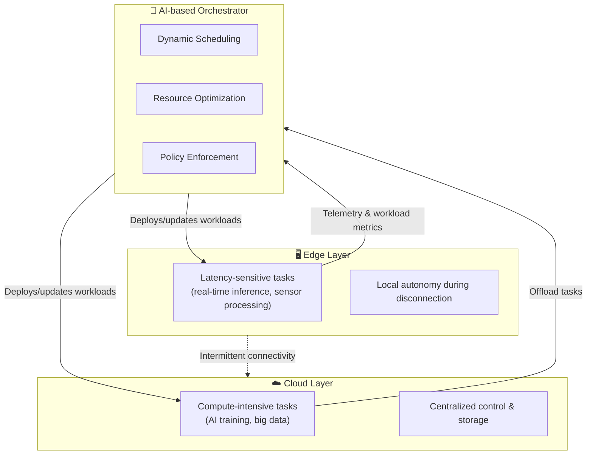

# Orchestration for the Edge–Cloud Continuum

---

## What is the Edge–Cloud Continuum?

* **Cloud:** centralized, high-performance infrastructure (data centers)
* **Edge:** computing resources closer to users/devices
* **Continuum:** seamless collaboration between cloud and edge resources
* **Goal:** deploy, manage, and scale workloads dynamically across both environments

---

## Why Orchestration?

* Edge and cloud environments are **heterogeneous**
* Applications are **distributed**, often involving:

    * IoT devices
    * Real-time analytics
    * AI inference
* Need for **automation** in:
    * Deployment
    * Scaling
    * Resilience
    * Monitoring

---

## Toward Unified and Adaptive Orchestration

* **Manages both latency-sensitive and compute-intensive tasks**

    * Deploys **real-time workloads** (e.g., sensor fusion, anomaly detection) close to data sources at the edge.
    * Offloads **compute-heavy operations** (e.g., model training, batch analytics) to the cloud.
    * Continuously adapts based on **network latency**, **resource availability**, and **QoS requirements**.

* **Enables autonomous operation during disconnection**

    * Edge nodes maintain **local decision-making** even when cloud connectivity is lost.
    * Synchronization and reconciliation occur automatically when the connection is restored.
    * Ensures **service continuity** and **resilience** in environments with intermittent networks.

* **Supports AI-driven scheduling and resource optimization**

    * Uses **machine learning models** to predict workload demands and adjust resource allocation.
    * Dynamically balances **power efficiency**, **performance**, and **cost** across the continuum.
    * Learns from telemetry data (CPU, GPU, network) to refine orchestration decisions over time.

---

## Kubernetes (K8s)

* **De facto standard** for container orchestration in the cloud
* Provides:

    * Automated deployment and scaling
    * Service discovery and load balancing
    * Self-healing (restarts, rescheduling)
* Suitable for **large-scale** clusters
* Challenges at the edge:

    * High overhead
    * Limited connectivity and resources

---

## K3s: Lightweight Kubernetes

* **Optimized for edge and IoT** environments
* Developed by Rancher (now SUSE)
* Key features:

    * Single binary (<100 MB)
    * Minimal dependencies
    * SQLite instead of etcd (by default)
    * ARM-compatible
* Ideal for **resource-constrained devices**

---

## MicroK8s: Developer-Friendly Kubernetes

* Developed by **Canonical** (Ubuntu)
* **Zero-ops** Kubernetes for:

    * Local development
    * Edge and IoT
* Key features:

    * Easy installation: `snap install microk8s --classic`
    * Modular via `microk8s enable <addon>`
    * Supports clustering (HA setups)
* Runs on Linux, macOS, and Windows

---

## KubeEdge: Extending K8s to the Edge

* Open-source project from **CNCF**
* Extends Kubernetes **beyond the cloud** to edge nodes
* Architecture:

    * **CloudCore:** runs in the cloud (control plane)
    * **EdgeCore:** runs on edge devices (data plane)
* Features:

    * Offline tolerance
    * Device management APIs
    * Synchronization between edge and cloud
    * Works with AI and IoT workloads

## References

* CNCF KubeEdge: [https://kubeedge.io](https://kubeedge.io)
* SUSE K3s: [https://k3s.io](https://k3s.io)
* Canonical MicroK8s: [https://microk8s.io](https://microk8s.io)
* Kubernetes Docs: [https://kubernetes.io](https://kubernetes.io)
