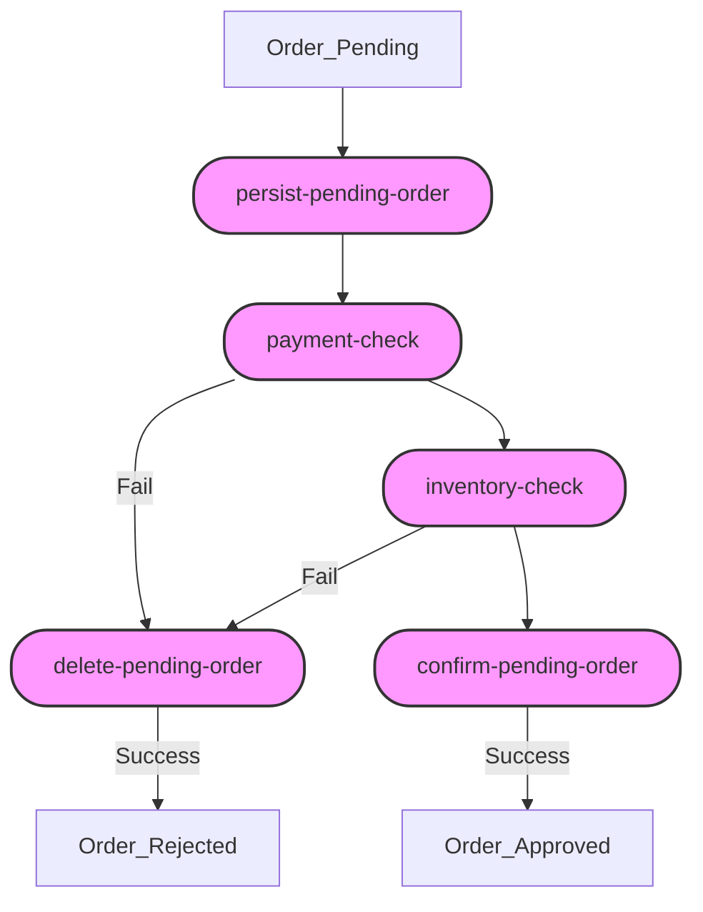

# Labs

## Lab 1: Orchestrated Saga

In this exercise, three services collaborate to implement a **Saga Pattern** using Orkes Conductor. The services are:

1. **Order Service**: Accepts a POST request to create an order (`POST /order`), and starts the workflow.
2. **Payment Service**: Validates and processes the customer’s payment.
3. **Inventory Service**: Checks product availability and reserves the items in the warehouse.

### Updated Workflow Design

1. **persist-pending-order** (Order Service): Saves the order with status `PENDING` in the database.
2. **payment-check** (Payment Service): Validates and charges the customer’s card and persist the result of the payment.
3. **inventory-check** (Inventory Service): Reserves products.
4. **confirm-pending-order** (Order Service): Changes the order status to `APPROVED`.
5. **delete-pending-order** (Order Service): Changes the order status to `REJECTED` if both `payment-check` and `inventory-check` fail.

Compensating tasks:
- If `payment-check` fails: run `delete-pending-orde`.
- If `inventory-check` fails: run `delete-pending-orde`.

# Questions
1. What challenges arise in maintaining data consistency when using the one database per service pattern in microservices?
2. What is the Saga pattern, and why is it essential for managing distributed transactions? Describe the choreography and orchestration approaches.
3. What does the CAP theorem state, and how does it affect the design of distributed systems?
4. What role do compensating transactions play in the Saga pattern, and why must they be idempotent?
5. What is the two-phase commit protocol, and how does it ensure atomicity in distributed transactions?
6. What are the performance and scalability trade-offs of using two-phase commit in a distributed environment?
7. What is Conductor, and how does it help manage distributed workflows?
8. What challenges drive the adoption of the CQRS pattern in large-scale applications?
9. How does the CQRS pattern enable independent scaling and performance optimization for read and write operations?
10. How can a CQRS-based system align with either the CP or AP model under the CAP theorem?