# Distributed data management

While distributed applications provides numerous benefits, they have several limitations as well. One of the major problems is how to handle a [transaction that spans multiple services](https://www.baeldung.com/transactions-across-microservices).

## Database per Service Pattern

The *Database per Service* pattern is a key principle in microservices architecture that promotes loose coupling and independent scalability by assigning each microservice its own dedicated database.

In this pattern, each microservice manages its own private data store, which is not shared with other services. 

This approach provides several advantages:
* Services can use the most suitable database technology (SQL, NoSQL, time-series, etc.) for their specific needs. 
* Services can manage its domain data independently, using a data store that best fits its schema and data types. 
* Services can scale their data stores independently and remain insulated from failures in other services.

**However, when a transaction spans multiple databases, maintaining *ACID* properties becomes a challenge**. 

To address this, the **SAGA pattern** offers an alternative by breaking a transaction into a sequence of smaller, reversible steps. Each step represents a local transaction within a single service, and in case of failure, compensating actions ensure consistency.

Additionally, the **CQRS (Command Query Responsibility Segregation) pattern** can help manage complex data consistency requirements by separating write operations (commands) from read operations (queries), allowing for optimized data storage and retrieval strategies. This separation also enhances scalability and performance, as each side can be independently tuned, scaled, or implemented using different technologies to meet specific throughput and latency requirements.

## CAP Theorem
In 2000, Eric Brewer introduced the idea that there is a fundamental trade-off between
consistency, availability, and partition tolerance in distributed systems. More specifically, the [CAP theorem](https://groups.csail.mit.edu/tds/papers/Gilbert/Brewer2.pdf) states that **any distributed system can simultaneously provide only two of three guarantees**: 
* Consistency
* Availability
* Partition tolerance

Let's consider a very simple distributed system. Our system is composed of two servers, G1 and G2. Both of these servers are keeping track of the same variable, v, whose value is initially v0. G1 and G2 can communicate with each other and can also communicate with external clients.

A client can request to write and read from any server. When a server receives a request, it performs any computations it wants and then responds to the client. 

And here is what a read looks like.

**Consistency**

> Every read receives the most recent write or an error. Note that consistency as defined in the CAP theorem is quite different from the consistency guaranteed in ACID database transactions.

In a consistent system, once a client writes a value to any server and gets a response, it expects to get that value (or a fresher value) back from any server it reads from.

Here is an example of a **consistent** system.

 
 
 
 
 
 
 

In this system, G1 replicates its value to G2 before sending an acknowledgement to the client. Thus, when the client reads from G2, it gets the most recent value of v: v1.

**Availability**

> Every request received by a non-failing node in the system must result in a response. Note that availability as defined in CAP theorem is different from high availability in software architecture.

In an available system, if our client sends a request to a server and the server has not crashed, then the server must eventually respond to the client. The server is not allowed to ignore the client's requests.

**Partition Tolerance**

> The system continues to operate despite an arbitrary number of messages being dropped (or delayed) by the network between nodes.

This means that any messages G1 and G2 send to one another can be dropped. If all the messages were being dropped, then our system would look like this.

Our system has to be able to function correctly despite arbitrary network partitions in order to be partition tolerant.

**The Proof**

**Assume for contradiction that there does exist a system that is consistent, available, and partition tolerant**. The first thing we do is partition our system. It looks like this.

Next, we have our client request that v1 be written to G1. Since our system is available, G1 must respond. Since the network is partitioned, however, G1 cannot replicate its data to G2.

 

Next, we have our client issue a read request to G2. Again, since our system is available, G2 must respond. It returns v0. **This is inconsistent.**

 

We assumed a consistent, available, partition tolerant system existed, but we just showed that there exists an execution for any such system in which the system acts inconsistently. **Thus, no such system exists.**

**Key Insight**

In a distributed system, network partitions are inevitable. Under normal conditions (i.e., no network failures), systems strive to provide both **Consistency** and **Availability**. However, when a partition occurs, a trade-off must be made:

1. **AP systems** prioritize **availability** by continuing to accept reads and writes during a partition, potentially at the cost of **consistency** (leading to **eventual consistency**).

2. **CP systems** prioritize **consistency** by rejecting some operations—typically writes—during a partition, ensuring that any served data remains consistent.

3. **CA systems** maintain both **consistency** and **availability** in the absence of network partitions. When a partition occurs, they must choose to behave as either **AP** or **CP**.

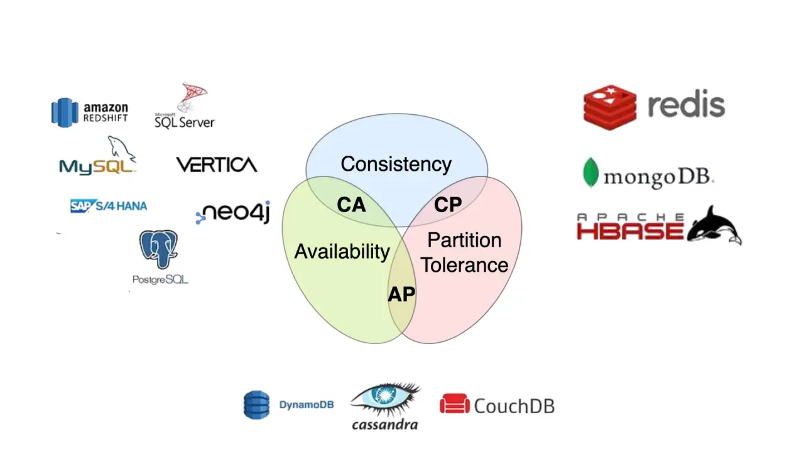

### CA Systems (Consistency and Availability)
- **Definition**: CA systems ensure **Consistency** and **Availability** but do not provide **Partition Tolerance**. CA systems are ideal for environments where network reliability is high, and both consistency and availability are critical.
- **Examples**:
    - **Centralized, tightly coupled distributed systems** (e.g., MySQL, PostgreSQL) within stable network environments.

### CP Systems (Consistency and Partition Tolerance)
- **Definition**: CP systems ensure **Consistency** and **Partition Tolerance** but do not guarantee **Availability** during network partitions. CP systems are suitable for applications where data accuracy and consistency are critical, even at the cost of availability during network issues.
- **Examples**:
    - **Zookeeper**, **Redis** (in specific configurations): Systems that prioritize strong consistency and may block requests if partitioned to ensure all nodes stay synchronized.

### AP Systems (Availability and Partition Tolerance)
- **Definition**: AP systems ensure **Availability** and **Partition Tolerance** but do not guarantee **Consistency**. AP systems are suitable for applications that require high availability and can tolerate temporary inconsistencies.
- **Examples**:
    - **Cassandra**, **DynamoDB**: NoSQL databases that prioritize availability and partition tolerance, offering eventual consistency.

## Challenges of Distributed Transaction

We'll take an example of an e-commerce application that processes online orders and is implemented as a microservice architecture.

There is a microservice to create the orders, one that processes the payment, another that updates the inventory and the last one that delivers the order. Each of these microservices performs a local transaction to implement the individual functionalities:

This is an example of a distributed transaction as the transaction boundary crosses multiple services and databases.

**Maintaining ACID Properties**

Ensuring transaction correctness in a distributed system requires adherence to ACID principles:

- **Atomicity**: A transaction must be all-or-nothing—either all steps complete successfully, or none take effect.
- **Consistency**: The system must transition from one valid state to another, preserving data integrity.
- **Isolation**: Transaction isolation defines how visible data modifications are when multiple services access the same data concurrently. For example, if a microservice updates a record while another service reads it, should the second service see the old or the new value?
- **Durability**: Once a transaction is committed, its changes must persist, even in the event of a system failure.

**To ensure a successful order processing:**
* all four microservices must complete the individual local transactions
* if any of the microservices fail to complete its local transaction, all the completed preceding transactions should roll back to ensure data integrity.

## The Two-Phase Commit Pattern (2PC)

The Two-Phase Commit protocol (2PC) is a widely used pattern to implement distributed transactions. We can use this pattern in a microservice architecture to implement distributed transactions.

In a two-phase commit protocol there are two key components:
* the coordinator component that is responsible for controlling the transaction and contains the logic to manage the transaction.
* the participating nodes (e.g., the microservices) that run their local transactions.

As the name indicates, the two-phase commit protocol runs a distributed transaction in two phases:

1.  **Phase 1 (Prepare)** -- The coordinator asks the participating nodes whether they are ready to commit the transaction. The participants returned with a *yes* or *no*.
2.  **Phase 2 (Commit)** -- If all the participating nodes respond affirmatively in phase 1, the coordinator asks all of them to commit. If at least one node returns negative, the coordinator asks all participants to roll back their local transactions.

### Problems With 2PC

Although 2PC is useful to implement a distributed transaction, it has the following shortcomings:

* The coordinator node can become the **single point of failure**.
* All other services need to wait until the slowest service finishes its confirmation. So, the **overall performance of the transaction is bound by the slowest service** **(scalability and performance issues)**.
* Two-phase commit protocol is **not supported in most NoSQL databases**. Therefore, in a microservice architecture where one or more services use NoSQL databases, we can't apply a two-phase commit. 

### Two-Phase Commit (2PC) and CAP Theorem

**Two-Phase Commit (2PC) aligns with the CP model in the CAP theorem**, prioritizing **consistency** over **availability** during network partitions. The protocol requires synchronous coordination among all participants; if any participant or the coordinator becomes unreachable, the transaction cannot proceed and enters a blocked state. This behavior ensures consistency but reduces availability. 

Because 2PC does not tolerate partitions well, it is poorly suited for environments where network partitions are frequent.

## The SAGA Pattern

The Saga pattern, [introduced in 1987 by Hector Garcia Molina & Kenneth Salem](https://www.cs.cornell.edu/andru/cs711/2002fa/reading/sagas.pdf), defines a saga as a sequence of transactions that can be interleaved with one another.

* A local transaction is the unit of work performed by a Saga participant.
* Every operation that is part of the Saga can be rolled back by a compensating transaction that must be *idempotent* (*retryable*).
* The Saga pattern guarantees that either all operations complete successfully or the corresponding compensation transactions are run to undo the work previously completed.

### Saga Pattern and CAP Theorem

The Saga pattern aligns with **AP** in the CAP theorem, favoring Availability while accepting **eventual consistency**. The Saga pattern offers **eventual consistency** through compensating transactions, ensuring the system eventually reaches a valid state without requiring strong consistency. 

It enhances **availability** by being non-blocking—allowing operations to proceed even during failures—and supports **partition tolerance** by executing steps asynchronously without the need for global coordination, making it more resilient in distributed environments compared to protocols like 2PC.

It is ideal for systems where high availability and partition tolerance are priorities, and where eventual consistency is acceptable, such as e-commerce order processing, travel bookings, and other long-running workflows.

### Saga Orchestration

In the Saga Orchestration pattern, the Saga Execution Coordinator (SEC) is the central component to implement a Saga flow. It contains a Saga log that captures the sequence of events of a distributed transaction.

* For any failure, the SEC inspects the Saga log to identify the impacted components and the sequence in which the compensating transactions should run.

* For any failure in the SEC, it can read the Saga log once it's coming back up. It can then identify the transactions successfully rolled back, which ones are pending, and can take appropriate actions.

In the event of a failure, the microservice reports the failure to SEC, and it is the SEC's responsibility to invoke the relevant compensation transactions:

In this example, the Payment microservice reports a failure, and the SEC invokes the compensating transaction. If the call to the compensating transaction fails, it is the SEC's responsibility to retry it until it is successfully completed.

### Saga Choreography

The Choreography pattern eliminates the need for a central orchestrator (single point of failure), enabling a faster (asynchronous) and loosely coupled approach (services are completely independent as they don't call an orchestrator). 

However, as the number of participants increases, the implementation becomes more **complex**, as each participant must manage its own interactions and state transitions.

### Choreography-based coordination

Example 1: Customer Support Triage with LLM and Notifications

- A **SupportTicketService** receives a ticket and emits `TicketCreated`.
- An **LLMAnalyzerService** listens and classifies the issue (e.g., billing, technical), emits `TicketClassified`.
- A **NotificationService** listens to send an email/slack alert to the appropriate team.

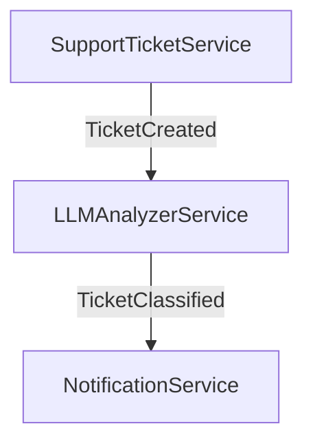

Example 2: Media Upload and Processing

- A **MediaUploadService** emits `MediaUploaded`.
- **ThumbnailService**, **AIImageTaggerService**, and **CDNUploaderService** all react in parallel:
  - generate preview
  - auto-tag images with AI
  - push to CDN

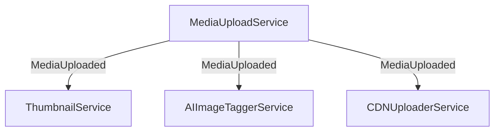

Example 3: Document Approval via Email Workflow

- A **DocumentSubmissionService** emits `DocumentSubmitted`.
- A **PDFGeneratorService** creates a PDF version and emits `DocumentReady`.
- An **EmailService** sends the document to a reviewer.
- A **WebhookService** receives the approval or rejection response via email click.

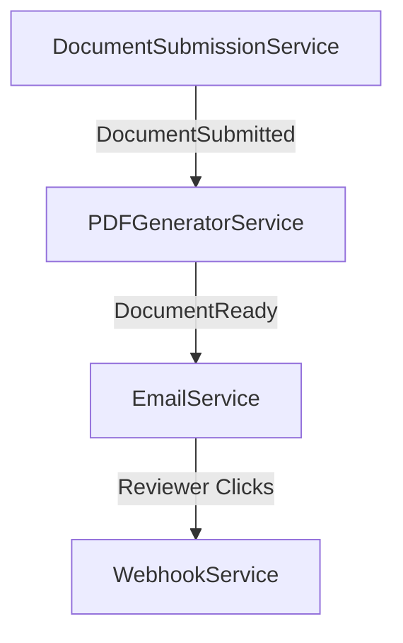

### Orchestration-based coordination

Example 1: Order Fulfillment with an Orchestrator

- A **CustomerOrderService** emits `OrderPlaced`.
- An **OrderOrchestrator** listens to this event, then triggers:
  - **PaymentProcessingService** to process the payment.
  - **InventoryService** to reserve items.
  - **ShippingService** to arrange delivery.
- Once all services finish, the orchestrator emits `OrderFulfilled`.

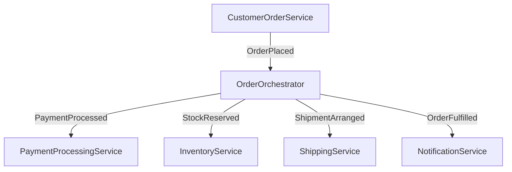

Example 2: User Onboarding Process with an Orchestrator

- A **UserRegistrationService** emits `UserRegistered`.
- An **OnboardingOrchestrator** listens and triggers:
  - **ProfileCreationService** to create a user profile.
  - **WelcomeEmailService** to send a welcome email.
  - **AuditService** to log the process.
- Once all tasks are completed, the orchestrator emits `OnboardingComplete`.

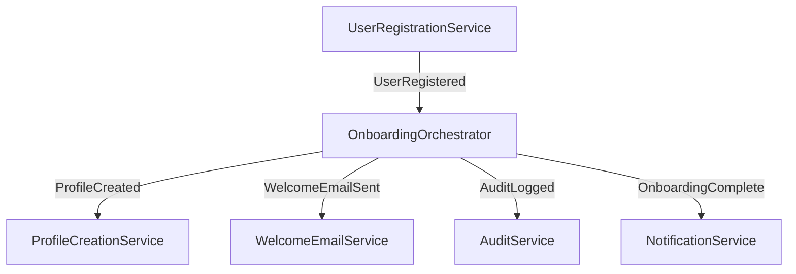

Example 3: Video Processing with an Orchestrator

- A **VideoUploadService** emits `VideoUploaded`.
- A **VideoProcessingOrchestrator** listens to this event and triggers:
  - **TranscodingService** to transcode the video.
  - **ThumbnailGenerationService** to create thumbnails.
  - **MetadataExtractionService** to analyze video metadata.
- Once all tasks are done, the orchestrator emits `VideoProcessed`.

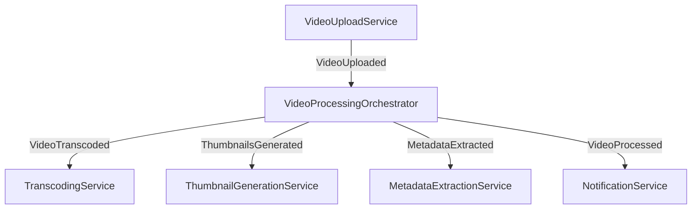

## The CQRS Pattern

### Motivation

In traditional application design, most systems interact with data using the **CRUD** model performing **C**reate, **R**ead, **U**pdate, and **D**elete operations. When designing these applications, we typically create **entity classes** and corresponding **repository classes** to handle database operations. In this approach, we use the **same model classes** for both read and write operations. Many applications work well with a straightforward CRUD model and don’t require additional complexity.

#### Challenge: Differing Read and Write Requirements
Consider an application with the following **normalized tables**:

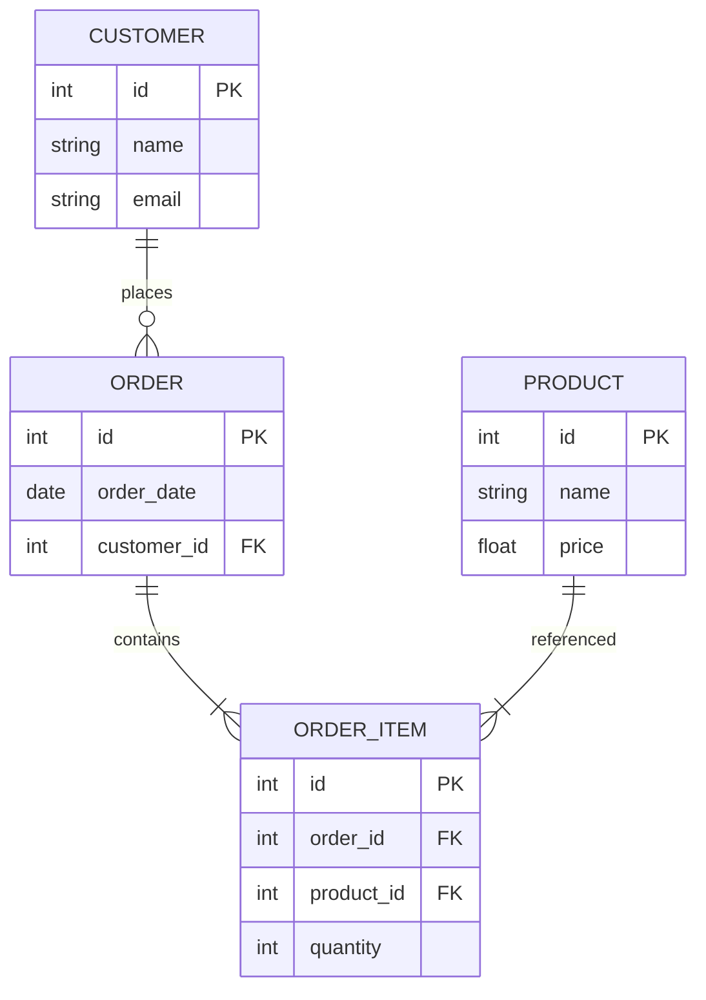

Write operations, such as creating a new product, or order, are straightforward and involve inserting data directly into the relevant tables. 

However, **read operations** often require more than just retrieving raw records (complex joins across multiple tables). For example:
- Fetching **all orders placed by a specific customer**.
- Calculating **state-wise sales**.
- Computing **product-wise sales**.

**The more we normalize our data, the easier it becomes to write, but at the cost of making reads more complex and potentially slower**.

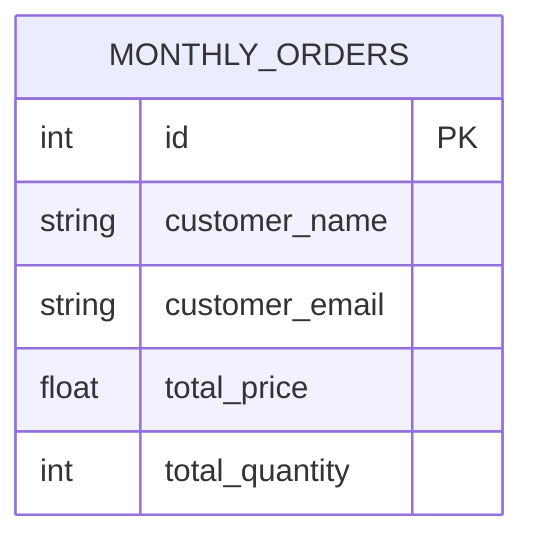

#### Challenge: Different traffic intensity between READ and WRITE operations

In most applications, **READ operations far outnumber WRITE operations**. This is especially true for web-based applications, which are typically **read-heavy**.
- **Social Media Platforms**: Users frequently check feeds, browse profiles, and search content — all of which are **read-heavy** operations.
- **Booking Applications**: Only a small percentage of users book tickets (writes), whereas the majority repeatedly search, check availability, and compare prices (reads). This creates a large disparity between **read and write workloads**.

### CQRS (Command Query Responsibility Segregation)

**The CQRS (Command Query Responsibility Segregation)** pattern separates the responsibilities of handling commands (write operations) and queries (read operations) within a software system. By decoupling commands from queries, CQRS enables better performance tuning, fault isolation, and system responsiveness—making it a strong candidate for complex, high-throughput applications.

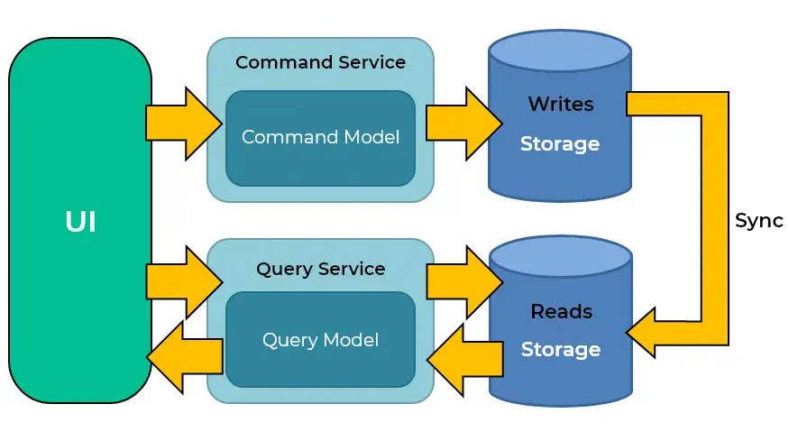

To pattern suggests to **separate read and write concerns at the architectural level** and use dedicated microservices for **READ** and **WRITE** operations.

**Benefits:**

- **Independent Scaling**: Read and write services can be scaled separately based on demand. For example, in a flight-booking application, the read service can be scaled out to handle heavy traffic, while the write service remains relatively smaller.
- **Performance Optimization**: Each service can use different data storage strategies — denormalized views, caching, or read replicas for fast queries, while the write service ensures data integrity.
- **Fault Isolation**: A failure in the write service (e.g., a database insert issue) does not impact read operations, improving system availability.

**Challenges:**

* **Increased complexity:** implementing CQRS can introduce additional complexity to your system. You need to manage the flow of data between command and query models, potentially duplicating data for different models.
* **Eventual consistency:** CQRS can lead to eventual consistency issues, where query models may not reflect the most recent changes made by commands immediately. Dealing with this inconsistency requires careful handling and synchronization.
* **Data duplication:** CQRS often involves duplicating data between command and query models, leading to increased storage requirements and complexity in keeping data synchronized.

### CQRS pattern and CAP theorem
**CQRS is inherently neither AP nor CP**, but its implementation can lean toward **AP** or **CP** depending on the consistency model used:

- **CQRS with CP**: Used in systems that require **immediate consistency**, ensuring that read and write operations are strictly synchronized (when sync after write is not available, reads fail).
- **CQRS with AP**: Common in **scalable, distributed systems** where reads are fast and based on an **eventually consistent** model (when sync after write is not available, reads might be inconsistent).

## Event Sourcing

### Motivation

In traditional CRUD-based systems, the state of an application is stored as the latest snapshot in a database. While simple, this approach has several limitations:

* **Loss of history**: Only the current state is stored; previous states are lost unless explicitly logged.
* **Complexity for auditing**: Reconstructing the history of changes requires additional logging or auditing mechanisms.
* **Challenges for distributed systems**: Maintaining consistency and traceability across services becomes harder in microservices.

**Event Sourcing** addresses these challenges by storing **all changes to the application state as a sequence of immutable events**, rather than storing just the current state. The current state can always be reconstructed by replaying the events.

### Key Concepts

1. **Events**:
   Each event represents a state change in the system. For example, in an e-commerce system:

    * `OrderCreated`
    * `PaymentProcessed`
    * `InventoryUpdated`
    * `OrderShipped`

2. **Event Store**:
   A dedicated storage system that persists all events in order. It acts as the **source of truth** for the application state. Events are **append-only** and immutable.

3. **State Reconstruction**:
   The current state of a service or entity is reconstructed by replaying events from the event store. This allows for:

    * Auditing: Every change can be traced back to its originating event.
    * Temporal queries: Ability to view the system state at any point in time.
    * Debugging: Developers can replay events to reproduce past states or issues.

4. **Integration with CQRS**:
   Event Sourcing pairs naturally with CQRS:

    * **Write model (Command side)**: Emits events instead of directly updating the database.
    * **Read model (Query side)**: Builds projections (denormalized views) by consuming these events. These projections can be optimized for queries without affecting the write model.

### Benefits

* **Auditability and traceability**: Every change is recorded as an event, creating a full audit trail.
* **Reproducibility**: The system state can be rebuilt at any point in time by replaying events.
* **Scalability**: Events can be published to multiple consumers, enabling asynchronous processing and integration with other services.
* **Resilience to failure**: As the event log is immutable, lost state can be reconstructed even after failures.

### Challenges

* **Increased complexity**: The need to manage an event store, handle event versioning, and build projections adds complexity.
* **Eventual consistency**: Read models built from events may be slightly out-of-date compared to the latest write, requiring careful handling of stale data.
* **Storage overhead**: Storing all events over time may require significant storage, though snapshots can mitigate this.
* **Debugging and reasoning**: Understanding the current state requires reasoning about sequences of events, which can be less intuitive than direct CRUD updates.

### Event Sourcing Example

For an e-commerce order service, an event-sourced workflow might look like this:

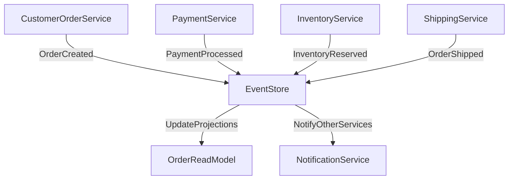

* **Command side**: Each service emits events to the **Event Store**.
* **Query side**: Events are consumed to update **read models** or trigger notifications.

### Event Sourcing and CAP Theorem

Event Sourcing can be implemented in both **AP** and **CP** systems, depending on the consistency guarantees of the event store and read models:

* **AP systems**: Read projections are eventually consistent with the write model; services continue to operate during partitions.
* **CP systems**: Writes may block during network partitions to ensure the event log remains strictly consistent.

## References
* https://www.orkes.io/what-is-conductor
* https://www.baeldung.com/cqrs-event-sourcing-java
* https://www.baeldung.com/orkes-conductor-saga-pattern-spring-boot
* https://www.baeldung.com/java-domain-driven-design-event-sourcing
* https://martinfowler.com/eaaDev/EventSourcing.html