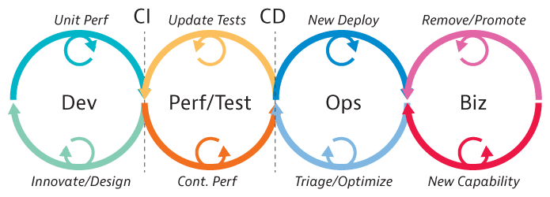
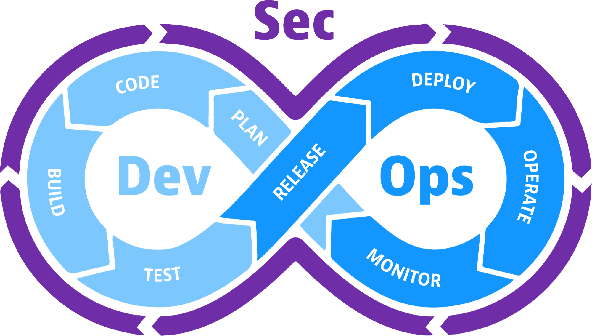

# DevOps, DevSecOps & Pre-commit hooks

## Introduction

Once we have complete the development of our microservice, we want to make it available to other microservices in a production environment.

So, we need to push it into a **Container Registry**, that store all version of our container image.

There are many **Container Registry** that we can use, such us **Docker Hub**, **GitLab Container Registry**, **GitHub Packages Registry** or we can also host our **personal Docker Registry**.

To **build** and **publish** a new version of our container image we need first to **login** to our container registry:

```bash
docker login registry.gitlab.com -u myusername --password-stdin
```

**Build** a new image with the **latest** tag:

```bash
docker build -t registry.gitlab.com/michelemosca/cloudedgecomputing:latest .
```

And **push** it into the container registry:

```bash
docker push registry.gitlab.com/michelemosca/cloudedgecomputing --all-tags
```

Once the new version of our container image is available inside the container registry, other microservices can interact with this new version by adding it as **image** inside the **docker-compose** file:

```yml
web:
    image: registry.gitlab.com/michelemosca/cloudedgecomputing:latest
    stop_signal: SIGINT
    environment:
      - SQLALCHEMY_DATABASE_URI=${SQLALCHEMY_DATABASE_URI}
    ports:
      - '80:5000'
    depends_on:
      postgres:
        condition: service_healthy
```

Force docker to **pull** the new version of the container image with the following command:

```bash
docker compose pull
```

And after all, **restart** the microservice in order to use the latest image:

```bash
docker compose up -d --build --no-deps web
```

All this operations needs to be performed **every time** we develop a new feature to our microservice.

To help us in these operations we can use **DevOps**'s practices. 

## DevOps

**DevOps** is a **collection** of flexible **practices** and **processes** organizations use to create and deliver applications and services by aligning and coordinating software development with IT operations.

The shift to DevOps is critical for organizations to support the ever-**accelerating** development speeds that customers and internal stakeholders demand. With the help of cloud-native technologies, open source solutions, and agile APIs, teams can now deliver and maintain code more **efficiently** than ever.


### How does DevOps works?

Under the DevOps model, teams dedicated to **development** and **production** no longer act separately.

Instead, in some cases, the two teams are merged into a unit in which engineers are active throughout the application lifecycle, from **development** and **testing** to **deployment** and **production**, and acquire a skill set not limited by a single function.

Teams rely on **automation** to speed up manual processes that have always been slow.
The technologies and tools used help teams get applications up and running, evolving **quickly** and **reliable**.

These tools also help technicians complete tasks that would normally have required the attention of other business units, such as **code deployment** or **infrastructure provisioning**, further increasing **efficiency**.

### Continuos Integration

Implementing DevOps often goes hand in hand with **continuous integration** (**CI**), where multiple developers commit software updates to a shared repository, often many times a day.

**CI** enables developers to **discover** integration issues and bugs earlier in the process and streamline code branches and builds.



### Continuous Delivery and Deployment

Continuous **delivery** to automate the process of delivering completed code blocks into the main branch, where it can be deployed to a production environment by the operations team.

It’s a way for the development part of a DevOps team to automate the process of **testing** and **committing** code.

Continuous **deployment** to automate the process of deploying completed, tested code into a **production environment**. 

It’s a way for the operations part of a DevOps team to automate the process of deploying new code to customers.

### DevOps Pipeline

A tipical **DevOps pipeline** is composed of **almost** 5 **stages**:

- **Lint**: perform a **static code analysis** used to flag programming errors, bugs, **stylistic** errors and suspicious constructs.
- **Test**: perform some **functional test** or **security analysis** of the code.
- **Build**: build all application's **artifacts**.
- **Package**: Use application's artifacts to build the new **container image** and push it inside the **container registry**.
- **Deploy**: make all operations that **update** the version of the current running microservice with the lastest version.

A DevOps pipeline can be enhanced by adding more stages and operations, such as for example by adding more security checks to application code before its release.

To help us in these operations we can use **DevSecOps**'s practices. 

## DevSecOps

**DevSecOps** is a tactical trifecta that connects three disciplines: **development**, **security**, and **operations**. The goal is to seamlessly integrate security into your continuous integration and continuous delivery (CI/CD) pipeline in both **pre-production** (dev/test/staging) and **production** (ops) environments.

**Release better software faster**, and **detect and respond to software flaws** in production faster and more efficiently.



### Historically

Application security has been addressed after development is completed, and by a separate team of people, separate from both the development team and the operations team.
This approach **slowed down** the development process and the reaction time.

Also, security tools themselves have historically been isolated. Each application security test looked only at that application, and often only at the source code of that application.

This made it hard for anyone to have an organization-wide view of security issues, or to understand any of the software risks in the context of the production environment.

By making **application security** part of a unified **DevSecOps** process, from initial design to eventual implementation, organizations can align the three most important components of software creation and delivery.

### Challenges in implementing DevSecOps

- The **first** challenge **involves people and culture**: You might find it necessary to retrain the people on your DevOps teams so they understand security best practices and know how to operate your new security tooling.

- A **second** challenge is **finding the right security tooling** and integrating it into your DevOps workflow: The more automated your DevSecOps tooling is, and the more integrated it is with your CI/CD pipeline, the less training and culture-shifting you need to do.

In many cases, however, choosing a more automated version of the security tools you have been using for years is not the right answer.
Your development environment has likely changed drastically over the past few years.

### Top traits of successful DevSecOps practices

This are the **key performance indicators** (**KPIs**) should you use to measure the quality of your DevSecOps initiatives:

- **Security awareness and ownership**: "Security is everyone’s responsibility"
- **Automated operation**
- **Fast results**
- **Wide scope**: Must works on all type of environments
- **Shift-left and shift-right**: Monitor the application in the in the **software development** lifecycle ("**shift left**") but also in the **production environments** ("**shift right**")
- **Accuracy**: To achieve DevSecOps efficiency, you need security tests that eliminate false positives and false negatives, and provide useful information to your remediation team
- **Developer acceptance**

## Pre-commit hooks

To make the work production more **efficient** we can implement some **pre-commit** operations.

**Git hook** scripts are useful for identifying simple issues **before** submission to code review.

We run our hooks on every commit to automatically point out issues in code such as missing semicolons, trailing whitespace, and debug statements.

By pointing these issues out before code review, this allows a code reviewer to focus on the architecture of a change while not wasting time with trivial style nitpicks.

## Hands-on

A small example of DevSecOps pipeline project can be found at [M12.2 - DevOps, DevSecOps & Pre-commit hooks (GitLab CI, GitGuardian, SemGrep, Trivy, Google Cloud VM)](M12.2%20-%20DevOps,%20DevSecOps%20&%20Pre-commit%20hooks%20(GitLab%20CI,%20GitGuardian,%20SemGrep,%20Trivy,%20Google%20Cloud%20VM).md) file.