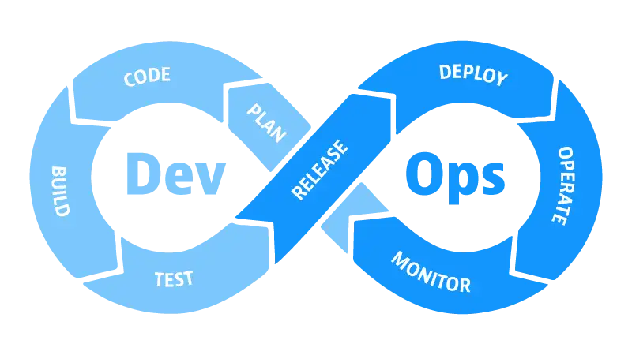
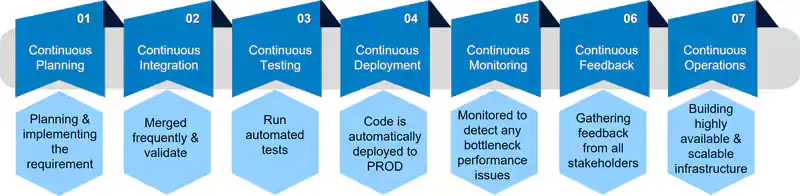
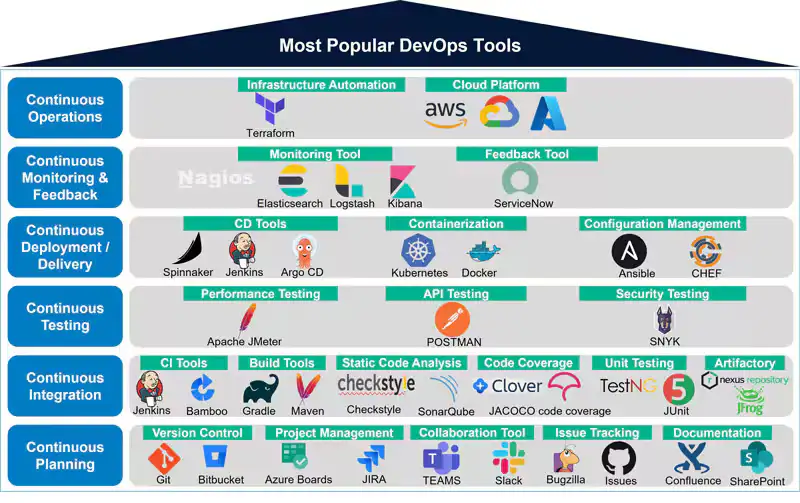
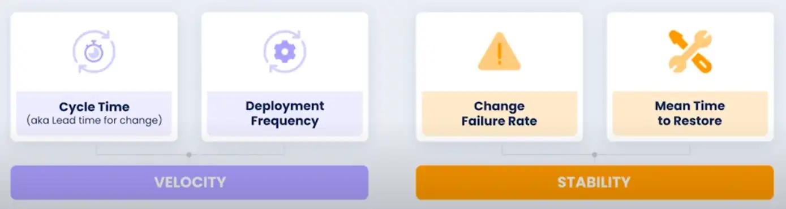
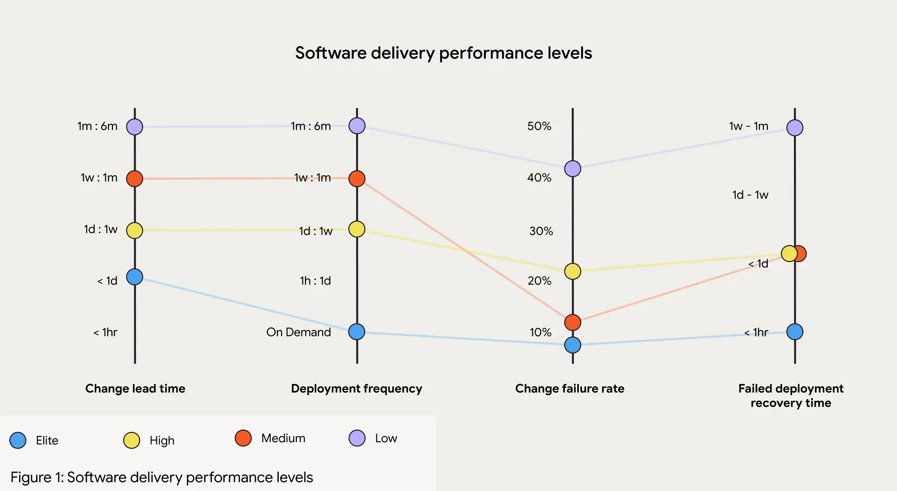

# DevOps, DevSecOps

## Brief history of software production models
The software production lifecycle consists of three essential stages, each playing a critical role in delivering a high-quality product that meets client expectations and performs reliably in a live environment:

1. **Requirements Gathering**
    - Define the scope, functionality, and specifications of the software.
    - Document requirements to guide the development process.

2. **Development and Testing**
    - Design and implement the software according to the requirements.
    - Perform testing to identify and resolve defects.

3. **Operations and Infrastructure**
    - Set up and manage the infrastructure required for the application.
    - Monitor, maintain, and update the system to ensure performance, security, and reliability.

### The Waterfall model


The waterfall model creates friction between (1) requirements gathering and (2) development due to its linear and rigid structure, where each phase must be completed before moving to the next. In this model, requirements are gathered and documented comprehensively at the start of the project, often without the flexibility to adapt to changes later. This approach assumes that clients can fully articulate their needs upfront, which is rarely the case. 

As development progresses, teams frequently discover **gaps, ambiguities, or misunderstandings** in the initial requirements, leading to delays, costly changes, or project misalignment.

- **Rigid Change Management**: Adapting to new requirements is difficult and costly.
- **Late Discovery of Issues**: Problems in requirements often surface deep into development.
- **Misalignment with Client Expectations**: What is delivered may no longer match what the client actually needs.
- **Long Feedback Loops**: Clients only see the final product, limiting opportunities for early correction.


### The Agile model


The Agile model eases the friction between (1) requirements gathering and (2) development by adopting an iterative and flexible approach to software production. Instead of trying to define all requirements upfront, Agile promotes collaboration and continuous feedback throughout the development lifecycle. Requirements are gathered incrementally and revisited during each iteration, allowing for adjustments based on client feedback, changing needs, or new insights. 

However, it neglects the operational aspects of software production leading to friction between (2) development and (3) operations:

- **Limited Integration with Operations**: Dev teams might build features without thinking about how they’ll be deployed, scaled, or maintained.
- **Deployment as an Afterthought**: Shipping to production happens late in the cycle and often causes problems.
- **Operational Silos**: Developers and operations work separately with little collaboration.
- **Insufficient Monitoring and Feedback**: Once the software is live, there's weak feedback from production issues back into the development cycle.

## The DevOps model

**What they say it is:**
- DevOps is a set of practices, tools, and a cultural philosophy that automates and integrates the processes between software development and IT teams, emphasizing team empowerment, cross-team communication, and technology automation. (Atlassian)
- DevOps is a collaborative and multidisciplinary organizational effort to automate the continuous delivery of new software updates while ensuring their correctness and reliability. ([Leite et al., 2020](https://arxiv.org/abs/1909.05409))

**What it is:**
- **Teams integrate into a single unit**, where engineers participate throughout the entire application lifecycle, from development to production (*you build it, you run it*).
- Teams use **automation** to accelerate traditionally slow, manual processes. DevOps tools and technologies enable faster, more reliable deployment and continuous evolution of applications

**What implies for Developers:**
- **Increased Automation**: Automation allows fewer people to manage more code and handle increased complexity, but this can create a more stressful environment as the responsibility scales.
- **Ownership and Accountability**: When something breaks, developers are called to fix it. This encourages developers to write better, more robust code, increase test coverage, and enhance observability, ensuring smoother and more reliable operations.



### The 7 C's





1. **Continuous Planning**  
   This phase involves planning and developing the software. Development is broken into smaller tasks, following Agile methodologies that focus on “just-in-time” requirements. It includes defining user stories and refining the product backlog.

2. **Continuous Integration**  
   In this phase, developers write code and push changes to the source code management system. All code changes are merged frequently and validated through automated builds, tests, and security checks. This helps the team identify issues early in the development process. **Continuous Delivery** refers to the continuous creation of an updated software artifact (e.g., mvn package/docker build).

3. **Continuous Testing**  
   This phase involves writing and running automated test cases using various tools such as Selenium, JUnit, and TestNG. Automated tests help ensure that the software is functioning correctly and meets quality standards.

4. **Continuous Deployment**  
   In this phase, application code is automatically deployed to production environments, facilitating seamless delivery. This ensures that new features and fixes are rapidly available to users.

5. **Continuous Monitoring**  
   This phase ensures that systems and applications are continuously monitored to detect any bottlenecks, performance issues, or downtime. Alerts can be set to notify stakeholders, allowing for timely action to resolve any issues.

6. **Continuous Feedback**  
   This crucial phase involves gathering feedback from all stakeholders, including developers, testers, product owners, and end users. This feedback helps the team identify what went well and what can be improved, driving continuous improvement in the development process.

7. **Continuous Operations**  
   This phase ensures that systems are available 24/7. It focuses on building highly available and scalable infrastructure through automation to minimize downtime and ensure reliability.

### Real-world pipeline

1. **Terraform** provisions infrastructure:
   - Terraform is used to **create cloud resources**, such as virtual machines (VMs), storage, networks, and managed Kubernetes clusters (like EKS, GKE, or AKS).

   ```hcl
   resource "aws_instance" "example" {
     ami           = "ami-12345678"
     instance_type = "t2.micro"
   }
   ```

2. **Puppet** configures the servers:
   - Once the infrastructure is provisioned, **Puppet** installs software packages, configures security settings, and ensures servers are properly configured.
   - Example: Puppet installs Docker and Kubernetes components on the provisioned VMs.

   ```puppet
   package { 'docker':
     ensure => installed,
   }

   service { 'docker':
     ensure => running,
     enable => true,
   }
   ```

3. **Maven** builds and manages Java projects:
   - Developers write Java code and commit it to the Git repository.
   - **Maven** is used to handle tasks like compiling the code, running tests, and packaging it into a `.jar` or `.war` file.

   ```bash
   mvn clean install
   ```

4. **Jenkins** / **GitLab CI/CD** automates build, test, and deploy cycles:
   - **Jenkins** is set up to automate the Maven build and test process.
   - On every code push, Jenkins triggers the Maven build to run tests and create a deployable artifact.
   - Jenkins also deploys the artifact to the appropriate environment (like staging or production).

   ```groovy
   pipeline {
     agent any
     stages {
       stage('Build') {
         steps {
           sh 'mvn clean install'
         }
       }
       stage('Deploy') {
         steps {
           // Deploy the artifact to Docker or Kubernetes
           sh 'kubectl apply -f deployment.yaml'
         }
       }
     }
   }
   ```

5. **Docker** packages the app into containers:
   - After the build, the artifact (e.g., `.jar` file) is packaged into a **Docker container** using a `Dockerfile`.

   ```dockerfile
   FROM openjdk:11-jdk
   COPY target/myapp.jar /app/myapp.jar
   ENTRYPOINT ["java", "-jar", "/app/myapp.jar"]
   ```

6. **Kubernetes** orchestrates and scales containers:
   - The Docker containers are deployed into a **Kubernetes cluster**.
   - Kubernetes manages scaling, networking, and fault tolerance for the app containers, ensuring high availability.

   ```yaml
   apiVersion: apps/v1
   kind: Deployment
   metadata:
     name: myapp-deployment
   spec:
     replicas: 3
     selector:
       matchLabels:
         app: myapp
     template:
       metadata:
         labels:
           app: myapp
       spec:
         containers:
           - name: myapp-container
             image: myapp:latest
             ports:
               - containerPort: 8080
   ```

7. **OpenTelemetry** monitors the systems:
   - **OpenTelemetry** is integrated into the Kubernetes cluster to collect application performance metrics, traces, and logs from your containers and Kubernetes services.

8. **Grafana** visualizes metrics and traces:
   - The data collected by **OpenTelemetry** is sent to a backend storage (like **Prometheus**).
   - **Grafana** is used to visualize this data by creating dashboards to monitor system health, performance, and business metrics.

### Infrastructure as Code (IaC)

Infrastructure as Code (IaC) is the practice of managing and provisioning computing infrastructure through machine-readable definition files, rather than through manual processes. This approach automates the setup and configuration of environments, ensuring consistency, reducing human error, and speeding up deployment cycles. 

- **Terraform**: Cloud provisioning tool that uses declarative configuration (HCL) to manage infrastructure across multiple cloud providers.
- **Puppet**: Configuration management tool using a declarative language to enforce desired system states, supports agent-based and agentless models.
- **Chef**: Configuration management tool using a Ruby-based DSL, defines infrastructure as "recipes" and "cookbooks," highly flexible for complex environments.
- **Ansible**: Configuration management and orchestration tool, agentless, uses YAML for simple automation.
- **Helm**: Package manager for Kubernetes, simplifies deployment and management of applications on Kubernetes clusters using YAML-based charts.

### Key Performance Indicators (KPIs)

**Deployment Frequency**: Measures how often updates are released to production. High-performing teams deploy multiple times a day, requiring a highly automated pipeline with thorough testing and minimal manual intervention.

**Change Failure Rate**: Tracks the percentage of deployments that need immediate fixes or rollbacks. High-performing teams aim for a failure rate between 0% and 15%, achieved through test automation and early defect detection.

---


**Lead Time**: The total time from request to full deployment of a product or feature, encompassing the entire development and delivery workflow. A key indicator of organizational efficiency.

**Cycle Time**: The time it takes to complete a specific part of the workflow, from development start to task completion, often including reviews and testing but not deployment. This metric highlights team productivity and potential bottlenecks.

**Lead Time for Changes**: Measures the time from a code commit to deployment in production. Short lead times indicate efficient workflows with quick feedback loops and minimal delays.

---


- **Mean Time to Failure (MTTF)**: The average time a system or service operates before failing. A high MTTF indicates robust system design and low unexpected downtime.

- **Mean Time to Detect (MTTD)**: The average time to identify a failure, performance issue, or security problem. Low MTTD ensures quick response to minimize impact on users and business.

- **Mean Time to Recovery (MTTR)**: The average time needed to restore a service after a failure. A low MTTR reflects efficient incident response, with practices like continuous monitoring and automated recovery.

- **Mean Time Between Failures (MTBF)**: The average time between successive system failures. A high MTBF suggests system stability, while low MTBF calls for improvements in reliability and fault tolerance.

### The DORA metrics
The DORA metrics were developed by the DevOps Research and Assessment (DORA) organization, which spent years studying engineering teams and their DevOps processes. They also deliver an interesting [annual report](../../../books/dora-report-2024.pdf).



These metrics are valuable because:
* they correlate with business outcomes and employee satisfaction, offering industry standards for benchmarking. 
* push teams to focus on continuous improvement.
* only four key metrics are needed to differentiate elite engineering teams from mediocre ones.



How to improve DORA metrics within an organization?

1. **Reduction of the Codebase**  
   Reducing the size and complexity of the codebase, such as by adopting microservices, makes the system easier to maintain and scale. Smaller, independently deployable services are less prone to failures, which improves **Change Failure Rate** and **Time to Restore Service**. Additionally, this allows for faster and more frequent deployments, boosting **Deployment Frequency**.

2. **Smaller Pull Requests**  
   Encourage developers to make smaller, more frequent pull requests rather than large, infrequent ones. Smaller pull requests are easier to review, merge, and test, reducing the risk of issues and speeding up the overall development process, which directly impacts **Lead Time for Changes**.

3. **Automate CI/CD Pipelines**  
   Automating your continuous integration (CI) and continuous delivery (CD) pipelines is essential for improving both **Deployment Frequency** and **Lead Time for Changes**. This reduces manual errors, accelerates testing and deployment processes, and ensures fast, consistent releases.

4. **Implement Blue/Green or Canary Deployments**  
   These deployment strategies reduce the impact of failed releases by gradually introducing changes to a small subset of users before scaling. This minimizes risk and downtime, improving both **Change Failure Rate** and **Time to Restore Service**.

## The DevSecOps model


### Motivation

**Application security has traditionally been handled after development is completed**, often by a team separate from both the development and operations teams. This approach slowed down development and delayed response times to security issues.

Furthermore, **security tools have typically operated in isolation**, with each application security test focusing only on a single application, often just examining its source code. This made it difficult to gain an **organization-wide view of security concerns** or to assess software risks in the context of the production environment.

### Definition

By integrating application security into a unified DevSecOps process—from the initial design phase to implementation—organizations can align development, security, and operations. **This approach ensures that security is continuously prioritized throughout the software lifecycle**, resulting in a more efficient, collaborative, and secure process for building and maintaining applications.

The primary goal of **DevSecOps** is to embed security practices into the continuous integration and continuous delivery (CI/CD) pipeline across both **pre-production** (development, testing, staging) and **production** (operations) environments.

By adopting DevSecOps, teams can **release higher-quality software more quickly** and **detect and respond to software vulnerabilities** in production with greater efficiency.


### Challenges

One of the primary challenges in implementing DevSecOps is addressing the people and culture aspect. It often **requires retraining DevOps teams to understand security best practices** and effectively use new security tools. This cultural shift is essential for embedding security into the development process from the outset.

Another key challenge is **selecting the right security tools and integrating them seamlessly into your DevOps workflow**. The more automated and well-integrated your DevSecOps tooling is within the CI/CD pipeline, the less training and cultural adjustment will be needed. This seamless integration ensures that security measures are applied continuously and without friction. 

### Key Performance Indicators (KPIs)

1. **Mean Time to Detect (MTTD) and Mean Time to Remediate (MTTR)**
   - **MTTD**: This metric measures the average time taken to detect security incidents or vulnerabilities. It indicates the effectiveness of security monitoring, detection systems, and incident response processes in identifying potential threats.
   - **MTTR**: This metric measures the average time required to remediate or mitigate security incidents or vulnerabilities after they are detected. It reflects the efficiency of incident response, patch management, and vulnerability resolution processes.

2. **Number of Security Vulnerabilities**  
   This metric quantifies the total number of vulnerabilities identified during the development cycle. It helps track trends in the identification, remediation, and resolution of security flaws, ensuring that they are addressed promptly before deployment.

3. **Code Review Findings**  
   This metric tracks the number and severity of security issues discovered during code reviews. It reflects the effectiveness of secure coding practices, the use of code analysis tools, and developer awareness in identifying and addressing code-level vulnerabilities.

4. **Deployment Frequency**  
   This metric measures how frequently software deployments are made to production. It indicates how seamlessly security practices are integrated into the deployment pipeline and highlights the ability to deliver secure software at a fast pace while maintaining quality.

5. **Security Test Coverage**  
   This metric evaluates the extent to which security testing is performed during the development lifecycle. It assesses the thoroughness of security assessments, including penetration testing, vulnerability scanning, and static/dynamic analysis, ensuring that security issues are detected early in the process.

## Resources
- [DevOps at Netflix](https://www.youtube.com/watch?v=m-gkDpmdTqI)
- [DORA Metrics: We've Been Using Them Wrong](https://www.youtube.com/watch?v=H3nlvHQHb5E)