# DevOps, DevSecOps

## Brief history of software production models
The software production lifecycle consists of three essential stages, each playing a critical role in delivering a high-quality product that meets client expectations and performs reliably in a live environment:

1. **Requirements Gathering**
    - Define the scope, functionality, and specifications of the software.
    - Document requirements to guide the development process.

2. **Development and Testing**
    - Design and implement the software according to the requirements.
    - Perform testing to identify and resolve defects.

3. **Operations and Infrastructure**
    - Set up and manage the infrastructure required for the application.
    - Monitor, maintain, and update the system to ensure performance, security, and reliability.

### The Waterfall model


The waterfall model creates friction between (1) requirements gathering and (2) development due to its linear and rigid structure, where each phase must be completed before moving to the next. In this model, requirements are gathered and documented comprehensively at the start of the project, often without the flexibility to adapt to changes later. This approach assumes that clients can fully articulate their needs upfront, which is rarely the case. 

As development progresses, teams frequently discover **gaps, ambiguities, or misunderstandings** in the initial requirements, leading to delays, costly changes, or project misalignment.

- **Rigid Change Management**: Adapting to new requirements is difficult and costly.
- **Late Discovery of Issues**: Problems in requirements often surface deep into development.
- **Misalignment with Client Expectations**: What is delivered may no longer match what the client actually needs.
- **Long Feedback Loops**: Clients only see the final product, limiting opportunities for early correction.


### The Agile model


The Agile model eases the friction between (1) requirements gathering and (2) development by adopting an iterative and flexible approach to software production. Instead of trying to define all requirements upfront, Agile promotes collaboration and continuous feedback throughout the development lifecycle. Requirements are gathered incrementally and revisited during each iteration, allowing for adjustments based on client feedback, changing needs, or new insights. 

However, it neglects the operational aspects of software production leading to friction between (2) development and (3) operations:

- **Limited Integration with Operations**: Dev teams might build features without thinking about how they’ll be deployed, scaled, or maintained.
- **Deployment as an Afterthought**: Shipping to production happens late in the cycle and often causes problems.
- **Operational Silos**: Developers and operations work separately with little collaboration.
- **Insufficient Monitoring and Feedback**: Once the software is live, there's weak feedback from production issues back into the development cycle.

## The DevOps model

**What they say it is:**
- DevOps is a set of practices, tools, and a cultural philosophy that automates and integrates the processes between software development and IT teams, emphasizing team empowerment, cross-team communication, and technology automation. (Atlassian)
- DevOps is a collaborative and multidisciplinary organizational effort to automate the continuous delivery of new software updates while ensuring their correctness and reliability. ([Leite et al., 2020](https://arxiv.org/abs/1909.05409))

**What it is:**
- **Teams integrate into a single unit (*you build it, you run it*)**, where developers participate throughout the entire application lifecycle, from development to production.
- Teams use **automation** to accelerate manual processes. DevOps tools and technologies enable faster, more reliable deployment.
- Despite originally defined for monolithic architectures, DevOps practices are **highly beneficial in managing distributed systems**, which are inherently difficult to operate manually.

**What implies for Developers:**
* **When something breaks, developers are called to fix it**. This encourages developers to write more robust code, increase test coverage, enhance observability etc.

* Automation allows fewer people to manage more code and handle increased complexity, but this can create a more stressful environment as the **responsibility scales**.


**The 7 C's**


1. **Continuous Planning**  
   This phase involves planning and developing the software. Development is broken into smaller tasks, following Agile methodologies that focus on “just-in-time” requirements. It includes defining user stories and refining the product backlog.

2. **Continuous Integration**  
   In this phase, developers write code and push changes to the source code management system. All code changes are merged frequently and validated through automated builds, tests, and security checks. This helps the team identify issues early in the development process. **Continuous Delivery** refers to the continuous creation of an updated software artifact (e.g., mvn package/docker build).

3. **Continuous Testing**  
   This phase involves writing and running automated test cases using various tools such as Selenium, JUnit, and TestNG. Automated tests help ensure that the software is functioning correctly and meets quality standards.

4. **Continuous Deployment**  
   In this phase, application code is automatically deployed to production environments, facilitating seamless delivery. This ensures that new features and fixes are rapidly available to users.

5. **Continuous Monitoring**  
   This phase ensures that systems and applications are continuously monitored to detect any bottlenecks, performance issues, or downtime. Alerts can be set to notify stakeholders, allowing for timely action to resolve any issues.

6. **Continuous Feedback**  
   This crucial phase involves gathering feedback from all stakeholders, including developers, testers, product owners, and end users. This feedback helps the team identify what went well and what can be improved, driving continuous improvement in the development process.

7. **Continuous Operations**  
   This phase ensures that systems are available 24/7. It focuses on building highly available and scalable infrastructure through automation to minimize downtime and ensure reliability.

## General concepts

### Domain Specific Language (DSL)

Domain-Specific Languages (DSLs) are widely used in CI/CD to simplify automation and pipeline management. These DSLs are designed to handle specific tasks in the CI/CD process, making it easier to define, manage, and maintain workflows.

| **Aspect**      | **Declarative DSL** | **Imperative DSL** |
| --------------- | ---- | -------------- |
| **Definition**  | Describes *what* needs to be done | Describes *how* tasks should be performed |
| **Examples**    | YAML | Groovy, Bash   |
| **Ease of Use** | Simple, easy to configure, more abstract | Greater control, flexible but more complex |
| **Control**     | Limited control over execution flow | Full control over logic and task execution |
| **Use Cases**   | Standardized workflows, repeatable tasks | Custom, complex tasks and workflows |
| **Maintenance** | Easier to maintain, less code to write | Harder to maintain due to complexity |

### Infrastructure as Code (IaC)

**Infrastructure as Code (IaC)** is the practice of **managing and provisioning infrastructure through machine-readable definition files** — rather than through manual processes.

* **Declarative or Imperative**: You can describe the *desired end state* (declarative) or the *steps to reach it* (imperative).
* **Version-controlled**: Infrastructure code is stored in systems like Git for traceability, review, and rollback.
* **Repeatable**: The same code can be used to create identical environments.
* **Automated**: Tools execute code to provision, update, or destroy resources automatically.


### Configuration as Code
Configuration drift happens when a system’s actual state diverges from its intended configuration.

**What causes configuration drift?**
* Manual changes made directly on systems (e.g., via SSH)
* Failed or partial deployments
* Unmanaged updates or patches
* Lack of version control in configuration files

**Why is configuration drift a problem?**
* Leads to **inconsistencies** across servers
* Makes **debugging and troubleshooting** harder
* Violates **security baselines**, audit requirements
* Can lead to **[compliance](https://www.tripwire.com/solutions/compliance) drift**

**How to detect configuration drift?**

1. Manually monitor. This is incredibly time-consuming and therefore is not done on a regular basis, if at all.

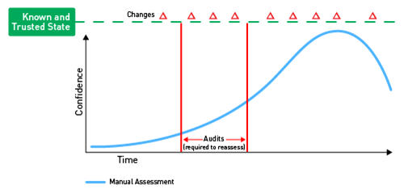

2. Scan for compliance. While not as tedious as the first level, this still requires a certain level of interaction to create administrative credentials for the tool to scan with, as well as someone to schedule or run the scans when required and remediate the results. This is typically done once a month or once a quarter to try to get ahead of the audit process.
   
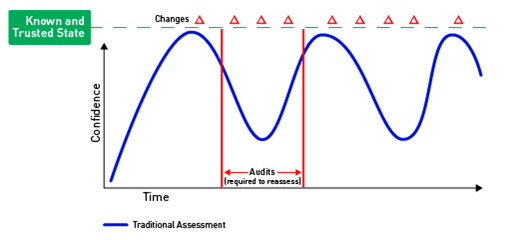

3. Monitor all systems in a near real-time manner. This would require that the systems are provisioned with a lightweight agent that can monitor/update the systems continuously.
   
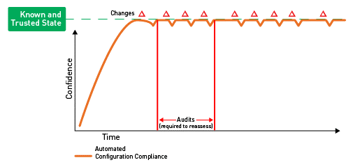


### GitOps

**GitOps** is a DevOps methodology that uses **Git as the single source of truth** for defining and managing **infrastructure and application configurations**.

With GitOps, all changes to your infrastructure or applications are made by **modifying Git repositories**, and then **automated systems** apply those changes to the runtime environment.

Key Principles:

* **Declarative Infrastructure**: Your system's desired state is described declaratively.
* **Version-controlled**: Infrastructure code is stored in systems like Git for traceability, review, and rollback.
* **Automated Delivery**: Agents or CI/CD pipelines detect changes in Git and automatically apply them.
* **Continuous Reconciliation**: The actual state of the system is continuously compared to the desired state in Git, and drift is corrected.
  * Chef InSpec
  * Ansible lint
  * DriftCTL (Terraform)

## DevOps Pipelines Overview

| **Stage**                       | **Purpose**                                    | **Tools**                             |
| ------------------------------- | ---------------------------------------------- |---------------------------------------|
| 1. Infrastructure Provisioning  | Define and create infrastructure as code (IaC) | Terraform                             |
| 2. Configuration Management     | Install software and configure instances       | Ansible, Puppet, Chef                 |
| 3. Build and Test Automation    | Compile code, run tests, and build artifacts   | Jenkins, GitHub Actions, Gitlab CI/CD |
| 4. Deployment Automation        | Deploy apps to test/staging/prod environments  | Jenkins, Ansible, Helm, ArgoCD        |
| 5. Monitoring and Observability | Track metrics, logs, and traces                | OpenTelemetry, Grafana, Prometheus    |

### Infrastructure Provisioning

* **What it does**: Provision cloud infrastructure (EC2, VPCs, load balancers, etc.) using declarative configuration (Infrastructure As Code).
* **Use case**: You define resources in `.tf` files and apply them via `terraform apply`.

[**Terraform**](https://www.terraform.io/)
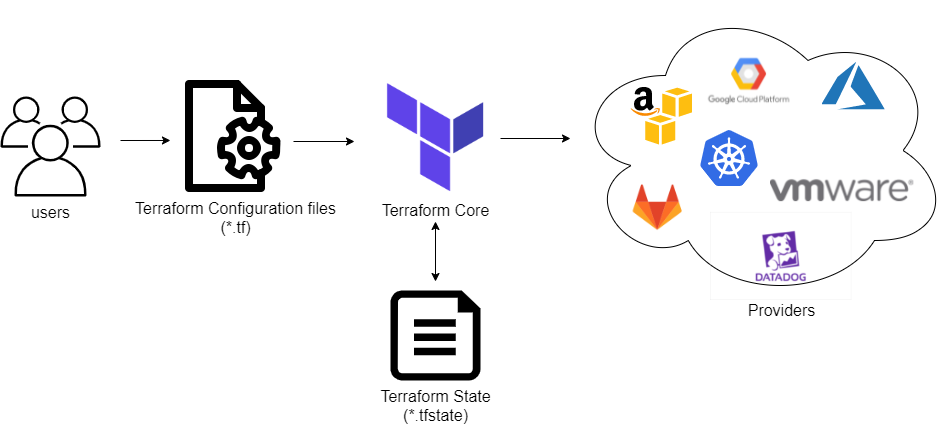

### Configuration Management

* **What it does**: Tools based on textual configuration files (recipes, playbooks, etc.) which define automation tasks (installing software, configuring services, copying files, or restarting servers) to be executed on remote systems.
* **Use case**: Install NGINX, set environment variables, deploy SSH keys.

[**Chef**](https://www.chef.io/) (Master/Agent, Imperative, Ruby DSL, Hard to learn). Ohai is a system profiling tool used by Chef to collect detailed information about the node (i.e., the system or server) where the Chef client is running.
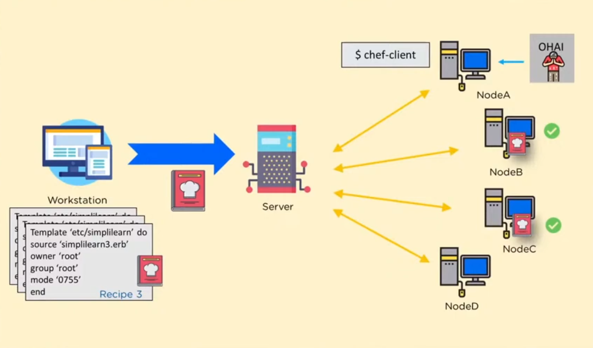

```text
# Install Apache package
package 'httpd' do
  action :install
end

# Start and enable the Apache service
service 'httpd' do
  action [:enable, :start]
end

# Create a custom homepage
file '/var/www/html/index.html' do
  content '<h1>Welcome to My Web Server!</h1>'
  mode '0644'
  owner 'root'
  group 'root'
end

```

[**Puppet**](https://puppet.com/): (Master/Agent, Declarative, Ruby DSL, Hard to learn)
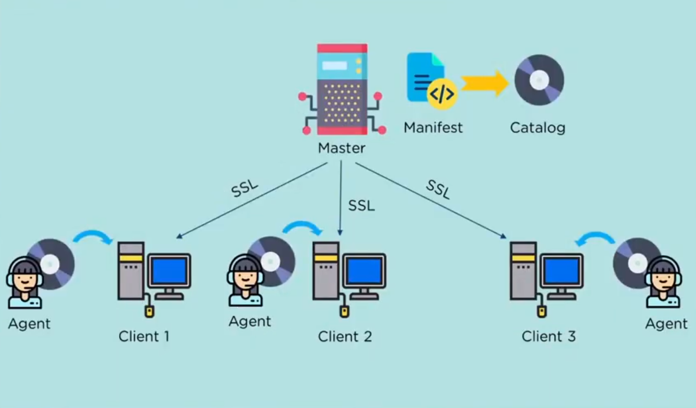

```text
# Install Apache package
package { 'httpd':
  ensure => installed,
}

# Enable and start the Apache service
service { 'httpd':
  ensure     => running,
  enable     => true,
  require    => Package['httpd'],
}

# Create a custom homepage
file { '/var/www/html/index.html':
  ensure  => file,
  content => '<h1>Welcome to My Web Server!</h1>',
  mode    => '0644',
  owner   => 'root',
  group   => 'root',
  require => Package['httpd'],
}
```

[**Ansible**](https://www.ansible.com/): (Agentless, Imperative, YAML DSL, Easy to learn)
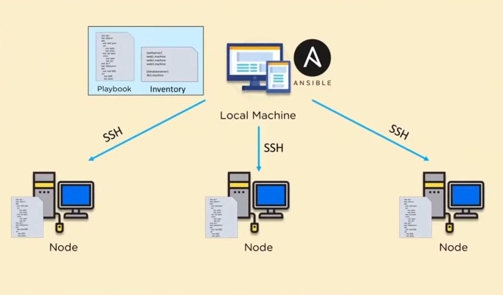

```text
- name: Setup Apache on web servers
  hosts: webservers
  become: true

  tasks:
    - name: Install Apache
      package:
        name: httpd
        state: present

    - name: Start and enable Apache service
      service:
        name: httpd
        state: started
        enabled: yes

    - name: Create custom homepage
      copy:
        dest: /var/www/html/index.html
        content: "<h1>Welcome to My Web Server!</h1>"
        owner: root
        group: root
        mode: '0644'
```

---

### Build and Test Automation

* **What it does**: Automates build, test, package, deploy steps using pipelines.
* **Use case**:
   1. Triggered by a `git push`.
   2. Pulls code, runs `mvn test`, builds a Docker image, pushes to a registry.

[**Jenkins**](https://www.jenkins.io/): (Master/Agent, Imperative, Groovy DSL)
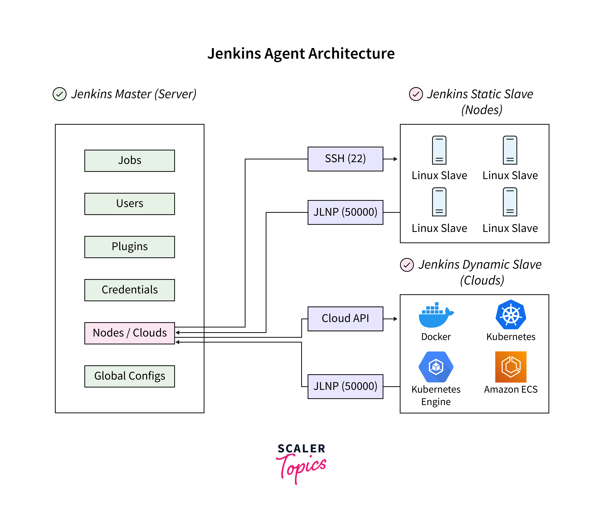

```groovy
pipeline {
    agent any

    environment {
        DOCKER_IMAGE = 'yourdockerhubusername/springboot-app'
        DOCKER_CREDENTIALS_ID = 'docker-hub-credentials'
    }

    stages {
        stage('Checkout') {
            steps {
                git 'https://github.com/your-org/your-spring-boot-app.git'
            }
        }

        stage('Build') {
            steps {
                sh './mvnw clean package -DskipTests=false'
            }
        }

        stage('Test') {
            steps {
                sh './mvnw test'
            }
        }

        stage('Build Docker Image') {
            steps {
                script {
                    dockerImage = docker.build("${DOCKER_IMAGE}:${env.BUILD_NUMBER}")
                }
            }
        }

        stage('Push to Docker Hub') {
            steps {
                script {
                    docker.withRegistry('https://index.docker.io/v1/', DOCKER_CREDENTIALS_ID) {
                        dockerImage.push()
                        dockerImage.push('latest')
                    }
                }
            }
        }
    }

    post {
        always {
            echo "Cleaning up..."
            sh 'docker image prune -f'
        }
        success {
            echo "Pipeline completed successfully!"
        }
        failure {
            echo "Pipeline failed!"
        }
    }
}
```

[**GitHub Actions**](https://github.com/features/actions): (Cloud-based ephemeral runners, YAML, Declarative/Imperative)


```yaml
name: Build and Push Spring Boot App

on:
  push:
    branches: [ "main" ]
  pull_request:
    branches: [ "main" ]

jobs:
  build:
    runs-on: ubuntu-latest

    env:
      DOCKER_IMAGE: yourdockerhubusername/springboot-app

    steps:
      - name: Checkout code
        uses: actions/checkout@v3

      - name: Set up JDK 21
        uses: actions/setup-java@v4
        with:
          java-version: '21'
          distribution: 'temurin'

      - name: Set up Docker Buildx
        uses: docker/setup-buildx-action@v3

      - name: Build with Maven
        run: ./mvnw clean package -DskipTests=false

      - name: Run tests
        run: ./mvnw test

      - name: Log in to Docker Hub
        uses: docker/login-action@v3
        with:
          username: ${{ secrets.DOCKERHUB_USERNAME }}
          password: ${{ secrets.DOCKERHUB_TOKEN }}

      - name: Build and push Docker image
        uses: docker/build-push-action@v5
        with:
          context: .
          push: true
          tags: |
            ${{ env.DOCKER_IMAGE }}:${{ github.run_number }}
            ${{ env.DOCKER_IMAGE }}:latest

      - name: Clean up Docker
        run: docker system prune -af
```

---

### Deployment Automation — **Jenkins + Ansible / Helm / ArgoCD**

* After Jenkins builds the artifact, it can:

   * Run an **Ansible playbook** to deploy to EC2.
   * Deploy to **Kubernetes** using **Helm** charts.
   * Trigger a **GitOps workflow** via **ArgoCD**.
* **Goal**: Make deployment repeatable, fast, and reliable across environments (dev, test, prod).


### Monitoring and Observability — **OpenTelemetry + Grafana**

* **Tool: OpenTelemetry**

   * **What it does**: Standardized collection of logs, metrics, and traces.
   * **Use**: Instrument code and export data to backends (Prometheus, Jaeger, etc.).

* **Tool: Grafana**

   * **What it does**: Visualizes metrics and dashboards using data from Prometheus, Loki, etc.
   * **Use**: Track CPU usage, request latency, memory, error rates.

### Key Performance Indicators (KPIs)

**Deployment Frequency**: Measures how often updates are released to production. High-performing teams deploy multiple times a day, requiring a highly automated pipeline with thorough testing and minimal manual intervention.

**Change Failure Rate**: Tracks the percentage of deployments that need immediate fixes or rollbacks. High-performing teams aim for a failure rate between 0% and 15%, achieved through test automation and early defect detection.

---


**Lead Time**: The total time from request to full deployment of a product or feature, encompassing the entire development and delivery workflow. A key indicator of organizational efficiency.

**Cycle Time**: The time it takes to complete a specific part of the workflow, from development start to task completion, often including reviews and testing but not deployment. This metric highlights team productivity and potential bottlenecks.

**Lead Time for Changes**: Measures the time from a code commit to deployment in production. Short lead times indicate efficient workflows with quick feedback loops and minimal delays.

---


- **Mean Time to Failure (MTTF)**: The average time a system or service operates before failing. A high MTTF indicates robust system design and low unexpected downtime.

- **Mean Time to Detect (MTTD)**: The average time to identify a failure, performance issue, or security problem. Low MTTD ensures quick response to minimize impact on users and business.

- **Mean Time to Recovery (MTTR)**: The average time needed to restore a service after a failure. A low MTTR reflects efficient incident response, with practices like continuous monitoring and automated recovery.

- **Mean Time Between Failures (MTBF)**: The average time between successive system failures. A high MTBF suggests system stability, while low MTBF calls for improvements in reliability and fault tolerance.

### The DORA metrics
The DORA metrics were developed by the DevOps Research and Assessment (DORA) organization, which spent years studying engineering teams and their DevOps processes. They also deliver an interesting [annual report](../../../books/dora-report-2024.pdf).


These metrics are valuable because:
* they correlate with business outcomes and employee satisfaction, offering industry standards for benchmarking. 
* push teams to focus on continuous improvement.
* only four key metrics are needed to differentiate elite engineering teams from mediocre ones.


How to improve DORA metrics within an organization?

1. **Monitor**  
   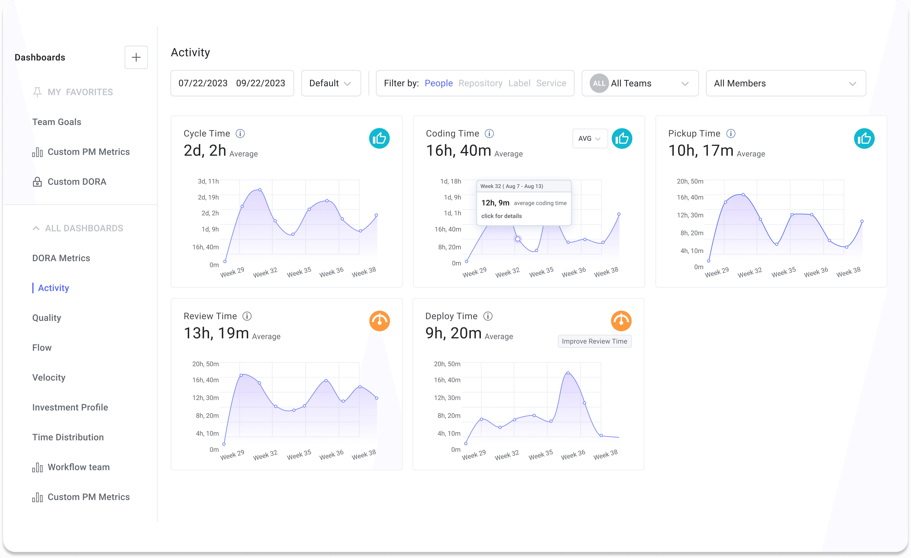

   [LinearB Dashboard](https://linearb.io/blog/dora-metrics)

1. **Reduction of Codebase Size**  
   Reducing size/complexity of the codebase (e.g., microservices) improves **Change Failure Rate**, **Time to Restore Service**, and **Deployment Frequency**.

2. **Reduction of PR Size**  
   Smaller pull requests are easier to review, merge, and test, reducing the risk of issues and speeding up the overall development process, which directly impacts **Lead Time for Changes**.

3. **Automate CI/CD Pipelines**  
   Automating continuous integration/delivery pipelines reduces manual errors, accelerates testing and deployment processes improving both **Deployment Frequency** and **Lead Time for Changes**. 

4. **Implement Deployments Strategies**  
   Deployment strategies reduce the impact of failed releases by gradually introducing changes to a small subset of users before improving both **Change Failure Rate** and **Time to Restore Service**.

## Deployment Strategies

**Blue-Green Deployment** uses two identical environments—one active (blue) and one idle (green). The new version is deployed to the idle environment and tested. Once verified, all traffic is instantly switched to it. This minimizes downtime and makes rollback simple by redirecting traffic back to the old environment if needed. It's ideal for major upgrades that require minimal disruption.

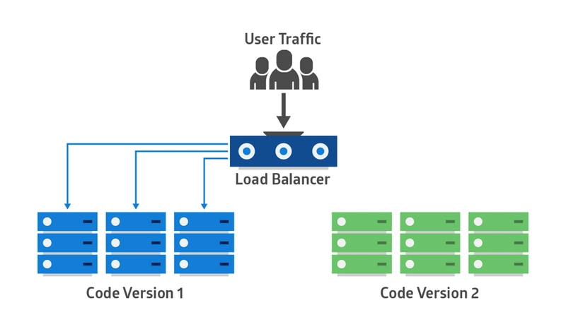

**Rolling Deployment** gradually replaces old instances of the application with new ones across the infrastructure. All users are progressively exposed to the new version as the update spreads. This approach avoids full downtime, but rollbacks are more involved since already updated instances must be reverted individually. It works well in stable environments with low rollback risk.

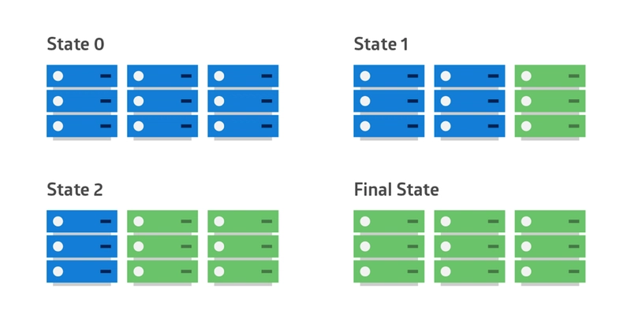

**Canary Deployment** starts by releasing the new version to a small subset of users. If no issues are observed, the rollout continues to a larger user base. This minimizes risk by limiting initial exposure and allows quick rollback if needed. It's especially useful when introducing potentially disruptive changes or testing new features under real-world conditions.

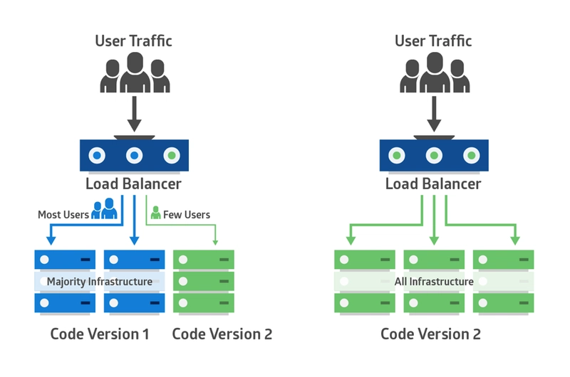

## The DevSecOps model

### Motivation

**Application security has traditionally been handled after development is completed**, often by a team separate from both the development and operations teams. This approach slowed down development and delayed response times to security issues.

Furthermore, **security tools have typically operated in isolation**, with each application security test focusing only on a single application, often just examining its source code. This made it difficult to gain an **organization-wide view of security concerns** or to assess software risks in the context of the production environment.

### Definition

By integrating application security into a unified DevSecOps process—from the initial design phase to implementation—organizations can align development, security, and operations. **This approach ensures that security is continuously prioritized throughout the software lifecycle**, resulting in a more efficient, collaborative, and secure process for building and maintaining applications.

The primary goal of **DevSecOps** is to embed security practices into the continuous integration and continuous delivery (CI/CD) pipeline across both **pre-production** (development, testing, staging) and **production** (operations) environments.

By adopting DevSecOps, teams can **release higher-quality software more quickly** and **detect and respond to software vulnerabilities** in production with greater efficiency.


### Challenges

One of the primary challenges in implementing DevSecOps is addressing the people and culture aspect. It often **requires retraining DevOps teams to understand security best practices** and effectively use new security tools. This cultural shift is essential for embedding security into the development process from the outset.

Another key challenge is **selecting the right security tools and integrating them seamlessly into your DevOps workflow**. The more automated and well-integrated your DevSecOps tooling is within the CI/CD pipeline, the less training and cultural adjustment will be needed. This seamless integration ensures that security measures are applied continuously and without friction. 

### Key Performance Indicators (KPIs)

1. **Mean Time to Detect (MTTD) and Mean Time to Remediate (MTTR)**
   - **MTTD**: This metric measures the average time taken to detect security incidents or vulnerabilities. It indicates the effectiveness of security monitoring, detection systems, and incident response processes in identifying potential threats.
   - **MTTR**: This metric measures the average time required to remediate or mitigate security incidents or vulnerabilities after they are detected. It reflects the efficiency of incident response, patch management, and vulnerability resolution processes.

2. **Number of Security Vulnerabilities**  
   This metric quantifies the total number of vulnerabilities identified during the development cycle. It helps track trends in the identification, remediation, and resolution of security flaws, ensuring that they are addressed promptly before deployment.

3. **Code Review Findings**  
   This metric tracks the number and severity of security issues discovered during code reviews. It reflects the effectiveness of secure coding practices, the use of code analysis tools, and developer awareness in identifying and addressing code-level vulnerabilities.

4. **Deployment Frequency**  
   This metric measures how frequently software deployments are made to production. It indicates how seamlessly security practices are integrated into the deployment pipeline and highlights the ability to deliver secure software at a fast pace while maintaining quality.

5. **Security Test Coverage**  
   This metric evaluates the extent to which security testing is performed during the development lifecycle. It assesses the thoroughness of security assessments, including penetration testing, vulnerability scanning, and static/dynamic analysis, ensuring that security issues are detected early in the process.

## Resources
- [DevOps at Netflix](https://www.youtube.com/watch?v=m-gkDpmdTqI)
- [DORA Metrics: We've Been Using Them Wrong](https://www.youtube.com/watch?v=H3nlvHQHb5E)