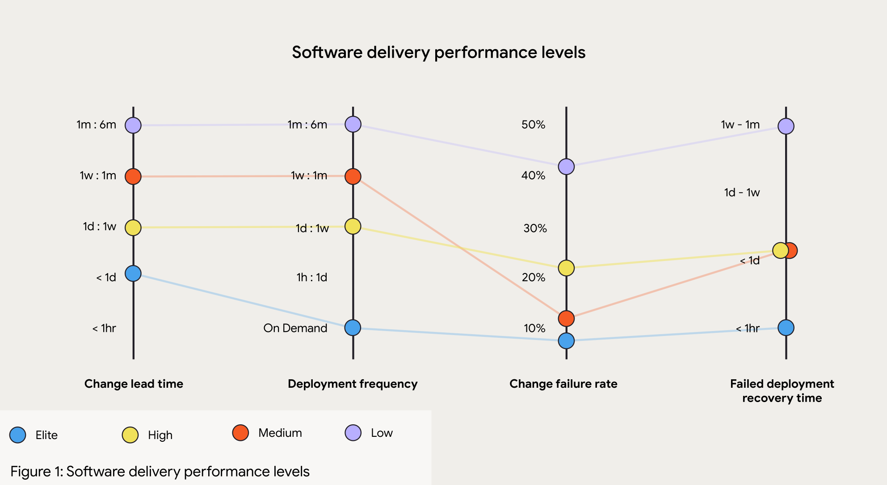

# DevOps, DevSecOps

## Brief history of software production models
The software production lifecycle consists of three essential stages, each playing a critical role in delivering a high-quality product that meets client expectations and performs reliably in a live environment:

1. **Requirements Gathering**
    - Define the scope, functionality, and specifications of the software.
    - Document requirements to guide the development process.

2. **Development and Testing**
    - Design and implement the software according to the requirements.
    - Perform testing to identify and resolve defects.

3. **Operations and Infrastructure**
    - Set up and manage the infrastructure required for the application.
    - Monitor, maintain, and update the system to ensure performance, security, and reliability.

### The Waterfall model

The waterfall model creates friction between (1) requirements gathering and (2) development due to its linear and rigid structure, where each phase must be completed before moving to the next. In this model, requirements are gathered and documented comprehensively at the start of the project, often without the flexibility to adapt to changes later. This approach assumes that clients can fully articulate their needs upfront, which is rarely the case. 

As development progresses, teams frequently discover **gaps, ambiguities, or misunderstandings** in the initial requirements, leading to delays, costly changes, or project misalignment.

- **Rigid Change Management**: Adapting to new requirements is difficult and costly.
- **Late Discovery of Issues**: Problems in requirements often surface deep into development.
- **Misalignment with Client Expectations**: What is delivered may no longer match what the client actually needs.
- **Long Feedback Loops**: Clients only see the final product, limiting opportunities for early correction.

### The Agile model

The Agile model eases the friction between (1) requirements gathering and (2) development by adopting an iterative and flexible approach to software production. Instead of trying to define all requirements upfront, Agile promotes collaboration and continuous feedback throughout the development lifecycle. Requirements are gathered incrementally and revisited during each iteration, allowing for adjustments based on client feedback, changing needs, or new insights. 

However, it neglects the operational aspects of software production leading to friction between (2) development and (3) operations:

- **Limited Integration with Operations**: Dev teams might build features without thinking about how they’ll be deployed, scaled, or maintained.
- **Deployment as an Afterthought**: Shipping to production happens late in the cycle and often causes problems.
- **Operational Silos**: Developers and operations work separately with little collaboration.
- **Insufficient Monitoring and Feedback**: Once the software is live, there's weak feedback from production issues back into the development cycle.

## The DevOps model

**What they say it is:**
- DevOps is a set of practices, tools, and a cultural philosophy that automates and integrates the processes between software development and IT teams, emphasizing team empowerment, cross-team communication, and technology automation. (Atlassian)
- DevOps is a collaborative and multidisciplinary organizational effort to automate the continuous delivery of new software updates while ensuring their correctness and reliability. ([Leite et al., 2020](https://arxiv.org/abs/1909.05409))

**What it is:**
- **Teams integrate into a single unit**, where engineers participate throughout the entire application lifecycle, from development to production (*you build it, you run it*).
- Teams use **automation** to accelerate traditionally slow, manual processes. DevOps tools and technologies enable faster, more reliable deployment and continuous evolution of applications

**What implies for Developers:**
- **Increased Automation**: Automation allows fewer people to manage more code and handle increased complexity, but this can create a more stressful environment as the responsibility scales.
- **Ownership and Accountability**: When something breaks, developers are called to fix it. This encourages developers to write better, more robust code, increase test coverage, and enhance observability, ensuring smoother and more reliable operations.

### The 7 C's

1. **Continuous Planning**  
   This phase involves planning and developing the software. Development is broken into smaller tasks, following Agile methodologies that focus on “just-in-time” requirements. It includes defining user stories and refining the product backlog.

2. **Continuous Integration**  
   In this phase, developers write code and push changes to the source code management system. All code changes are merged frequently and validated through automated builds, tests, and security checks. This helps the team identify issues early in the development process.

3. **Continuous Testing**  
   This phase involves writing and running automated test cases using various tools such as Selenium, JUnit, and TestNG. Automated tests help ensure that the software is functioning correctly and meets quality standards.

4. **Continuous Deployment**  
   In this phase, application code is automatically deployed to production environments, facilitating seamless delivery. This ensures that new features and fixes are rapidly available to users.

5. **Continuous Monitoring**  
   This phase ensures that systems and applications are continuously monitored to detect any bottlenecks, performance issues, or downtime. Alerts can be set to notify stakeholders, allowing for timely action to resolve any issues.

6. **Continuous Feedback**  
   This crucial phase involves gathering feedback from all stakeholders, including developers, testers, product owners, and end users. This feedback helps the team identify what went well and what can be improved, driving continuous improvement in the development process.

7. **Continuous Operations**  
   This phase ensures that systems are available 24/7. It focuses on building highly available and scalable infrastructure through automation to minimize downtime and ensure reliability.

### Key Performance Indicators (KPIs)

**Deployment Frequency**: Measures how often updates are released to production. High-performing teams deploy multiple times a day, requiring a highly automated pipeline with thorough testing and minimal manual intervention.

**Change Failure Rate**: Tracks the percentage of deployments that need immediate fixes or rollbacks. High-performing teams aim for a failure rate between 0% and 15%, achieved through test automation and early defect detection.

---

**Lead Time**: The total time from request to full deployment of a product or feature, encompassing the entire development and delivery workflow. A key indicator of organizational efficiency.

**Cycle Time**: The time it takes to complete a specific part of the workflow, from development start to task completion, often including reviews and testing but not deployment. This metric highlights team productivity and potential bottlenecks.

**Lead Time for Changes**: Measures the time from a code commit to deployment in production. Short lead times indicate efficient workflows with quick feedback loops and minimal delays.

---

- **Mean Time to Failure (MTTF)**: The average time a system or service operates before failing. A high MTTF indicates robust system design and low unexpected downtime.

- **Mean Time to Detect (MTTD)**: The average time to identify a failure, performance issue, or security problem. Low MTTD ensures quick response to minimize impact on users and business.

- **Mean Time to Recovery (MTTR)**: The average time needed to restore a service after a failure. A low MTTR reflects efficient incident response, with practices like continuous monitoring and automated recovery.

- **Mean Time Between Failures (MTBF)**: The average time between successive system failures. A high MTBF suggests system stability, while low MTBF calls for improvements in reliability and fault tolerance.

### The DORA metrics
The DORA metrics were developed by the DevOps Research and Assessment (DORA) organization, which spent years studying engineering teams and their DevOps processes. 

These metrics are valuable because they correlate with business outcomes and employee satisfaction, offering industry standards for benchmarking. Only four key metrics are needed to differentiate elite engineering teams from mediocre ones.

## The DevSecOps model

Application security has been addressed after development is completed, and by a separate team of people, separate from both the development team and the operations team.
This approach **slowed down** the development process and the reaction time.

Also, **security tools themselves have historically been isolated**. Each application security test looked only at that application, and often only at the source code of that application. This made it hard for anyone to have an organization-wide view of security issues, or to understand any of the software risks in the context of the production environment.

Incorporating application security into a unified DevSecOps process, from the initial design phase through to implementation, allows organizations to seamlessly integrate the three core pillars of software creation and delivery: development, security, and operations. This alignment ensures that **security is treated as a continuous priority rather than an afterthought**, fostering a more efficient, collaborative, and secure approach to building and maintaining applications.

### Definition

**DevSecOps** primary goal is to embed security practices into the continuous integration and continuous delivery (CI/CD) pipeline across both **pre-production** (development, testing, staging) and **production** (operations) environments. 

By adopting DevSecOps, teams can **release higher-quality software more quickly** and **detect and respond to software vulnerabilities** in production with greater efficiency.

### Challenges

One of the primary challenges in implementing DevSecOps is addressing the people and culture aspect. It often **requires retraining DevOps teams to understand security best practices** and effectively use new security tools. This cultural shift is crucial for embedding security into the development process from the start.

Another key challenge is **selecting the right security tools and integrating them seamlessly into your DevOps workflow***. The more automated and well-integrated your DevSecOps tooling is within the CI/CD pipeline, the less training and cultural adjustment will be needed. This seamless integration enables security measures to be applied continuously and without friction. However, **simply automating and continuing to use traditional security tools may not be the best approach**. A thoughtful evaluation of new tools and practices can help build a more effective and adaptive security strategy within your DevOps processes.

### Key Performance Indicators (KPIs)

**Number of Security Vulnerabilities** Tracks the number of vulnerabilities identified in the application or infrastructure. This helps assess the effectiveness of proactive security measures like automated scanning.

**Security Test Coverage** Measures the percentage of code or systems covered by security testing (e.g., static analysis, dynamic analysis, penetration testing). Higher coverage reduces the likelihood of undetected vulnerabilities.

**Patch Deployment Time** The average time it takes to deploy a security patch across the system. Quicker deployment times improve an organization's ability to respond to discovered vulnerabilities.

**Percentage of Automated Security Scans** Tracks the percentage of security scans that are automated within the CI/CD pipeline. Higher automation typically leads to faster and more frequent identification of security issues.

**False Positive Rate** Measures the percentage of identified vulnerabilities that turn out to be non-issues. A lower false positive rate indicates the accuracy of security tools and improves overall efficiency.

**Percentage of Security Issues Fixed in the Current Sprint** This KPI tracks how many security issues are resolved within the same sprint or development cycle they are identified in, promoting a proactive security approach.

**Security Incidents per Deployment** Measures the number of security incidents (breaches, vulnerabilities) detected per deployment. A lower number suggests better security practices and controls in place.

**Code Review and Vulnerability Fix Time** Measures the time it takes for security vulnerabilities to be addressed during code reviews. A shorter fix time indicates a more agile security response.

**Security-Related Downtime** Measures the downtime caused by security incidents, such as breaches or vulnerabilities being exploited. Reducing downtime helps maintain business continuity.

**Security Automation Adoption Rate** The percentage of security tasks automated within the DevSecOps pipeline. Higher adoption rates often correlate with more efficient and consistent security practices.

## Resources
- [DevOps at Netflix](https://www.youtube.com/watch?v=m-gkDpmdTqI)