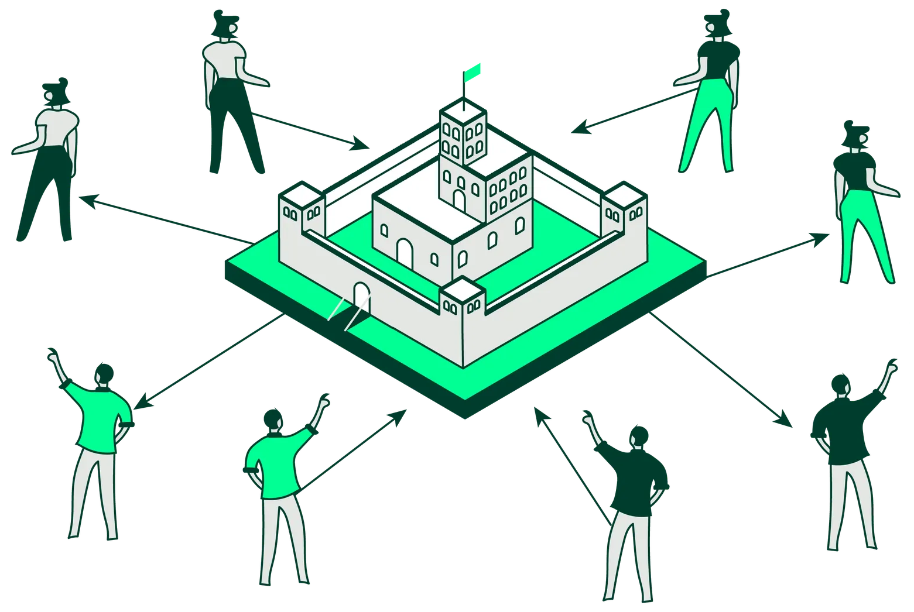

# Distributed Systems Algorithms

Distributed system must solve 6 fundamental challenges:

1. **Consensus:** Reaching agreement on a single value despite node failures or malicious actors.
2. **Replication & Consistency:** Duplicating data for reliability while managing how updates spread.
3. **Leader Election:** Appointing a coordinator to manage shared resources and tasks.
4. **Fault Detection:** Monitoring node health to trigger automatic self-healing.
5. **Clock & Ordering:** Synchronizing time or event sequences without a central clock.

---

## 1. Consensus and Agreement

Ensures all nodes agree on a decision (e.g. the state of a variable), even with network delays or crashes. This is essential for maintaining a consistent global state.

**Example: Distributed Bank Account**

* Suppose three servers maintain the balance of the same bank account: **$100**.
* Two clients simultaneously try to **withdraw $70**.
* Without consensus:

    * Server A approves the first transaction.
    * Server B also approves the second transaction because it hasn’t seen the update from A yet.
* Result: **balance becomes $-40**, violating correctness.

Using a **consensus algorithm**, the nodes **agree on the order of transactions**, ensuring the final balance is correct: only **one \$70 withdrawal** succeeds first, the second sees $30 and can be rejected or queued.

Types of consensus algorithms:
* **Crash Fault Tolerant (CFT):** Handles nodes going offline (e.g., Paxos, Raft).
* **Byzantine Fault Tolerant (BFT):** Handles nodes that lie or act maliciously (e.g., PBFT).

### **The Byzantine Context**

* **Origin (1982):** Coined by **Leslie Lamport** in *"The Byzantine Generals Problem"*.
* **The Allegory:** Generals must decide to **Attack** or **Retreat**. Traitors may send conflicting messages to different generals to prevent a unanimous decision.
* **The Rule:** To tolerate $f$ traitors, a system requires at least $3f + 1$ total nodes.
* **First Practical Implementation:** **PBFT (Practical Byzantine Fault Tolerance, 1999)** by **Miguel Castro and Barbara Liskov** demonstrated a working solution for distributed systems.
* **Modern Impact:** With **Bitcoin (2008)**, BFT became the cornerstone of blockchain technology.

### Real software
* etcd
* Apache Kafka 
* Apache ZooKeeper
* Consul
* RethinkDB 
* CockroachDB
* TiDB

---

## 2. Replication and Consistency

### Replication

Distribute data across multiple nodes while enabling **scalability** and **fault tolerance**.
* **Consistent Hashing:** Maps keys to a **ring of nodes**, so each node is responsible for a portion of the key space.
* **Replication Factor:** Each key is stored on multiple nodes (e.g., 3 nodes) to ensure **redundancy**.
* **Node Addition/Removal:** Only a fraction of keys need to be moved, minimizing disruption compared to naive hashing.

### Real Software
* Cassandra
* Amazon DynamoDB
* Redis
* Riak

### Consistency
* **Strong Consistency:** All replicas update immediately; users always see the latest data (High accuracy, low availability).
* **Eventual Consistency:** Replicas converge over time; the system is temporarily out of sync but eventually uniform (Low accuracy, high availability).

### **Key Protocols**
* **Two-Phase Commit (2PC):** A strong consistency "stop-the-world" approach where all nodes must vote "Yes" to commit.
* **Sagas:** Manages eventual consistency in microservices via a sequence of local transactions and **compensating transactions** (undo) if a step fails.
* **CRDTs:** Mathematical data structures that allow concurrent updates to be merged without conflicts (e.g., Google Docs).

### Real Software
* **Cassandra** (Eventual)
* **Amazon DynamoDB** (Eventual)
* **PostgreSQ** (Strong)
* **MySQL** (Strong)

---

## 3. Leader Election & Coordination

Leader election ensures that a distributed system **operates as a unified whole** by appointing a single **coordinator (leader)**.

The leader is responsible for **serializing operations**, **managing shared resources**, and **orchestrating tasks across worker nodes**.
* **Safety:** Ensures that **at most one leader exists at any time**, preventing split-brain scenarios.
* **Liveness:** Guarantees that if the current leader fails, the system **eventually elects a new leader**, maintaining continuous operation.

### **Bully Algorithm**

Based on the concept of **"brute force"** tied to a unique Node ID. The node with the highest ID always wins.

* **Mechanism:** 
  * When a node detects the leader is offline, it sends an "Election" message to all nodes with a **higher ID** than its own. 
  * If it receives a response from a higher-ID node, it stands down. 
  * If no response is received, it proclaims itself the leader and sends a "Victory" message to all other nodes.

* **Strengths:** Very fast if high-ID nodes are stable and reliable.
* **Weaknesses:** Generates high network traffic ($O(n^2)$ messages) and suffers if the highest-ID node "flaps" (constantly crashes and restarts).

### **Ring Algorithm**

Based on a **logical circle structure**. Each node is aware only of its immediate successor.

* **Mechanism:** 
  * When a node detects a leader failure, it creates an "Election" message containing its own ID and sends it to its neighbor.
  * Each node receiving the message adds its ID to the list and passes it forward.
  * Once the message returns to the initiator (completing the full circle), the node identifies the highest ID in the list as the winner.
  * A second round of messages is sent to inform the entire ring of the new leader.

* **Strengths:** More organized and predictable; prevents network "flooding."
* **Weaknesses:** Slower performance (requires a full cycle) and vulnerable if another node in the ring fails during the election process.

### Real Software

* Raft-based strong consensus: etcd, Kafka, Consul, Nomad
* Paxos-like: ZooKeeper
* Quorum-based / bully / ring: Redis Sentinel, Hazelcast

---

## 4. Fault Detection & Recovery

Continuously monitors the system to detect failures and initiate "self-healing."

* **Heartbeat Protocols:** Periodic "I am alive" signals.
* **Failover:** Shifting workloads to a healthy standby node.
* **Checkpointing:** Rolling back to the last "safe" snapshot of the global state.

### Real Software
* Docker
* Kubernetes
* Apache Kafka
* Redis Sentinel

---

## 5. Clock Synchronization & Ordering

In distributed systems, **no single universal clock** exists. Without proper ordering:

* **Logs** become inconsistent → hard to debug.
* **Transactions** may conflict → data inconsistency.
* **Causal relationships** are lost → cannot tell which event triggered another.

### Physical Clocks

* Measure real-world time; use **NTP** to sync across nodes.
* Good for **logging** and **auditing**.
* Limitation: high-speed events may be **misordered** due to drift/network delay.

### Logical Clocks

* Track **event order** rather than real time.

**Lamport Timestamps**

* Each node keeps a counter; increments on events and messages.
* Provides **total ordering**: `e1 → e2 → e3`.
* Limitation: cannot detect **concurrent events**.

**Vector Clocks**

* Each node keeps an **array of counters** (one per node).
* Compare vectors to detect:

    * `A < B` → A happened before B
    * `B < A` → B happened before A
    * Mixed → **concurrent events / conflicts**
* Useful for **causal relationships** and **conflict resolution**.

### Real Software

* **Google Spanner** – Uses **TrueTime** (GPS + atomic clocks) for globally consistent timestamps across data centers.
* **Apache Cassandra** – Uses **lightweight transactions and Lamport-style logical clocks** to order updates.
* **Amazon DynamoDB** – Implements **Lamport/vector clocks** internally to maintain eventual consistency across replicas.
* **Google Docs** – Uses CRDTs and **vector clocks** to merge concurrent edits without losing causality.

---

## References

* [Raft Simulator](https://raft.github.io) | [Paxos Made Simple](https://lamport.azurewebsites.net/pubs/paxos-simple.pdf)
* [Practical Byzantine Fault Tolerance (PBFT)](http://pmg.csail.mit.edu/papers/osdi99.pdf)
* [Conflict-Free Replicated Data Types (CRDTs)](https://crdt.tech)
* [Leader Election in Distributed Systems](https://en.wikipedia.org/wiki/Leader_election)
